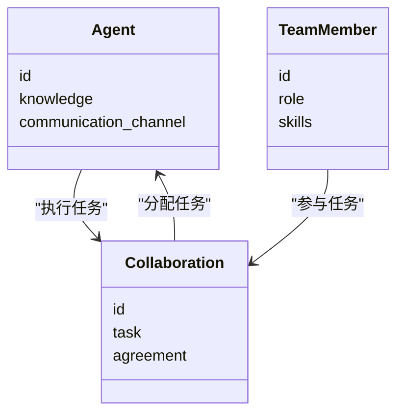
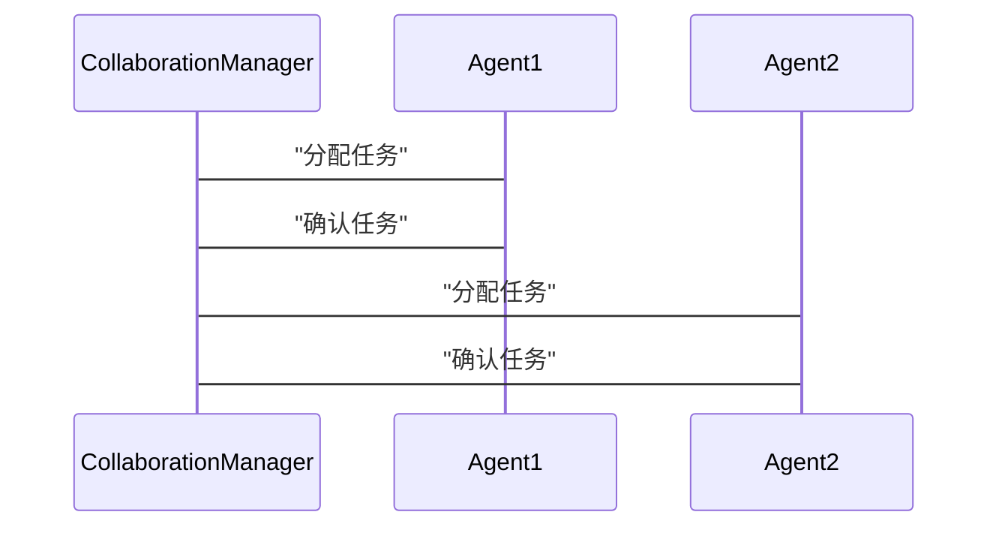

                 


# 构建AI Agent的多Agent协作框架：团队问题解决

> 关键词：AI Agent，多Agent协作框架，团队协作，协作协议，通信机制，系统架构

> 摘要：本文系统地探讨了构建AI Agent的多Agent协作框架的设计与实现，从背景分析到核心算法，从系统架构到项目实战，全面解析了如何利用多Agent协作框架解决复杂的团队问题。通过数学模型、算法流程图和系统架构图的详细阐述，结合实际案例分析，深入剖析了多Agent协作框架的关键技术与实际应用。

---

# 第一部分: 多Agent协作框架的背景与概念

# 第1章: 多Agent协作框架概述

## 1.1 多Agent系统的基本概念

### 1.1.1 问题背景：AI Agent的协作需求

在现代人工智能系统中，单个AI Agent往往难以独立完成复杂的任务，特别是在需要团队协作的场景中，例如自动驾驶、智能客服、机器人协作等领域。多个AI Agent需要协同工作，共同完成目标，这就需要一个高效的多Agent协作框架。

### 1.1.2 问题描述：团队协作中的AI Agent角色

AI Agent在团队协作中需要扮演不同的角色，例如协调者、执行者、监督者等。每个角色有不同的职责和权限，且需要通过通信机制进行信息共享和任务分配。

### 1.1.3 问题解决：多Agent协作框架的设计目标

多Agent协作框架的设计目标是实现AI Agent之间的高效协作，包括任务分配、信息共享、冲突解决等功能，确保团队能够高效完成任务。

### 1.1.4 边界与外延：多Agent协作的适用范围

多Agent协作框架适用于需要分布式任务分配和协作的场景，例如智能交通系统、分布式计算、智能安防等。其边界在于任务分解和协作机制的设计。

### 1.1.5 核心要素：任务分配、通信机制、协作协议

多Agent协作框架的核心要素包括任务分配机制、通信机制和协作协议。任务分配机制确保每个Agent都有明确的职责，通信机制保证信息共享，协作协议规范协作流程。

## 1.2 多Agent协作框架的核心概念

### 1.2.1 多Agent协作框架的定义

多Agent协作框架是一种用于管理多个AI Agent协作的系统架构，通过定义通信机制、任务分配和协作协议，确保团队协作的高效性。

### 1.2.2 多Agent协作框架的属性特征对比

| 属性 | 基于消息传递 | 基于共享知识库 |
|------|--------------|----------------|
| 通信机制 | 通过消息队列或API进行通信 | 通过共享数据库或知识图谱进行信息共享 |
| 任务分配 | 基于角色分配或动态协商 | 基于知识库中的任务描述和Agent能力进行动态分配 |
| 协作协议 | 基于合同网模型或分布式一致性协议 | 基于一致性协议或分布式共识算法 |

### 1.2.3 多Agent协作框架的ER实体关系图

```mermaid
erDiagram
    actor TeamMember {
        id
        role
        skills
    }
    agent Agent {
        id
        knowledge
        communication_channel
    }
    collaboration Collaboration {
        id
        task
        agreement
    }
    TeamMember -> Collaboration : "参与任务"
    Agent -> Collaboration : "执行任务"
    Collaboration -> Agent : "分配任务"
```

## 1.3 本章小结

---

# 第二部分: 多Agent协作框架的算法原理

# 第2章: 多Agent协作的算法基础

## 2.1 多Agent协作协议

### 2.1.1 协作协议的分类

多Agent协作协议主要分为基于合同网模型和分布式一致性协议两类。

### 2.1.2 合同网模型

合同网模型通过定义任务合同，明确任务分配、责任和报酬。以下是合同网模型的mermaid流程图：

```mermaid
graph TD
    A[Agent A] --> C[Collaboration Manager]
    B[Agent B] --> C
    C --> A: "分配任务"
    C --> B: "分配任务"
```

### 2.1.3 分布式一致性协议

分布式一致性协议如RAFT、PAXOS等，用于确保多个Agent之间的任务分配和协作一致。

## 2.2 多Agent通信机制

### 2.2.1 基于消息传递的通信

通过消息队列或API进行通信，确保实时信息共享。

### 2.2.2 基于共享知识库的通信

通过共享数据库或知识图谱进行信息共享，确保数据一致性。

## 2.3 多Agent协作的数学模型

### 2.3.1 协作任务分配的数学模型

$$ \text{最大化 } \sum_{i=1}^{n} w_i x_i $$

其中，\( w_i \) 是任务 \( i \) 的权重，\( x_i \) 是任务 \( i \) 的分配情况。

### 2.3.2 协作协议的数学表达式

$$ 

---

# 第三部分: 多Agent协作框架的系统架构设计

# 第3章: 系统分析与架构设计

## 3.1 问题场景介绍

### 3.1.1 问题场景：多Agent协作的典型场景

例如，在智能交通系统中，多个自动驾驶汽车需要协作完成交通调度。

## 3.2 系统功能设计

### 3.2.1 领域模型类图



### 3.2.2 系统架构设计


### 3.2.3 系统接口设计

接口设计包括任务分配接口、通信接口和协作协议接口。

### 3.2.4 系统交互流程图



## 3.3 本章小结

---

# 第四部分: 多Agent协作框架的项目实战

# 第4章: 项目实战

## 4.1 环境安装

### 4.1.1 环境要求

安装Python、Java等编程语言，以及相关框架和库。

## 4.2 核心代码实现

### 4.2.1 协作协议实现

```python
class CollaborationManager:
    def __init__(self):
        self.agents = []
        self.tasks = []
    def assign_task(self, agent, task):
        # 分配任务逻辑
        pass
```

### 4.2.2 通信机制实现

```python
import zmq

context = zmq.Context()
socket = context.socket(zmq.PUB)
socket.bind("tcp://*:5555")
socket.send_string("task_assigned")
```

## 4.3 案例分析

### 4.3.1 案例分析：智能交通系统

### 4.3.2 案例分析：分布式计算任务协作

## 4.4 项目总结

---

# 第五部分: 多Agent协作框架的最佳实践与拓展

# 第5章: 最佳实践

## 5.1 小结

### 5.1.1 多Agent协作框架的核心要点

### 5.1.2 实际应用中的注意事项

## 5.2 注意事项

### 5.2.1 通信机制的选择

### 5.2.2 任务分配策略的选择

## 5.3 拓展阅读

### 5.3.1 推荐的书籍

### 5.3.2 推荐的技术博客

---

# 作者：AI天才研究院/AI Genius Institute & 禅与计算机程序设计艺术 /Zen And The Art of Computer Programming

