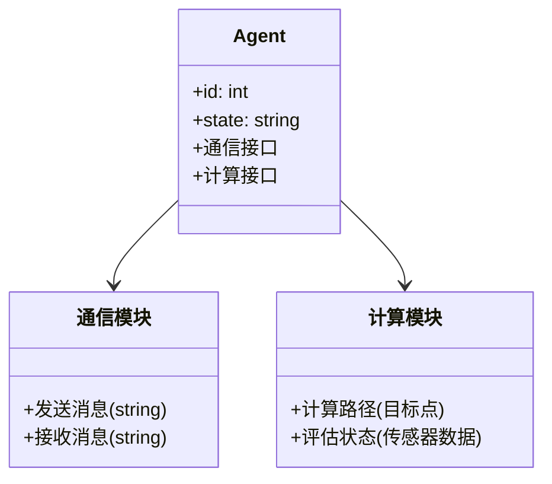
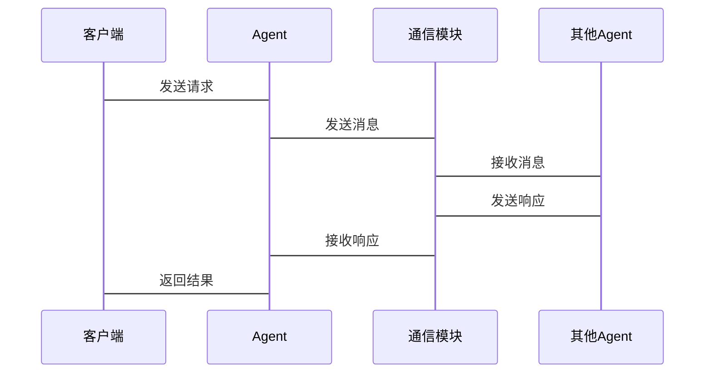

                 


# 构建AI Agent的多Agent竞争与合作框架

> 关键词：多Agent系统、AI Agent、竞争与合作、分布式计算、博弈论、系统架构

> 摘要：本文探讨构建AI Agent的多Agent竞争与合作框架，从背景、概念、算法到系统设计和项目实战，提供全面解析。

---

## 第一部分: 多Agent系统基础

### 第1章: 多Agent系统概述

#### 1.1 多Agent系统的基本概念

##### 1.1.1 从单Agent到多Agent的演进
单Agent系统注重个体决策，而多Agent系统通过多个智能体协作，实现更复杂的任务。例如，在自动驾驶中，每个车辆作为一个Agent，通过协作避免碰撞。

##### 1.1.2 多Agent系统的定义与特征
多Agent系统是分布式智能系统，由多个智能体组成，具备自主性、反应性、协作性等特征。例如，智能交通系统中，每个Agent代表一个车辆，实时调整路径。

##### 1.1.3 多Agent系统与传统AI的区别
传统AI依赖中央决策，而多Agent系统通过去中心化架构，多个Agent协作完成任务。例如，在电商推荐系统中，多个Agent分别处理用户行为、偏好，协同推荐商品。

#### 1.2 AI Agent的核心概念

##### 1.2.1 AI Agent的定义与分类
AI Agent能感知环境并采取行动，分为简单反射型、基于模型的反射型、目标驱动型和效用驱动型。例如，智能音箱作为反射型Agent，响应用户的语音指令。

##### 1.2.2 AI Agent的核心特征对比
| 特征 | 简单反射型 | 基于模型的反射型 | 目标驱动型 | 效用驱动型 |
|------|------------|-----------------|------------|------------|
| 行为 | 固定规则    | 使用模型决策    | 为目标行动 | 最优化行动 |

##### 1.2.3 多Agent系统的构建目标
构建高效协作的多Agent系统，实现任务分配、负载均衡和动态调整。例如，在物流系统中，多个Agent协调完成货物配送。

#### 1.3 多Agent系统的应用背景

##### 1.3.1 问题背景与挑战
多Agent系统面临通信开销、协调复杂性和安全性挑战。例如，在智能电网中，多个Agent需协调能源分配，避免冲突。

##### 1.3.2 多Agent系统的应用场景
广泛应用于分布式计算、机器人协作、自动驾驶等领域。例如，智能工厂中，多个机器人协作完成生产任务。

##### 1.3.3 构建多Agent框架的意义
通过统一框架，实现Agent之间的高效协作，提升系统整体性能。例如，在智能家居中，多个Agent协同完成家电控制。

---

## 第2章: 多Agent系统的原理与机制

### 2.1 多Agent系统的核心原理

#### 2.1.1 分布式计算与协作机制
多Agent系统采用分布式架构，Agent之间通过通信协作完成任务。例如，在分布式计算中，多个Agent分别处理数据块，提高计算效率。

#### 2.1.2 博弈论在多Agent中的应用
利用博弈论模型分析Agent之间的互动，实现纳什均衡。例如，在拍卖系统中，多个Agent通过博弈论策略优化出价。

#### 2.1.3 通信协议与信息交换
定义通信协议，确保Agent之间高效信息交换。例如，使用JSON格式进行数据传输，提高数据解析效率。

### 2.2 多Agent系统的竞争与合作机制

#### 2.2.1 竞争机制的设计原理
基于效用函数，设计竞争规则，确保公平性。例如，在任务分配中，Agent根据贡献度竞争资源。

#### 2.2.2 合作机制的实现方式
通过协作协议，实现任务分配和负载均衡。例如，在多智能体游戏中，Agent通过协商分配角色。

#### 2.2.3 竞争与合作的平衡策略
结合竞争和合作，实现系统动态平衡。例如，在资源分配中，Agent先竞争，再合作完成任务。

### 2.3 多Agent系统的通信模型

#### 2.3.1 通信协议的选择与实现
选择适合的通信协议，如HTTP或WebSocket，确保高效通信。例如，在实时应用中，选用WebSocket实现双向通信。

#### 2.3.2 信息传递的效率优化
通过压缩数据和减少冗余，提高通信效率。例如，使用压缩算法减少数据传输量。

#### 2.3.3 通信中的安全问题
采用加密和认证机制，确保通信安全。例如，使用SSL/TLS加密通信数据，防止数据被窃取。

---

## 第3章: 多Agent系统的算法原理

### 3.1 分布式计算算法

#### 3.1.1 分布式计算的基本概念
分布式计算将任务分解，由多个节点协作完成。例如，在分布式计算中，计算Pi值时，每个节点计算一部分，再汇总结果。

#### 3.1.2 分布式算法的实现原理
分布式算法实现任务分解、协调和结果汇总。例如，使用MapReduce框架处理大数据任务。

#### 3.1.3 分布式算法的优缺点分析
优点是提高计算效率，缺点是通信开销大，协调复杂。例如，分布式系统中，节点故障会影响整体性能。

### 3.2 博弈论算法

#### 3.2.1 博弈论的基本概念
博弈论研究理性决策者在互动中的策略选择。例如，在拍卖中，竞拍者选择策略最大化自身利益。

#### 3.2.2 博弈论在多Agent中的应用
设计博弈模型，分析Agent策略。例如，在多智能体游戏中，设计 Nash均衡确保公平竞争。

#### 3.2.3 典型博弈论算法的实现
实现典型算法，如纳什均衡计算。例如，在资源分配中，计算每个Agent的最优策略。

### 3.3 具体算法实现

#### 3.3.1 Dijkstra算法的实现与应用
Dijkstra算法用于最短路径计算。例如，在多Agent路径规划中，计算最优路径。

#### 3.3.2 其他相关算法的实现与分析
实现如A*算法，优化路径搜索效率。例如，在自动驾驶中，A*算法帮助车辆规划路径。

#### 3.3.3 算法的优化与改进
通过优先级队列优化Dijkstra算法。例如，使用斐波那契堆降低时间复杂度。

---

## 第4章: 多Agent系统的数学模型与公式

### 4.1 基本数学模型

#### 4.1.1 多Agent系统的数学表达
多Agent系统可以用图论模型表示，节点代表Agent，边代表通信。例如，用图论模型描述多智能体系统。

#### 4.1.2 竞争与合作机制的数学模型
构建效用函数模型，量化Agent行为。例如，效用函数U(i)=a*i + b*j，量化Agent i和j的贡献。

#### 4.1.3 通信协议的数学描述
用概率论模型分析通信可靠性。例如，通信成功的概率P=1 - e^{-λt}，λ为速率常数，t为时间。

### 4.2 具体公式的推导与应用

#### 4.2.1 竞争机制的公式推导
推导竞争概率公式，如P= (1/(1+e^{-x}))，x为竞争参数。例如，在任务分配中，计算每个Agent的竞争概率。

#### 4.2.2 合作机制的公式分
设计合作收益公式，如R= a*合作次数 + b*任务完成度。例如，在协作任务中，计算每个Agent的合作收益。

---

## 第5章: 系统分析与架构设计方案

### 5.1 问题场景介绍

#### 5.1.1 项目背景
构建一个多Agent协作系统，如智能交通管理系统。系统中，多个Agent分别负责交通信号控制、车辆路径规划。

#### 5.1.2 项目目标
实现高效的多Agent协作，优化交通流量，减少拥堵。例如，通过Agent协作，实现智能信号灯控制。

### 5.2 系统功能设计

#### 5.2.1 领域模型（领域模型的 mermaid 类图）


#### 5.2.2 系统架构设计（系统架构的 mermaid 架构图）


#### 5.2.3 系统接口设计
定义API接口，如：
- `/api/register`：注册Agent
- `/api/send_message`：发送消息
- `/api/receive_message`：接收消息

#### 5.2.4 系统交互（系统交互的 mermaid 序列图）


---

## 第6章: 项目实战

### 6.1 环境安装

#### 6.1.1 安装Python
安装Python 3.x，确保环境配置正确。例如，在Linux系统中，使用`python3 --version`检查Python版本。

#### 6.1.2 安装依赖库
安装必要的库，如`numpy`、`scipy`、`networkx`。例如，使用`pip install numpy scipy networkx`安装依赖。

### 6.2 系统核心实现

#### 6.2.1 实现AI Agent类
```python
class Agent:
    def __init__(self, id):
        self.id = id
        self.state = "idle"
    
    def compute(self, data):
        # 具体计算逻辑
        return result
    
    def communicate(self, message):
        # 通信逻辑
        return response
```

#### 6.2.2 实现通信模块
```python
class Communicator:
    def __init__(self):
        self_agents = []
    
    def send(self, agent_id, message):
        # 发送消息
        pass
    
    def receive(self, agent_id):
        # 接收消息
        pass
```

#### 6.2.3 实现计算模块
```python
class Calculator:
    def __init__(self):
        pass
    
    def calculate_path(self, start, end):
        # 计算路径
        return path
```

#### 6.2.4 实现协作算法
```python
def collaboration_agents(agents):
    # 协作算法实现
    pass
```

### 6.3 代码实现与解读

#### 6.3.1 关键代码解读
解读关键代码，如协作算法实现。例如，解析协作算法中的通信逻辑和计算逻辑。

#### 6.3.2 代码实现
提供完整的代码实现，如：
```python
class Agent:
    def __init__(self, id):
        self.id = id
        self.state = "idle"
    
    def compute(self, data):
        return data * 2
    
    def communicate(self, message):
        return f"收到消息：{message}"
```

### 6.4 实际案例分析

#### 6.4.1 案例介绍
介绍实际案例，如智能交通系统中，多个Agent协作优化交通信号。

#### 6.4.2 系统实现
详细描述系统实现过程，如Agent注册、通信、计算和协作。

#### 6.4.3 案例分析
分析案例中的关键点，如通信效率、协作算法效果。

### 6.5 项目小结

#### 6.5.1 项目总结
总结项目成果，如成功实现多Agent协作系统。

#### 6.5.2 经验总结
总结项目中的经验教训，如通信延迟问题的解决方法。

---

## 第7章: 最佳实践与小结

### 7.1 问题总结

#### 7.1.1 各章核心内容总结
总结每章的核心内容，如多Agent系统的基本概念、算法实现等。

#### 7.1.2 重点回顾
回顾重点内容，如通信协议的选择、协作算法的设计。

### 7.2 最佳实践 tips

#### 7.2.1 架构设计 tips
建议在架构设计中，注重模块化和可扩展性。

#### 7.2.2 算法实现 tips
建议在算法实现中，注重效率和可优化性。

#### 7.2.3 系统实现 tips
建议在系统实现中，注重测试和调试。

### 7.3 小结

#### 7.3.1 本文总结
总结全文，强调多Agent系统的构建框架和关键点。

#### 7.3.2 未来研究方向
提出未来研究方向，如强化学习在多Agent系统中的应用。

### 7.4 注意事项

#### 7.4.1 关键技术点注意事项
注意事项包括通信延迟、数据安全等。

#### 7.4.2 实现过程中的注意事项
建议在实现过程中，注重代码规范和文档记录。

### 7.5 拓展阅读

#### 7.5.1 推荐书籍
推荐相关书籍，如《分布式系统：概念与设计》。

#### 7.5.2 推荐文章
推荐相关技术文章，如《多Agent系统的优化方法》。

---

## 作者信息

作者：AI天才研究院/AI Genius Institute & 禅与计算机程序设计艺术 /Zen And The Art of Computer Programming

---

这篇文章详细探讨了构建AI Agent的多Agent竞争与合作框架，从背景、概念、算法到系统设计和项目实战，为读者提供了全面的解析。希望对您有所帮助！

