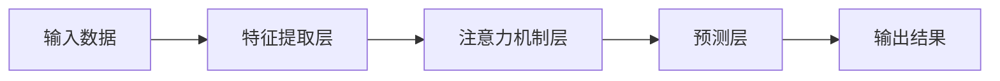
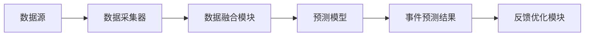

                 


# 构建AI Agent的多模态事件预测系统

> 关键词：AI Agent, 多模态事件预测, 系统架构, 事件预测算法, 系统设计

> 摘要：本文详细探讨了如何构建一个基于多模态数据的AI Agent事件预测系统。从问题背景、核心概念、算法原理到系统设计与项目实战，文章全面解析了构建该系统的各个方面，包括数学模型、系统架构、代码实现以及实际案例分析。最后，文章总结了最佳实践和注意事项，为读者提供了一个完整的构建指南。

---

## 第一章: 多模态事件预测与AI Agent概述

### 1.1 多模态事件预测的背景与意义

#### 1.1.1 问题背景
在现实世界中，事件预测是许多应用的核心问题，如金融风险预测、智能安防、自动驾驶等。传统的单模态数据（如文本或图像）预测方法在复杂场景下表现有限，难以捕捉多维度的信息。多模态数据的引入能够显著提升预测的准确性和鲁棒性。

#### 1.1.2 问题描述
多模态事件预测是指利用多种数据源（如图像、文本、语音等）来预测未来可能发生事件的过程。AI Agent作为一种智能体，能够实时感知环境并做出决策，结合多模态数据，能够更准确地预测和应对事件。

#### 1.1.3 问题解决思路
通过整合多模态数据，构建深度学习模型，利用并行计算和分布式系统优化性能。结合实时数据流处理技术，提升预测的实时性和准确性。

#### 1.1.4 边界与外延
- **边界**：专注于单一事件预测，不考虑多事件的复杂场景。
- **外延**：可扩展至多任务学习和增强学习。

#### 1.1.5 核心概念结构与组成
多模态事件预测系统由数据采集、数据融合、模型训练、事件预测和反馈优化五个部分组成。

---

### 1.2 AI Agent的基本概念与特点

#### 1.2.1 AI Agent的定义
AI Agent是指能够感知环境、自主决策并执行任务的智能实体。它可以基于多模态数据做出决策，适用于复杂动态环境。

#### 1.2.2 多模态数据的定义与特点
多模态数据指来自不同感官或数据源的数据，如视觉（图像/视频）、听觉（语音/音频）、触觉（传感器数据）等。

#### 1.2.3 AI Agent与多模态数据的关系
AI Agent通过多模态数据感知环境，利用融合技术提取有用信息，从而做出更准确的预测和决策。

#### 1.2.4 AI Agent的核心属性对比
| 属性 | 单模态AI Agent | 多模态AI Agent |
|------|----------------|----------------|
| 感知能力 | 单一数据源 | 多数据源融合 |
| 决策能力 | 基于单一信息 | 基于多维信息 |
| 环境适应性 | 较低 | 较高 |

---

## 第二章: 多模态数据与AI Agent的关系

### 2.1 多模态数据的属性特征对比

#### 2.1.1 数据类型对比
| 数据类型 | 特点 |
|----------|------|
| 图像 | 高维、空间信息丰富 |
| 文本 | 语义丰富、结构化 |
| 语音 | 时间序列、语调信息 |

#### 2.1.2 数据量对比
- 图像数据通常比文本和语音数据量大。
- 语音数据在时间维度上具有连续性。

#### 2.1.3 数据处理难度对比
| 数据类型 | 处理难度 |
|----------|----------|
| 图像 | 较高 | 
| 文本 | 中等 |
| 语音 | 较低 |

#### 2.1.4 数据融合方式对比
- 平行融合：独立处理各模态数据后融合。
- 串行融合：按顺序处理模态数据。
- 混合融合：结合平行和串行方法。

---

### 2.2 AI Agent的核心概念原理

#### 2.2.1 AI Agent的感知机制
AI Agent通过多模态传感器实时感知环境，提取特征并进行初步分析。

#### 2.2.2 多模态数据的融合方法
使用注意力机制对多模态数据进行加权融合，突出重要信息。

#### 2.2.3 事件预测的逻辑推理过程
从数据输入到特征提取，再到注意力机制和预测层，最终输出预测结果。

#### 2.2.4 系统的反馈与优化机制
系统根据预测结果和实际事件进行反馈，调整模型参数以优化性能。

---

## 第三章: 多模态事件预测算法原理

### 3.1 多模态数据融合算法

#### 3.1.1 多模态数据融合的数学模型
$$ y = f(x_1, x_2, ..., x_n) $$
其中，$x_i$ 表示不同模态的数据输入，$y$ 表示融合后的输出。

#### 3.1.2 模态融合方法对比
- 平行融合：各模态独立处理后融合。
- 串行融合：按顺序处理各模态数据。
- 混合融合：结合平行和串行方法。

---

### 3.2 事件预测算法

#### 3.2.1 基于深度学习的事件预测模型


#### 3.2.2 模型训练流程
1. 数据预处理
2. 模型初始化
3. 前向传播
4. 损失计算
5. 反向传播
6. 参数优化

---

## 第四章: 系统分析与架构设计

### 4.1 系统功能设计
系统功能模块包括数据采集、数据融合、模型训练、事件预测和反馈优化。

### 4.2 系统架构设计


### 4.3 系统接口设计
系统接口包括数据输入接口、模型调用接口和结果输出接口。

---

## 第五章: 项目实战

### 5.1 环境安装
安装必要的库，如TensorFlow、Keras、OpenCV等。

### 5.2 系统核心实现源代码
```python
import tensorflow as tf
from tensorflow.keras import layers

class MultiModalPredictor:
    def __init__(self):
        self.model = self.build_model()
    
    def build_model(self):
        inputs = {}
        inputs['text'] = layers.Input(shape=(None,), dtype='int32')
        inputs['image'] = layers.Input(shape=(224, 224, 3))
        # 其他模态数据输入...
        
        # 处理文本模态
        text_embeddings = layers.Embedding(...)(inputs['text'])
        text_features = layers.Flatten()(text_embeddings)
        
        # 处理图像模态
        image_features = layers.Conv2D(...)(inputs['image'])
        image_features = layers.Flatten()(image_features)
        
        # 融合特征
        merged_features = layers.Concatenate()([text_features, image_features])
        dense_layer = layers.Dense(128, activation='relu')(merged_features)
        prediction = layers.Dense(1, activation='sigmoid')(dense_layer)
        
        model = tf.keras.Model(inputs=inputs, outputs=prediction)
        return model
```

### 5.3 实际案例分析
分析一个具体案例，如智能安防中的异常行为检测，展示模型的预测过程和结果。

---

## 第六章: 最佳实践与注意事项

### 6.1 小结
多模态事件预测系统能够显著提升预测的准确性和鲁棒性。

### 6.2 注意事项
- 数据质量：确保多模态数据的准确性和完整性。
- 模型选择：根据实际需求选择合适的模型架构。
- 性能优化：通过分布式计算和并行处理提升性能。

---

## 附录

### 附录A: 参考文献
1. 《深度学习》, Ian Goodfellow
2. 《机器学习实战》, 周志华

### 附录B: 工具与库
- TensorFlow
- Keras
- OpenCV

---

**作者：AI天才研究院 & 禅与计算机程序设计艺术**

