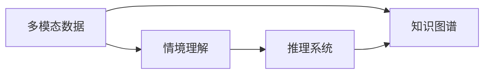
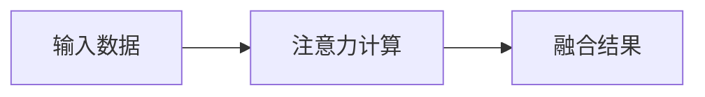
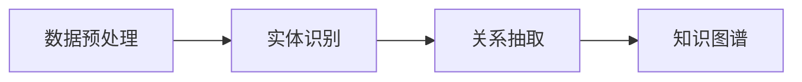
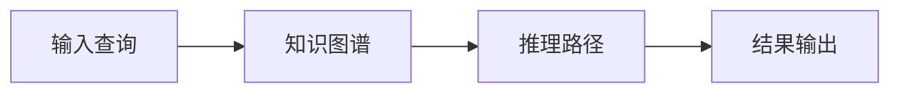
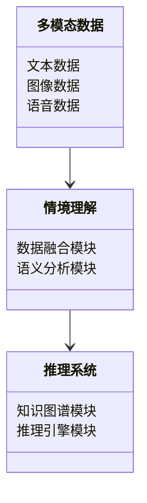
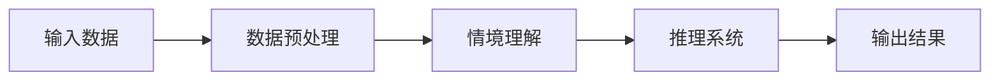
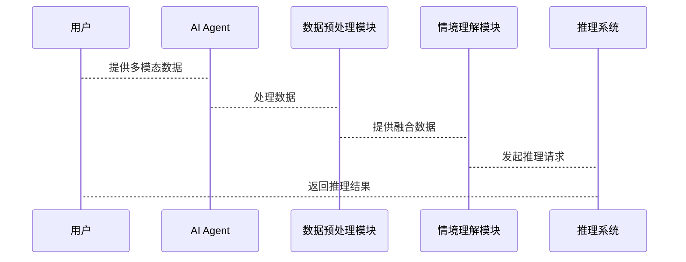

                 


# 构建AI Agent的多模态情境理解与推理系统

> 关键词：AI Agent，多模态数据，情境理解，推理系统，知识图谱，系统架构，项目实战

> 摘要：本文详细探讨了构建AI Agent的多模态情境理解与推理系统的各个方面。从背景介绍到核心概念，从算法原理到系统架构设计，从项目实战到最佳实践，系统地阐述了构建这一系统的完整流程。文章内容涵盖多模态数据的处理、情境理解与推理机制的设计、算法原理的数学模型与实现、系统架构的规划与实现、项目实战的代码实现与案例分析，以及系统的优化与未来展望。通过本文，读者可以全面了解如何构建一个高效、准确的AI Agent多模态情境理解与推理系统。

---

# 第一部分: 背景介绍

## 第1章: 问题背景

### 1.1 多模态数据的兴起
随着人工智能技术的快速发展，单一模态的数据处理已经难以满足复杂场景的需求。多模态数据的兴起为AI Agent提供了更丰富、更全面的信息来源，使得AI Agent能够更准确地理解和处理复杂情境。

### 1.2 情境理解与推理的重要性
AI Agent的核心能力之一是情境理解与推理。通过理解当前情境，AI Agent可以做出合理的决策和行动，从而更好地与人类交互或完成任务。

### 1.3 当前技术的局限性
尽管AI技术取得了长足进步，但在多模态数据处理、情境理解和推理方面仍存在诸多挑战，例如不同模态数据的融合难度大、推理的准确性和实时性不足等。

## 第2章: 问题描述

### 2.1 AI Agent的定义与目标
AI Agent是一种能够感知环境、自主决策并执行任务的智能实体。其目标是通过多模态数据的处理和情境理解，实现智能化的交互与决策。

### 2.2 多模态数据处理的挑战
多模态数据的异构性和多样性给数据融合带来了困难。如何高效地将不同模态的数据进行融合，是构建AI Agent的关键问题。

### 2.3 情境理解与推理的复杂性
情境理解需要AI Agent能够理解当前环境中的各种因素，而推理则需要基于这些理解做出合理的推断。这一过程涉及复杂的逻辑推理和知识表示。

## 第3章: 问题解决思路

### 3.1 多模态数据融合策略
采用层次化的融合策略，先分别处理各模态数据，再进行跨模态融合，以充分利用不同模态的信息。

### 3.2 情境理解的层次划分
将情境理解划分为感知层、语义层和认知层，逐步深入地理解环境信息。

### 3.3 推理机制的设计原则
基于知识图谱和逻辑推理，结合深度学习模型，设计高效的推理机制。

## 第4章: 系统的边界与外延

### 4.1 系统功能边界
AI Agent的多模态情境理解与推理系统主要负责数据处理、情境理解和推理，不包括任务执行和外部交互。

### 4.2 系统的输入输出定义
输入包括多模态数据（如文本、图像、语音等），输出包括情境理解和推理结果。

### 4.3 系统与其他模块的交互关系
系统需要与数据采集模块、知识库以及任务执行模块进行交互，确保数据的输入与输出的正确性。

## 第5章: 核心概念与组成

### 5.1 多模态数据的核心要素
多模态数据包括文本、图像、语音等多种类型的数据，每种数据都有其独特的特征和处理方式。

### 5.2 情境理解的关键模块
情境理解模块包括数据融合、语义分析和上下文推理等子模块。

### 5.3 推理系统的组成部分
推理系统由知识表示、推理引擎和结果解释等部分组成，确保推理过程的高效和准确。

---

# 第二部分: 核心概念与联系

## 第6章: 多模态数据的核心原理

### 6.1 多模态数据的定义与特征
多模态数据是指来自不同感知渠道的信息，具有异构性、多样性和互补性。

### 6.2 不同模态数据的处理方式
文本数据可以通过自然语言处理技术进行处理，图像数据可以通过计算机视觉技术进行处理，语音数据可以通过语音识别技术进行处理。

### 6.3 多模态数据融合的数学模型
多模态数据融合可以通过多种方式实现，例如：
$$ y = f(x_1, x_2, ..., x_n) $$
其中，$x_i$ 表示不同的模态数据，$f$ 是融合函数。

---

## 第7章: 情境理解与推理机制

### 7.1 情境理解的层次模型
情境理解可以分为感知层、语义层和认知层。感知层负责基本的特征提取，语义层负责语义分析，认知层负责上下文推理。

### 7.2 推理机制的类型与特点
推理机制可以分为基于规则的推理和基于深度学习的推理。基于规则的推理适用于简单场景，基于深度学习的推理适用于复杂场景。

### 7.3 情境与推理的关联关系
情境理解为推理提供基础信息，推理结果反过来可以指导情境理解的优化。

---

## 第8章: 核心概念对比分析

### 8.1 多模态数据与单模态数据的对比
多模态数据具有更高的信息丰富度，但处理复杂性也更高。

### 8.2 不同推理机制的优缺点
基于规则的推理具有可解释性，但灵活性较低；基于深度学习的推理具有强大的表达能力，但可解释性较差。

### 8.3 情境理解与知识图谱的关系
知识图谱为情境理解提供知识支持，情境理解的结果可以进一步丰富知识图谱。

---

## 第9章: 实体关系图



---

# 第三部分: 算法原理讲解

## 第10章: 多模态数据融合算法

### 10.1 多模态融合的数学模型
$$ y = f(x_1, x_2, ..., x_n) $$
其中，$x_i$ 表示不同的模态数据，$f$ 是融合函数。

### 10.2 基于注意力机制的融合方法


---

## 第11章: 知识图谱推理算法

### 11.1 知识图谱构建流程


### 11.2 基于图神经网络的推理方法


---

## 第12章: 算法实现代码

### 12.1 多模态数据融合代码
```python
import numpy as np

def fuse_modalities(text, image):
    # 文本向量化
    text_vec = model_text.encode(text)
    # 图像向量化
    image_vec = model_image.encode(image)
    # 融合向量
    fused_vec = np.concatenate((text_vec, image_vec), axis=-1)
    return fused_vec
```

### 12.2 知识图谱推理代码
```python
from kg推理器 import KnowledgeGraph

kg = KnowledgeGraph(kg_path)
result = kg推理(text_query)
print(result)
```

---

# 第四部分: 系统分析与架构设计方案

## 第13章: 问题场景介绍

### 13.1 系统目标
构建一个能够处理多模态数据、理解情境并进行推理的AI Agent系统。

### 13.2 项目介绍
本项目旨在实现一个高效的多模态情境理解与推理系统，为AI Agent提供强大的支持。

---

## 第14章: 系统功能设计

### 14.1 领域模型类图


---

## 第15章: 系统架构设计

### 15.1 系统架构图


### 15.2 系统接口设计
系统接口包括数据输入接口、推理接口和结果输出接口。

### 15.3 系统交互序列图


---

## 第16章: 项目实战

### 16.1 环境安装
需要安装的环境包括Python、TensorFlow、Keras、Numpy等。

### 16.2 系统核心实现源代码
```python
import numpy as np
from tensorflow import keras

# 定义多模态数据融合模型
class MultiModalFusion(keras.Model):
    def __init__(self, text_dim, image_dim):
        super(MultiModalFusion, self).__init__()
        self.text_dense = keras.layers.Dense(128, activation='relu')
        self.image_dense = keras.layers.Dense(128, activation='relu')
        self.concatenate = keras.layers.Concatenate()

    def call(self, inputs):
        text_input = inputs[0]
        image_input = inputs[1]
        text_output = self.text_dense(text_input)
        image_output = self.image_dense(image_input)
        outputs = self.concatenate([text_output, image_output])
        return outputs

# 定义知识图谱推理模型
class KnowledgeGraphInference:
    def __init__(self, kg_path):
        self.kg = self.load_kg(kg_path)
    
    def load_kg(self, kg_path):
        # 加载知识图谱
        pass
    
    def infer(self, query):
        # 推理过程
        pass
```

### 16.3 代码应用解读与分析
多模态数据融合模型通过将文本和图像数据分别映射到低维空间，然后进行融合，最后输出融合后的向量。知识图谱推理模型基于预训练的知识图谱，进行路径推理，返回推理结果。

### 16.4 实际案例分析
以一个具体的案例为例，展示系统的输入、处理过程和输出结果。

### 16.5 项目小结
通过本项目的实现，我们掌握了多模态数据融合和知识图谱推理的核心技术，为构建高效的AI Agent系统奠定了基础。

---

## 第17章: 最佳实践 tips

### 17.1 小结
构建AI Agent的多模态情境理解与推理系统需要综合运用多种技术，包括多模态数据处理、知识图谱构建和逻辑推理等。

### 17.2 注意事项
在实际应用中，需要注意数据的多样性和模型的可解释性，确保系统的健壮性和高效性。

### 17.3 未来展望
未来的研究方向包括更高效的多模态数据融合方法、更强大的知识图谱推理算法，以及更智能化的AI Agent系统。

### 17.4 拓展阅读
推荐读者阅读相关领域的经典论文和技术报告，深入了解多模态数据处理和知识图谱推理的最新进展。

---

# 作者

作者：AI天才研究院/AI Genius Institute & 禅与计算机程序设计艺术 /Zen And The Art of Computer Programming

