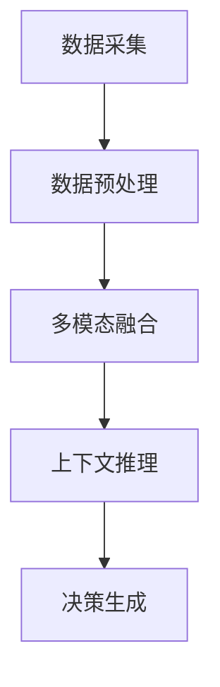

                 


# 构建AI Agent的多模态情境理解系统

> 关键词：AI Agent, 多模态数据, 情境理解, 数据融合, 上下文推理

> 摘要：本文详细探讨了构建AI Agent的多模态情境理解系统的各个方面，包括背景介绍、核心概念、算法原理、系统架构设计、项目实战以及最佳实践。通过理论分析和实际案例，阐述了如何利用多模态数据进行情境理解，并为AI Agent的设计和实现提供了系统的解决方案。

---

## 第一部分: AI Agent与多模态情境理解系统概述

### 第1章: 问题背景与核心概念

#### 1.1 问题背景
在当今的AI技术中，单一模态的数据处理已经无法满足复杂的现实需求。例如，智能音箱需要同时理解用户的语音指令和房间环境中的视觉信息；自动驾驶系统需要整合来自摄像头、雷达和激光雷达等多种传感器的数据。这些场景表明，单一模态的数据处理方式在面对复杂情境时显得力不从心。

#### 1.2 核心概念
- **AI Agent**: AI Agent是一种能够感知环境并采取行动以实现目标的智能实体。它需要具备多模态数据处理能力，以便在复杂的环境中做出合理决策。
- **多模态情境理解**: 多模态情境理解是指系统能够同时处理和理解多种类型的数据（如文本、图像、语音等），并基于这些数据进行上下文推理，最终生成符合情境的决策。

#### 1.3 系统边界与外延
- 系统边界：本系统专注于多模态数据的融合与情境理解，不涉及具体的决策执行。
- 系统外延：扩展至AI Agent的实际应用，如智能助手、自动驾驶等。

### 第2章: 多模态数据与情境理解

#### 2.1 多模态数据类型
| 数据类型 | 特点 | 示例 |
|----------|------|------|
| 文本      | 结构化，可直接处理 | 中文、英文 |
| 图像      | 高维，需降维处理 | 图片、视频帧 |
| 语音      | 时间序列数据 | 音频流 |
| 结构化数据 | 格式化，便于处理 | JSON、XML |

#### 2.2 情境理解的核心要素
- **数据融合**: 将不同模态的数据进行融合，提取共同信息。
- **上下文推理**: 基于融合后的数据进行语义理解。
- **实体识别与关系抽取**: 识别数据中的实体及其关系。

### 第3章: 多模态情境理解系统的架构

#### 3.1 系统组成模块
- 数据采集模块：负责采集多模态数据。
- 数据预处理模块：对数据进行清洗和标准化处理。
- 多模态融合模块：将不同模态的数据进行融合。
- 上下文推理模块：基于融合后的数据进行语义理解。
- 决策生成模块：根据理解结果生成决策。

#### 3.2 系统架构图


---

## 第二部分: 多模态数据融合与情境理解算法

### 第4章: 多模态数据融合原理

#### 4.1 数据融合方法
- **基于概率论的融合方法**: 使用贝叶斯定理进行融合。
  $$ P(A|B) = \frac{P(B|A)P(A)}{P(B)} $$
- **基于注意力机制的融合方法**: 使用Transformer模型进行融合。
- **基于图神经网络的融合方法**: 使用图卷积网络进行融合。

#### 4.2 数据融合的数学模型
- 概率融合公式：
  $$ P(A|B) = \frac{P(B|A)P(A)}{P(B)} $$

---

## 第5章: 上下文推理与情境建模

#### 5.1 上下文推理方法
- **基于知识图谱的推理**: 使用知识图谱进行关系推理。
- **基于Transformer的上下文理解**: 使用预训练的Transformer模型进行上下文理解。

#### 5.2 情境建模
- **知识图谱构建**: 使用图数据库构建知识图谱。
  ```mermaid
  graph TD
      A[实体1] --> B[实体2]
      B --> C[实体3]
  ```

---

## 第6章: 系统实现与优化

#### 6.1 系统实现细节
- 数据预处理：将文本、图像等数据进行标准化处理。
- 多模态融合：使用预训练模型进行特征提取。
- 模型训练与优化：使用反向传播算法进行模型训练。

#### 6.2 代码实现
```python
import torch
from torch import nn

class MultiModalFuser(nn.Module):
    def __init__(self, input_size, hidden_size):
        super().__init__()
        self.lstm = nn.LSTM(input_size, hidden_size, batch_first=True)
    
    def forward(self, x):
        output, _ = self.lstm(x)
        return output
```

---

## 第7章: 项目实战

#### 7.1 环境安装
```bash
pip install torch numpy
```

#### 7.2 代码实现
```python
import torch
import torch.nn as nn
import torch.optim as optim

class MultiModalAgent(nn.Module):
    def __init__(self):
        super().__init__()
        self.text_encoder = nn.LSTM(100, 50)
        self.image_encoder = nn.Conv2d(3, 10, 5)
    
    def forward(self, text, image):
        text_out, _ = self.text_encoder(text)
        image_out = self.image_encoder(image)
        combined = torch.cat((text_out, image_out), dim=1)
        return combined
```

---

## 第三部分: 最佳实践与总结

### 8章: 最佳实践

#### 8.1 小结
- 理解多模态数据的特点。
- 掌握数据融合与上下文推理的算法原理。
- 熟悉系统架构设计与实现细节。

#### 8.2 注意事项
- 数据预处理是关键，需仔细清洗和标准化。
- 算法选择需结合实际场景，避免过度复杂化。

#### 8.3 拓展阅读
- Transformer模型在多模态数据处理中的应用。
- 图神经网络在知识图谱构建中的应用。

---

作者：AI天才研究院/AI Genius Institute & 禅与计算机程序设计艺术 /Zen And The Art of Computer Programming

