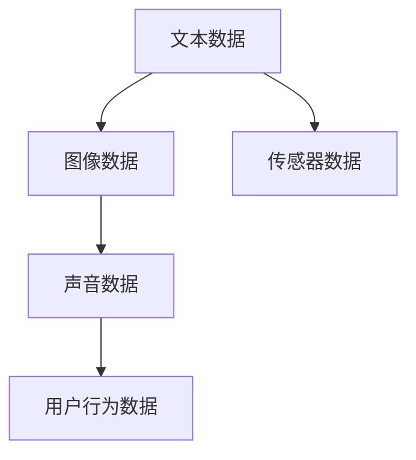
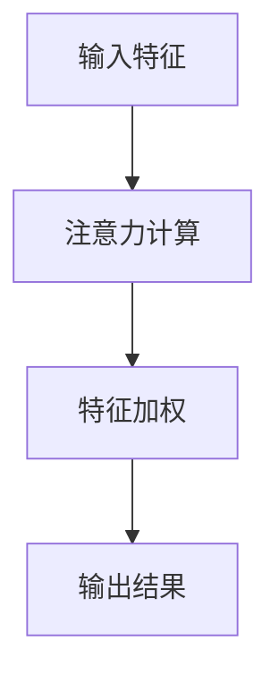

                 


# 《构建AI Agent的多模态感知系统》

> **关键词**: AI Agent, 多模态感知, 数据融合, 深度学习, 实体关系图, 数学公式, 项目实战

> **摘要**: 本文详细探讨了构建AI Agent的多模态感知系统的各个方面，从基本概念到算法原理，再到系统架构设计和项目实战。文章首先介绍了AI Agent和多模态感知的核心概念，然后分析了多模态数据融合的原理和方法，接着详细讲解了基于深度学习的多模态感知算法及其数学模型。最后，通过实际项目案例展示了多模态感知系统的实现过程，并总结了开发中的注意事项和未来发展方向。

---

# 第1章: AI Agent与多模态感知系统概述

## 1.1 AI Agent的基本概念

### 1.1.1 AI Agent的定义与特点
AI Agent（人工智能代理）是指在计算机系统中，能够感知环境、自主决策并执行任务的智能体。它具备以下特点：
- **自主性**: 能够自主决策，无需外部干预。
- **反应性**: 能够实时感知环境并做出响应。
- **学习能力**: 能够通过经验改进自身的性能。
- **社会能力**: 能够与其他Agent或人类进行交互协作。

### 1.1.2 多模态感知的定义与特点
多模态感知是指AI Agent能够同时处理多种类型的数据（如文本、图像、声音、传感器数据等），并从中提取有用信息的能力。其特点包括：
- **多样性**: 能够处理多种类型的数据。
- **互补性**: 不同模态的数据可以相互补充，提高感知的准确性。
- **实时性**: 能够实时处理多模态数据，快速做出决策。

### 1.1.3 多模态感知在AI Agent中的作用
多模态感知是AI Agent实现复杂任务的核心能力。通过多模态感知，AI Agent可以更好地理解环境、识别意图并做出更准确的决策。

## 1.2 多模态感知系统的背景与技术背景

### 1.2.1 多模态数据的来源与特点
多模态数据来源于多种传感器、设备和交互界面，包括：
- **文本数据**: 包括自然语言文本、语音转写的文字等。
- **图像数据**: 包括照片、视频帧等视觉信息。
- **声音数据**: 包括语音、音乐、环境声音等。
- **传感器数据**: 包括温度、湿度、加速度等物理量。

### 1.2.2 多模态感知技术的发展历程
多模态感知技术起源于20世纪90年代，随着深度学习技术的发展，多模态感知技术逐渐成熟，并在近年来取得了显著进展。

### 1.2.3 当前多模态感知技术的主要应用领域
- **计算机视觉**: 图像识别、目标检测。
- **自然语言处理**: 文本分类、机器翻译。
- **语音识别**: 语音助手、智能音箱。
- **智能机器人**: 多模态交互、环境感知。

## 1.3 多模态感知系统的核心问题与挑战

### 1.3.1 多模态数据融合的难点
多模态数据融合的难点在于如何有效结合不同模态的数据，避免信息冗余和冲突。

### 1.3.2 不同模态数据之间的关联性分析
不同模态的数据之间可能存在关联性，例如，声音和图像数据可能在时间上同步。

### 1.3.3 多模态感知系统的设计与实现挑战
设计多模态感知系统需要考虑系统的实时性、可扩展性和容错性。

## 1.4 本章小结
本章介绍了AI Agent和多模态感知的基本概念，分析了多模态感知技术的背景和发展历程，并讨论了多模态感知系统的核心问题与挑战。

---

# 第2章: 多模态感知的核心概念与联系

## 2.1 多模态数据的特征分析

### 2.1.1 文本模态的特征
文本模态的特征包括：
- **序列性**: 文本数据具有序列性。
- **语义性**: 文本数据具有丰富的语义信息。
- **多样性**: 文本数据可以是多种语言、多种格式。

### 2.1.2 图像模态的特征
图像模态的特征包括：
- **空间性**: 图像数据具有空间结构。
- **纹理性**: 图像数据具有纹理特征。
- **光照不变性**: 图像数据在不同光照条件下具有不变性。

### 2.1.3 声音模态的特征
声音模态的特征包括：
- **时域特性**: 包括幅度、频率等。
- **频域特性**: 包括音调、节奏等。
- **情感特征**: 包括语气、语调等。

### 2.1.4 其他模态的特征（如视频、传感器数据等）
视频模态的特征包括：
- **空间-temporal特性**: 包括物体的运动轨迹、速度等。
- **语义特性**: 包括视频内容的主题、场景等。

## 2.2 多模态数据融合的原理

### 2.2.1 数据融合的基本概念
数据融合是指将多个来源的数据进行整合，以提高信息的准确性和完整性。

### 2.2.2 多模态数据融合的方法与策略
多模态数据融合的方法包括：
- **特征融合**: 将不同模态的特征向量进行融合。
- **决策融合**: 将不同模态的决策结果进行融合。
- **晚期融合**: 在特征提取的后期进行融合。

### 2.2.3 数据融合的效果评估
数据融合的效果可以通过以下指标进行评估：
- **准确率**: 正确识别的样本数占总样本数的比例。
- **召回率**: 正确识别的样本数占真实为正样本的比例。
- **F1值**: 准确率和召回率的调和平均数。

## 2.3 多模态感知系统的实体关系图



## 2.4 本章小结
本章详细分析了多模态数据的特征，并介绍了多模态数据融合的原理和方法。通过实体关系图展示了多模态数据之间的关联关系。

---

# 第3章: 多模态数据融合算法

## 3.1 基于特征融合的多模态感知算法

### 3.1.1 特征提取的基本原理
特征提取是指从原始数据中提取具有代表性的特征向量。

### 3.1.2 多模态特征融合的方法
多模态特征融合的方法包括：
- **加权融合**: 根据特征的重要性进行加权。
- **注意力机制**: 通过注意力机制动态调整特征的权重。
- **对比学习**: 通过对比学习提取相似的特征。

### 3.1.3 基于注意力机制的特征融合算法


## 3.2 基于对比学习的多模态感知算法

### 3.2.1 对比学习的基本原理
对比学习是指通过比较两个样本的相似性来学习特征表示。

### 3.2.2 对比学习在多模态感知中的应用
对比学习可以应用于跨模态数据的特征对齐。

### 3.2.3 对比学习的数学模型
$$\text{损失函数} = -\log\left(\frac{\exp(s)}{1+\exp(s)}\right)$$
其中，\(s\) 是样本对的相似度得分。

## 3.3 本章小结
本章介绍了基于特征融合和对比学习的多模态感知算法，并通过mermaid流程图展示了注意力机制的实现过程。

---

# 第4章: 多模态感知系统的算法原理

## 4.1 多模态数据融合的算法实现

### 4.1.1 基于深度学习的多模态感知算法
深度学习是一种基于人工神经网络的机器学习方法，广泛应用于多模态感知。

### 4.1.2 多模态数据融合的深度学习模型
多模态数据融合的深度学习模型包括：
- **多模态卷积神经网络**: 多模态数据经过卷积层提取特征。
- **多模态变换器**: 多模态数据经过自注意力机制提取特征。

### 4.1.3 多模态数据融合的数学模型
$$p(y|x) = \argmax_y \sum_{i} \alpha_i x_i$$
其中，\(x_i\) 是不同模态的特征，\(\alpha_i\) 是对应的权重。

## 4.2 多模态数据融合的优化方法

### 4.2.1 基于梯度下降的优化方法
梯度下降是一种常用的优化算法，用于最小化损失函数。

### 4.2.2 基于Adam优化器的优化方法
Adam优化器是一种常用优化算法，结合了动量和自适应学习率。

### 4.2.3 基于早停的优化方法
早停是一种防止过拟合的优化方法，通过监控验证集的损失函数进行。

## 4.3 本章小结
本章介绍了多模态数据融合的算法实现和优化方法，重点讲解了深度学习模型和优化算法。

---

# 第5章: 多模态感知系统的项目实战

## 5.1 项目背景与需求分析

### 5.1.1 项目背景
本项目旨在构建一个基于多模态感知的智能助手，能够同时处理文本、图像和声音数据。

### 5.1.2 项目需求
- 实现文本、图像和声音数据的多模态感知。
- 提供实时交互功能，支持用户通过多种模态进行输入。

## 5.2 系统设计与实现

### 5.2.1 系统功能设计
系统功能包括：
- 多模态数据采集与预处理。
- 多模态数据融合与分析。
- 用户交互与反馈。

### 5.2.2 系统实现代码
```python
import numpy as np
from tensorflow import keras

class MultiModalFuser:
    def __init__(self):
        self.model = self.build_model()
    
    def build_model(self):
        inputs = []
        outputs = []
        # 文本分支
        text_input = keras.Input(shape=(100, 100, 1))
        x = keras.layers.Conv2D(32, (3, 3), activation='relu')(text_input)
        x = keras.layers.MaxPooling2D((2, 2))(x)
        text_branch = keras.Model(inputs=text_input, outputs=x)
        
        # 图像分支
        image_input = keras.Input(shape=(100, 100, 1))
        x = keras.layers.Conv2D(32, (3, 3), activation='relu')(image_input)
        x = keras.layers.MaxPooling2D((2, 2))(x)
        image_branch = keras.Model(inputs=image_input, outputs=x)
        
        # 声音分支
        audio_input = keras.Input(shape=(100, 100, 1))
        x = keras.layers.Conv2D(32, (3, 3), activation='relu')(audio_input)
        x = keras.layers.MaxPooling2D((2, 2))(x)
        audio_branch = keras.Model(inputs=audio_input, outputs=x)
        
        # 融合层
        merged = keras.layers.concatenate([text_branch.output, image_branch.output, audio_branch.output])
        merged = keras.layers.Dense(64, activation='relu')(merged)
        merged = keras.layers.Dense(1, activation='sigmoid')(merged)
        
        model = keras.Model(inputs=[text_input, image_input, audio_input], outputs=merged)
        return model
```

### 5.2.3 代码解读与分析
上述代码实现了一个多模态融合模型，包括文本、图像和声音三个分支，最终通过全连接层进行融合。

## 5.3 实际案例分析与详细讲解

### 5.3.1 案例背景
假设我们有一个智能音箱项目，能够通过语音和触摸屏进行交互。

### 5.3.2 案例实现过程
- 数据采集与预处理。
- 模型训练与优化。
- 系统集成与测试。

## 5.4 项目小结
本章通过一个实际项目展示了多模态感知系统的实现过程，包括系统设计、代码实现和案例分析。

---

# 第6章: 多模态感知系统的高级话题与未来展望

## 6.1 多模态感知系统的优化与改进

### 6.1.1 模型压缩与轻量化
通过模型压缩技术，减少模型的计算量和存储空间。

### 6.1.2 在线学习与自适应
通过在线学习，使模型能够实时适应环境的变化。

### 6.1.3 多模态数据的边缘计算
在边缘设备上进行多模态数据的处理和分析。

## 6.2 多模态感知系统的未来发展方向

### 6.2.1 更多模态的融合
未来将有更多的模态数据被引入，如视频、激光雷达等。

### 6.2.2 更高效的算法
未来将开发更高效的算法，提高多模态感知的实时性和准确性。

### 6.2.3 更广泛的应用场景
多模态感知技术将应用于更多的领域，如医疗、教育、娱乐等。

## 6.3 本章小结
本章展望了多模态感知系统的未来发展方向，包括更多的模态融合、更高效的算法和更广泛的应用场景。

---

# 第7章: 总结与展望

## 7.1 本书内容总结
本书系统地介绍了构建AI Agent的多模态感知系统的各个方面，从基本概念到算法原理，再到项目实战。

## 7.2 未来研究方向
未来的研究方向包括：
- 更高效的多模态数据融合算法。
- 更智能的多模态感知系统架构。
- 更广泛的应用场景探索。

## 7.3 本章小结
本章总结了全书内容，并展望了未来的研究方向。

---

**作者：AI天才研究院/AI Genius Institute & 禅与计算机程序设计艺术 /Zen And The Art of Computer Programming**

