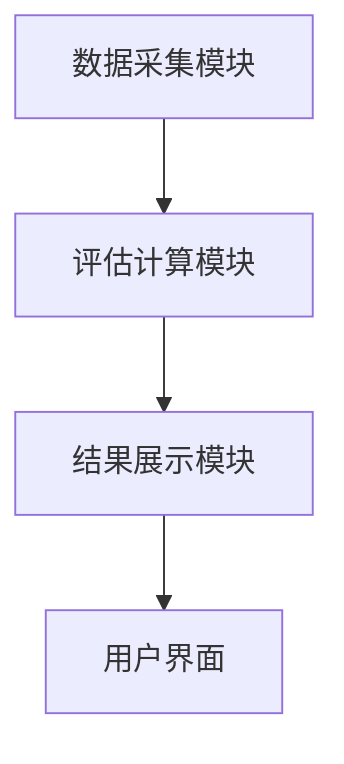

                 


# 《构建AI Agent的多维度性能评估体系》

## 关键词：AI Agent，性能评估，多维度，算法，系统架构，项目实战

## 摘要：本文系统地探讨了构建AI Agent多维度性能评估体系的必要性、核心概念、算法原理、系统架构及实际应用。通过详细分析各评估维度及其相互关系，结合数学模型和实际案例，为AI Agent的优化和应用提供了理论支持和实践指导。

---

## 第1章：AI Agent的基本概念与背景

### 1.1 AI Agent的定义与核心概念

#### 1.1.1 AI Agent的定义与特点
AI Agent（人工智能代理）是一种智能系统，能够感知环境、自主决策并执行任务。其特点包括：
- **自主性**：无需外部干预，自主完成任务。
- **反应性**：能够实时感知环境并做出反应。
- **目标导向性**：基于目标驱动行为。
- **学习能力**：通过数据和经验不断优化性能。

#### 1.1.2 AI Agent的类型与应用场景
AI Agent可以分为以下类型：
- **简单反射型**：基于规则的反应，适用于简单任务。
- **基于模型的反射型**：利用内部模型进行决策，适用于复杂环境。
- **目标驱动型**：以实现特定目标为导向。
- **实用驱动型**：追求效用最大化，适用于资源优化场景。

应用场景包括智能助手、自动驾驶、机器人控制、推荐系统等。

#### 1.1.3 AI Agent与传统自动化的区别
AI Agent的核心区别在于其具备自主决策和学习能力，能够适应动态变化的环境，而传统自动化依赖于固定的规则和程序。

---

### 1.2 性能评估体系的背景与重要性

#### 1.2.1 当前AI Agent应用中的挑战
随着AI Agent的广泛应用，其性能评估面临以下挑战：
- **多维度评估需求**：单一指标无法全面反映性能。
- **动态环境适应性**：需要评估其在不同环境下的表现。
- **数据异构性**：评估数据来源多样，处理复杂。

#### 1.2.2 多维度性能评估的必要性
为了全面衡量AI Agent的能力，必须从多个维度进行评估，包括知识准确性、响应速度、决策合理性等。

#### 1.2.3 评估体系对AI Agent发展的推动作用
科学的评估体系能够帮助开发者识别性能瓶颈，优化算法，提升用户体验。

---

## 第2章：AI Agent性能评估的核心概念

### 2.1 评估维度的分类与特征

#### 2.1.1 评估维度
- **知识准确性**：AI Agent对问题理解的深度。
- **响应速度**：处理请求的时间效率。
- **决策合理性**：决策的逻辑性和可行性。
- **系统稳定性**：在异常情况下的表现。
- **用户体验满意度**：用户的主观感受。

#### 2.1.2 各维度的特征对比
| 维度 | 描述 | 示例场景 | 关键指标 |
|------|------|----------|----------|
| 知识准确性 | 正确性与全面性 | 自然语言理解 | 错误率、召回率 |
| 响应速度 | 处理时间 | 实时响应 | 响应时间、吞吐量 |
| 决策合理性 | 逻辑性和最优性 | 路径规划 | 路径长度、能耗 |
| 系统稳定性 | 抗干扰能力 | 故障恢复 | 响应时间、错误率 |
| 用户体验满意度 | 用户主观感受 | 交互体验 | 用户满意度调查 |

---

### 2.2 各维度之间的关系与权重分配

#### 2.2.1 维度间的相互影响
- 知识准确性影响决策合理性。
- 响应速度影响用户体验满意度。
- 系统稳定性保障整体可用性。

#### 2.2.2 权重确定方法
- **层次分析法（AHP）**：通过专家打分确定权重。
- **熵值法**：基于数据信息量计算权重。

#### 2.2.3 权重调整策略
根据实际应用场景动态调整权重，例如在实时系统中提高响应速度的权重。

---

## 第3章：多维度评估体系的数学模型

### 3.1 综合评估模型的构建

#### 3.1.1 模型输入与输出
- **输入**：各维度的评估数据。
- **输出**：综合评分和改进建议。

#### 3.1.2 维度权重计算
使用层次分析法确定各维度权重：
$$
A = \begin{bmatrix}
1 & 3 & 2 & 4 & 1 \\
1/3 & 1 & 1/2 & 2 & 1 \\
1/2 & 2 & 1 & 3 & 1 \\
1/4 & 1/2 & 1/3 & 1 & 1 \\
1 & 1 & 1 & 1 & 1 \\
\end{bmatrix}
$$

计算权重：
$$
w_i = \frac{\sum_{j} a_{ij}}{\sum_{i} \sum_{j} a_{ij}}
$$

#### 3.1.3 综合评分公式
综合评分计算：
$$
S = \sum_{i=1}^{n} w_i \cdot s_i
$$
其中，$w_i$为第i个维度的权重，$s_i$为该维度的评分。

---

## 第4章：系统架构与实现方案

### 4.1 系统功能模块设计

#### 4.1.1 数据采集模块
负责收集各维度的评估数据，包括响应时间、错误率等。

#### 4.1.2 评估计算模块
根据数据计算各维度评分，并进行加权求和得到综合评分。

#### 4.1.3 结果展示模块
以图表形式展示评估结果，便于用户理解和分析。

---

### 4.2 系统架构图



---

## 第5章：项目实战

### 5.1 环境配置与数据准备

#### 5.1.1 开发环境搭建
- 使用Python 3.8及以上版本。
- 安装依赖：`numpy`, `pandas`, `scikit-learn`。

#### 5.1.2 数据收集与处理
收集AI Agent在不同场景下的响应时间和错误率数据。

---

### 5.2 核心代码实现

#### 5.2.1 评估模型代码
```python
import numpy as np
from sklearn.metrics import accuracy_score

def calculate_weights(data_matrix):
    # 假设数据矩阵为n×m，n为样本数，m为维度数
    n, m = data_matrix.shape
    # 计算每列的熵
    entropy = np.zeros(m)
    for i in range(m):
        # 计算每个维度的分布概率
        prob = np.bincount(data_matrix[:, i]) / n
        entropy[i] = -np.sum(prob * np.log2(prob))
    # 计算权重
    weights = 1 - entropy / np.max(entropy)
    return weights

# 示例数据
data = np.array([[1, 2, 3],
                 [2, 3, 4],
                 [3, 4, 5]])

weights = calculate_weights(data)
print("维度权重:", weights)
```

---

## 第6章：总结与展望

### 6.1 最佳实践与注意事项
- 数据质量直接影响评估结果，需确保数据的准确性和完整性。
- 定期更新评估模型，适应AI Agent的优化和新应用场景的需求。

### 6.2 未来发展方向
- 探索更多评估维度，如情感分析、创造性思维能力。
- 研究更智能的评估算法，如深度学习模型。
- 扩展应用场景，如教育、医疗等高精度要求的领域。

---

## 作者：AI天才研究院 & 禅与计算机程序设计艺术

---

通过以上结构，文章详细探讨了构建AI Agent多维度性能评估体系的各个方面，结合理论分析和实际案例，为读者提供了全面的指导和参考。

