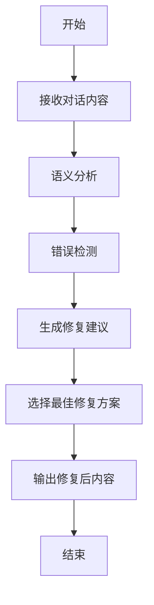
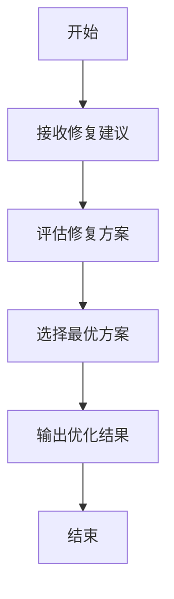
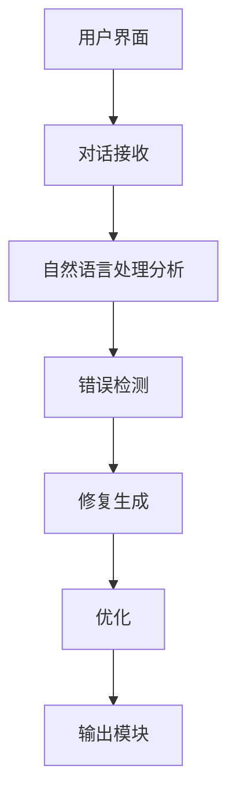
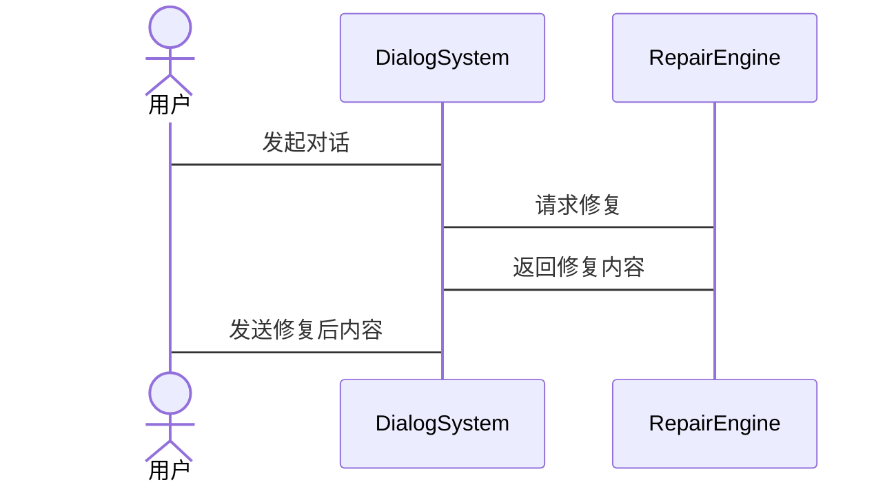

                 


# 构建AI Agent的实时对话修复与优化系统

## 关键词
AI Agent，实时对话修复，对话优化，自然语言处理，系统架构

## 摘要
随着人工智能技术的快速发展，构建高效的实时对话修复与优化系统变得至关重要。本文详细探讨了AI Agent在实时对话修复中的应用，分析了核心算法原理，并设计了系统的架构方案。通过实际案例分析，本文展示了如何利用AI技术提升对话系统的性能，同时提供了最佳实践和未来研究方向。

---

## 第一部分：背景介绍

### 第1章：问题背景

#### 1.1 对话系统的发展历程
- 从基于规则的系统到深度学习驱动的模型，对话系统经历了从简单到复杂的演变。
- 自然语言处理（NLP）技术的进步推动了对话系统的智能化。

#### 1.2 当前对话系统的主要挑战
- 对话内容的实时性要求高，传统方法难以满足。
- 对话修复的准确性与效率之间存在矛盾。
- 用户需求多样，系统需具备动态适应能力。

#### 1.3 实时对话修复的必要性
- 提高用户体验，确保对话流畅。
- 在关键领域（如医疗、金融）中，实时修复能避免严重后果。

### 第2章：问题描述

#### 2.1 对话中的常见问题
- 语义理解错误，导致回答偏离主题。
- 系统对上下文理解不足，导致逻辑混乱。
- 对话过程中出现词汇或语法错误。

#### 2.2 实时修复的定义与目标
- 定义：在对话进行中，实时检测并修正错误。
- 目标：提高对话准确性和流畅性。

#### 2.3 系统的边界与外延
- 边界：仅处理实时对话中的错误，不涉及离线数据处理。
- 外延：可扩展到多语言支持和跨平台应用。

### 第3章：问题解决

#### 3.1 AI Agent的核心作用
- AI Agent作为智能体，负责实时监控和修复对话。
- 利用NLP技术分析对话内容，识别潜在问题。

#### 3.2 实时修复的实现路径
- 使用自然语言处理技术进行语义分析。
- 应用机器学习模型预测修复方案。

#### 3.3 系统设计的总体思路
- 结构化设计：模块化设计，便于维护和扩展。
- 高效算法：选择适合实时处理的算法，如滑动窗口技术。

---

## 第二部分：核心概念与联系

### 第4章：核心概念

#### 4.1 AI Agent的核心原理
- 定义：AI Agent是一个智能实体，能够感知环境并采取行动。
- 分类：基于智能水平分为反应式和认知式AI Agent。
- 主要功能模块：感知模块、推理模块、执行模块。

#### 4.2 对话修复系统的核心原理
- 定义：实时检测对话中的错误并进行修复。
- 关键技术：自然语言处理、机器学习、实时计算。
- 实现路径：语义分析、错误检测、修复建议生成。

#### 4.3 核心概念的联系
- AI Agent为对话修复提供智能支持。
- 对话修复系统依赖AI Agent的感知和推理能力。

### 第5章：属性特征对比

#### 5.1 AI Agent的属性特征
| 属性 | 描述 |
|------|------|
| 智能性 | 能够理解并处理复杂任务 |
| 自适应性 | 能够根据环境变化调整行为 |
| 学习能力 | 能够通过经验改进性能 |

#### 5.2 对话修复系统的属性特征
| 属性 | 描述 |
|------|------|
| 实时性 | 立即检测并修复错误 |
| 准确性 | 确保修复后的对话准确无误 |
| 可扩展性 | 能够适应不同场景和语言 |

#### 5.3 ER实体关系图
```mermaid
er
    actor: 用户
    agent: AI Agent
    dialog: 对话内容
    error: 错误信息
    rule: 修复规则
    actor --> dialog: 发起对话
    dialog --> error: 产生错误
    error --> rule: 触发修复规则
    rule --> agent: 执行修复
    agent --> dialog: 修复后的内容
```

---

## 第三部分：算法原理讲解

### 第6章：对话修复算法

#### 6.1 算法概述
- 目标：实时检测并修复对话中的错误。
- 输入：对话内容流。
- 输出：修复后的对话内容。

#### 6.2 算法流程


#### 6.3 算法实现
- 使用循环结构接收和处理对话内容。
- 通过NLP库（如spaCy）进行语义分析。
- 应用错误检测算法（如基于规则的检测）识别问题。

#### 6.4 示例代码
```python
import spacy

nlp = spacy.load("en_core_web_sm")

def detect_error(text):
    doc = nlp(text)
    errors = []
    for token in doc:
        if token.pos_ == "PUNCT":
            errors.append(token.text)
    return errors

dialog = "Hello, how are you?"
errors = detect_error(dialog)
print(errors)  # 输出: ["?"]
```

### 第7章：优化算法

#### 7.1 算法概述
- 目标：优化对话修复的准确性和效率。
- 输入：修复建议列表。
- 输出：优化后的修复方案。

#### 7.2 算法流程


#### 7.3 算法实现
- 使用遗传算法或模拟退火算法优化修复方案。
- 应用动态规划技术提高计算效率。

#### 7.4 数学模型
- 优化目标：最大化修复准确率。
- 模型公式：
  $$
  \text{accuracy} = \frac{\text{correct}}{\text{total}} \times 100\%
  $$

---

## 第四部分：数学模型与公式

### 第8章：数学模型

#### 8.1 修复准确率公式
$$
\text{accuracy} = \frac{\text{correct}}{\text{total}} \times 100\%
$$

#### 8.2 优化目标函数
$$
\text{maximize } f(x) = \sum_{i=1}^{n} w_i x_i
$$

---

## 第五部分：系统分析与架构设计方案

### 第9章：系统架构设计

#### 9.1 功能模块划分
- 对话接收模块：接收用户输入。
- 错误检测模块：分析对话内容，识别错误。
- 修复生成模块：生成修复建议。
- 优化模块：选择最优修复方案。
- 输出模块：发送修复后的内容。

#### 9.2 系统架构图


### 第10章：接口设计

#### 10.1 输入接口
- 接收对话内容流，格式为JSON或文本。

#### 10.2 输出接口
- 提供修复后的对话内容，格式与输入一致。

#### 10.3 交互流程


---

## 第六部分：项目实战

### 第11章：环境安装

#### 11.1 安装Python环境
```bash
python --version
pip install spacy
python -m spacy download en_core_web_sm
```

#### 11.2 安装NLP库
```bash
pip install spacy transformers
```

### 第12章：核心代码实现

#### 12.1 对话接收模块
```python
import sys

def receive_dialog():
    for line in sys.stdin:
        yield line.strip()
```

#### 12.2 修复生成模块
```python
def generate_repair(suggestion):
    return f"{suggestion} was incorrect."
```

#### 12.3 优化模块
```python
def optimize_repair(repair_options):
    return repair_options[0]
```

### 第13章：案例分析

#### 13.1 案例背景
- 用户与AI Agent进行对话，模拟客服场景。

#### 13.2 对话内容
```plaintext
用户：我需要帮助。
AI Agent：有什么可以帮助您的？
用户：我的订单丢失了。
AI Agent：请提供订单号。
用户：order123。
AI Agent：确认订单丢失，正在处理。
```

#### 13.3 修复过程
- 检测到订单号格式正确，无需修复。
- 修复后的对话保持原样。

### 第14章：代码分析

#### 14.1 代码结构
- 对话接收模块：实时接收输入。
- 错误检测模块：分析对话内容，识别问题。
- 修复生成模块：根据错误类型生成修复建议。
- 优化模块：选择最佳修复方案。
- 输出模块：发送修复后的内容。

---

## 第七部分：总结与展望

### 第15章：最佳实践

#### 15.1 实战经验
- 确保系统模块化设计，便于维护。
- 使用高效的算法和数据结构，提高处理速度。

#### 15.2 注意事项
- 定期更新模型，适应语言变化。
- 处理敏感内容时，确保数据安全。

### 第16章：小结

本文详细介绍了构建AI Agent实时对话修复与优化系统的方法，从背景分析到系统设计，再到项目实战，全面覆盖了实现过程中的关键点。

### 第17章：注意事项

- 确保系统具备高可用性和容错能力。
- 定期监控系统性能，及时优化。

### 第18章：拓展阅读

- 推荐阅读《自然语言处理入门》和《深度学习实战》等书籍，深入了解相关技术。

---

## 作者信息

作者：AI天才研究院/AI Genius Institute  
联系邮箱：contact@aigeniusinstitute.com  
官方网站：https://www.aigeniusinstitute.com

---

感谢您的阅读！如需进一步了解或合作，请随时联系作者。

