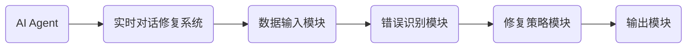
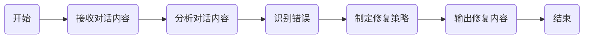
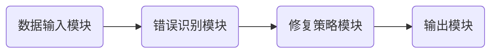

                 


# 构建AI Agent的实时对话修复系统

> 关键词：AI Agent，实时对话修复，自然语言处理，对话系统，对话修复算法

> 摘要：本文详细探讨了构建AI Agent的实时对话修复系统的各个方面，从背景介绍到系统架构设计，再到项目实战，深入分析了该系统的构建过程和关键实现技术。通过本文的学习，读者将能够理解并掌握如何设计和实现一个高效的实时对话修复系统。

---

## 第一部分：AI Agent与实时对话修复系统背景

### 第1章：AI Agent与实时对话修复系统概述

#### 1.1 问题背景
在现代通信系统中，对话系统的准确性和实时性是关键。然而，现有的对话系统在处理复杂语境、语法错误和信息不一致时常常出现错误，导致用户体验下降。实时对话修复系统能够及时识别并纠正这些问题，提升对话质量。

#### 1.2 问题描述
实时对话修复系统需要具备以下功能：
- 识别对话中的错误或不准确部分。
- 自动修复或建议修复方案。
- 实时更新对话内容，确保信息的准确性和连贯性。

#### 1.3 问题解决
AI Agent通过自然语言处理技术，结合实时反馈机制，能够快速识别并修复对话中的问题。系统架构设计包括数据采集、错误识别、修复策略制定和反馈输出四个模块。

#### 1.4 概念结构与核心要素
系统的核心要素包括：
- 数据输入模块：接收实时对话内容。
- 错误识别模块：使用NLP技术分析对话内容。
- 修复策略模块：基于分析结果制定修复方案。
- 输出模块：将修复后的内容反馈给用户。

---

## 第二部分：AI Agent的核心概念与原理

### 第2章：AI Agent的核心概念与原理

#### 2.1 AI Agent的基本原理
AI Agent是一种智能代理，能够感知环境并执行任务。在实时对话修复系统中，AI Agent负责分析对话内容，识别错误，并执行修复操作。

#### 2.2 实时对话修复系统
实时对话修复系统是一个闭环系统，包括数据输入、处理和输出三个阶段。系统通过持续反馈机制，确保对话内容的准确性和实时性。

#### 2.3 核心概念的联系
AI Agent与实时对话修复系统的交互关系可以用以下Mermaid图表示：

```
# AI Agent与实时对话修复系统的交互关系


---

## 第三部分：算法原理与数学模型

### 第3章：算法原理与数学模型

#### 3.1 算法原理
实时对话修复算法主要包括以下步骤：
1. 接收对话内容。
2. 使用NLP模型分析对话内容。
3. 识别错误或不准确的部分。
4. 制定修复策略。
5. 输出修复后的内容。

#### 3.2 算法实现
修复算法的数学模型如下：

修复概率公式：
$$ P(修复) = \frac{1}{1 + e^{-x}} $$
其中，x是对话内容的相似度评分。

对话相似度计算公式：
$$ S(s_1, s_2) = \frac{\sum_{i=1}^{n} w_i \cdot |s_{1i} - s_{2i}|}{\sum_{i=1}^{n} w_i} $$
其中，w_i是第i个特征的权重，s_{1i}和s_{2i}是对话内容的两个特征值。

#### 3.3 算法流程图


---

## 第四部分：系统分析与架构设计方案

### 第4章：系统分析与架构设计方案

#### 4.1 系统分析
系统需要支持多线程处理，确保实时性。系统架构包括数据输入、处理和输出三个模块。

#### 4.2 系统架构设计
系统架构图如下：



#### 4.3 接口设计
系统提供RESTful API接口，支持POST和GET请求。

#### 4.4 交互设计
系统交互流程如下：

```mermaid
sequenceDiagram
参与者 用户
角色 系统
用户->系统: 发送对话内容
系统->用户: 返回修复后的内容
```

---

## 第五部分：项目实战

### 第5章：项目实战

#### 5.1 环境安装
需要安装以下工具和库：
- Python 3.8+
- NLTK库
- Transformers库
- Flask框架

#### 5.2 核心代码实现
修复算法的Python代码如下：

```python
import torch
import torch.nn as nn
import torch.optim as optim

class DialogRepairModel(nn.Module):
    def __init__(self, input_size, hidden_size, output_size):
        super(DialogRepairModel, self).__init__()
        self.hidden_size = hidden_size
        self.embedding = nn.Embedding(input_size, hidden_size)
        self.rnn = nn.RNN(hidden_size, hidden_size)
        self.fc = nn.Linear(hidden_size, output_size)

    def forward(self, x):
        embed = self.embedding(x)
        output, _ = self.rnn(embed)
        output = self.fc(output)
        return output

# 示例使用
input_size = 100
hidden_size = 128
output_size = 5
model = DialogRepairModel(input_size, hidden_size, output_size)
criterion = nn.CrossEntropyLoss()
optimizer = optim.Adam(model.parameters(), lr=0.001)
```

#### 5.3 代码解读与分析
代码实现了一个基于RNN的对话修复模型，包括嵌入层、RNN层和全连接层。模型通过反向传播算法进行训练，优化器采用Adam算法。

#### 5.4 案例分析
假设用户输入一段有语法错误的对话，系统会识别错误并输出修复后的对话。

#### 5.5 项目小结
通过项目实战，读者可以掌握如何将理论应用于实际，实现一个简单的实时对话修复系统。

---

## 第六部分：小结与拓展阅读

### 第6章：小结与拓展阅读

#### 6.1 最佳实践 tips
- 使用预训练模型提高修复准确率。
- 实时反馈机制确保系统响应速度。

#### 6.2 小结
本文详细讲解了构建AI Agent的实时对话修复系统的各个方面，从背景介绍到项目实战，帮助读者掌握该系统的构建和实现技术。

#### 6.3 注意事项
- 确保系统的实时性和准确性。
- 定期更新模型以适应新的语言变化。

#### 6.4 拓展阅读
- 《神经网络与深度学习》
- 《自然语言处理实战》

---

## 作者

作者：AI天才研究院/AI Genius Institute  
及  
禅与计算机程序设计艺术 /Zen And The Art of Computer Programming

---

通过本文的学习，读者将能够理解并掌握如何设计和实现一个高效的实时对话修复系统，为构建更加智能和流畅的对话系统奠定基础。

