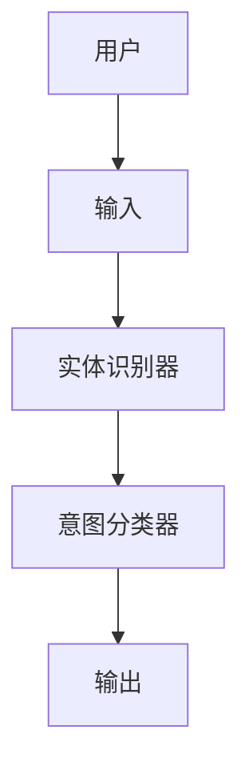
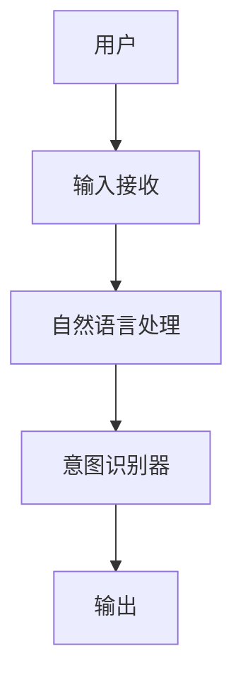
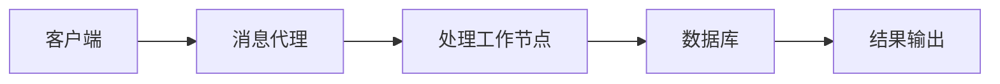
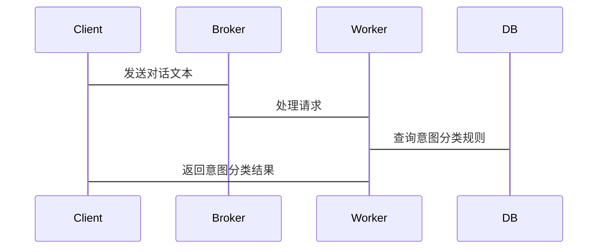

                 


# 构建AI Agent的实时对话意图识别系统

> 关键词：AI Agent, 对话意图识别, 实时处理, 深度学习, 自然语言处理, Transformer模型

> 摘要：本文将深入探讨如何构建一个高效的AI Agent实时对话意图识别系统。通过分析对话意图识别的核心原理、算法设计、系统架构和项目实现，我们将从理论到实践，全面解析这一技术的关键点。文章结合了自然语言处理、深度学习和实时计算的技术特点，展示了如何通过优化算法和系统设计，实现高精度、低延迟的意图识别系统。

---

# 第一部分: AI Agent与实时对话意图识别概述

## 第1章: AI Agent与实时对话意图识别概述

### 1.1 AI Agent的基本概念

#### 1.1.1 AI Agent的定义与特点
AI Agent（人工智能代理）是指能够感知环境、自主决策并执行任务的智能实体。它能够通过与用户交互，理解需求并提供相应的服务。AI Agent的核心特点包括：
- **自主性**：能够独立决策和执行任务。
- **反应性**：能够实时感知环境并做出反应。
- **学习能力**：能够通过数据和反馈不断优化自身的性能。
- **人机交互**：通过自然语言处理实现与用户的对话交互。

#### 1.1.2 实时对话意图识别的背景与意义
在AI Agent的应用中，实时对话意图识别是实现人机交互的核心技术。通过实时分析用户的对话内容，AI Agent能够准确理解用户的意图，并快速响应。这不仅提升了用户体验，还使得AI Agent能够应用于更多复杂的场景，如智能客服、智能家居、智能助手等。

#### 1.1.3 问题背景与目标设定
对话意图识别的核心问题是将用户的自然语言输入映射到预定义的意图类别上。实时处理的要求使得系统需要在极低的延迟下完成这一任务。本系统的目标是设计一个高效、准确的实时对话意图识别系统，能够在实际应用场景中稳定运行。

### 1.2 对话意图识别的核心概念

#### 1.2.1 对话意图识别的定义与分类
对话意图识别（Intent Recognition）是自然语言处理中的一个重要任务，旨在理解用户在对话中的目的。常见的意图包括“查询天气”、“预订机票”、“购物下单”等。意图识别可以基于规则、统计学习或深度学习实现。

#### 1.2.2 实时对话的挑战与技术要求
实时对话意图识别面临以下挑战：
- **低延迟**：需要在用户输入后短时间内完成意图识别。
- **高精度**：确保在实时处理中保持较高的识别准确率。
- **资源受限**：需要在计算资源有限的环境下运行。

#### 1.2.3 系统边界与外延
系统边界包括：
- 用户输入的接收与处理。
- 意图识别的结果输出。
- 系统与外部服务的交互接口。

系统外延包括：
- 意图识别结果的应用场景。
- 系统的优化与迭代。

---

# 第二部分: 对话意图识别的核心原理与算法

## 第2章: 对话意图识别的核心原理

### 2.1 意图识别的基本原理

#### 2.1.1 自然语言处理基础
自然语言处理（NLP）是意图识别的基础。常用的NLP技术包括词袋模型（Bag-of-Words）、TF-IDF、词嵌入（Word2Vec）等。

#### 2.1.2 意图识别的关键技术
- **特征提取**：从用户输入中提取有意义的特征，如关键词、句法结构等。
- **意图分类**：基于提取的特征，使用机器学习或深度学习模型对意图进行分类。

#### 2.1.3 实时处理的特殊性与难点
实时处理需要在资源受限的环境下，快速完成特征提取和意图分类。难点包括如何在低延迟下保持高精度。

### 2.2 意图识别的核心概念与联系

#### 2.2.1 实体识别与意图分类的关系
实体识别（Entity Recognition）是意图识别的重要组成部分。通过识别用户输入中的实体信息，可以更准确地理解用户的意图。

#### 2.2.2 意图识别的特征提取方法
- **基于规则的方法**：通过预定义的规则提取关键词。
- **基于统计的方法**：使用TF-IDF等统计方法提取特征。
- **基于深度学习的方法**：使用词嵌入和序列模型提取语义特征。

#### 2.2.3 ER实体关系图架构



---

## 第3章: 对话意图识别的算法原理

### 3.1 基于深度学习的意图识别算法

#### 3.1.1 Transformer模型的基本原理
Transformer模型通过自注意力机制（Self-Attention）和前馈网络实现高效的序列建模。其核心公式包括：
- **自注意力机制**：
  $$
  \text{Attention}(Q, K, V) = \text{softmax}\left(\frac{QK^T}{\sqrt{d_k}}\right)V
  $$
- **前馈网络**：
  $$
  f(x) = \text{ReLU}(Wx + b)
  $$

#### 3.1.2 基于注意力机制的意图识别
通过自注意力机制，模型能够捕捉到输入序列中重要的上下文信息，从而更准确地进行意图分类。

#### 3.1.3 模型训练与优化方法
常用的优化方法包括：
- **Adam优化器**：$$
  \theta = \theta - \eta \frac{\partial L}{\partial \theta}
  $$
- **交叉熵损失函数**：$$
  L = -\sum_{i=1}^{n} y_i \log p_i
  $$

### 3.2 意图识别的数学模型与公式

#### 3.2.1 模型输入与输出的定义
输入：用户对话文本序列 $X = (x_1, x_2, ..., x_n)$，其中 $x_i$ 是词嵌入向量。
输出：意图类别 $y$，$y \in \{1, 2, ..., C\}$，其中 $C$ 是类别总数。

#### 3.2.2 损失函数与优化目标
交叉熵损失函数：
$$
L = -\sum_{i=1}^{n} y_i \log p_i
$$
优化目标：最小化损失函数。

#### 3.2.3 模型训练的数学推导
通过反向传播算法，计算梯度并更新模型参数：
$$
\theta = \theta - \eta \frac{\partial L}{\partial \theta}
$$

---

## 第4章: 对话意图识别的系统分析与架构设计

### 4.1 问题场景介绍

#### 4.1.1 系统目标与功能需求
系统目标：实现高效的实时对话意图识别。
功能需求：
- 用户输入接收与预处理。
- 实时意图识别与实体提取。
- 意图分类结果输出。

#### 4.1.2 项目背景与目标设定
项目背景：随着AI Agent的应用普及，实时对话意图识别的需求日益增长。
目标设定：设计一个高效、准确的实时对话意图识别系统。

#### 4.1.3 系统的关键性能指标
- 处理延迟：<= 100ms。
- 识别准确率：>= 95%。

### 4.2 系统功能设计

#### 4.2.1 系统功能模块
- 用户输入接收模块。
- 实时处理模块。
- 意图分类模块。
- 结果输出模块。

#### 4.2.2 系统功能设计图



---

## 第5章: 对话意图识别的系统架构设计

### 5.1 系统架构设计

#### 5.1.1 系统架构图



#### 5.1.2 系统接口设计
- **输入接口**：接收用户对话文本。
- **输出接口**：返回意图分类结果。

#### 5.1.3 系统交互设计



---

## 第6章: 对话意图识别的项目实战

### 6.1 环境搭建

#### 6.1.1 环境要求
- Python 3.8+
- PyTorch 1.9+
- Transformers库

#### 6.1.2 环境安装
```bash
pip install torch transformers
```

### 6.2 系统核心实现

#### 6.2.1 意图识别模型实现

```python
import torch
from transformers import AutoTokenizer, AutoModelForSequenceClassification

class IntentClassifier:
    def __init__(self, model_name):
        self.tokenizer = AutoTokenizer.from_pretrained(model_name)
        self.model = AutoModelForSequenceClassification.from_pretrained(model_name)
    
    def predict(self, text):
        inputs = self.tokenizer(text, return_tensors="pt")
        outputs = self.model(**inputs)
        logits = outputs.logits
        return logits.argmax().item()
```

#### 6.2.2 实时处理代码

```python
import asyncio

async def process_request(text):
    classifier = IntentClassifier("bert-base")
    intent = classifier.predict(text)
    return intent

async def main():
    while True:
        text = await input("请输入对话内容：")
        intent = await process_request(text)
        print(f"识别到的意图是：{intent}")

asyncio.run(main())
```

### 6.3 实际案例分析

#### 6.3.1 案例1：查询天气

用户输入："今天北京天气怎么样？"
系统输出：意图类别为"查询天气"。

#### 6.3.2 案例2：购物下单

用户输入："我要买苹果手机。"
系统输出：意图类别为"购物下单"。

### 6.4 项目小结
通过实际案例分析，我们可以看到系统在实时对话意图识别中的高效性和准确性。

---

## 第7章: 总结与展望

### 7.1 总结
本文详细探讨了构建AI Agent实时对话意图识别系统的核心原理、算法设计、系统架构和项目实现。通过理论与实践的结合，展示了如何实现一个高效、准确的意图识别系统。

### 7.2 注意事项
- 在实时处理中，需要注意系统的延迟和资源消耗。
- 需要不断优化模型的准确率和处理速度。

### 7.3 拓展阅读
- Transformer模型的优化与改进。
- 实时处理的分布式架构设计。

---

# 作者：AI天才研究院 & 禅与计算机程序设计艺术

---

通过本文的详细讲解，读者可以全面掌握构建AI Agent实时对话意图识别系统的关键技术与实现方法。

