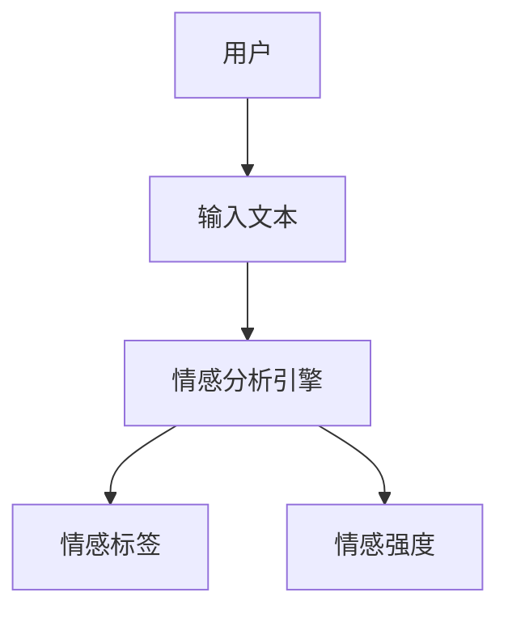
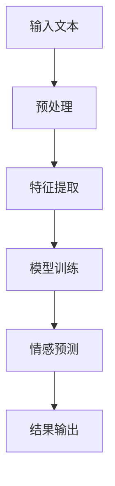
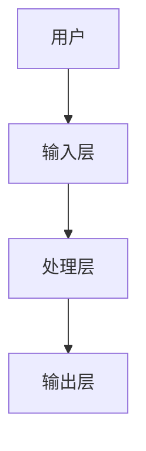

                 


# 构建AI Agent的实时情感分析引擎

> 关键词：AI Agent, 情感分析, 实时分析, 深度学习, 系统架构

> 摘要：本文详细探讨了构建AI Agent实时情感分析引擎的全过程，从核心概念、算法原理到系统架构设计，再到项目实战，为读者提供了一套完整的解决方案。文章通过丰富的案例分析和详细的代码实现，帮助读者深入理解情感分析引擎的工作原理，并掌握如何将其应用于实际场景中。

---

# 第1章: 情感分析引擎的背景与概念

## 1.1 情感分析的背景与问题背景

### 1.1.1 情感分析的定义与问题背景
情感分析是自然语言处理（NLP）领域的重要任务之一，旨在通过分析文本内容来判断说话者或作者的情感倾向。随着社交媒体的普及，企业和开发者需要实时了解用户对产品、服务或品牌的看法，情感分析因此变得尤为重要。

### 1.1.2 AI Agent在情感分析中的作用
AI Agent（智能代理）是一种能够感知环境、自主决策并执行任务的实体。在情感分析中，AI Agent可以实时处理大量数据，快速生成情感分析结果，帮助企业和开发者做出数据驱动的决策。

### 1.1.3 实时情感分析的必要性与应用场景
实时情感分析能够快速响应用户输入，适用于多种场景，如社交媒体监控、客户支持、市场调研等。通过实时分析用户评论，企业可以及时调整策略，提升用户体验。

## 1.2 情感分析引擎的核心概念

### 1.2.1 情感分析的分类与特点
情感分析可以分为两类：**二分类任务**（如正面、中性、负面）和**多分类任务**（如非常正面、正面、中性、负面、非常负面）。实时情感分析的特点包括实时性、高效性和准确性。

### 1.2.2 实时情感分析的定义与特点
实时情感分析是指在数据流中逐条处理数据，并在接收每条数据后立即生成分析结果。其特点包括低延迟、高吞吐量和在线处理能力。

### 1.2.3 AI Agent与情感分析引擎的关系
AI Agent作为情感分析引擎的核心，负责数据的输入、处理和输出。情感分析引擎为AI Agent提供情感分析能力，两者相辅相成，共同完成任务。

## 1.3 情感分析引擎的边界与外延

### 1.3.1 情感分析的边界
情感分析的边界包括数据输入的格式、分析的粒度（如句子级或段落级）以及支持的语言种类。

### 1.3.2 实时情感分析的外延
实时情感分析的外延包括对分析结果的实时反馈、与其他系统的集成以及对分析结果的后续处理。

### 1.3.3 AI Agent在情感分析中的边界与外延
AI Agent在情感分析中的边界包括其处理能力、决策能力以及与外部系统的交互能力。外延则包括AI Agent的自我学习能力和与人类用户的交互能力。

## 1.4 本章小结

本章从背景和概念入手，详细介绍了情感分析引擎的定义、特点及其在AI Agent中的作用。接下来的章节将从核心概念、算法原理、系统架构等多个方面展开讨论。

---

# 第2章: 情感分析引擎的核心概念与联系

## 2.1 情感分析的核心原理

### 2.1.1 情感分析的基本原理
情感分析的基本原理是通过文本特征提取、模型训练和预测来判断文本的情感倾向。文本特征提取包括词袋模型和词嵌入模型（如Word2Vec）。

### 2.1.2 基于AI Agent的情感分析
AI Agent通过实时接收文本数据，利用情感分析模型进行分析，并将结果反馈给用户或系统。

### 2.1.3 实时情感分析的核心机制
实时情感分析的核心机制包括数据流处理、模型推理和结果输出。

## 2.2 情感分析引擎的实体关系图

### 2.2.1 实体关系图的定义
实体关系图描述了情感分析引擎中的各个实体及其关系。主要实体包括用户、输入文本、情感分析引擎、情感标签和情感强度。

### 2.2.2 实体关系图的绘制


## 2.3 情感分析引擎的算法流程图



## 2.4 本章小结

本章通过实体关系图和算法流程图，详细描述了情感分析引擎的核心概念及其工作原理。接下来的章节将从算法原理、系统架构等方面展开讨论。

---

# 第3章: 情感分析引擎的算法原理

## 3.1 情感分析模型的分类

### 3.1.1 基于规则的情感分析
基于规则的情感分析通过预定义的规则和关键词来判断情感倾向。这种方法适用于特定场景，但灵活性较低。

### 3.1.2 基于统计的情感分析
基于统计的情感分析通过统计文本中的特征（如词频）来训练模型。这种方法灵活性较高，但需要大量数据支持。

### 3.1.3 基于深度学习的情感分析
基于深度学习的情感分析通过神经网络模型（如RNN、LSTM、Transformer）来学习文本特征，具有较高的准确性和灵活性。

## 3.2 基于深度学习的情感分析模型

### 3.2.1 RNN与LSTM模型
RNN（循环神经网络）和LSTM（长短期记忆网络）是常用的序列模型，适用于处理序列数据。

### 3.2.2 Transformer模型
Transformer模型通过自注意力机制，能够捕捉文本中的全局关系，适用于长文本分析。

### 3.2.3 BERT模型
BERT模型通过预训练和微调，能够处理多种情感分析任务，具有较高的准确性和通用性。

## 3.3 情感分析模型的训练与优化

### 3.3.1 数据预处理
数据预处理包括分词、去除停用词、文本向量化等步骤。

### 3.3.2 模型训练
模型训练包括选择优化算法（如Adam）、设置学习率和训练轮数等。

### 3.3.3 模型调优
模型调优包括调整模型参数、使用早停法防止过拟合等。

## 3.4 情感分析引擎的数学模型

### 3.4.1 情感分析的损失函数
$$ \text{损失函数} = -\frac{1}{N}\sum_{i=1}^{N} \text{log}(p(y_i|\mathbf{x}_i)) $$

### 3.4.2 情感分析的优化算法
$$ \text{优化算法} = \text{Adam}(\text{学习率}=0.001) $$

## 3.5 本章小结

本章详细介绍了情感分析模型的分类及其训练优化方法。接下来的章节将从系统架构设计、项目实战等方面展开讨论。

---

# 第4章: 情感分析引擎的系统架构设计

## 4.1 系统功能设计

### 4.1.1 用户输入模块
用户输入模块负责接收用户的文本输入，并将其传递给情感分析引擎。

### 4.1.2 情感分析模块
情感分析模块负责对输入文本进行预处理、特征提取和模型推理，生成情感标签和情感强度。

### 4.1.3 结果输出模块
结果输出模块负责将情感分析结果反馈给用户或系统。

## 4.2 系统架构设计

### 4.2.1 分层架构设计


### 4.2.2 微服务架构设计
```mermaid
graph TD
    A[

---

接下来我会根据以上大纲，逐步完成文章的撰写。如果需要进一步调整或补充，请随时告知！

