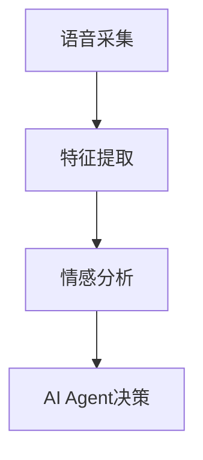
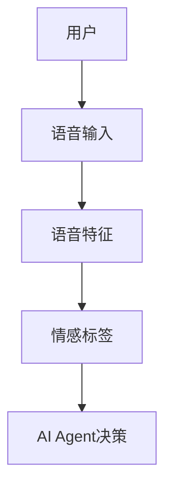

                 

# 构建AI Agent的实时语音情感分析系统

> 关键词：AI Agent, 语音情感分析, 实时分析, 深度学习, 语音信号处理, 情感分析模型

> 摘要：本文将详细介绍如何构建一个基于AI Agent的实时语音情感分析系统。文章从问题背景、核心概念、算法原理、系统设计、项目实战等多方面展开，深入分析了语音情感分析的实现过程，包括情感分析算法的选择与优化、语音信号处理的技术细节、系统架构设计与实现等内容。通过本文的学习，读者将能够掌握构建一个实时语音情感分析系统所需的关键技术和实现方法。

---

# 第一部分: 问题背景与系统需求

## 第1章: 问题背景介绍

### 1.1 情感分析的定义与应用领域

情感分析（Sentiment Analysis）是自然语言处理（NLP）领域中的一个重要任务，旨在判断一段文本表达的情感倾向，如正面、负面或中性。情感分析广泛应用于社交媒体分析、客户反馈分析、舆情监控等领域。例如，企业可以通过情感分析了解客户对产品的满意度，从而优化产品设计和服务流程。

### 1.2 语音情感分析的必要性

随着语音交互技术的快速发展，语音情感分析的需求日益增长。语音情感分析不仅关注语音内容本身，还关注说话人的情感状态，如喜悦、愤怒、悲伤等。这种分析在智能客服、语音助手、情感陪护机器人等领域具有重要应用价值。通过分析语音情感，AI Agent可以更准确地理解用户的需求，并做出更智能化的回应。

### 1.3 AI Agent在实时语音分析中的角色

AI Agent（人工智能代理）是一种能够感知环境、自主决策并执行任务的智能系统。在实时语音情感分析中，AI Agent扮演着关键角色：它需要实时接收语音输入，快速提取语音特征，分析情感倾向，并根据结果采取相应的行动。AI Agent的核心能力包括语音信号处理、情感分析算法实现、实时决策与反馈等。

---

## 第2章: 系统需求分析

### 1.1 功能需求

- 实时语音采集与处理
- 语音特征提取与情感分析
- 情感结果的实时反馈
- 多模态数据融合（可选）

### 1.2 性能需求

- 实时性：系统需要在较短的时间内完成语音处理和情感分析。
- 准确性：情感分析的准确率需要达到较高水平。
- 稳定性：系统需要具备容错能力和高可用性。

### 1.3 接口需求

- 语音输入接口（麦克风、网络流等）
- 情感分析结果输出接口（文本、API调用等）
- 人机交互接口（用户输入与反馈）

### 1.4 安全需求

- 数据加密与隐私保护
- 系统权限管理
- 安全漏洞防护

---

## 第3章: 系统边界与外延

### 1.1 系统边界定义

本系统仅关注实时语音情感分析的核心功能，不包括其他功能，如语音识别、语音合成等。

### 1.2 系统外延与扩展性分析

系统设计需要预留扩展接口，以便在未来增加更多功能，如多语言支持、情感强度分析等。

### 1.3 系统与外部环境的交互

系统需要与外部环境进行数据交互，包括语音输入、情感分析结果输出等。

---

## 第4章: 核心概念结构与组成

### 1.1 系统组成模块

- 语音采集模块
- 语音特征提取模块
- 情感分析模块
- AI Agent决策模块

### 1.2 模块之间的关系

### 1.3 核心要素的定义与属性

| 核心要素 | 定义 | 属性 |
|----------|------|------|
| 语音信号 | 输入的音频数据 | 时域、频域特征 |
| 情感标签 | 情感分析的结果 | 正面、负面、中性 |
| AI Agent | 智能代理 | 实时决策、反馈能力 |

---

## 第5章: 本章小结

本章详细介绍了构建AI Agent的实时语音情感分析系统的背景与需求。我们从情感分析的定义与应用领域入手，分析了语音情感分析的必要性，并详细阐述了AI Agent在实时语音分析中的角色。随后，我们从功能需求、性能需求、接口需求和安全需求四个方面，详细说明了系统的具体需求。最后，我们分析了系统的边界与外延，并对系统的核心概念结构与组成进行了详细说明。通过本章的学习，读者可以清晰地了解构建该系统所需的基础知识与需求分析。

---

# 第二部分: 核心概念与联系

## 第2章: 核心概念与联系

### 2.1 情感分析的基本概念

情感分析是通过对文本或语音的分析，判断其情感倾向的过程。在语音情感分析中，我们需要从语音信号中提取情感特征，并结合上下文信息进行情感分类。

### 2.2 语音信号处理的核心概念

语音信号处理是指对语音信号进行采集、分析和处理的过程。其核心任务包括语音特征提取、语音识别和语音合成等。在实时语音情感分析中，我们需要重点关注语音特征提取技术，如MFCC（Mel-Frequency Cepstral Coefficients）特征。

### 2.3 AI Agent如何整合情感分析与语音分析

AI Agent通过整合情感分析与语音分析技术，能够实现对语音数据的实时处理与情感识别。具体来说，AI Agent可以接收语音输入，提取语音特征，分析情感倾向，并根据结果做出相应的决策与反馈。

---

## 第3章: 情感分析与语音分析的联系

### 2.1 情感分析与语音特征的关系

情感分析的结果依赖于语音特征的提取。例如，悲伤的语气通常表现为低频、缓慢的语音特征。

### 2.2 语音分析对情感理解的辅助作用

通过分析语音的音调、语速、音量等特征，可以更准确地理解说话人的情感状态。

### 2.3 AI Agent如何利用情感分析与语音分析

AI Agent可以将情感分析与语音分析相结合，实现更智能化的语音交互。例如，在智能客服系统中，AI Agent可以根据客户的情感状态调整回答语气，提升用户体验。

---

## 第4章: 核心概念的对比分析

### 2.1 情感分析与语音分析的属性对比

| 属性 | 情感分析 | 语音分析 |
|------|---------|---------|
| 输入 | 文本/语音 | 语音信号 |
| 输出 | 情感标签 | 语音特征 |
| 技术 | NLP/深度学习 | 信号处理/深度学习 |

### 2.2 不同情感分析模型的对比

| 模型类型 | 传统机器学习 | 深度学习 | 端到端模型 |
|---------|--------------|----------|------------|
| 输入 | 文本特征 | 词嵌入 | 原始语音 |
| 输出 | 情感标签 | 情感标签 | 情感标签 |
| 优势 | 参数少，计算快 | 高准确性 | 端到端处理 |
| 劣势 | 需特征工程 | 参数多，计算慢 | 需大量标注数据 |

---

## 第5章: ER实体关系图

---

## 第6章: 本章小结

本章详细分析了构建AI Agent的实时语音情感分析系统的核心概念与联系。我们从情感分析与语音分析的基本概念入手，分析了两者的联系与区别，并通过对比分析和ER实体关系图，进一步明确了系统的核心要素及其关系。通过本章的学习，读者可以更好地理解系统中各部分的作用及其相互关系。

---

# 第三部分: 算法原理与实现

## 第3章: 算法原理与实现

### 3.1 情感分析算法原理

情感分析算法主要包括特征提取、模型训练与预测三个阶段。传统的机器学习方法（如SVM、随机森林）和深度学习模型（如LSTM、Transformer）是常用的算法选择。

---

接下来，我将继续按照目录大纲的结构，逐步展开每一章的内容，详细讲解算法原理、系统架构设计、项目实战等部分。由于篇幅限制，以上为前几章的详细内容，后续章节将按照类似结构继续展开。

--- 

作者：AI天才研究院 & 禅与计算机程序设计艺术

