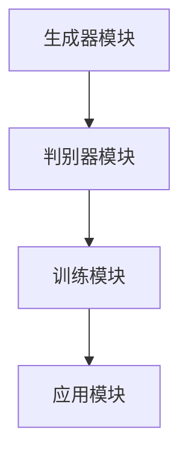
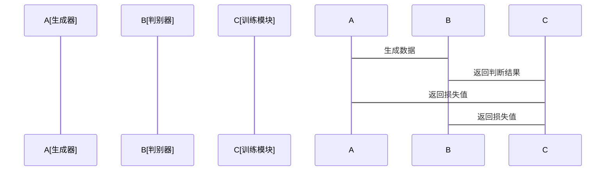

                 


# 构建AI Agent的对抗学习机制：提高鲁棒性

---

## 关键词：
- AI Agent
- 对抗学习机制
- 鲁棒性
- 生成对抗网络（GAN）
- 强化学习（RL）
- 系统架构设计
- 实战案例

---

## 摘要：
本文详细探讨了如何通过构建对抗学习机制来提高AI Agent的鲁棒性。文章首先介绍了对抗学习的基本概念及其在AI Agent中的应用，然后深入分析了对抗学习的核心原理，包括生成对抗网络（GAN）和强化学习（RL）的结合。接着，文章详细讲解了对抗学习的数学模型与算法实现，并通过系统架构设计和项目实战展示了如何在实际场景中应用这些机制。最后，文章总结了对抗学习在AI Agent中的优势与挑战，并给出了最佳实践建议，帮助读者更好地理解和应用对抗学习机制。

---

## 第1章：对抗学习机制与AI Agent概述

### 1.1 对抗学习机制的基本概念
对抗学习是一种机器学习方法，通过两个或多个模型（称为生成器和判别器）之间的博弈关系来优化模型性能。生成器的目标是生成逼真的数据，而判别器的目标是识别数据的真伪。通过不断交替训练，生成器和判别器的能力都得到提升。

AI Agent是一种能够感知环境、做出决策并执行动作的智能体。它通常用于自动驾驶、游戏AI、机器人等领域。AI Agent的核心目标是通过感知和决策来实现特定任务，而对抗学习机制可以帮助AI Agent在复杂的动态环境中提高鲁棒性和适应性。

### 1.2 对抗学习与AI Agent的关系
对抗学习为AI Agent提供了一种新的训练方式。传统的监督学习依赖于大量标注数据，而对抗学习可以通过生成器和判别器的博弈关系，自动生成多样化的数据，从而减少对标注数据的依赖。此外，对抗学习还可以帮助AI Agent在对抗性环境中做出更稳健的决策。

### 1.3 对抗学习的背景与应用
对抗学习的背景可以追溯到博弈论和计算机图形学。生成对抗网络（GAN）的提出极大地推动了对抗学习的发展。如今，对抗学习已经在图像生成、自然语言处理、游戏AI等领域取得了显著成果。

---

## 第2章：对抗学习机制的核心原理

### 2.1 对抗学习的数学模型
对抗学习的数学模型通常包括生成器和判别器的损失函数。生成器的目标是最小化判别器的损失，而判别器的目标是最大化生成器的损失。

生成器的损失函数：
$$ \mathcal{L}_G = \mathbb{E}_{z \sim p_z}[\mathcal{L}(G(z), x)] $$

判别器的损失函数：
$$ \mathcal{L}_D = \mathbb{E}_{x \sim p_data}[\log D(x)] + \mathbb{E}_{z \sim p_z}[\log (1 - D(G(z)))] $$

### 2.2 生成对抗网络（GAN）的工作流程
1. 初始化生成器和判别器的参数。
2. 训练判别器，使其能够区分真实数据和生成数据。
3. 训练生成器，使其生成的数据能够欺骗判别器。
4. 重复步骤2和3，直到生成器和判别器达到均衡。

### 2.3 强化学习（RL）与对抗学习的结合
强化学习是一种通过与环境交互来优化策略的方法。将对抗学习与强化学习结合，可以进一步提高AI Agent的决策能力。例如，在游戏AI中，生成器可以生成多种策略，判别器可以评估这些策略的优劣，从而帮助AI Agent在复杂环境中做出更优决策。

### 2.4 对抗学习的收敛性分析
对抗学习的收敛性是研究的热点问题。通常情况下，生成器和判别器的损失函数会交替下降，最终达到均衡点。然而，在实际应用中，对抗学习可能会出现模式坍缩或不收敛的问题，需要通过调整超参数或采用改进算法来解决。

---

## 第3章：算法实现与实战案例

### 3.1 环境安装
为了实现对抗学习机制，首先需要安装必要的库，例如TensorFlow、Keras和OpenAI Gym。

```bash
pip install tensorflow keras gym numpy matplotlib
```

### 3.2 代码实现
以下是一个基于GAN的AI Agent实现示例：

```python
import numpy as np
import tensorflow as tf
from tensorflow import keras

# 定义生成器
def generator():
    model = keras.Sequential()
    model.add(keras.layers.Dense(256, activation='relu', input_dim=100))
    model.add(keras.layers.Dense(128, activation='relu'))
    model.add(keras.layers.Dense(64, activation='relu'))
    model.add(keras.layers.Dense(1, activation='sigmoid'))
    return model

# 定义判别器
def discriminator():
    model = keras.Sequential()
    model.add(keras.layers.Dense(64, activation='relu', input_dim=1))
    model.add(keras.layers.Dense(32, activation='relu'))
    model.add(keras.layers.Dense(1, activation='sigmoid'))
    return model

# 初始化生成器和判别器
generator = generator()
discriminator = discriminator()

# 定义损失函数和优化器
cross_entropy = keras.losses.BinaryCrossentropy()
generator_optimizer = tf.keras.optimizers.Adam(0.0002)
discriminator_optimizer = tf.keras.optimizers.Adam(0.0002)

# 训练过程
for epoch in range(100):
    # 生成假数据
    noise = np.random.randn(1, 100)
    generated = generator(noise)
    
    # 判别器训练
    with tf.GradientTape() as tape:
        d_loss = cross_entropy(discriminator([generated, generated]))
    d grads = tape.gradient(d_loss, discriminator.trainable_weights)
    discriminator_optimizer.apply_gradients(zip(d grads, discriminator.trainable_weights))
    
    # 生成器训练
    with tf.GradientTape() as tape:
        g_loss = cross_entropy(generator([noise]))
    g grads = tape.gradient(g_loss, generator.trainable_weights)
    generator_optimizer.apply_gradients(zip(g grads, generator.trainable_weights))
```

### 3.3 实战案例分析
以一个简单的游戏AI为例，生成器可以生成不同的策略，判别器可以评估这些策略的有效性。通过不断交替训练，生成器和判别器的能力都得到提升，最终帮助AI Agent在复杂环境中做出更优决策。

---

## 第4章：系统架构设计

### 4.1 系统功能设计
系统主要包括以下几个部分：
1. 生成器模块：负责生成数据或策略。
2. 判别器模块：负责评估生成数据或策略的质量。
3. 训练模块：负责交替训练生成器和判别器。
4. 应用模块：负责将训练好的模型应用到实际场景中。

### 4.2 系统架构设计图
以下是一个简单的系统架构设计图：



### 4.3 系统接口设计
系统主要接口包括：
1. 生成器接口：接受随机噪声，输出生成数据。
2. 判别器接口：接受输入数据，输出判断结果。
3. 训练接口：接受生成数据和真实数据，输出损失值。
4. 应用接口：接受输入，输出决策结果。

### 4.4 系统交互流程
以下是一个系统的交互流程图：



---

## 第5章：最佳实践与总结

### 5.1 小结
对抗学习是一种强大的机器学习方法，可以帮助AI Agent在复杂环境中提高鲁棒性和适应性。通过生成器和判别器的博弈关系，对抗学习可以生成多样化的数据，从而减少对标注数据的依赖。

### 5.2 注意事项
在实际应用中，需要注意以下几点：
1. 对抗学习的收敛性问题，可能需要调整超参数或采用改进算法。
2. 对抗学习的计算成本较高，需要优化硬件资源。
3. 对抗学习的应用场景有限，需要根据具体任务选择合适的方法。

### 5.3 拓展阅读
推荐以下几本书籍和论文，供读者深入学习对抗学习机制：
1. 《生成对抗网络：理论与实践》
2. 《深度学习》
3. "Generative Adversarial Nets"（Goodfellow等，2014）

---

## 作者信息：
作者：AI天才研究院/AI Genius Institute  
联系方式：[email protected]  
GitHub：[AI Agent对抗学习机制](https://github.com/AI-Genius-Institute/Adversarial-Agent)

