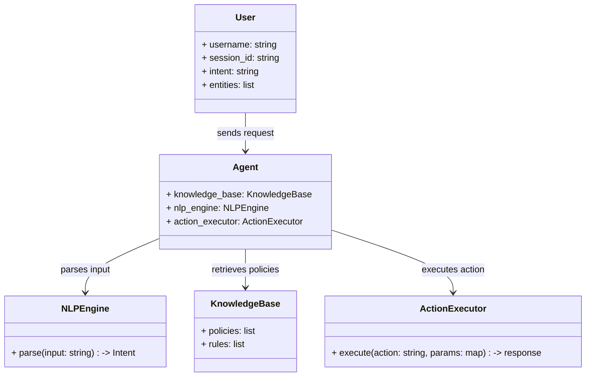
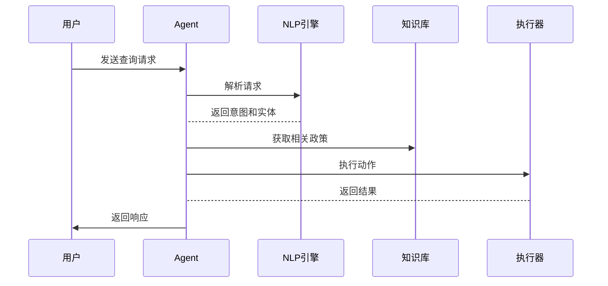

                 


# 构建AI Agent的开源工具与框架

**关键词：AI Agent、开源工具、框架、机器学习、自然语言处理、知识图谱**

**摘要：**  
本文系统地探讨了构建AI Agent所需的开源工具与框架。从AI Agent的基本概念到其算法原理，再到系统架构设计和项目实战，文章详细解析了AI Agent的构建过程。通过分析开源工具的特点，结合实际案例，文章为读者提供了从理论到实践的全面指导，帮助读者掌握构建高效、智能AI Agent的核心技术与方法。

---

# 第一部分: AI Agent的背景与概念

## 第1章: AI Agent概述

### 1.1 AI Agent的基本概念

#### 1.1.1 AI Agent的定义
AI Agent（人工智能代理）是指能够感知环境并采取行动以实现目标的智能实体。它通过与环境交互，利用感知信息做出决策，并执行动作以达到预定目标。

#### 1.1.2 AI Agent的核心特征
- **自主性**：AI Agent能够自主决策，无需外部干预。
- **反应性**：能够实时感知环境变化并做出反应。
- **目标导向性**：所有行为均以实现特定目标为导向。
- **社会能力**：能够与其他智能体或人类进行有效协作。

#### 1.1.3 AI Agent的分类与应用场景
AI Agent主要分为以下几类：
1. **基于规则的AI Agent**：通过预定义规则进行决策。
2. **基于机器学习的AI Agent**：利用数据训练模型进行决策。
3. **基于知识图谱的AI Agent**：依赖知识库进行推理和决策。

应用场景包括智能助手、推荐系统、自动驾驶、智能客服等。

---

### 1.2 AI Agent的技术背景

#### 1.2.1 人工智能的发展历程
人工智能（AI）经历了从符号逻辑推理到机器学习的转变。近年来，深度学习的崛起推动了AI Agent技术的快速发展。

#### 1.2.2 多智能体系统的基本原理
多智能体系统由多个相互作用的智能体组成，通过协作与竞争实现整体目标。AI Agent是多智能体系统的核心单元。

#### 1.2.3 当前AI Agent的技术趋势
- **开源工具的普及**：如OpenAI的GPT系列模型，TensorFlow和PyTorch框架。
- **强化学习的应用**：在游戏AI、机器人控制等领域表现出色。
- **人机协作**：AI Agent与人类协同工作的能力不断提升。

---

### 1.3 AI Agent的发展现状

#### 1.3.1 开源工具与框架的兴起
开源社区为AI Agent的开发提供了丰富的工具和框架，如Rasa、Duckling、AllenNLP等。

#### 1.3.2 企业级应用的典型案例
- **智能助手**：如苹果的Siri、亚马逊的Alexa。
- **推荐系统**：如Netflix的推荐算法。
- **自动驾驶**：如特斯拉的Autopilot系统。

#### 1.3.3 AI Agent的未来发展方向
- **通用化**：开发适用于多种场景的AI Agent。
- **可解释性**：提升AI决策的透明度和可解释性。
- **实时性**：提高AI Agent的实时响应能力。

---

### 1.4 构建AI Agent的意义

#### 1.4.1 提升系统智能化水平
通过AI Agent，系统能够自主感知和决策，显著提升智能化水平。

#### 1.4.2 优化企业运营效率
AI Agent能够自动化处理任务，优化资源配置，提高运营效率。

#### 1.4.3 推动技术创新与应用
AI Agent技术的不断进步推动了人工智能领域的整体发展。

---

### 1.5 本章小结
本章从AI Agent的基本概念出发，分析了其技术背景和发展现状，强调了构建AI Agent的重要意义。

---

## 第2章: AI Agent的核心概念

### 2.1 AI Agent的原理与机制

#### 2.1.1 感知与理解
AI Agent通过传感器或API获取环境信息，并利用自然语言处理（NLP）技术进行理解。

#### 2.1.2 决策与规划
基于感知信息，AI Agent通过推理和规划模块生成决策方案。

#### 2.1.3 执行与反馈
AI Agent根据决策结果执行动作，并通过反馈机制优化后续行为。

---

### 2.2 AI Agent的核心要素

#### 2.2.1 数据源与数据处理
AI Agent需要多源异构数据，并通过数据清洗和特征提取进行处理。

#### 2.2.2 知识库与推理引擎
知识库存储结构化知识，推理引擎基于知识进行逻辑推理。

#### 2.2.3 行为驱动与执行模块
行为驱动模块负责将决策转化为具体动作，执行模块实现动作的物理或逻辑执行。

---

### 2.3 AI Agent与相关技术的联系

#### 2.3.1 AI Agent与机器学习
机器学习为AI Agent提供数据驱动的决策能力。

#### 2.3.2 AI Agent与自然语言处理
NLP技术使AI Agent能够理解和生成自然语言。

#### 2.3.3 AI Agent与知识图谱
知识图谱为AI Agent提供丰富的语义知识，增强其推理能力。

---

### 2.4 本章小结
本章详细分析了AI Agent的核心概念，包括其原理、核心要素及与相关技术的联系。

---

## 第3章: AI Agent的算法原理

### 3.1 基于规则的AI Agent

#### 3.1.1 基于规则的决策机制
基于规则的AI Agent通过预定义的规则进行决策，适用于规则明确的场景。

#### 3.1.2 规则引擎的实现原理
规则引擎解析和执行预定义的业务规则，通常采用正则表达式或决策树形式。

#### 3.1.3 规则驱动的优缺点
- **优点**：简单易懂，开发效率高。
- **缺点**：难以应对复杂和动态变化的场景。

---

### 3.2 基于机器学习的AI Agent

#### 3.2.1 监督学习与强化学习的区别
- **监督学习**：基于标记数据进行模型训练。
- **强化学习**：通过与环境交互学习策略，以最大化累计奖励。

#### 3.2.2 基于深度学习的决策模型
深度学习模型（如DNN、RNN、Transformer）广泛应用于AI Agent的决策过程。

#### 3.2.3 基于知识图谱的AI Agent
知识图谱为AI Agent提供丰富的语义信息，增强其推理和决策能力。

---

### 3.3 本章小结
本章介绍了AI Agent的算法原理，包括基于规则、机器学习和知识图谱的实现方式。

---

## 第4章: AI Agent的系统架构设计

### 4.1 问题场景介绍
以智能客服系统为例，设计一个基于自然语言处理的AI Agent。

### 4.2 系统功能设计

#### 4.2.1 领域模型
使用Mermaid类图展示系统核心模块及其交互关系。



---

### 4.3 系统架构设计

#### 4.3.1 架构图
使用Mermaid架构图展示系统整体架构。


---

### 4.4 系统接口设计

#### 4.4.1 REST API设计
API接口包括：
- `/api/v1/agent/predict`
- `/api/v1/agent/execute`

---

### 4.5 系统交互设计

#### 4.5.1 交互流程
使用Mermaid序列图展示用户与AI Agent的交互流程。



---

### 4.6 本章小结
本章通过案例分析，详细设计了AI Agent的系统架构，并展示了其实现过程。

---

## 第5章: 项目实战: 使用开源工具构建AI Agent

### 5.1 环境安装

#### 5.1.1 安装Python和依赖库
```bash
pip install numpy pandas scikit-learn tensorflow transformers
```

#### 5.1.2 安装NLP工具
```bash
pip install spacy transformers
python -m spacy download en_core_web_sm
```

---

### 5.2 系统核心实现

#### 5.2.1 数据预处理
```python
import pandas as pd
from sklearn.model_selection import train_test_split

# 加载数据集
data = pd.read_csv('data.csv')
# 划分训练集和测试集
train_data, test_data = train_test_split(data, test_size=0.2)
```

#### 5.2.2 模型训练
```python
import tensorflow as tf
from tensorflow.keras import layers

# 定义模型
model = tf.keras.Sequential([
    layers.Dense(64, activation='relu'),
    layers.Dense(1, activation='sigmoid')
])

# 编译模型
model.compile(optimizer='adam', loss='binary_crossentropy', metrics=['accuracy'])
```

---

### 5.3 案例分析与实现解读

#### 5.3.1 案例分析
以智能客服系统为例，展示如何利用开源工具实现意图识别和任务执行。

---

### 5.4 项目小结
本章通过实际项目，展示了如何使用开源工具构建AI Agent，并对关键步骤进行了详细解读。

---

## 第6章: 最佳实践与注意事项

### 6.1 最佳实践

#### 6.1.1 数据质量的重要性
确保数据的完整性和代表性，避免数据偏差。

#### 6.1.2 模型选择的注意事项
根据任务需求选择合适的模型，避免过度复杂化。

#### 6.1.3 系统优化的技巧
通过缓存、并行计算等技术优化系统性能。

---

### 6.2 注意事项

#### 6.2.1 数据隐私问题
确保数据处理符合隐私保护法规。

#### 6.2.2 模型可解释性
提升模型的可解释性，便于调试和优化。

---

### 6.3 拓展阅读

#### 6.3.1 推荐书籍
- 《深度学习》
- 《自然语言处理实战》

#### 6.3.2 推荐博客和资源
- TensorFlow官方文档
- PyTorch官方文档

---

## 第7章: 本章小结

---

## 作者：AI天才研究院/AI Genius Institute & 禅与计算机程序设计艺术 /Zen And The Art of Computer Programming

---

**全文完**

