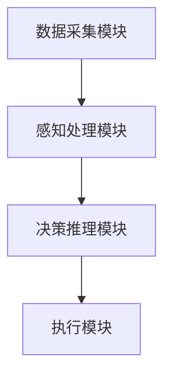
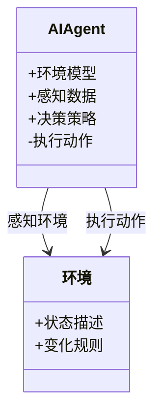

                 


# 构建AI Agent的情境感知能力：环境适应性

> 关键词：AI Agent, 情境感知, 环境适应性, 多模态数据融合, 强化学习

> 摘要：本文详细探讨了构建具备情境感知能力的AI Agent的环境适应性问题。首先介绍了AI Agent的基本概念和情境感知的核心要素，接着分析了多模态数据融合算法和强化学习在环境适应中的应用，随后详细设计了系统的架构与接口，最后通过实际项目案例展示了如何实现具备环境适应性的AI Agent。

---

# 第一部分: AI Agent与情境感知能力概述

## 第1章: AI Agent的基本概念

### 1.1 AI Agent的定义与特点

AI Agent（人工智能代理）是指能够感知环境、自主决策并采取行动以实现目标的智能实体。与传统AI相比，AI Agent具有以下特点：

- **自主性**：能够独立运作，无需外部干预。
- **反应性**：能够实时感知环境并做出反应。
- **主动性**：主动采取行动以实现目标。
- **社会性**：能够与其他AI Agent或人类交互协作。

### 1.2 情境感知能力的定义

情境感知能力是指AI Agent能够理解当前环境状态，并根据环境信息调整自身行为的能力。具体包括以下关键要素：

- **环境模型**：构建环境的数学或逻辑模型。
- **感知数据**：通过多种传感器获取环境信息。
- **解释与推理**：对感知数据进行理解和推理，生成有意义的环境描述。

---

## 第2章: AI Agent的情境感知能力

### 2.1 情境感知的核心概念

#### 环境模型的构建

环境模型是AI Agent理解环境的基础。常见的环境模型包括：

- **静态模型**：环境在短时间内不发生变化。
- **动态模型**：环境随时间发生变化，需要实时更新。

#### 感知数据的处理

AI Agent需要处理多模态数据（如视觉、听觉、文本等）来构建环境模型。数据处理的关键步骤包括：

1. 数据采集：通过传感器获取原始数据。
2. 数据预处理：对数据进行清洗、标准化等处理。
3. 数据融合：将多模态数据进行融合，以获得更准确的环境描述。

#### 感知结果的解释

感知结果需要通过上下文进行解释，以生成有意义的环境信息。例如，在自动驾驶中，感知到的“前方有行人”需要结合速度、距离等信息进行解释。

### 2.2 环境适应性的实现

#### 动态环境的建模

动态环境建模需要考虑环境的变化率和不确定性。常用方法包括：

- **马尔可夫链模型**：适用于状态转移概率已知的动态环境。
- **强化学习模型**：适用于复杂动态环境的建模。

#### 不同环境下的行为调整

AI Agent需要根据环境变化动态调整行为策略。例如，在拥挤的环境中，AI Agent需要调整移动速度以避免碰撞。

#### 环境变化的实时响应

实时响应需要高效的计算能力和快速的决策机制。例如，在机器人导航中，实时感知环境变化并调整路径。

---

# 第二部分: AI Agent的情境感知算法与数学模型

## 第3章: 多模态数据融合算法

### 3.1 多模态数据的融合方法

多模态数据融合是提升情境感知能力的关键技术。常见的融合方法包括：

- **基于特征融合的方法**：将不同模态的特征向量进行线性组合。
- **基于模型融合的方法**：将多个模型的输出进行加权融合。
- **基于注意力机制的融合**：通过注意力机制动态调整不同模态的权重。

#### 注意力机制的公式推导

假设输入多模态数据$X = (x_1, x_2, ..., x_n)$，注意力权重$w_i$的计算公式为：

$$w_i = \frac{e^{x_i}}{\sum_{j=1}^{n} e^{x_j}}$$

融合后的结果$Y$为：

$$Y = \sum_{i=1}^{n} w_i x_i$$

### 3.2 多模态数据融合的数学模型

多模态数据融合的数学模型通常包括以下几个步骤：

1. **特征提取**：对每种模态数据进行特征提取。
2. **特征融合**：将提取的特征进行融合。
3. **模型训练**：通过训练数据优化融合模型。

---

## 第4章: 强化学习在环境适应中的应用

### 4.1 强化学习的基本原理

强化学习是一种通过试错机制学习策略的方法。核心要素包括：

- **状态空间**：环境的状态描述。
- **动作空间**：AI Agent可执行的动作。
- **奖励函数**：用于评估动作的优劣。

#### 奖励函数的设计

奖励函数的设计直接影响学习效果。例如，在自动驾驶中，奖励函数可以定义为：

$$R(s, a) = \text{到达目标点的距离} - \text{碰撞风险}$$

### 4.2 强化学习在环境适应中的应用

#### 策略网络的构建

策略网络用于生成动作概率分布。常用的策略网络结构包括：

- **卷积神经网络（CNN）**：适用于处理视觉数据。
- **循环神经网络（RNN）**：适用于处理序列数据。

#### 策略优化的数学模型

策略优化的目标是最优化奖励函数。常用的优化方法包括：

- **梯度上升**：最大化奖励函数的梯度。
- **Q-learning**：通过Q值更新策略。

---

# 第三部分: 系统架构与实现

## 第5章: 系统架构设计

### 5.1 系统功能模块划分

AI Agent的情境感知系统通常包括以下功能模块：

- **数据采集模块**：负责采集环境数据。
- **感知处理模块**：对数据进行处理和融合。
- **决策推理模块**：根据感知结果生成动作策略。

#### 系统整体架构图



### 5.2 系统架构图



---

## 第6章: 系统接口设计

### 6.1 系统接口定义

系统接口设计需要考虑模块间的通信协议和外部接口。常用的接口包括：

- **数据接口**：用于数据采集和传输。
- **模块间通信接口**：用于模块之间的数据交换。
- **外部接口**：用于与外部系统的交互。

#### 数据采集接口实现

```python
class 数据采集模块:
    def 获取数据(self):
        # 返回多模态数据
        return {"视觉": image, "听觉": audio, "文本": text}
```

---

# 第四部分: 项目实战与案例分析

## 第7章: 项目实战

### 7.1 环境安装与配置

项目实战需要以下环境：

- **开发工具**：Python、PyTorch、TensorFlow等。
- **数据集**：多模态数据集（如KITTI数据集）。
- **依赖库**：numpy、pandas、scikit-learn等。

#### 代码实现

```python
import numpy as np

def 融合数据(visual_data, audio_data, text_data):
    # 特征向量融合
    features = np.concatenate([visual_data, audio_data, text_data], axis=1)
    # 注意力机制融合
    attention_weights = np.exp(features) / np.sum(np.exp(features), axis=1, keepdims=True)
    fused_features = np.sum(attention_weights * features, axis=1)
    return fused_features
```

---

## 第8章: 案例分析与优化

### 8.1 实际案例分析

以自动驾驶为例，AI Agent需要实时感知环境并调整驾驶策略。案例分析包括：

- **感知阶段**：检测车道线、障碍物和行人。
- **决策阶段**：根据感知结果生成驾驶指令。
- **执行阶段**：发送指令到执行机构。

### 8.2 系统优化建议

- **性能优化**：通过并行计算加速数据处理。
- **扩展性优化**：支持更多模态数据的接入。

---

# 作者

作者：AI天才研究院 & 禅与计算机程序设计艺术

---

以上是文章的详细内容，涵盖从理论到实践的各个方面，确保读者能够全面理解AI Agent的情境感知能力及其环境适应性实现。

