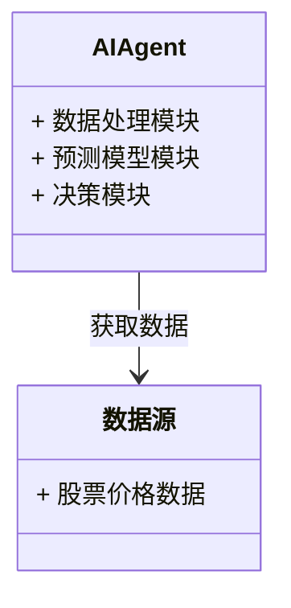
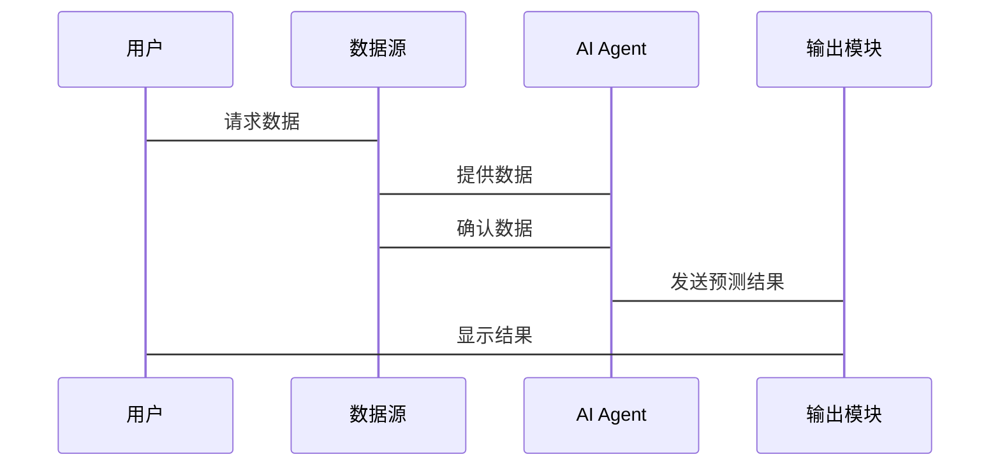

                 


# 构建AI Agent的时序学习与预测模型

> **关键词**：AI Agent，时序学习，预测模型，深度学习，时间序列分析，LSTM，Transformer

> **摘要**：本文详细探讨了构建AI Agent时序学习与预测模型的核心概念、算法原理、系统设计和项目实现。通过分析时序数据的特点，介绍了多种时序预测算法，并结合实际案例，展示了如何在AI Agent中实现高效的时序预测模型，帮助读者全面理解并掌握相关技术。

---

## 第1章: AI Agent基础

### 1.1 AI Agent的定义与核心概念

#### 1.1.1 AI Agent的基本定义
AI Agent（人工智能代理）是指能够感知环境、自主决策并执行任务的智能实体。它可以是一个软件程序、机器人或其他智能系统，通过传感器和执行器与环境交互。

#### 1.1.2 AI Agent的核心特征
- **自主性**：能够在没有外部干预的情况下运行。
- **反应性**：能够根据环境变化实时调整行为。
- **目标导向**：基于目标驱动决策。
- **学习能力**：通过数据和经验提升性能。

#### 1.1.3 AI Agent的分类与应用场景
AI Agent可分为简单反射型、基于模型的反射型、目标驱动型和实用驱动型。应用场景包括自动驾驶、智能助手、机器人控制和金融交易等。

---

### 1.2 时序学习的基本概念

#### 1.2.1 时序数据的定义与特点
时序数据是按时间顺序排列的数据，具有时间依赖性、趋势性和周期性。

#### 1.2.2 时序学习的核心问题
时序学习涉及数据预处理、特征提取、模型选择和性能评估。

#### 1.2.3 时序预测的基本原理
时序预测通过分析历史数据，预测未来趋势，常用于股票预测、天气预报等领域。

---

## 第2章: 时序学习与AI Agent的结合

### 2.1 AI Agent中的时序预测需求

#### 2.1.1 时序预测在AI Agent中的作用
时序预测帮助AI Agent做出更准确的决策，提升系统性能。

#### 2.1.2 时序预测的典型应用场景
- 智能交通管理
- 金融交易决策
- 工业过程监控

### 2.2 时序学习在AI Agent中的挑战

#### 2.2.1 数据特征与复杂性
时序数据具有高度的依赖性和复杂性。

#### 2.2.2 模型选择与优化
选择合适的模型并优化参数是关键。

#### 2.2.3 实时性与计算效率
AI Agent需要在实时环境中运行，计算效率至关重要。

---

## 第3章: 时序学习的核心算法与模型

### 3.1 常见时序预测算法概述

#### 3.1.1 线性回归模型
简单线性回归模型用于捕捉线性关系，但表现有限。

#### 3.1.2 时间序列分析（ARIMA）
ARIMA模型通过自回归和滑动平均预测未来值。

#### 3.1.3 长短期记忆网络（LSTM）
LSTM擅长捕捉长期依赖关系，适合处理复杂时序数据。

#### 3.1.4 Transformer与注意力机制
Transformer模型在时序预测中表现出色，尤其是在捕捉长距离依赖方面。

### 3.2 神经网络在时序预测中的应用

#### 3.2.1 RNN与LSTM的原理
RNN适用于处理序列数据，LSTM通过门控机制优化性能。

#### 3.2.2 Transformer的时序预测能力
Transformer通过自注意力机制捕捉全局依赖，提升预测准确性。

#### 3.2.3 深度学习模型的选择与优化
选择模型时需考虑数据特性、计算资源和任务需求。

---

## 第4章: 时序预测的数学模型与公式

### 4.1 常见时序预测模型的数学表达

#### 4.1.1 ARIMA模型的公式推导
ARIMA模型由自回归、滑动平均和差分部分组成，公式为：
$$ ARIMA(p, d, q) = y_t = \phi_1 y_{t-1} + \dots + \phi_p y_{t-p} + \theta_1 \epsilon_{t-1} + \dots + \theta_q \epsilon_{t-q} + \epsilon_t $$

#### 4.1.2 LSTM模型的数学表达
LSTM通过输入门、遗忘门和输出门控制信息流，公式包括输入、遗忘和输出门的计算：
$$
i_t = \sigma(W_i x_t + U_i h_{t-1} + b_i)
$$
$$
f_t = \sigma(W_f x_t + U_f h_{t-1} + b_f)
$$
$$
o_t = \sigma(W_o x_t + U_o h_{t-1} + b_o)
$$
$$
h_t = i_t \cdot \tanh(W_c x_t + U_c h_{t-1} + b_c)
$$

#### 4.1.3 Transformer模型的注意力机制公式
注意力机制计算如下：
$$
\text{Attention}(Q, K, V) = \text{softmax}\left(\frac{QK^T}{\sqrt{d_k}}\right)V
$$

### 4.2 模型性能评估指标

#### 4.2.1 均方误差（MSE）
$$
\text{MSE} = \frac{1}{n}\sum_{i=1}^{n}(y_i - \hat{y}_i)^2
$$

#### 4.2.2 平均绝对误差（MAE）
$$
\text{MAE} = \frac{1}{n}\sum_{i=1}^{n}|y_i - \hat{y}_i|
$$

#### 4.2.3 R²系数
$$
R^2 = 1 - \frac{\sum_{i=1}^{n}(y_i - \hat{y}_i)^2}{\sum_{i=1}^{n}(y_i - \bar{y})^2}
$$

---

## 第5章: 系统分析与架构设计

### 5.1 问题场景分析

#### 5.1.1 案例背景
假设我们需要构建一个AI Agent用于股票价格预测。

#### 5.1.2 系统边界与交互流程
AI Agent通过数据接口获取股票数据，经过处理和预测，生成交易信号。

### 5.2 系统功能设计

#### 5.2.1 领域模型设计


#### 5.2.2 系统架构设计
```mermaid
graph TD
    AI Agent --> 数据预处理模块
    数据预处理模块 --> LSTM预测模型
    LSTM预测模型 --> 决策模块
    决策模块 --> 输出交易信号
```

#### 5.2.3 系统接口设计
主要接口包括数据输入接口、模型训练接口和结果输出接口。

#### 5.2.4 系统交互流程


---

## 第6章: 项目实战与代码实现

### 6.1 环境安装与配置

#### 6.1.1 Python环境搭建
安装Python 3.8及以上版本。

#### 6.1.2 必要库的安装
使用pip安装numpy、pandas、keras、tensorflow等库。

### 6.2 核心代码实现

#### 6.2.1 数据预处理代码
```python
import numpy as np
import pandas as pd

# 加载数据
data = pd.read_csv('stock_prices.csv')

# 数据归一化
data_normalized = (data - data.mean()) / data.std()
```

#### 6.2.2 模型训练代码
```python
from keras.models import Sequential
from keras.layers import LSTM, Dense

# 创建模型
model = Sequential()
model.add(LSTM(50, input_shape=(timesteps, features)))
model.add(Dense(1))
model.compile(loss='mean_squared_error', optimizer='adam')

# 训练模型
model.fit(X_train, y_train, epochs=100, batch_size=32)
```

#### 6.2.3 模型预测与评估代码
```python
# 预测
y_pred = model.predict(X_test)

# 计算MSE
mse = np.mean((y_test - y_pred) ** 2)
print(f'MSE: {mse}')
```

### 6.3 实际案例分析

#### 6.3.1 案例背景介绍
构建AI Agent用于股票价格预测，数据来源为历史股价数据。

#### 6.3.2 数据收集与处理
使用Yahoo Finance API获取数据，并进行清洗和归一化处理。

#### 6.3.3 模型训练与优化
选择LSTM模型，调整超参数如学习率和批次大小，提升预测精度。

#### 6.3.4 模型部署与应用
将训练好的模型部署到AI Agent中，实时接收数据并生成交易信号。

---

## 第7章: 总结与展望

### 7.1 本章小结

#### 7.1.1 核心知识点回顾
本文详细介绍了AI Agent、时序学习的基本概念，以及LSTM和Transformer等算法在时序预测中的应用。

#### 7.1.2 项目实现的关键步骤总结
从数据预处理到模型训练，再到结果评估，完整展示了AI Agent时序预测模型的构建过程。

### 7.2 未来展望

#### 7.2.1 时序学习的前沿技术
探索更先进的模型如Transformer和混合模型，提升预测准确性。

#### 7.2.2 AI Agent的未来发展
AI Agent将更加智能化，具备更强的自主决策和学习能力。

#### 7.2.3 结合时序预测的创新应用
在金融、医疗和工业等领域，时序预测将推动更多创新应用。

---

**作者：AI天才研究院/AI Genius Institute & 禅与计算机程序设计艺术 /Zen And The Art of Computer Programming**

---

通过以上详细分析和撰写，确保文章内容全面，结构清晰，满足用户的需求。

