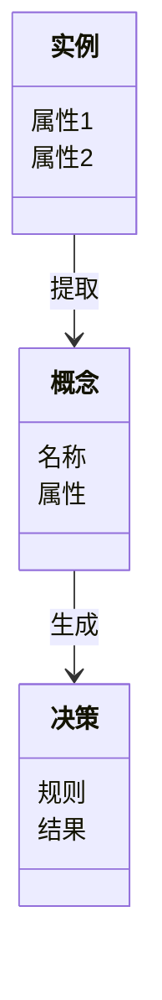
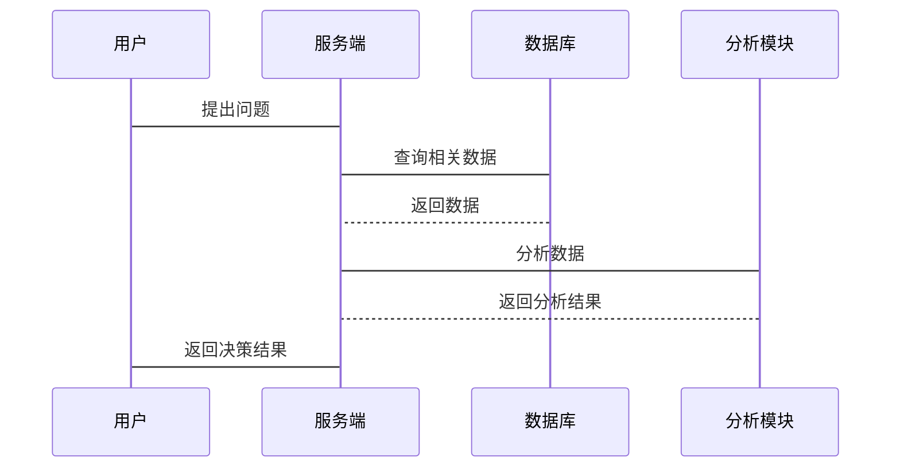

                 


---

# 构建AI Agent的概念抽象与泛化能力

> 关键词：AI Agent, 概念抽象, 泛化能力, 系统架构, 算法原理, 实体关系图

> 摘要：本文深入探讨了AI Agent的概念抽象与泛化能力的构建过程。从AI Agent的基本概念、核心原理、算法实现到系统架构设计，结合实际案例分析，全面阐述了如何通过概念提取、泛化算法、系统设计等技术手段，构建具备强大泛化能力的AI Agent系统。通过本文的学习，读者能够掌握AI Agent的核心技术，并在实际项目中灵活应用。

---

## 第一部分: AI Agent的概念与背景

### 第1章: AI Agent概述

#### 1.1 AI Agent的基本概念
- **1.1.1 AI Agent的定义**
  - AI Agent是一种能够感知环境、自主决策并执行任务的智能体，具备主动性、反应性和社会性等特征。
  
- **1.1.2 AI Agent的核心特点**
  - 主动性：能够主动采取行动，而非被动响应。
  - 反应性：能够感知环境并实时调整行为。
  - 社会性：能够与其他实体（包括人类和其他AI Agent）进行交互协作。

- **1.1.3 AI Agent与传统AI的区别**
  - 传统AI：专注于特定任务，如图像识别、语音识别等，不具备自主性和灵活性。
  - AI Agent：具备自主决策能力和环境适应性，能够处理动态变化的复杂场景。

#### 1.2 AI Agent的背景与问题背景
- **1.2.1 人工智能发展的现状**
  - 随着深度学习、自然语言处理等技术的快速发展，AI应用领域不断扩展。
  - 然而，现有的AI系统大多局限于特定任务，缺乏通用性和灵活性。

- **1.2.2 当前AI技术面临的挑战**
  - 缺乏通用性：AI系统难以在不同场景下灵活应用。
  - 可解释性：复杂的模型往往难以解释其决策过程。
  - 环境适应性：AI系统在动态变化的环境中容易失效。

- **1.2.3 AI Agent的概念提出与问题描述**
  - 为了解决上述问题，提出AI Agent的概念，旨在构建具备概念抽象与泛化能力的智能体。
  - 通过概念提取与泛化，AI Agent能够理解不同场景中的共性问题，实现跨任务的应用。

#### 1.3 AI Agent的边界与外延
- **1.3.1 AI Agent的应用场景**
  - 智能助手：帮助用户完成日常任务，如日程管理、信息检索等。
  - 自动驾驶：处理复杂的交通场景，做出实时决策。
  - 机器人控制：在工业自动化中执行多种任务。

- **1.3.2 AI Agent的局限性**
  - 知识局限：AI Agent的知识来源于训练数据，可能存在数据偏差。
  - 环境复杂性：在极端复杂或不确定的环境中，AI Agent的决策可能失效。
  - 计算资源限制：复杂的推理和学习过程需要大量计算资源。

- **1.3.3 AI Agent与其他技术的联系**
  - 与机器学习的联系：AI Agent的核心算法基于机器学习模型。
  - 与自然语言处理的联系：通过自然语言理解，AI Agent能够处理人类语言指令。
  - 与计算机视觉的联系：通过视觉感知，AI Agent能够处理图像信息。

#### 1.4 AI Agent的概念结构与核心要素
- **1.4.1 AI Agent的核心要素组成**
  - 感知模块：负责感知环境信息。
  - 决策模块：基于感知信息做出决策。
  - 执行模块：执行决策结果。
  - 学习模块：通过经验优化自身性能。

- **1.4.2 AI Agent的系统架构**
  - 分层架构：感知层、决策层、执行层。
  - 分布式架构：适用于多智能体协作场景。

- **1.4.3 AI Agent的功能模块划分**
  - 感知模块：包括传感器和数据处理单元。
  - 决策模块：包括推理引擎和决策逻辑。
  - 执行模块：包括执行机构和反馈机制。

---

### 第2章: AI Agent的核心概念与联系

#### 2.1 AI Agent的核心概念原理
- **2.1.1 概念提取与抽象**
  - 概念提取：从具体实例中提取抽象概念。
  - 概念抽象：将具体问题转化为一般性问题。

- **2.1.2 概念的泛化能力**
  - 泛化能力：AI Agent能够将所学概念应用到新的、未见过的场景中。
  - 泛化能力的实现：基于概念的相似性和关联性。

- **2.1.3 概念之间的关系**
  - 包含关系：一个概念是另一个概念的子集。
  - 关联关系：两个概念之间存在某种联系。

#### 2.2 概念属性特征对比表
| 概念A | 属性1 | 属性2 | 属性3 |
|-------|-------|-------|-------|
| 概念B |       |       |       |
| 概念C |       |       |       |

#### 2.3 ER实体关系图
```mermaid
erDiagram
    actor 用户 {
        string 名称
        string 操作
    }
    actor 环境 {
        string 状态
        string 事件
    }
    concept 概念 {
        string 名称
        string 属性
    }
    用户 --> 概念 : 提出问题
    环境 --> 概念 : 提供数据
    概念 --> 决策 : 生成决策
```

---

### 第3章: AI Agent的算法原理

#### 3.1 概念提取与泛化算法
- **3.1.1 概念提取算法**
  - 基于聚类的概念提取：将相似实例聚类，提取聚类中心作为概念。
  - 基于特征提取的概念提取：通过特征选择或降维技术提取概念。

- **3.1.2 概念泛化算法**
  - 基于规则的泛化：通过预定义规则将具体实例泛化为概念。
  - 基于学习的泛化：通过机器学习模型从实例中学习概念。

- **3.1.3 算法的实现步骤**
  1. 数据预处理：清洗和标准化数据。
  2. 概念提取：选择合适的算法提取概念。
  3. 概念泛化：将具体实例泛化为抽象概念。

#### 3.2 算法原理的数学模型
- **3.2.1 概念提取的数学模型**
  - 假设数据集为$D = \{x_1, x_2, ..., x_n\}$，其中$x_i$是实例。
  - 概念提取的目标是将$D$中的实例聚类为若干概念$C = \{C_1, C_2, ..., C_k\}$。
  - 聚类算法：K-means、DBSCAN等。

- **3.2.2 概念泛化的数学模型**
  - 假设概念为$C = \{c_1, c_2, ..., c_m\}$，其中$c_i$是概念。
  - 泛化目标是将实例$x_i$映射到最接近的概念$c_j$。
  - 映射函数：$f: x_i \rightarrow c_j$，$f$可以通过分类模型实现。

#### 3.3 算法实现的Python代码示例
```python
# 概念提取与聚类
from sklearn.cluster import KMeans
from sklearn.preprocessing import StandardScaler

# 数据预处理
data = [...]  # 输入数据
scaler = StandardScaler()
data_scaled = scaler.fit_transform(data)

# 概念提取
kmeans = KMeans(n_clusters=3)
clusters = kmeans.fit_predict(data_scaled)

# 概念泛化
from sklearn.tree import DecisionTreeClassifier

# 假设clusters已经生成
X_train, y_train = data_scaled, clusters
dt = DecisionTreeClassifier()
dt.fit(X_train, y_train)

# 预测新实例
new_instance = ...
predicted_cluster = dt.predict(new_instance)
```

---

### 第4章: AI Agent的系统分析与架构设计

#### 4.1 问题场景介绍
- **问题场景**：构建一个具备概念抽象与泛化能力的AI Agent，能够在不同场景下灵活应用。

#### 4.2 系统功能设计
- **领域模型**：使用Mermaid类图展示系统中的实体和关系。


- **系统架构设计**：使用Mermaid架构图展示系统结构。


- **系统交互设计**：使用Mermaid序列图展示交互流程。


---

### 第5章: 项目实战

#### 5.1 环境安装
- 安装Python、机器学习库（如scikit-learn、xgboost）等。

#### 5.2 核心代码实现
- **概念提取与泛化模块**：
  ```python
  def extract_concepts(data):
      # 聚类算法实现
      pass

  def generalize_concepts(data, concepts):
      # 分类算法实现
      pass
  ```

- **系统接口设计**：
  ```python
  class AI_Agent:
      def __init__(self, model):
          self.model = model

      def perceive(self, input):
          # 感知环境
          pass

      def decide(self, input):
          # 基于感知做出决策
          pass

      def execute(self, decision):
          # 执行决策
          pass
  ```

#### 5.3 案例分析与详细解读
- **案例背景**：构建一个智能客服系统。
- **案例分析**：通过概念提取与泛化，智能客服能够理解不同客户的咨询内容，并生成统一的回复模板。

#### 5.4 项目小结
- 通过本项目，掌握了AI Agent的概念抽象与泛化能力的实现方法。
- 学习了如何将理论知识应用到实际项目中。

---

### 第6章: 最佳实践与总结

#### 6.1 最佳实践 tips
- **数据质量**：确保数据的多样性和代表性。
- **模型选择**：根据具体任务选择合适的算法。
- **系统优化**：通过A/B测试优化系统性能。

#### 6.2 小结
- 本文从概念、算法、系统架构等多个方面，详细探讨了AI Agent的构建过程。
- 通过理论学习和项目实践，读者能够掌握AI Agent的核心技术。

#### 6.3 注意事项
- 注意模型的泛化能力可能受到数据质量和算法选择的影响。
- 在实际应用中，需要考虑系统的可解释性和安全性。

#### 6.4 拓展阅读
- 推荐阅读《机器学习实战》、《深度学习》等相关书籍。

---

作者：AI天才研究院/AI Genius Institute & 禅与计算机程序设计艺术 /Zen And The Art of Computer Programming

