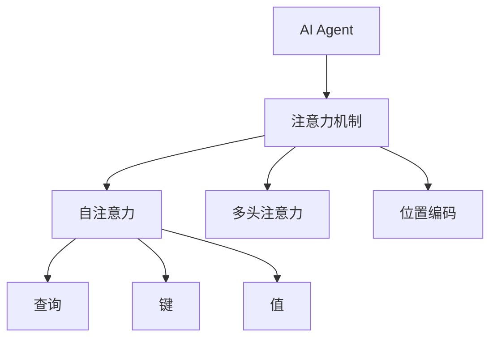
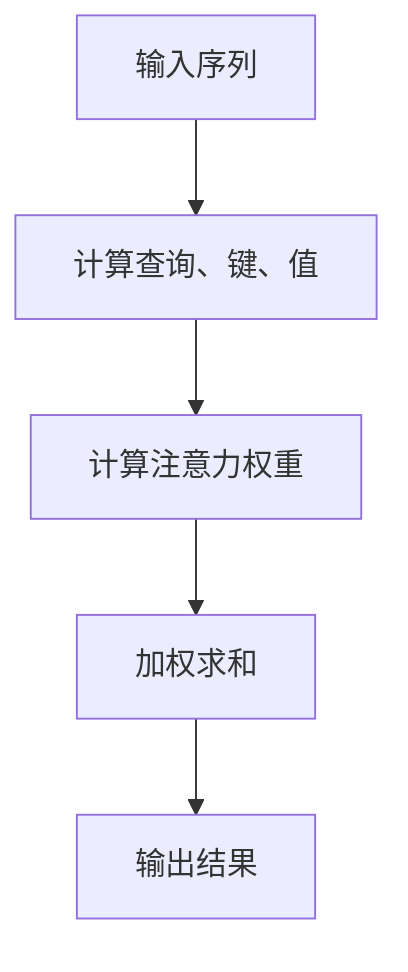
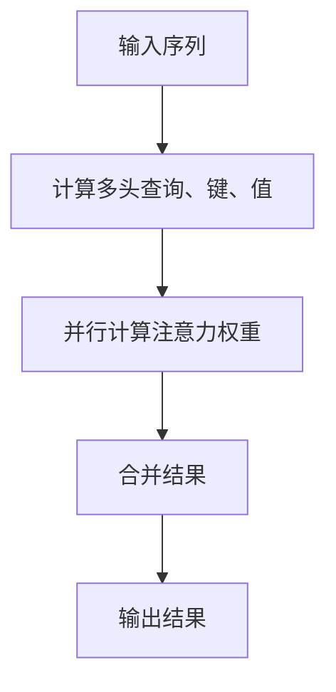
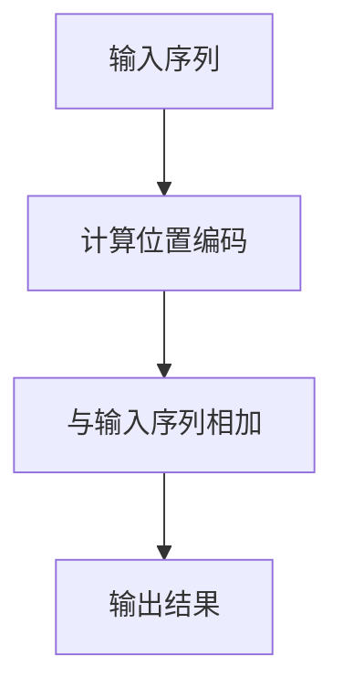
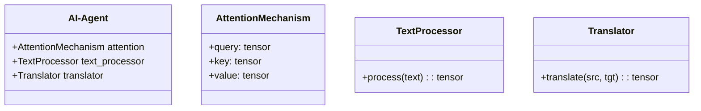
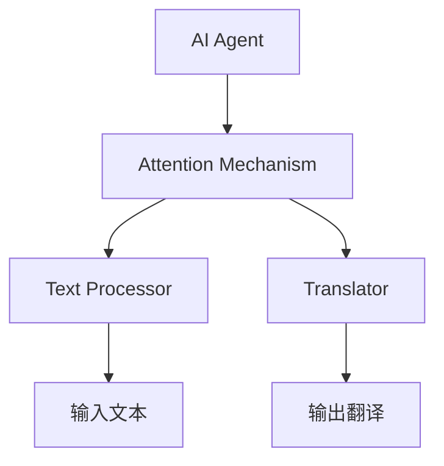
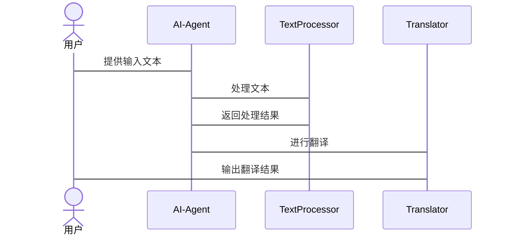

                 


# 构建AI Agent的注意力机制设计

> 关键词：AI Agent，注意力机制，自注意力，多头注意力，Transformer，机器翻译

> 摘要：注意力机制是AI Agent中信息处理的关键技术，本文从背景、原理、算法、系统架构到项目实战，全面解析注意力机制的设计与实现，帮助读者深入理解其在AI Agent中的应用。

---

## 第1章: 注意力机制的背景与问题背景

### 1.1 问题背景

#### 1.1.1 AI Agent的核心概念
AI Agent是一种智能体，能够感知环境、自主决策并执行任务。其核心能力包括感知、推理、学习和行动。

#### 1.1.2 注意力机制的提出背景
传统神经网络处理序列数据时，无法有效捕捉长距离依赖关系。注意力机制的提出解决了这一问题，使模型能够聚焦于重要的输入部分。

#### 1.1.3 注意力机制在AI Agent中的作用
注意力机制帮助AI Agent在信息处理中突出重点，提升任务效率和准确性，特别是在自然语言处理和模式识别中表现优异。

### 1.2 问题描述

#### 1.2.1 AI Agent的信息处理挑战
AI Agent需要处理大量信息，但传统方法难以高效提取关键信息。

#### 1.2.2 注意力机制的核心问题
如何在序列数据中有效分配注意力权重，优化信息处理效果。

#### 1.2.3 问题解决的必要性
通过注意力机制，AI Agent能够更高效地处理信息，提升任务性能。

### 1.3 问题解决

#### 1.3.1 注意力机制的解决方案
引入自注意力机制，计算每个位置的权重，指导信息处理。

#### 1.3.2 解决方案的优缺点分析
优点：提升模型性能，降低计算复杂度。缺点：参数量增加，训练时间变长。

#### 1.3.3 边界与外延
注意力机制适用于序列数据处理，但需结合具体任务调整参数。

### 1.4 概念结构与核心要素

#### 1.4.1 注意力机制的基本结构
包括查询、键、值三个部分，通过点积计算权重。

#### 1.4.2 核心要素的组成
- 查询：表示输入序列中的某个位置。
- 键：用于匹配其他位置的特征。
- 值：提供与键匹配后的结果。

#### 1.4.3 概念之间的关系
注意力机制通过计算权重，实现序列数据的高效处理。

---

## 第2章: 注意力机制的核心概念与联系

### 2.1 核心概念原理

#### 2.1.1 自注意力机制的原理
自注意力机制通过计算每个位置与其他位置的相关性，生成注意力权重。

#### 2.1.2 多头注意力机制的原理
多头注意力机制通过多个并行的注意力头，捕捉不同位置的信息。

#### 2.1.3 位置编码的原理
位置编码为序列数据中的每个位置赋予位置信息，帮助模型理解序列结构。

### 2.2 概念属性特征对比

| 机制类型      | 参数共享 | 复杂度 | 应用场景 |
|---------------|----------|--------|----------|
| 单头注意力     | 是       | 低     | 简单任务 |
| 多头注意力     | 否       | 高     | 复杂任务 |
| 带位置编码的注意力 | 否       | 中     | 序列数据 |

### 2.3 ER实体关系图



---

## 第3章: 注意力机制的算法原理

### 3.1 算法原理讲解

#### 3.1.1 自注意力机制的算法流程



#### 3.1.2 多头注意力机制的算法流程



#### 3.1.3 位置编码的算法流程



#### 3.1.4 详细代码实现

```python
import torch

def attention(query, key, value):
    scores = torch.bmm(query, key.transpose(-2, -1).float())
    scores = torch.softmax(scores, dim=-1)
    output = torch.bmm(scores, value)
    return output
```

---

## 第4章: 注意力机制的系统分析与架构设计

### 4.1 系统分析

#### 4.1.1 项目背景
本文通过一个AI Agent案例，展示注意力机制的设计与实现。

#### 4.1.2 系统功能设计
- 文本摘要：提取关键信息。
- 机器翻译：处理源语言并生成目标语言。

#### 4.1.3 领域模型设计



#### 4.1.4 系统架构设计



#### 4.1.5 系统接口设计
- 输入接口：接收文本数据。
- 输出接口：输出处理结果。

#### 4.1.6 系统交互设计



---

## 第5章: 注意力机制的项目实战

### 5.1 环境安装

```bash
pip install torch
pip install numpy
pip install matplotlib
```

### 5.2 核心代码实现

```python
import torch
import torch.nn as nn

class Attention(nn.Module):
    def __init__(self, embed_dim):
        super(Attention, self).__init__()
        self.embed_dim = embed_dim
        self.W_q = nn.Linear(embed_dim, embed_dim)
        self.W_k = nn.Linear(embed_dim, embed_dim)
        self.W_v = nn.Linear(embed_dim, embed_dim)
    
    def forward(self, x):
        batch_size, seq_len, embed_dim = x.size()
        query = self.W_q(x)
        key = self.W_k(x)
        value = self.W_v(x)
        
        attention_scores = torch.bmm(query, key.permute(0, 2, 1))
        attention_weights = torch.softmax(attention_scores, dim=2)
        
        output = torch.bmm(attention_weights, value.permute(0, 2, 1)).permute(0, 2, 1)
        return output
```

### 5.3 代码解读与分析

```python
# 初始化参数
embed_dim = 512
attention_layer = Attention(embed_dim)

# 前向传播
input_tensor = torch.randn(batch_size, seq_len, embed_dim)
output = attention_layer(input_tensor)
```

### 5.4 案例分析

#### 5.4.1 文本摘要案例

```python
def text_summary(text):
    processor = TextProcessor()
    encoded_input = processor.encode(text)
    attention_layer = Attention(embed_dim)
    output = attention_layer(encoded_input)
    decoded_output = processor.decode(output)
    return decoded_output
```

#### 5.4.2 机器翻译案例

```python
def machine_translation(src, tgt):
    translator = Translator()
    encoded_src = translator.encode(src)
    attention_layer = Attention(embed_dim)
    output = attention_layer(encoded_src)
    decoded_tgt = translator.decode(output)
    return decoded_tgt
```

### 5.5 项目小结

注意力机制在文本摘要和机器翻译中表现出色，但需要结合具体任务进行优化。

---

## 第6章: 总结与展望

### 6.1 总结

注意力机制是AI Agent中信息处理的核心技术，通过自注意力和多头注意力机制，提升了模型的性能和效率。

### 6.2 展望

未来的研究方向包括改进注意力机制，探索其在更多领域的应用，以及结合其他技术进一步优化性能。

---

## 作者

作者：AI天才研究院 & 禅与计算机程序设计艺术

