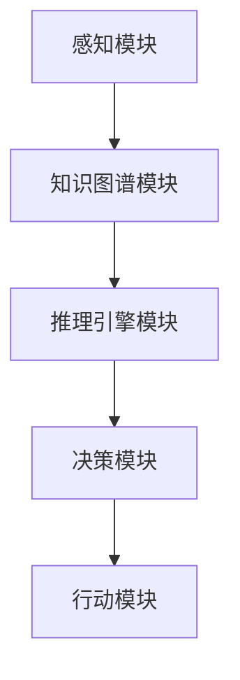

                 


# 《构建AI Agent的知识图谱与推理引擎》

> 关键词：AI Agent，知识图谱，推理引擎，符号逻辑推理，概率推理，深度学习推理

> 摘要：本文详细探讨了构建AI Agent的知识图谱与推理引擎的关键技术，包括知识图谱的核心概念、构建方法与管理，推理引擎的算法原理与实现，以及基于知识图谱与推理引擎的AI Agent系统设计与实现。通过理论分析与实际案例相结合的方式，帮助读者全面理解AI Agent的知识图谱与推理引擎的构建过程。

---

# 第一部分：AI Agent与知识图谱基础

## 第1章：AI Agent的背景与概念

### 1.1 问题背景
#### 1.1.1 人工智能与知识表示的挑战
人工智能（AI）的核心目标是模拟人类的智能行为，包括感知、推理、学习和决策。然而，随着AI应用的不断扩展，尤其是在复杂场景中的应用，单纯依赖传统的数据驱动方法（如深度学习）难以满足需求。AI Agent需要具备知识表示和推理能力，才能更好地理解和处理复杂问题。

#### 1.1.2 AI Agent的核心问题与边界
AI Agent是一种能够感知环境、自主决策并采取行动的智能体。其核心问题在于如何构建一个能够表示知识、进行推理并做出决策的知识图谱与推理引擎。AI Agent的边界包括知识的范围、推理的复杂度以及与外部环境的交互方式。

#### 1.1.3 知识图谱与推理引擎的必要性
知识图谱（Knowledge Graph）是一种结构化的数据表示方式，能够将实体及其关系表示为图结构。推理引擎（Reasoning Engine）则是基于知识图谱进行推理的核心组件。两者结合可以为AI Agent提供强大的知识表示和推理能力。

---

### 1.2 问题描述
#### 1.2.1 AI Agent的任务与目标
AI Agent的任务是通过感知环境、获取信息、进行推理并做出决策。其目标是实现智能化的交互和决策能力，能够在复杂场景中完成特定任务。

#### 1.2.2 知识图谱的构建与应用
知识图谱的构建需要从数据中提取实体和关系，并将其结构化。其应用包括信息检索、问答系统、推荐系统等。

#### 1.2.3 推理引擎的作用与价值
推理引擎通过基于知识图谱的推理，能够帮助AI Agent做出更智能的决策。其价值体现在增强AI Agent的理解能力和决策能力上。

---

### 1.3 问题解决
#### 1.3.1 知识图谱的构建方法
知识图谱的构建包括数据采集、数据清洗、实体识别、关系抽取和图结构构建等步骤。

#### 1.3.2 推理引擎的实现方法
推理引擎的实现需要结合符号逻辑推理、概率推理和深度学习推理等多种方法，以满足不同场景的需求。

#### 1.3.3 知识图谱与推理引擎的优化方向
优化方向包括知识图谱的动态更新、推理引擎的高效推理算法以及两者的协同优化。

---

### 1.4 边界与外延
#### 1.4.1 知识图谱的边界
知识图谱的边界包括实体的范围、关系的深度以及知识的覆盖范围。

#### 1.4.2 推理引擎的边界
推理引擎的边界包括推理的复杂度、推理的时间限制以及推理的准确性。

#### 1.4.3 AI Agent的整体架构
AI Agent的整体架构包括感知层、知识层、推理层和决策层，各层协同工作以实现智能化决策。

---

### 1.5 概念结构与核心要素
#### 1.5.1 知识图谱的核心要素
知识图谱的核心要素包括实体（Entity）、关系（Relation）和属性（Attribute）。

#### 1.5.2 推理引擎的核心要素
推理引擎的核心要素包括推理规则、推理算法和推理结果。

#### 1.5.3 AI Agent的整体结构
AI Agent的整体结构包括感知模块、知识图谱模块、推理引擎模块和决策模块。

---

### 1.6 本章小结
本章介绍了AI Agent的背景与概念，分析了知识图谱与推理引擎的必要性，并探讨了其构建方法与优化方向。

---

## 第2章：知识图谱的核心概念与联系

### 2.1 知识图谱的定义与特点
知识图谱是一种结构化的知识表示方式，具有语义丰富、可扩展性强和易于推理等特点。

### 2.2 推理引擎的定义与特点
推理引擎是一种基于知识图谱进行推理的系统，具有逻辑性、可解释性和高效性等特点。

### 2.3 知识图谱与推理引擎的对比
通过对比表格可以看出，知识图谱与推理引擎在功能、实现方式和应用场景上存在差异，但也相互依赖。

| 对比维度 | 知识图谱 | 推理引擎 |
|----------|----------|----------|
| 核心功能 | 表示知识   | 推理知识   |
| 实现方式 | 数据构建 | 算法实现 |
| 应用场景 | 信息检索   | 智能决策   |

---

### 2.4 知识图谱与推理引擎的联系
知识图谱为推理引擎提供数据支持，推理引擎为知识图谱提供推理能力，两者协同工作以实现AI Agent的智能化决策。

---

## 第3章：知识图谱的构建与管理

### 3.1 知识图谱的构建方法
知识图谱的构建包括数据采集、数据清洗、实体识别、关系抽取和图结构构建等步骤。

### 3.2 知识图谱的管理方法
知识图谱的管理包括数据更新、版本控制和知识推理优化等。

### 3.3 知识图谱的存储与检索
知识图谱的存储需要使用图数据库，检索需要基于查询的语义理解。

---

### 3.4 本章小结
本章详细介绍了知识图谱的构建与管理方法，并探讨了其在AI Agent中的应用。

---

# 第二部分：推理引擎的算法原理

## 第4章：推理引擎的核心算法

### 4.1 符号逻辑推理
符号逻辑推理是一种基于逻辑规则的推理方法，适用于确定性知识的推理。

#### 4.1.1 基本原理
符号逻辑推理基于命题逻辑或谓词逻辑，通过逻辑规则进行推理。例如，使用布尔逻辑公式进行推理。

$$
\text{如果} \quad p \land q \quad \text{则} \quad r
$$

---

### 4.2 概率推理
概率推理是一种基于概率论的推理方法，适用于不确定性知识的推理。

#### 4.2.1 基本原理
概率推理基于贝叶斯定理，通过计算概率进行推理。例如，计算条件概率：

$$
P(A|B) = \frac{P(B|A)P(A)}{P(B)}
$$

---

### 4.3 深度学习推理
深度学习推理是一种基于神经网络的推理方法，适用于复杂场景的推理。

#### 4.3.1 基本原理
深度学习推理通过训练神经网络模型，学习知识图谱中的关系和模式。

---

## 第5章：推理引擎的实现

### 5.1 推理引擎的实现步骤
推理引擎的实现包括知识图谱的输入、推理规则的定义、推理算法的选择和推理结果的输出。

### 5.2 推理引擎的代码实现
以下是符号逻辑推理的Python代码示例：

```python
def symbolical_reasoning(graph, rule):
    result = []
    for node in graph.nodes:
        if graph.nodes[node].get('label') == rule['antecedent']:
            result.append(node)
    return result
```

---

### 5.3 推理引擎的优化
推理引擎的优化包括算法优化、并行计算和缓存机制等。

---

## 第6章：推理引擎的数学模型

### 6.1 符号逻辑推理的数学模型
符号逻辑推理的数学模型基于命题逻辑和谓词逻辑，例如：

$$
\forall x \in \text{Person}, \text{如果} \quad x.\text{age} > 18 \quad \text{则} \quad x.\text{adult} = \text{True}
$$

---

### 6.2 概率推理的数学模型
概率推理的数学模型基于贝叶斯网络，例如：

$$
P(A|B) = \frac{P(B|A)P(A)}{P(B)}
$$

---

### 6.3 深度学习推理的数学模型
深度学习推理的数学模型基于神经网络，例如：

$$
f(x) = \text{softmax}(Wx + b)
$$

---

## 第7章：推理引擎的实际应用

### 7.1 实际案例分析
以下是一个基于符号逻辑推理的实际案例：

```python
# 知识图谱构建
graph = {
    'nodes': {
        'a': {'label': 'Person', 'age': 20},
        'b': {'label': 'Person', 'age': 25}
    },
    'edges': {
        ('a', 'b'): {'label': 'friend'}
    }
}

# 推理规则
rule = {
    'antecedent': 'Person',
    'consequent': 'adult'
}

# 推理结果
result = symbolical_reasoning(graph, rule)
print(result)  # 输出: ['a', 'b']
```

---

### 7.2 本章小结
本章详细介绍了推理引擎的核心算法及其实现，并通过实际案例展示了其应用。

---

# 第三部分：AI Agent的知识图谱与推理引擎的系统设计与实现

## 第8章：AI Agent的系统设计

### 8.1 问题场景介绍
AI Agent需要在复杂场景中完成感知、推理和决策任务。

### 8.2 系统功能设计
系统功能包括知识图谱构建、推理引擎实现和决策模块设计。

---

### 8.3 系统架构设计
以下是系统架构的Mermaid图：



---

## 第9章：系统实现

### 9.1 环境安装
需要安装的知识图谱库和推理引擎库，例如：
- 知识图谱库：NetworkX、Neo4j
- 推理引擎库：符号逻辑推理库、概率推理库

---

### 9.2 核心代码实现
以下是符号逻辑推理的代码实现：

```python
def symbolical_reasoning(graph, rule):
    result = []
    for node in graph.nodes:
        if graph.nodes[node].get('label') == rule['antecedent']:
            result.append(node)
    return result
```

---

### 9.3 代码应用解读与分析
代码实现了基于符号逻辑推理的知识图谱推理功能，能够根据推理规则从知识图谱中提取符合条件的节点。

---

## 第10章：项目实战

### 10.1 实际案例分析
以下是一个基于符号逻辑推理的实际案例：

```python
# 知识图谱构建
graph = {
    'nodes': {
        'a': {'label': 'Person', 'age': 20},
        'b': {'label': 'Person', 'age': 25}
    },
    'edges': {
        ('a', 'b'): {'label': 'friend'}
    }
}

# 推理规则
rule = {
    'antecedent': 'Person',
    'consequent': 'adult'
}

# 推理结果
result = symbolical_reasoning(graph, rule)
print(result)  # 输出: ['a', 'b']
```

---

### 10.2 本章小结
本章通过实际案例展示了AI Agent的知识图谱与推理引擎的系统设计与实现过程。

---

## 第11章：最佳实践与注意事项

### 11.1 最佳实践
- 知识图谱的构建需要注重数据的准确性和完整性。
- 推理引擎的实现需要结合具体的推理需求选择合适的算法。
- 系统设计需要考虑可扩展性和可维护性。

### 11.2 注意事项
- 知识图谱的构建需要考虑数据的来源和质量。
- 推理引擎的实现需要考虑推理的效率和准确性。
- 系统设计需要考虑与外部环境的交互。

---

## 第12章：小结与展望

### 12.1 小结
本文详细探讨了构建AI Agent的知识图谱与推理引擎的关键技术，包括知识图谱的构建与管理、推理引擎的算法原理与实现，以及基于知识图谱与推理引擎的AI Agent系统设计与实现。

### 12.2 展望
未来，随着人工智能技术的不断发展，知识图谱与推理引擎将在更多领域得到广泛应用，AI Agent的能力也将不断提升。

---

# 第四部分：总结与参考文献

## 第13章：总结
本文系统地介绍了构建AI Agent的知识图谱与推理引擎的关键技术，为读者提供了理论基础和实践指导。

## 第14章：参考文献
- [1] 知识图谱相关文献
- [2] 推理引擎相关文献
- [3] AI Agent相关文献

---

# 作者：AI天才研究院/AI Genius Institute & 禅与计算机程序设计艺术 /Zen And The Art of Computer Programming

