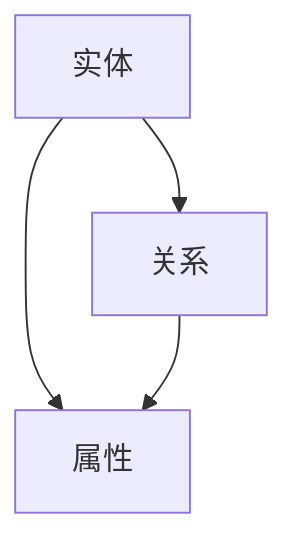

                 

# 构建AI Agent的知识图谱因果推理引擎

## 关键词：AI Agent，知识图谱，因果推理，引擎构建，技术实现

## 摘要：本文章详细探讨了构建AI Agent的知识图谱因果推理引擎的关键技术，从背景知识到核心算法，再到系统架构和项目实战，全面解析了如何设计和实现一个高效的、基于知识图谱的因果推理引擎。文章通过理论与实践相结合的方式，为读者提供了清晰的思路和详细的实现方案。

---

## 第一部分: AI Agent与知识图谱因果推理引擎的背景与基础

### 第1章: AI Agent的基本概念与应用

#### 1.1 AI Agent的定义与特点
##### 1.1.1 AI Agent的定义
AI Agent（人工智能代理）是指能够感知环境并采取行动以实现目标的智能体。它具备自主性、反应性、目标导向和社会能力等核心特点。

##### 1.1.2 AI Agent的核心特点
- **自主性**：能够在没有外部干预的情况下独立运作。
- **反应性**：能够根据环境的变化调整自己的行为。
- **目标导向**：具备明确的目标，并采取行动以实现这些目标。
- **社会能力**：能够与其他AI Agent或人类进行交互和协作。

##### 1.1.3 AI Agent与传统AI的区别
AI Agent不仅是一个静态的知识库，而是一个动态的、能够主动采取行动的实体，它能够根据环境的变化做出实时决策。

---

#### 1.2 知识图谱的基本概念
##### 1.2.1 知识图谱的定义
知识图谱是一种结构化的数据表示方式，通常以图的形式表示实体之间的关系，包含大量的实体（node）和关系（edge）。

##### 1.2.2 知识图谱的构建方法
知识图谱的构建通常包括数据抽取、实体识别、关系抽取、数据融合和知识表示等步骤。

##### 1.2.3 知识图谱的应用场景
知识图谱广泛应用于搜索引擎优化、智能问答系统、推荐系统和语义搜索等领域。

---

#### 1.3 因果推理的基本概念
##### 1.3.1 因果推理的定义
因果推理是指从因果关系中推断出结果的过程，它关注的是“为什么”某个事件会发生，而不仅仅是“是什么”发生了。

##### 1.3.2 因果推理与相关概念的区别
- **统计推理**：基于数据分布进行推断，不考虑因果关系。
- **推理**：包括演绎推理和归纳推理，因果推理是其中的一种形式。

##### 1.3.3 因果推理的应用领域
因果推理在医学诊断、金融风险评估、政策分析和自动驾驶等领域有广泛应用。

---

### 第2章: 知识图谱因果推理引擎的背景与问题描述

#### 2.1 知识图谱与因果推理的结合背景
##### 2.1.1 知识图谱在AI Agent中的作用
知识图谱为AI Agent提供了丰富的语义信息，帮助其理解和推理复杂场景。

##### 2.1.2 因果推理在AI Agent中的价值
因果推理使AI Agent能够理解因果关系，从而做出更合理的决策。

##### 2.1.3 知识图谱因果推理引擎的必要性
知识图谱因果推理引擎能够将知识图谱的语义信息与因果推理的能力结合起来，为AI Agent提供更强大的推理能力。

---

#### 2.2 知识图谱因果推理引擎的核心问题
##### 2.2.1 知识图谱中的因果关系建模
如何在知识图谱中表示因果关系，并进行有效的推理。

##### 2.2.2 因果推理引擎的实现挑战
- **计算复杂度**：因果推理通常涉及复杂的计算，如何优化计算效率是关键。
- **知识图谱的动态性**：知识图谱是动态变化的，如何保持因果推理的实时性是一个挑战。

##### 2.2.3 知识图谱因果推理引擎的边界与外延
知识图谱因果推理引擎的边界包括数据来源、推理范围和应用场景，其外延则涉及与其他AI技术的结合。

---

### 第3章: 知识图谱因果推理引擎的核心概念与联系

#### 3.1 核心概念原理
##### 3.1.1 知识图谱的表示方法
知识图谱通常使用RDF（资源描述框架）或图数据库来表示实体和关系。

##### 3.1.2 因果推理的数学模型
因果推理的数学模型通常基于图论和概率论，例如因果图和贝叶斯网络。

##### 3.1.3 知识图谱因果推理引擎的逻辑架构
知识图谱因果推理引擎通常包括知识图谱存储层、因果推理算法层和应用接口层。

---

#### 3.2 核心概念属性特征对比表格
| 概念       | 属性特征                     |
|------------|------------------------------|
| 知识图谱    | 结构化数据表示，语义关联      |
| 因果推理    | 关注因果关系，可解释性        |
| 引擎        | 集成知识图谱与因果推理能力    |

---

#### 3.3 ER实体关系图架构

---

## 第4章: 知识图谱的构建与表示

---

## 总结
以上是构建AI Agent的知识图谱因果推理引擎的详细目录大纲，涵盖了从背景知识到核心算法，再到系统架构和项目实战的各个方面。接下来，我们将逐步深入探讨每个部分的核心内容，帮助读者全面理解如何设计和实现一个高效的、基于知识图谱的因果推理引擎。

