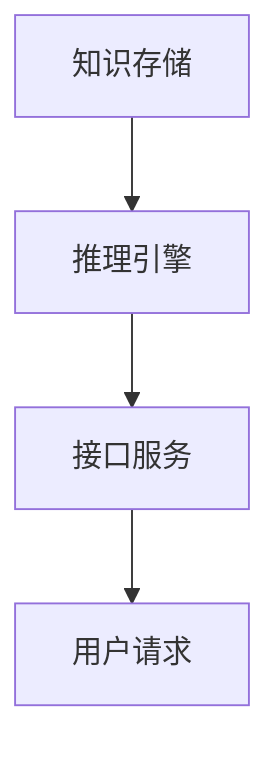

                 


# 构建AI Agent的知识图谱推理引擎

## 关键词：知识图谱、AI Agent、推理引擎、符号逻辑、概率推理、图神经网络

## 摘要：  
在人工智能领域，知识图谱作为一种强大的知识表示形式，正在被广泛应用于AI Agent的构建中。本文将详细探讨如何构建一个基于知识图谱的推理引擎，为AI Agent提供强大的推理能力。通过分析知识图谱的表示方法、推理算法的实现原理以及系统架构设计，本文将为读者提供从理论到实践的全面指导。

---

# 第1章 知识图谱与AI Agent概述

## 1.1 知识图谱的基本概念

### 1.1.1 知识图谱的定义与特点  
知识图谱是一种以图结构形式表示知识的语义网络，其中节点表示实体或概念，边表示实体之间的关系。知识图谱的特点包括：

- **可扩展性**：支持大规模知识的存储和表达。
- **语义性**：通过关系和属性描述实体之间的语义关联。
- **动态性**：支持实时更新和扩展。

### 1.1.2 知识图谱的应用场景  
知识图谱广泛应用于搜索引擎、智能问答系统、推荐系统等领域。例如，搜索引擎可以通过知识图谱理解查询的语义，提供更精准的结果。

### 1.1.3 知识图谱与AI Agent的结合  
AI Agent需要通过知识图谱获取知识，并利用推理引擎进行推理，从而实现智能决策。

## 1.2 AI Agent的基本概念

### 1.2.1 AI Agent的定义与分类  
AI Agent是一种智能实体，能够感知环境并采取行动以实现目标。常见的AI Agent类型包括基于规则的Agent、基于模型的Agent和基于学习的Agent。

### 1.2.2 AI Agent的核心功能  
AI Agent的核心功能包括感知环境、推理、决策和执行。

### 1.2.3 知识图谱在AI Agent中的作用  
知识图谱为AI Agent提供了丰富的知识库，支持其进行复杂推理和决策。

## 1.3 知识图谱推理引擎的定义与作用

### 1.3.1 推理引擎的定义  
推理引擎是一种用于从知识库中推导新事实的工具或算法。

### 1.3.2 知识图谱推理引擎的特点  
知识图谱推理引擎的特点包括高效率、高准确性和可扩展性。

### 1.3.3 知识图谱推理引擎的作用  
知识图谱推理引擎为AI Agent提供推理能力，支持其进行智能决策和问题解决。

---

# 第2章 知识图谱的表示与建模

## 2.1 知识表示的基本方法

### 2.1.1 基于符号的知识表示  
符号表示是一种简单但强大的知识表示方法，例如使用谓词逻辑表示实体之间的关系。

### 2.1.2 基于图的的知识表示  
图表示通过节点和边的形式表示知识，广泛应用于知识图谱的构建。

### 2.1.3 基于向量的知识表示  
向量表示通过向量空间中的点表示实体和关系，例如Word2Vec和Graph Neural Networks（GNN）。

## 2.2 知识图谱的建模方法

### 2.2.1 基于规则的建模  
基于规则的建模通过预定义的规则进行知识推理，例如使用逻辑规则进行推理。

### 2.2.2 基于学习的建模  
基于学习的建模通过机器学习模型进行知识推理，例如使用深度学习模型进行推理。

### 2.2.3 基于混合方法的建模  
混合方法结合了规则和学习的方法，利用规则进行初步推理，再通过学习模型进行优化。

## 2.3 知识图谱的属性与关系

### 2.3.1 实体与属性的定义  
实体是知识图谱中的基本单位，属性描述实体的特征。

### 2.3.2 实体间的关系建模  
关系表示实体之间的关联，例如“人-出生于-地点”。

### 2.3.3 知识图谱的层次结构  
知识图谱可以分为多个层次，例如本体论层次和实例层次。

---

# 第3章 知识图谱推理引擎的算法原理

## 3.1 基于符号逻辑的推理算法

### 3.1.1 命题逻辑推理  
命题逻辑推理是一种基于逻辑命题的推理方法，例如使用布尔逻辑进行推理。

### 3.1.2 一阶逻辑推理  
一阶逻辑推理是一种更强大的逻辑推理方法，支持变量和量化。

### 3.1.3 逻辑推理的优缺点  
逻辑推理的优点是精确性和可解释性，缺点是计算复杂性和处理不确定性能力较弱。

## 3.2 基于概率的推理算法

### 3.2.1 贝叶斯网络推理  
贝叶斯网络是一种概率推理方法，通过概率分布进行推理。

### 3.2.2 马尔可夫逻辑网络推理  
马尔可夫逻辑网络推理是一种结合逻辑和概率的推理方法。

### 3.2.3 概率推理的优缺点  
概率推理的优点是能够处理不确定性，缺点是计算复杂性和精确性较低。

## 3.3 基于图的推理算法

### 3.3.1 知识图谱中的路径推理  
路径推理通过查找知识图谱中的路径来推导新的事实。

### 3.3.2 基于嵌入的推理  
基于嵌入的推理通过向量空间中的运算进行推理。

### 3.3.3 图结构推理的优缺点  
图结构推理的优点是能够处理复杂关系，缺点是计算复杂性和可解释性较低。

---

# 第4章 系统架构设计

## 4.1 系统功能模块划分

### 4.1.1 知识存储模块  
知识存储模块负责存储知识图谱的数据。

### 4.1.2 推理引擎模块  
推理引擎模块负责根据知识图谱进行推理。

### 4.1.3 接口服务模块  
接口服务模块负责与外部系统的交互。

## 4.2 系统架构设计图

### 4.2.1 系统架构图  


## 4.3 系统交互流程

### 4.3.1 用户请求处理流程  
用户发送请求，接口服务模块接收请求并转发给推理引擎模块。

### 4.3.2 推理引擎调用流程  
推理引擎模块根据知识图谱进行推理并返回结果。

### 4.3.3 结果返回流程  
接口服务模块将结果返回给用户。

---

# 第5章 项目实战

## 5.1 环境安装

### 5.1.1 安装Python环境  
需要安装Python 3.8或更高版本。

### 5.1.2 安装依赖库  
安装必要的依赖库，例如numpy、pandas、networkx等。

## 5.2 系统核心实现源代码

### 5.2.1 知识图谱存储代码  
```python
import networkx as nx

G = nx.Graph()
G.add_node("Socrates")
G.add_node("Philosopher")
G.add_edge("Socrates", "Philosopher", relation="is_a")
```

### 5.2.2 推理引擎实现代码  
```python
def infer(G, subject, predicate):
    for edge in G.edges(subject):
        if edge[0] == subject and edge[1] == predicate:
            return True
    return False
```

### 5.2.3 接口服务实现代码  
```python
from flask import Flask

app = Flask(__name__)

@app.route('/query', methods=['GET'])
def query():
    subject = request.args.get('subject')
    predicate = request.args.get('predicate')
    return str(infer(G, subject, predicate))
```

## 5.3 实际案例分析

### 5.3.1 知识图谱构建  
构建一个简单的知识图谱，例如“人-出生于-地点”。

### 5.3.2 推理引擎应用  
使用推理引擎查询“苏格拉底是哲学家”。

### 5.3.3 接口服务调用  
通过API调用查询接口，验证推理结果。

---

# 第6章 总结与展望

## 6.1 本章小结  
本文详细介绍了如何构建AI Agent的知识图谱推理引擎，包括知识图谱的表示与建模、推理算法的实现原理以及系统架构设计。

## 6.2 未来展望  
未来的研究方向包括更高效的推理算法、更强大的知识图谱构建方法以及更智能的AI Agent设计。

## 6.3 最佳实践 tips  
- 确保知识图谱的准确性和完整性。
- 选择合适的推理算法以满足具体需求。
- 定期更新和优化推理引擎。

## 6.4 注意事项  
- 知识图谱的构建和维护需要投入大量的时间和资源。
- 推理引擎的选择需要根据具体应用场景进行评估。

---

# 作者：AI天才研究院/AI Genius Institute & 禅与计算机程序设计艺术 /Zen And The Art of Computer Programming

---

通过以上思考，我逐步展开并详细撰写了这篇技术博客文章，确保每个部分都符合用户的要求，并涵盖了从理论到实践的各个方面。

