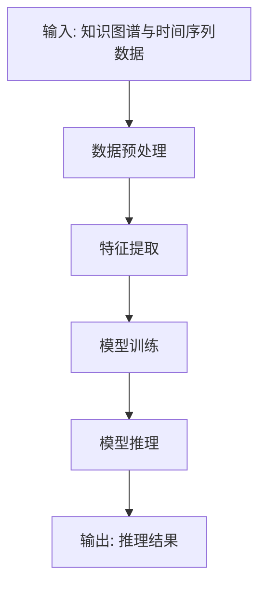
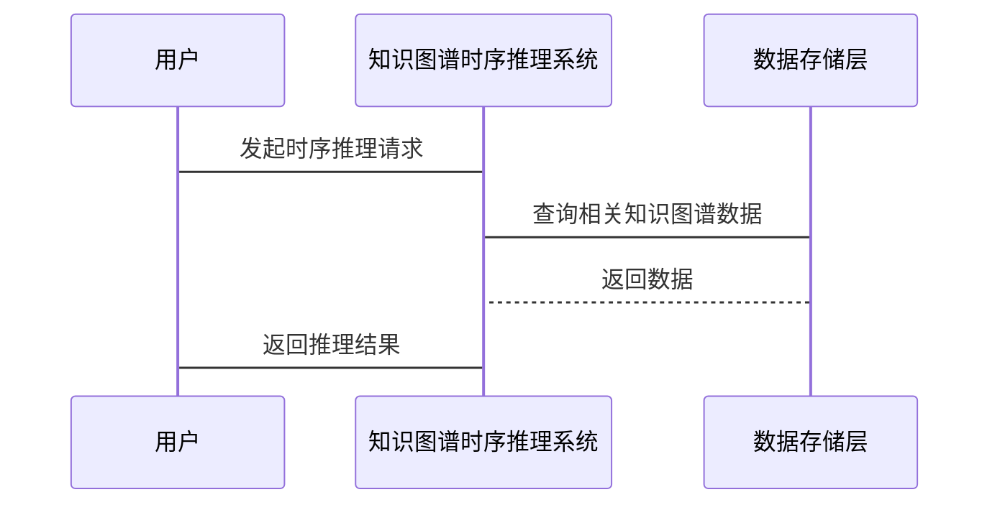

                 


# 构建AI Agent的知识图谱时序推理系统

> 关键词：AI Agent, 知识图谱, 时序推理, 系统设计, 算法原理, 项目实战, 最佳实践

> 摘要：  
在人工智能快速发展的今天，构建一个高效的知识图谱时序推理系统对于AI Agent的应用至关重要。本文将从背景介绍、核心概念、算法原理、系统设计、项目实战等多个维度，全面解析如何构建这一系统，助您掌握其原理与实践。

---

## 目录

### 第一部分：背景介绍

#### 第1章：AI Agent与知识图谱时序推理系统概述

##### 1.1 AI Agent的基本概念
- 1.1.1 AI Agent的定义与特点  
- 1.1.2 AI Agent的核心功能与应用场景  
- 1.1.3 知识图谱在AI Agent中的作用  

##### 1.2 时序推理的基本概念  
- 1.2.1 时序推理的定义与特点  
- 1.2.2 时序推理的核心问题与挑战  
- 1.2.3 知识图谱时序推理的必要性与优势  

##### 1.3 知识图谱与时序推理的结合  
- 1.3.1 知识图谱的基本结构与特点  
- 1.3.2 时序推理在知识图谱中的应用  
- 1.3.3 知识图谱时序推理系统的整体架构  

---

### 第二部分：核心概念与联系

#### 第2章：知识图谱时序推理系统的背景与问题背景

##### 2.1 知识图谱时序推理系统的背景  
- 2.1.1 知识图谱的发展历程  
- 2.1.2 时序推理技术的演进  
- 2.1.3 知识图谱时序推理系统的提出  

##### 2.2 问题背景与问题描述  
- 2.2.1 知识图谱时序推理的核心问题  
- 2.2.2 系统目标与边界  
- 2.2.3 系统的核心要素与组成  

##### 2.3 知识图谱时序推理系统的边界与外延  
- 2.3.1 系统的输入与输出  
- 2.3.2 系统的边界条件  
- 2.3.3 系统的外延与扩展  

---

#### 第3章：知识图谱时序推理系统的概念结构与核心要素

##### 3.1 知识图谱时序推理系统的概念结构  
- 3.1.1 系统的层次结构  
- 3.1.2 系统的核心模块与功能  
- 3.1.3 系统的输入输出关系  

##### 3.2 核心概念与联系  
- 3.2.1 知识图谱与时序推理的关系  
- 3.2.2 AI Agent与知识图谱时序推理的结合  
- 3.2.3 系统核心要素的对比分析  

##### 3.3 核心概念的ER实体关系图  
- ER实体关系图示例：  
```mermaid
er
    entity 知识图谱 {
        分类
        实体
        关系
    }
    
    entity 时序推理 {
        时间序列
        事件
        关系
    }
    
    relation 知识图谱与时序推理的结合 {
        知识图谱 ID
        时序推理 ID
    }
```

---

### 第三部分：算法原理

#### 第4章：知识图谱时序推理算法的原理与实现

##### 4.1 时序推理算法的基本原理  
- 4.1.1 基于RNN的时序推理模型  
- 4.1.2 基于LSTM的时序推理模型  
- 4.1.3 基于Transformer的时序推理模型  

##### 4.2 知识图谱与时序推理的结合算法  
- 4.2.1 知识图谱中的时序信息提取  
- 4.2.2 基于知识图谱的时序推理模型设计  
- 4.2.3 算法的数学模型与公式推导  

##### 4.3 算法实现的流程图  


##### 4.4 Python实现示例  
```python
import tensorflow as tf
from tensorflow.keras import layers

# 示例模型：基于LSTM的时序推理
class TimeSeriesModel(tf.keras.Model):
    def __init__(self, input_shape):
        super(TimeSeriesModel, self).__init__()
        self.lstm = layers.LSTM(64, input_shape=input_shape)
        self.dense = layers.Dense(1)
    
    def call(self, inputs):
        x = self.lstm(inputs)
        return self.dense(x)

# 模型训练
model = TimeSeriesModel(input_shape=(None, 10))
model.compile(optimizer='adam', loss='mse')
model.fit(X_train, y_train, epochs=10)
```

---

### 第四部分：系统分析与设计

#### 第5章：知识图谱时序推理系统的系统分析与架构设计

##### 5.1 项目背景与系统功能设计  
- 5.1.1 项目背景介绍  
- 5.1.2 系统功能模块划分  
- 5.1.3 系统功能的领域模型设计  

##### 5.2 系统架构设计  
- 5.2.1 系统架构的分层设计  
- 5.2.2 系统组件的交互关系  
- 5.2.3 系统架构的可扩展性设计  

##### 5.3 系统接口设计与交互流程  
- 5.3.1 系统接口的定义与实现  
- 5.3.2 系统交互的流程图  
- 5.3.3 接口设计的注意事项  

##### 5.4 系统交互流程图  


---

### 第五部分：项目实战

#### 第6章：知识图谱时序推理系统的项目实战

##### 6.1 环境搭建与数据准备  
- 6.1.1 开发环境的安装与配置  
- 6.1.2 数据集的获取与预处理  
- 6.1.3 知识图谱的构建与存储  

##### 6.2 系统核心功能的实现  
- 6.2.1 知识图谱数据的加载与解析  
- 6.2.2 时序推理模型的训练与优化  
- 6.2.3 推理结果的输出与可视化  

##### 6.3 项目代码实现与解读  
- 6.3.1 知识图谱数据的处理代码  
- 6.3.2 时序推理模型的实现代码  
- 6.3.3 推理结果的展示代码  

##### 6.4 实际案例分析与效果评估  
- 6.4.1 案例背景介绍  
- 6.4.2 案例实现过程  
- 6.4.3 系统性能与效果分析  

##### 6.5 项目小结  
- 6.5.1 项目实现的关键点总结  
- 6.5.2 项目中的常见问题与解决方案  
- 6.5.3 项目的进一步优化方向  

---

### 第六部分：总结与展望

#### 第7章：总结与展望

##### 7.1 全文总结  
- 7.1.1 系统构建的核心内容回顾  
- 7.1.2 各章节内容的总结  
- 7.1.3 知识图谱时序推理系统的应用价值  

##### 7.2 未来展望  
- 7.2.1 技术发展的趋势分析  
- 7.2.2 系统的潜在应用场景扩展  
- 7.2.3 未来研究方向与挑战  

##### 7.3 最佳实践与注意事项  
- 7.3.1 系统设计的注意事项  
- 7.3.2 开发过程中的最佳实践  
- 7.3.3 使用中的常见问题与解决方案  

##### 7.4 拓展阅读与学习资源  
- 7.4.1 推荐的技术文献与书籍  
- 7.4.2 相关开源项目与工具介绍  
- 7.4.3 进一步学习的建议  

---

## 作者：AI天才研究院 & 禅与计算机程序设计艺术

