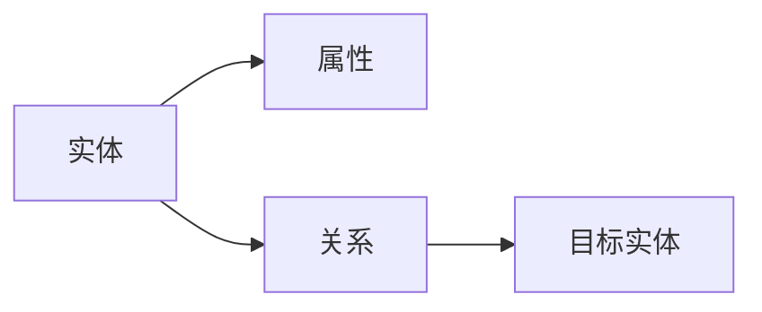
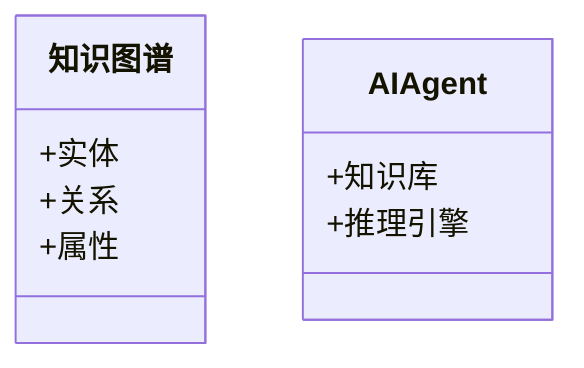
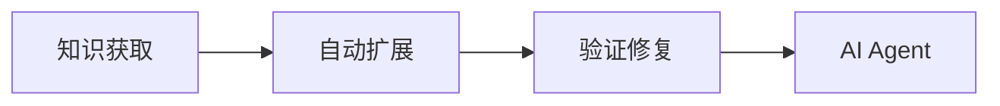
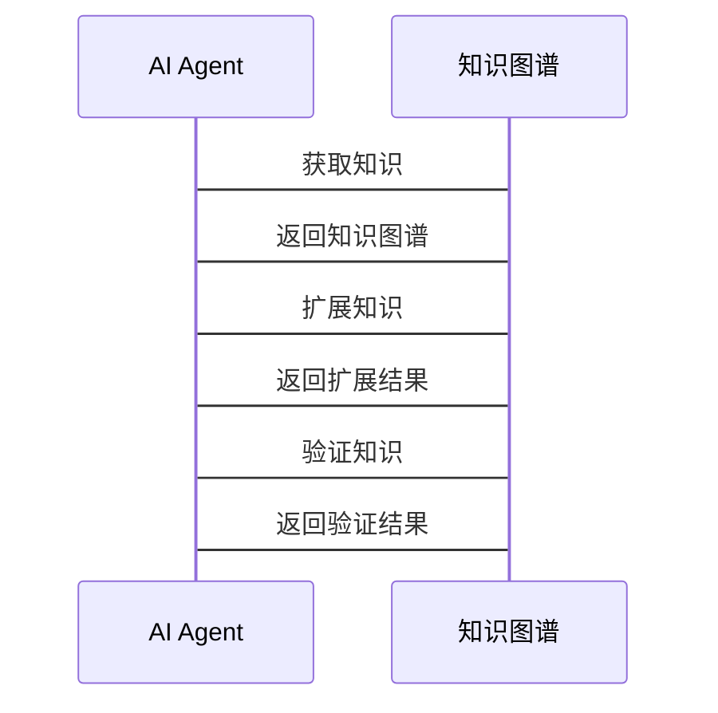

                 


# 构建AI Agent的知识图谱自动扩展与验证框架

> 关键词：AI Agent, 知识图谱, 自动扩展, 验证框架, 语义网络, 知识推理, 多模态数据

> 摘要：本文详细探讨了构建AI Agent的知识图谱自动扩展与验证框架的关键技术，从知识图谱与AI Agent的核心概念出发，结合自动扩展算法和验证算法，设计了系统的架构，并通过实际案例展示了框架的实现与应用。

---

# 第一部分: 知识图谱与AI Agent的背景介绍

# 第1章: 问题背景与目标

## 1.1 知识图谱的定义与特点
### 1.1.1 知识图谱的定义
知识图谱是一种用于描述实体及其关系的语义网络，旨在通过结构化的形式表示知识，支持复杂的语义推理。

### 1.1.2 知识图谱的核心特点
- **结构化**：以图结构表示，包含实体、关系和属性。
- **语义丰富**：能够表示复杂的语义关系。
- **动态扩展**：支持实时更新和扩展。

### 1.1.3 知识图谱的构建与应用
知识图谱广泛应用于搜索、推荐、问答系统等领域，为AI Agent提供了强大的知识支持。

## 1.2 AI Agent的定义与特点
### 1.2.1 AI Agent的定义
AI Agent是一种智能实体，能够感知环境并自主决策，完成特定任务。

### 1.2.2 AI Agent的核心特点
- **自主性**：无需外部干预。
- **反应性**：实时感知并响应环境变化。
- **学习能力**：通过经验改进性能。

## 1.3 知识图谱与AI Agent的关系
### 1.3.1 知识图谱在AI Agent中的作用
知识图谱作为AI Agent的知识库，提供决策所需的信息和语义理解。

### 1.3.2 AI Agent如何利用知识图谱
AI Agent通过知识图谱进行推理和验证，提升任务处理的准确性和效率。

## 1.4 问题描述与解决思路
### 1.4.1 知识图谱自动扩展的问题背景
知识图谱需要动态更新以适应环境变化，但手动扩展效率低下。

### 1.4.2 知识图谱验证的必要性
验证知识图谱的准确性，确保AI Agent决策的可靠性。

### 1.4.3 AI Agent在知识图谱扩展与验证中的应用
AI Agent利用自身能力自动扩展和验证知识图谱，提升知识图谱的动态性和准确性。

## 1.5 本章小结
本章介绍了知识图谱和AI Agent的核心概念，分析了它们的关联，并提出了自动扩展与验证的必要性。

---

# 第二部分: 核心概念与联系

# 第2章: 知识图谱与AI Agent的核心概念

## 2.1 知识图谱的核心要素
### 2.1.1 实体与概念
实体是知识图谱的基本单元，概念是实体的抽象表示。

### 2.1.2 关系与属性
关系描述实体之间的关联，属性描述实体的特征。

## 2.2 AI Agent的核心原理
### 2.2.1 AI Agent的感知与决策机制
通过感知环境信息，AI Agent利用知识图谱进行推理和决策。

### 2.2.2 知识表示与推理
知识图谱为AI Agent提供结构化的知识表示，支持高效的推理过程。

## 2.3 知识图谱与AI Agent的关联
### 2.3.1 知识图谱作为AI Agent的知识库
知识图谱为AI Agent提供丰富的知识支持，提升任务处理能力。

### 2.3.2 AI Agent驱动的知识图谱扩展
AI Agent通过任务执行，自动发现新知识并扩展知识图谱。

## 2.4 核心概念对比表
| 概念 | 知识图谱 | AI Agent |
|------|----------|----------|
| 核心目标 | 表示知识 | 完成任务 |
| 表达形式 | 图结构 | 多模态 |
| 应用场景 | 搜索、推荐 | 问答、自动化 |

## 2.5 实体关系图


## 2.6 本章小结
本章通过对比和图表分析，详细阐述了知识图谱与AI Agent的核心概念及其关联。

---

# 第三部分: 算法原理讲解

# 第3章: 知识图谱自动扩展算法

## 3.1 基于规则的推理算法
### 3.1.1 规则定义与匹配
定义规则，如“如果A是B的子类，则A具有B的所有属性”，然后匹配知识图谱中的实例。

### 3.1.2 基于规则的扩展流程
1. 识别未满足规则的实例。
2. 自动生成新的关系或属性。
3. 更新知识图谱。

### 3.1.3 示例规则展示


## 3.2 基于学习的推理算法
### 3.2.1 神经网络模型简介
使用图神经网络（Graph Neural Networks, GNN）进行推理。

### 3.2.2 知识图谱嵌入表示
将实体和关系嵌入到低维空间，便于模型处理。

### 3.2.3 基于学习的扩展流程
1. 训练模型识别潜在的关系。
2. 使用模型预测新关系。
3. 更新知识图谱。

## 3.3 算法对比与优化
### 3.3.1 规则与学习的优缺点
- **规则**：精确但缺乏灵活性。
- **学习**：灵活但可能引入噪声。

### 3.3.2 组合优化策略
结合规则和学习，提升扩展的准确性和效率。

## 3.4 本章小结
本章详细讲解了知识图谱自动扩展的两种主要算法，并分析了它们的优缺点。

---

# 第四章: 知识图谱验证算法

## 4.1 基于规则的验证算法
### 4.1.1 规则定义与检查
定义验证规则，如“每个实体必须有至少一个属性”。

### 4.1.2 基于规则的验证流程
1. 遍历知识图谱。
2. 检查每个实例是否符合规则。
3. 标记不符合规则的部分。

## 4.2 基于学习的验证算法
### 4.2.1 使用神经网络进行验证
通过模型预测知识图谱中的潜在错误。

### 4.2.2 验证流程
1. 数据预处理。
2. 模型训练。
3. 验证并修复知识图谱。

## 4.3 算法对比与优化
### 4.3.1 规则与学习的优缺点
- **规则**：高效但可能漏检。
- **学习**：全面但可能误判。

### 4.3.2 组合优化策略
结合规则和学习，提升验证的准确性和全面性。

## 4.4 本章小结
本章介绍了知识图谱验证的两种主要算法，并分析了它们的优缺点。

---

# 第五部分: 系统架构设计

# 第5章: 系统架构设计

## 5.1 问题场景介绍
AI Agent需要实时扩展和验证知识图谱，确保决策的准确性。

## 5.2 项目介绍
构建一个支持自动扩展与验证的知识图谱框架，供AI Agent使用。

## 5.3 系统功能设计
### 5.3.1 功能模块
- **知识获取**：从多种数据源获取知识。
- **自动扩展**：基于规则和学习进行扩展。
- **验证修复**：验证知识图谱并修复错误。
- **接口交互**：与AI Agent进行交互。

### 5.3.2 领域模型


## 5.4 系统架构设计
### 5.4.1 系统架构图


## 5.5 系统接口设计
### 5.5.1 接口定义
- `getKnowledge()`：获取知识图谱。
- `expandKnowledge()`：扩展知识图谱。
- `verifyKnowledge()`：验证知识图谱。

### 5.5.2 交互流程


## 5.6 本章小结
本章设计了系统的整体架构，并详细说明了各模块的功能和交互流程。

---

# 第六部分: 项目实战

# 第6章: 项目实战

## 6.1 环境安装
- 安装Python和相关库（如networkx、numpy、scikit-learn）。
- 安装知识图谱构建工具（如Ubergraph）。

## 6.2 系统核心实现
### 6.2.1 知识图谱构建
```python
import networkx as nx

G = nx.Graph()
G.add_nodes_from(["A", "B", "C"])
G.add_edges_from([("A", "B"), ("B", "C")])
```

### 6.2.2 自动扩展实现
```python
def expand_knowledge(G):
    # 假设规则：每个节点必须有至少一个属性
    new_edges = []
    for node in G.nodes():
        if not G.nodes[node].get('attributes'):
            G.nodes[node]['attributes'] = {'color': 'blue'}
            new_edges.append(('attributes', node))
    return G
```

## 6.3 案例分析
### 6.3.1 实际案例
构建一个简单的知识图谱，表示公司组织结构，并自动扩展部门和职位关系。

### 6.3.2 分析与解读
展示扩展后的知识图谱，并验证其准确性。

## 6.4 项目总结
总结项目实现过程中的关键点和经验教训，强调框架的可扩展性和鲁棒性。

## 6.5 本章小结
本章通过实际案例展示了知识图谱自动扩展与验证框架的实现过程。

---

# 第七部分: 总结与展望

# 第7章: 总结与展望

## 7.1 核心内容总结
本文详细讲解了知识图谱自动扩展与验证框架的构建过程，涵盖了算法设计、系统架构和项目实战。

## 7.2 未来研究方向
- 更高效的知识图谱扩展算法。
- 更准确的验证方法。
- 多模态知识图谱的构建与应用。

## 7.3 最佳实践 tips
- 结合规则和学习算法，提升扩展与验证的效率。
- 定期更新知识图谱，保持其准确性和时效性。

## 7.4 小结
本文为构建AI Agent的知识图谱自动扩展与验证框架提供了理论支持和实践指导。

---

# 作者：AI天才研究院 & 禅与计算机程序设计艺术

---

通过以上步骤，您可以系统地构建一个知识图谱自动扩展与验证框架，并将其应用于AI Agent的设计与实现中。希望本文对您有所帮助！

