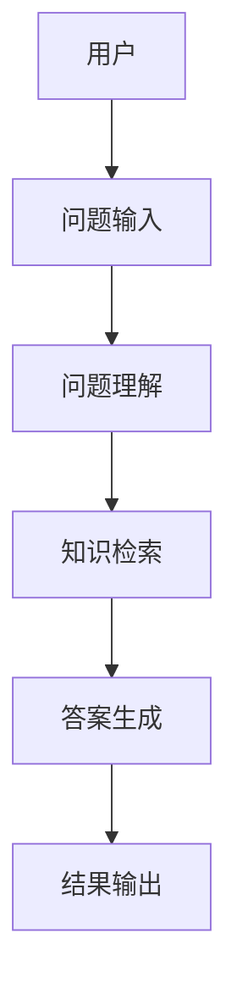

                 


# 构建AI Agent的知识图谱自动问答系统

> 关键词：知识图谱，问答系统，AI Agent，自然语言处理，智能问答，知识表示

> 摘要：本文详细介绍了如何构建基于知识图谱的AI Agent自动问答系统。首先，我们从知识图谱的基本概念出发，探讨其在问答系统中的应用价值。接着，我们分析了知识图谱的构建方法，包括数据预处理、知识抽取与表示、知识融合与推理等关键步骤。然后，我们详细讲解了问答系统的设计与实现，包括问题理解、基于知识图谱的答案生成以及系统的优化与调优。最后，我们结合实际案例，展示了如何将知识图谱与问答系统结合，构建一个高效、智能的AI Agent自动问答系统。

---

# 目录

1. [知识图谱自动问答系统背景与概述](#知识图谱自动问答系统背景与概述)
2. [知识图谱的构建方法](#知识图谱的构建方法)
3. [问答系统的设计与实现](#问答系统的设计与实现)
4. [知识图谱与问答系统的结合](#知识图谱与问答系统的结合)
5. [算法原理](#算法原理)
6. [系统架构设计](#系统架构设计)
7. [项目实战](#项目实战)
8. [总结与展望](#总结与展望)
9. [附录](#附录)

---

## 1. 知识图谱自动问答系统背景与概述

### 1.1 知识图谱的定义与特点

知识图谱是一种结构化的数据表示方式，通过实体和关系将知识组织起来。它可以表示为一个图结构，其中节点表示实体，边表示实体之间的关系。知识图谱具有以下特点：

1. **结构化**：知识图谱通过结构化的表示方式，将知识组织成易于计算机理解和推理的形式。
2. **可扩展性**：知识图谱可以通过不断添加新的实体和关系，扩展其覆盖范围。
3. **语义丰富**：知识图谱不仅包含实体，还包含实体之间的关系，语义信息非常丰富。

### 1.2 问答系统的定义与分类

问答系统是一种基于自然语言处理技术的智能系统，能够理解和回答用户提出的问题。根据应用场景的不同，问答系统可以分为以下几类：

1. **基于规则的问答系统**：通过预定义的规则和模板来回答问题。
2. **基于检索的问答系统**：通过检索预先存储的知识库或文档来回答问题。
3. **基于生成的问答系统**：利用自然语言生成技术生成回答。

### 1.3 知识图谱在问答系统中的作用

知识图谱在问答系统中的作用主要体现在以下几个方面：

1. **提供丰富的知识库**：知识图谱可以作为问答系统的知识库，提供实体和关系的信息。
2. **提升回答的准确性**：通过知识图谱的结构化信息，可以更准确地理解用户的问题，并生成准确的回答。
3. **支持复杂问题的推理**：知识图谱支持基于图的推理，能够回答需要多步推理的问题。

---

## 2. 知识图谱的构建方法

### 2.1 数据预处理与清洗

在构建知识图谱之前，需要对原始数据进行预处理和清洗，以确保数据的质量和一致性。常见的数据预处理步骤包括：

1. **数据清洗**：去除重复数据、噪声数据和错误数据。
2. **数据格式转换**：将数据转换为统一的格式，以便后续处理。
3. **数据分块**：将大规模数据分块处理，以提高处理效率。

### 2.2 知识抽取与表示

知识抽取是从文本中提取实体和关系的过程。常用的实体识别和关系抽取方法包括：

1. **基于规则的方法**：通过预定义的规则进行实体识别和关系抽取。
2. **基于统计的方法**：利用统计学习模型（如条件随机场）进行实体识别和关系抽取。
3. **基于深度学习的方法**：利用神经网络模型（如BERT）进行实体识别和关系抽取。

知识表示是将抽取到的实体和关系表示为结构化的形式，常见的知识表示方法包括：

1. **RDF（资源描述框架）**：通过三元组（主语-谓词-宾语）的形式表示知识。
2. **图表示**：将实体和关系表示为图中的节点和边。

### 2.3 知识融合与推理

知识融合是将多个来源的知识整合到一个统一的知识图谱中。常见的知识融合方法包括：

1. **实体对齐**：将不同来源的实体进行对齐，确保同一实体在知识图谱中只有一个表示。
2. **关系合并**：将不同来源的关系进行合并，消除冗余和冲突。

知识推理是基于知识图谱中的知识进行推理，以回答更复杂的问题。常见的推理方法包括：

1. **基于规则的推理**：通过预定义的规则进行推理。
2. **基于逻辑的推理**：利用逻辑推理技术（如描述逻辑）进行推理。
3. **基于图的推理**：通过图遍历算法进行推理。

---

## 3. 问答系统的设计与实现

### 3.1 问题理解与解析

问题理解是问答系统的关键步骤，主要包括以下几个方面：

1. **问题分类**：根据问题的类型（如事实性问题、描述性问题）进行分类。
2. **问题解析**：将自然语言问题转化为结构化的形式，以便后续处理。

### 3.2 基于知识图谱的答案生成

基于知识图谱的答案生成是问答系统的核心步骤，主要包括以下几个方面：

1. **实体识别与关系抽取**：从问题中提取实体和关系。
2. **知识检索**：在知识图谱中检索与问题相关的知识。
3. **答案生成**：根据检索到的知识生成回答。

### 3.3 系统的优化与调优

系统的优化与调优是提高问答系统性能的重要步骤，主要包括以下几个方面：

1. **知识图谱优化**：通过优化知识图谱的结构和内容，提高检索效率。
2. **算法优化**：通过改进算法（如优化推理算法）提高系统的响应速度和准确性。
3. **用户体验优化**：通过优化用户界面和交互流程，提高用户体验。

---

## 4. 知识图谱与问答系统的结合

### 4.1 知识图谱在问答系统中的应用流程

知识图谱在问答系统中的应用流程主要包括以下几个步骤：

1. **问题理解**：理解用户的问题，提取实体和关系。
2. **知识检索**：在知识图谱中检索与问题相关的知识。
3. **答案生成**：根据检索到的知识生成回答。
4. **结果优化**：优化回答的准确性和表达。

### 4.2 知识图谱驱动的问答系统设计

知识图谱驱动的问答系统设计主要包括以下几个方面：

1. **知识图谱的构建**：构建适合问答系统的知识图谱。
2. **问答系统的设计**：设计基于知识图谱的问答系统架构。
3. **系统的优化与调优**：优化系统的性能和用户体验。

### 4.3 知识图谱与问答系统的未来发展趋势

知识图谱与问答系统的未来发展趋势主要包括以下几个方面：

1. **知识图谱的动态更新**：随着知识的不断更新，知识图谱需要动态更新以保持其准确性。
2. **多模态问答系统**：结合图像、视频等多种模态信息，构建更智能的问答系统。
3. **人机协作问答系统**：通过人机协作，提高问答系统的智能性和用户体验。

---

## 5. 算法原理

### 5.1 知识图谱构建的算法原理

知识图谱构建的算法主要包括以下几个方面：

1. **实体识别算法**：如条件随机场（CRF）和BERT模型。
2. **关系抽取算法**：如基于规则的方法和深度学习方法。
3. **知识融合算法**：如基于相似度的实体对齐算法。

### 5.2 问答系统中的算法原理

问答系统中的算法主要包括以下几个方面：

1. **问题理解算法**：如基于规则的问题分类和基于深度学习的问题解析。
2. **知识检索算法**：如基于向量空间模型的检索算法和基于图的检索算法。
3. **答案生成算法**：如基于模板的答案生成算法和基于生成模型的答案生成算法。

---

## 6. 系统架构设计

### 6.1 系统功能模块设计

系统功能模块设计主要包括以下几个方面：

1. **数据预处理模块**：负责数据的清洗和格式转换。
2. **知识抽取模块**：负责从文本中抽取实体和关系。
3. **知识图谱构建模块**：负责构建知识图谱。
4. **问答系统模块**：负责理解和回答用户的问题。

### 6.2 系统架构图

以下是一个基于知识图谱的问答系统的架构图：



### 6.3 系统接口设计

系统接口设计主要包括以下几个方面：

1. **用户接口**：负责与用户的交互。
2. **知识图谱接口**：负责与知识图谱的交互。
3. **问答系统接口**：负责与外部系统的交互。

### 6.4 系统交互流程

系统交互流程主要包括以下几个步骤：

1. **用户输入问题**：用户通过用户接口输入问题。
2. **问题理解**：系统通过问题理解模块理解用户的问题。
3. **知识检索**：系统在知识图谱中检索与问题相关的知识。
4. **答案生成**：系统根据检索到的知识生成回答。
5. **结果输出**：系统通过用户接口输出回答。

---

## 7. 项目实战

### 7.1 环境安装

在进行项目实战之前，需要安装以下环境：

1. **Python**：推荐使用Python 3.8及以上版本。
2. **NLTK库**：用于自然语言处理。
3. **NetworkX库**：用于图的构建和分析。
4. **SPARQL查询语言**：用于知识图谱的查询。

### 7.2 系统核心实现源代码

以下是一个基于知识图谱的问答系统的实现代码示例：

```python
from nltk import word_tokenize, pos_tag
from nltk.corpus import stopwords
from spacy.lang.zh import Chinese

# 数据预处理
def preprocess(text):
    tokens = word_tokenize(text.lower())
    filtered = [word for word in tokens if word not in stopwords.words('english')]
    return filtered

# 实体识别
def extract_entities(text):
    nlp = Chinese()
    doc = nlp(text)
    entities = []
    for ent in doc.ents:
        entities.append((ent.start, ent.end, ent.label_))
    return entities

# 知识图谱构建
def build_knowledge_graph(entities):
    from networkx import Graph
    graph = Graph()
    for entity in entities:
        graph.add_node(entity[2])
    return graph

# 问题理解
def understand_question(question):
    processed = preprocess(question)
    entities = extract_entities(' '.join(processed))
    return entities

# 知识检索
def retrieve_knowledge(graph, entities):
    # 假设graph中存储了实体和关系
    result = []
    for entity in entities:
        result.append(graph.nodes[entity[2]]['info'])
    return result

# 答案生成
def generate_answer(result):
    return "根据知识图谱，答案如下：{}".format(result)

# 主程序
if __name__ == '__main__':
    question = "什么是人工智能？"
    entities = understand_question(question)
    result = retrieve_knowledge(graph, entities)
    answer = generate_answer(result)
    print(answer)
```

### 7.3 案例分析与详细解读

以“什么是人工智能？”为例，系统首先对问题进行预处理，提取实体“人工智能”，然后在知识图谱中检索与“人工智能”相关的知识，最后生成回答：“人工智能是一种模拟人类智能的计算机系统。”

---

## 8. 总结与展望

### 8.1 系统总结

本文详细介绍了如何构建基于知识图谱的AI Agent自动问答系统。通过知识图谱的构建和问答系统的设计，我们可以构建一个高效、智能的问答系统。

### 8.2 未来发展方向

未来，基于知识图谱的问答系统有以下几个发展方向：

1. **动态知识图谱**：随着知识的不断更新，知识图谱需要动态更新以保持其准确性。
2. **多模态问答系统**：结合图像、视频等多种模态信息，构建更智能的问答系统。
3. **人机协作问答系统**：通过人机协作，提高问答系统的智能性和用户体验。

### 8.3 注意事项

在构建基于知识图谱的问答系统时，需要注意以下几点：

1. **数据质量**：确保知识图谱中的数据准确、一致。
2. **系统性能**：优化系统的响应速度和准确性。
3. **用户体验**：提高用户的使用体验。

---

## 9. 附录

### 9.1 知识图谱构建工具

1. **DBpedia**：基于维基百科构建的知识图谱。
2. **Freebase**：一个通用的知识图谱。
3. **Wikidata**：一个自由的、可编辑的知识库。

### 9.2 问答系统开发工具

1. **spaCy**：一个用于自然语言处理的Python库。
2. **NLTK**：一个用于自然语言处理的Python库。
3. **Rasa**：一个开源的对话式AI框架。

---

作者：AI天才研究院/AI Genius Institute & 禅与计算机程序设计艺术 /Zen And The Art of Computer Programming

