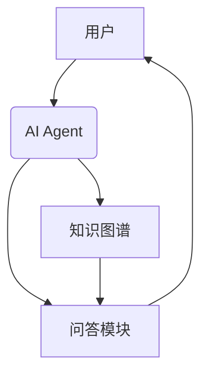

                 


# 《构建AI Agent的知识图谱问答系统》

## 关键词：
知识图谱、问答系统、AI Agent、自然语言处理、知识表示、信息抽取、问答系统优化

## 摘要：
本文系统地介绍了构建AI Agent的知识图谱问答系统的理论基础、技术实现和应用实践。首先，我们从知识图谱和问答系统的概念入手，详细讲解了AI Agent在其中的作用。接着，我们深入分析了知识图谱问答系统的算法原理，包括信息抽取、知识融合和问答模型的设计。随后，我们从系统架构的角度，探讨了如何设计一个高效的知识图谱问答系统，并提供了具体的项目实现步骤和代码示例。最后，我们总结了构建AI Agent的知识图谱问答系统的最佳实践和未来发展方向。

---

# 第一部分: 知识图谱问答系统背景与核心概念

# 第1章: 知识图谱问答系统概述

## 1.1 知识图谱问答系统的基本概念
### 1.1.1 知识图谱的定义与特点
知识图谱是一种以图结构形式表示知识的语义网络，节点表示实体或概念，边表示实体之间的关系。知识图谱具有语义丰富、结构化、可扩展性强等特点。

### 1.1.2 问答系统的定义与分类
问答系统是一种能够理解和回答用户提问的智能系统，主要分为基于规则、基于检索和基于生成的问答系统。

### 1.1.3 AI Agent的核心概念与作用
AI Agent（智能代理）是能够感知环境、执行任务的智能实体，能够辅助知识图谱问答系统实现更复杂的交互和推理。

## 1.2 知识图谱问答系统的技术基础
### 1.2.1 知识图谱的构建与存储
知识图谱的构建包括数据抽取、实体识别、关系抽取和知识融合等步骤，常用存储方式包括图数据库和RDF存储。

### 1.2.2 问答系统的实现原理
问答系统基于自然语言处理技术，通过语义分析、信息检索和生成式回答来实现对用户提问的处理。

### 1.2.3 AI Agent与知识图谱的结合
AI Agent能够利用知识图谱中的结构化知识，提高问答系统的准确性和智能化水平。

## 1.3 知识图谱问答系统的应用与挑战
### 1.3.1 应用场景
知识图谱问答系统广泛应用于智能助手、搜索引擎优化、教育问答、医疗咨询等领域。

### 1.3.2 技术挑战
包括知识图谱的质量、问答系统的准确性和效率、AI Agent的自主学习能力等。

## 1.4 本章小结
本章介绍了知识图谱问答系统的基本概念、技术基础和应用场景，为后续内容奠定了基础。

---

# 第2章: 知识图谱与问答系统的核心概念

## 2.1 知识图谱的构建与表示
### 2.1.1 知识图谱的构建流程
1. 数据采集：从多种数据源获取结构化和非结构化数据。
2. 实体识别：通过NLP技术识别文本中的实体。
3. 关系抽取：识别实体之间的关系。
4. 知识融合：消除数据中的冗余和冲突，构建一致的知识图谱。

### 2.1.2 知识图谱的表示方法
常用的知识表示方法包括RDF、OWL和图嵌入（如Word2Vec）。

### 2.1.3 知识图谱的存储与管理
知识图谱的存储和管理通常使用图数据库（如Neo4j）或RDF存储系统。

## 2.2 问答系统的实现原理
### 2.2.1 基于规则的问答系统
基于规则的问答系统通过预定义的规则和模板匹配用户的问题，适用于特定领域的简单问答。

### 2.2.2 基于检索的问答系统
基于检索的问答系统利用搜索引擎或知识库中的信息，通过关键词匹配返回答案。

### 2.2.3 基于生成的问答系统
基于生成的问答系统采用自然语言生成技术（如GPT），生成与用户问题相关的回答。

## 2.3 AI Agent与知识图谱问答系统的结合
### 2.3.1 AI Agent在知识图谱问答中的角色
AI Agent作为中介，能够协调知识图谱和问答系统，提供更智能和个性化的服务。

### 2.3.2 知识图谱问答系统的任务分解
知识图谱问答系统的任务包括信息抽取、知识表示、问题理解、答案生成和结果优化。

### 2.3.3 知识图谱与问答系统的协同工作
知识图谱为问答系统提供语义支持，而问答系统则为知识图谱的动态更新提供反馈。

## 2.4 核心概念对比分析
### 2.4.1 知识图谱与传统数据库的对比
知识图谱具有语义表达能力强、支持复杂查询等特点，而传统数据库主要是结构化数据的存储和查询。

### 2.4.2 问答系统与搜索引擎的对比
问答系统注重理解用户意图并提供精准答案，而搜索引擎主要是基于关键词匹配返回相关网页。

### 2.4.3 AI Agent与传统问答系统的对比
AI Agent具有自主决策和学习能力，能够与知识图谱和问答系统协同工作，提供更高级的服务。

## 2.5 本章小结
本章深入分析了知识图谱和问答系统的核心概念，并探讨了AI Agent在其中的作用，为后续章节奠定了理论基础。

---

# 第3章: 知识图谱问答系统的算法原理

## 3.1 知识图谱问答的核心算法
### 3.1.1 基于图的问答算法
基于图的问答算法利用知识图谱的结构，通过图遍历或路径推理生成回答。

### 3.1.2 信息抽取算法
信息抽取算法用于从文本中提取实体和关系，常用技术包括CRF、RNN和Transformer。

### 3.1.3 知识融合算法
知识融合算法用于合并多个数据源的知识，解决数据冗余和冲突问题。

## 3.2 问答系统的算法实现
### 3.2.1 基于检索的问答系统算法
基于检索的问答系统通常使用向量空间模型（如TF-IDF）或深度学习模型（如BERT）进行信息检索。

### 3.2.2 基于生成的问答系统算法
基于生成的问答系统主要采用生成式模型（如GPT、Transformer）生成回答。

## 3.3 AI Agent的知识表示与推理
### 3.3.1 知识表示方法
知识表示方法包括符号表示、向量表示和图表示，其中图表示方法能够更好地捕捉知识的语义关系。

### 3.3.2 知识推理算法
知识推理算法包括基于规则的推理、基于概率的推理和基于神经网络的推理。

## 3.4 算法的数学模型与公式
### 3.4.1 信息抽取的数学模型
信息抽取的数学模型可以用马尔可夫随机场（MRF）或条件随机场（CRF）表示：

$$ P(y|x) = \frac{1}{Z} \exp(\sum_{i=1}^n \theta y_i) $$

### 3.4.2 知识融合的数学模型
知识融合的数学模型可以用图嵌入方法表示，例如Node2Vec模型：

$$ \text{Node2Vec} = (\text{walk length}, \text{window size}) $$

## 3.5 本章小结
本章详细讲解了知识图谱问答系统的算法原理，包括信息抽取、知识融合和问答模型的设计，并给出了相关的数学公式和模型。

---

# 第4章: 知识图谱问答系统的系统架构与实现

## 4.1 系统架构设计
### 4.1.1 系统功能模块划分
知识图谱问答系统的功能模块包括知识图谱构建模块、问答模块和AI Agent模块。

### 4.1.2 系统架构设计
系统架构采用分层设计，包括数据层、知识层、逻辑层和应用层。

### 4.1.3 系统交互流程
用户通过AI Agent提交问题，系统通过知识图谱查询和问答模块生成回答。

## 4.2 系统功能设计
### 4.2.1 知识图谱构建模块
知识图谱构建模块包括数据预处理、实体识别、关系抽取和知识融合功能。

### 4.2.2 问答模块
问答模块包括问题理解、信息检索和回答生成功能。

### 4.2.3 AI Agent模块
AI Agent模块负责协调知识图谱和问答模块，实现智能交互和任务执行。

## 4.3 系统架构图
以下是系统的架构图：



## 4.4 系统接口设计
### 4.4.1 系统接口定义
系统接口包括用户接口（API）、知识图谱接口和问答模块接口。

### 4.4.2 接口交互流程
用户通过API提交问题，AI Agent调用知识图谱接口和问答模块接口生成回答。

## 4.5 本章小结
本章详细讲解了知识图谱问答系统的系统架构与实现，包括功能模块划分、系统架构设计和接口设计。

---

# 第5章: 知识图谱问答系统的项目实战

## 5.1 环境安装与配置
### 5.1.1 开发环境搭建
开发环境包括Python、Jupyter Notebook、TensorFlow和PyTorch等工具。

### 5.1.2 知识图谱工具安装
安装知识图谱相关工具，如Neo4j、RDF4J和networkx。

## 5.2 数据准备与预处理
### 5.2.1 数据来源
数据来源包括结构化数据（如CSV文件）和非结构化数据（如文本文件）。

### 5.2.2 数据清洗与预处理
数据清洗包括去除重复数据、处理缺失值和格式转换。

## 5.3 知识图谱构建与训练
### 5.3.1 实体识别与关系抽取
使用NLP工具（如spaCy、NLTK）进行实体识别和关系抽取。

### 5.3.2 知识融合与存储
将抽取的知识进行融合，并存储到知识图谱数据库中。

## 5.4 问答系统实现
### 5.4.1 基于检索的问答系统实现
实现基于检索的问答系统，使用向量索引技术（如TF-IDF、BM25）进行信息检索。

### 5.4.2 基于生成的问答系统实现
实现基于生成的问答系统，使用预训练模型（如GPT、BERT）进行回答生成。

## 5.5 AI Agent的集成与测试
### 5.5.1 AI Agent的集成
将AI Agent与知识图谱和问答系统集成，实现智能交互。

### 5.5.2 系统测试与优化
通过测试用例验证系统性能，并进行优化。

## 5.6 项目代码示例
以下是一个简单的问答系统实现代码：

```python
import numpy as np

def question_answering_system(questions, knowledge_base):
    answers = []
    for question in questions:
        # 提取关键词
        keywords = extract_keywords(question)
        # 在知识库中搜索
        results = search_in_knowledge_base(keywords, knowledge_base)
        # 生成回答
        answer = generate_answer(results)
        answers.append(answer)
    return answers

def extract_keywords(question):
    # 使用NLP工具提取关键词
    pass

def search_in_knowledge_base(keywords, knowledge_base):
    # 在知识库中搜索关键词相关的结果
    pass

def generate_answer(results):
    # 根据搜索结果生成回答
    pass
```

## 5.7 本章小结
本章通过一个具体的项目案例，详细讲解了知识图谱问答系统的实现过程，包括环境搭建、数据准备、知识图谱构建、问答系统实现和AI Agent的集成。

---

# 第6章: 知识图谱问答系统的优化与扩展

## 6.1 系统优化策略
### 6.1.1 知识图谱优化
优化知识图谱的质量和结构，减少冗余和冲突。

### 6.1.2 问答系统优化
优化问答系统的性能和准确性，包括提升信息检索效率和生成回答的质量。

### 6.1.3 AI Agent优化
优化AI Agent的智能性和自主性，提升其与知识图谱和问答系统的协同能力。

## 6.2 知识图谱问答系统的扩展
### 6.2.1 多语言支持
扩展知识图谱问答系统的多语言支持，实现跨语言问答。

### 6.2.2 实时更新与动态推理
实现知识图谱的实时更新和动态推理，提升系统的适应性和响应能力。

## 6.3 最佳实践与注意事项
### 6.3.1 数据质量管理
确保数据的准确性和完整性，避免数据冗余和冲突。

### 6.3.2 系统性能优化
优化系统性能，包括减少响应时间、提高查询效率。

### 6.3.3 安全与隐私保护
确保系统数据的安全性和用户的隐私保护。

## 6.4 未来发展方向
### 6.4.1 知识图谱的深度学习
结合深度学习技术，进一步提升知识图谱的构建和应用能力。

### 6.4.2 智能问答系统的创新
探索新的问答技术，如情感问答、多轮对话等。

### 6.4.3 AI Agent的智能化
提升AI Agent的自主学习和决策能力，实现更高级的智能服务。

## 6.5 本章小结
本章总结了知识图谱问答系统的优化策略和扩展方向，为系统的进一步发展提供了指导。

---

# 附录

## 附录A: 知识图谱构建工具
常用的知识图谱构建工具包括Neo4j、RDF4J、networkx和igraph。

## 附录B: 问答系统开源框架
常用的问答系统开源框架包括spaCy、Rasa、Dialogflow和Hugging Face Transformers。

## 附录C: 参考文献
1. 知识图谱相关文献
2. 问答系统相关文献
3. AI Agent相关文献

---

# 作者：AI天才研究院/AI Genius Institute & 禅与计算机程序设计艺术 /Zen And The Art of Computer Programming

---

通过以上目录大纲，我们可以清晰地看到构建AI Agent的知识图谱问答系统的各个关键部分，从理论到实践，从系统设计到优化扩展，为读者提供了一个全面的学习和参考框架。

