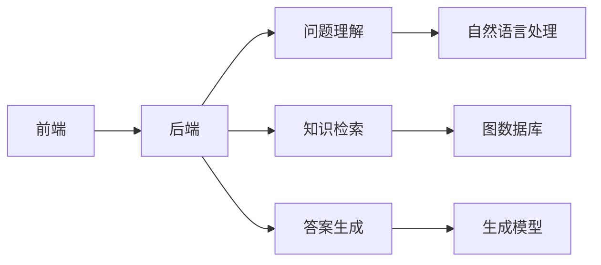

                 


# 构建AI Agent的知识图谱问答系统优化

## 关键词：
知识图谱，问答系统，AI Agent，自然语言处理，深度学习，系统优化

## 摘要：
知识图谱问答系统是一种结合了知识图谱和自然语言处理技术的问答系统，旨在通过构建和利用结构化的知识库来提高问答的准确性和效率。本文将从知识图谱的基本概念和问答系统的优化目标出发，详细探讨知识图谱问答系统的核心原理、算法实现、系统架构设计以及实际项目中的优化策略。通过理论分析和实践案例的结合，本文旨在为读者提供一套构建高效AI Agent的知识图谱问答系统优化方法。

---

## 第一部分：知识图谱问答系统概述

### 第1章：知识图谱与问答系统背景

#### 1.1 知识图谱的定义与特点
知识图谱是一种以图结构形式表示知识的语义网络，由实体（概念）和关系（属性或联系）组成。其特点包括：
- **结构化**：知识以实体和关系的形式组织，便于计算机理解和推理。
- **语义丰富**：通过实体间的关系，可以表达复杂的语义信息。
- **可扩展性**：支持动态扩展和更新，适应不断变化的知识需求。

#### 1.2 问答系统的基本原理
问答系统是一种通过自然语言处理技术来理解和回答用户问题的系统，主要分为以下步骤：
1. **问题理解**：解析用户的问题，提取关键词和语义信息。
2. **知识检索**：基于问题在知识库中检索相关答案。
3. **答案生成**：根据检索结果生成自然语言回答。

#### 1.3 知识图谱问答系统的优势
将知识图谱与问答系统结合，可以显著提高问答系统的准确性和效率，尤其在处理复杂问题和多义词时表现优异。

---

### 第2章：知识图谱问答系统的核心概念

#### 2.1 知识图谱的构建流程
1. **数据收集与预处理**：从多种数据源（如文本、数据库）收集数据，并进行清洗和结构化。
2. **实体识别与关系抽取**：使用自然语言处理技术识别文本中的实体及其关系。
3. **知识图谱的存储与管理**：将实体和关系存储在图数据库中，并设计高效的查询机制。

#### 2.2 问答系统的优化目标
- **提高准确率**：通过优化算法和知识库的结构，减少错误答案。
- **提升响应速度**：优化查询算法和数据库性能，减少用户等待时间。
- **增强可解释性**：使用户能够理解回答的来源和逻辑。

#### 2.3 知识图谱与问答系统的结合
知识图谱为问答系统提供了丰富的语义信息，而问答系统则为知识图谱提供了动态的应用场景。两者结合可以实现更智能、更高效的问答功能。

---

## 第二部分：知识图谱问答系统的算法原理

### 第3章：知识图谱问答系统的算法基础

#### 3.1 向量空间模型
向量空间模型通过将文本表示为向量，计算文本之间的相似性。例如，使用TF-IDF或Word2Vec生成词向量。

**代码示例：**
```python
from sklearn.feature_extraction.text import TfidfVectorizer

vectorizer = TfidfVectorizer()
text = "How can I improve my coding skills?"
vector = vectorizer.fit_transform([text])
print(vector)
```

#### 3.2 图嵌入算法
图嵌入算法通过将图中的节点表示为低维向量，保留图的结构信息。常用算法包括Node2Vec和GraphSAGE。

**代码示例：**
```python
import networkx as nx
from node2vec import Node2Vec

G = nx.Graph()
G.add_nodes_from(["A", "B", "C"])
G.add_edges_from([("A", "B"), ("B", "C")])
model = Node2Vec(G, walks_per_node=10, num_walks=10)
embeddings = model.get_embeddings()
print(embeddings)
```

#### 3.3 注意力机制
注意力机制通过计算输入数据中各部分的重要性，聚焦关键信息。在问答系统中，注意力机制常用于问题理解和答案生成。

**数学公式：**
$$
\alpha_i = \frac{e^{score(q, a_i)}}{\sum_{j} e^{score(q, a_j)}}
$$
其中，$q$ 是问题，$a_i$ 是候选答案，$score$ 是相似度评分。

---

### 第4章：知识图谱问答系统的优化算法

#### 4.1 知识图谱问答系统的优化目标
通过优化算法和知识库结构，提高问答系统的性能和用户体验。

#### 4.2 基于深度学习的问答优化
使用深度学习模型（如BERT）对问题和答案进行语义理解，提升问答系统的准确性。

**代码示例：**
```python
from transformers import BertTokenizer, BertModel

tokenizer = BertTokenizer.from_pretrained('bert-base-uncased')
model = BertModel.from_pretrained('bert-base-uncased')

text = "How can I improve my coding skills?"
inputs = tokenizer.encode_plus(text, return_tensors='pt')
outputs = model(**inputs)
print(outputs)
```

#### 4.3 混合模型优化
结合规则推理和深度学习模型，利用知识图谱中的结构化知识进行问答优化。

**数学公式：**
$$
score(q, a) = \alpha \cdot score_{\text{ML}}(q, a) + (1-\alpha) \cdot score_{\text{rule}}(q, a)
$$
其中，$\alpha$ 是混合比例，$score_{\text{ML}}$ 是机器学习模型评分，$score_{\text{rule}}$ 是基于规则的评分。

---

## 第三部分：系统分析与架构设计

### 第5章：系统分析与架构设计

#### 5.1 系统应用场景
知识图谱问答系统适用于智能客服、教育辅助、医疗咨询等领域。

#### 5.2 系统功能设计
- **问题理解**：解析用户问题，提取关键词。
- **知识检索**：在知识图谱中查找相关实体和关系。
- **答案生成**：根据检索结果生成自然语言回答。

#### 5.3 系统架构设计
使用微服务架构，包括前端、后端（问题理解、知识检索、答案生成）、数据库和第三方服务（如NLP模型）。

**Mermaid架构图：**


---

## 第四部分：项目实战

### 第6章：项目实战

#### 6.1 环境安装
安装必要的库，如Python、TensorFlow、NetworkX等。

#### 6.2 核心代码实现
实现知识图谱构建、问答系统优化的核心代码。

**代码示例：**
```python
import networkx as nx
from sklearn.metrics.pairwise import cosine_similarity

G = nx.Graph()
G.add_edges_from([("A", "B"), ("B", "C")])
vectors = {"A": [1, 0], "B": [0, 1], "C": [0, 0]}
similarity = cosine_similarity([vectors["A"], vectors["B"]])
print(similarity)
```

#### 6.3 案例分析
通过具体案例分析，展示知识图谱问答系统的实际应用和优化效果。

---

## 第五部分：最佳实践

### 第7章：最佳实践

#### 7.1 小结
总结全文内容，强调知识图谱问答系统在AI Agent中的重要性。

#### 7.2 注意事项
- 确保知识图谱的准确性和及时更新。
- 优化算法时关注性能和可解释性。
- 结合实际场景选择合适的模型和方法。

#### 7.3 拓展阅读
推荐进一步学习的知识图谱和问答系统相关书籍和论文。

---

## 作者：AI天才研究院 & 禅与计算机程序设计艺术

---

这篇文章通过系统地介绍知识图谱问答系统的构建和优化方法，为读者提供了从理论到实践的完整指南。通过详细的代码示例和实际案例分析，帮助读者掌握构建高效AI Agent的知识图谱问答系统优化技术。

