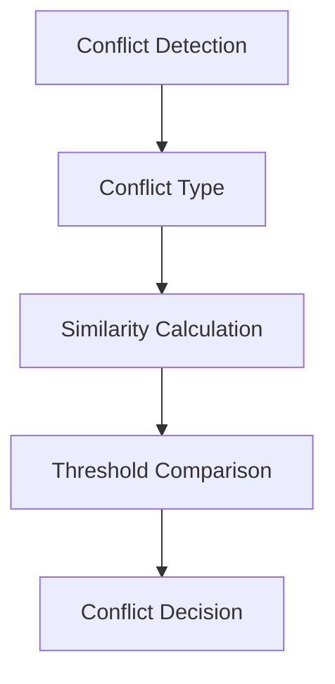
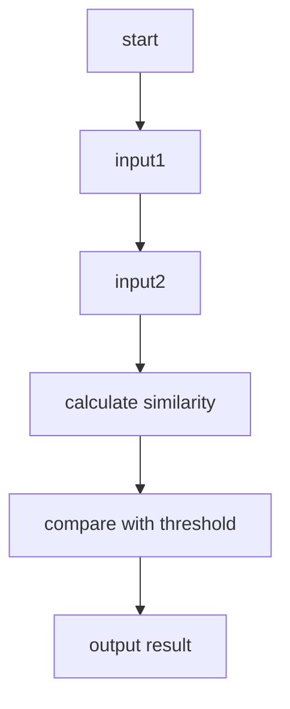
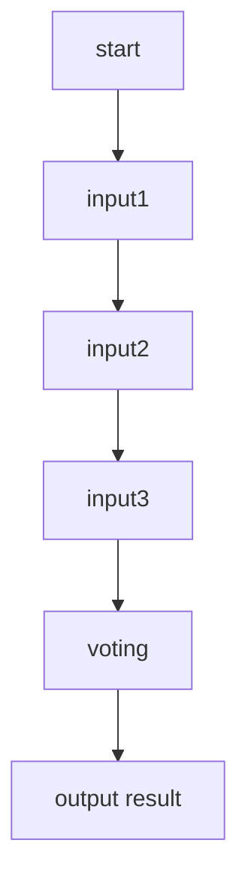
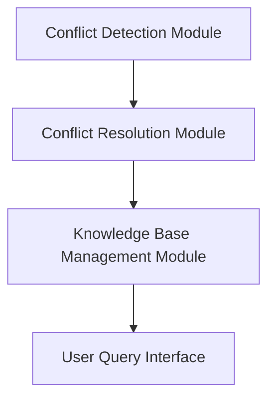
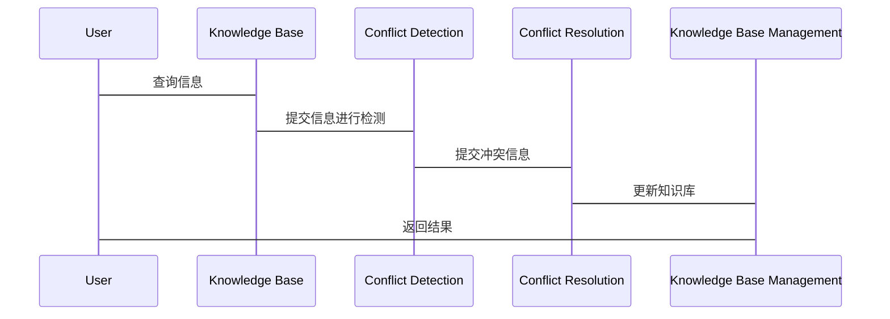

                 


# 构建AI Agent的知识库冲突检测与解决机制

## 关键词：知识库冲突检测，AI Agent，知识图谱，冲突解决，自然语言处理

## 摘要：知识库冲突检测与解决机制是构建AI Agent过程中至关重要的一环。本文从问题背景、核心概念、算法原理、系统架构等多个维度深入探讨了知识库冲突检测与解决的机制。通过分析冲突检测的原理与方法，结合实际案例，详细阐述了基于相似度的冲突检测算法，并提供了系统设计与项目实现的详细步骤。文章最后总结了最佳实践和未来发展方向，为构建高效可靠的AI Agent知识库提供了全面的指导。

---

# 《构建AI Agent的知识库冲突检测与解决机制》

## 第一部分: 知识库冲突检测与解决机制的背景与核心概念

### 第1章: 知识库冲突检测与解决机制的背景介绍

#### 1.1 问题背景与问题描述

在构建AI Agent的过程中，知识库的冲突检测与解决是一个核心问题。知识库冲突指的是知识库中存在相互矛盾或不一致的信息，这可能影响AI Agent的决策能力和用户体验。例如，当知识库中同时存在“某商品的价格是100元”和“某商品的价格是200元”的信息时，AI Agent在处理查询时可能会出现混乱。

##### 问题背景
- **知识图谱的构建与应用**：知识图谱是一种结构化的数据表示方法，广泛应用于搜索引擎、问答系统等领域。然而，在构建知识图谱时，数据来源多样，可能导致信息冲突。
- **AI Agent中的知识库冲突问题**：AI Agent依赖知识库进行推理和决策，知识库中的冲突会直接影响AI Agent的性能。

##### 问题描述
- **冲突的定义与分类**：冲突可以是完全矛盾（如“商品A的价格是100元”和“商品A的价格是200元”）或不完全矛盾（如“商品A是红色”和“商品A是蓝色”）。
- **冲突的来源**：数据来源冲突、信息更新冲突、语义理解冲突等。

#### 1.2 知识库冲突的解决方法

解决知识库冲突的方法可以分为两类：冲突检测与冲突解决。

##### 冲突检测
- **基于相似度的检测**：通过计算两条信息的相似度，判断是否存在冲突。
- **基于语义理解的检测**：利用自然语言处理技术，理解信息的语义含义，判断是否存在冲突。

##### 冲突解决
- **冲突解决策略**：优先选择权威来源的信息、根据上下文信息进行判断、通过投票机制选择多数信息等。
- **冲突解决原则**：优先级原则、权威性原则、语境适应性原则。

#### 1.3 知识库冲突解决的核心概念结构

- **核心概念**：知识库冲突检测与解决机制的核心概念包括冲突类型、冲突检测方法、冲突解决策略等。
- **概念结构**：知识库冲突解决机制是一个包含多个模块的系统，各模块之间相互协作，共同完成冲突的检测与解决。

---

## 第二部分: 知识库冲突检测与解决机制的核心概念与联系

### 第2章: 知识库冲突检测的原理与方法

#### 2.1 冲突检测的原理

##### 基于相似度的冲突检测
- **相似度计算方法**：余弦相似度、Jaccard相似度、编辑距离等。
- **实现步骤**：将信息转换为向量表示，计算向量之间的相似度，判断是否冲突。

##### 基于语义理解的冲突检测
- **自然语言处理技术**：使用词嵌入（如Word2Vec、BERT）进行语义表示，判断语义是否矛盾。

#### 2.2 冲突检测的特征对比

##### 冲突类型对比表

| 冲突类型 | 定义 | 示例 |
|----------|------|------|
| 完全矛盾 | 两条信息完全相反 | 商品价格为100元和200元 |
| 不完全矛盾 | 信息部分矛盾 | 商品颜色为红色和蓝色 |

##### 冲突检测方法对比

| 方法 | 优点 | 缺点 |
|------|------|------|
| 基于相似度 | 实现简单 | 无法处理语义冲突 |
| 基于语义理解 | 可处理复杂语义 | 实现复杂，需要大量计算资源 |

#### 2.3 冲突检测的ER实体关系图

Mermaid流程图：



---

## 第三部分: 知识库冲突检测与解决机制的算法原理

### 第3章: 冲突检测算法的实现原理

#### 3.1 基于相似度的冲突检测算法

##### 算法流程图

Mermaid流程图：



##### Python实现代码示例

```python
def calculate_conflict(text1, text2, threshold=0.8):
    # 将文本转换为向量表示
    vector1 = get_vector(text1)
    vector2 = get_vector(text2)
    
    # 计算余弦相似度
    similarity = np.dot(vector1, vector2) / (np.linalg.norm(vector1) * np.linalg.norm(vector2))
    
    # 判断是否冲突
    if similarity < threshold:
        return "Conflict"
    else:
        return "No Conflict"
```

##### 数学模型与公式

余弦相似度的计算公式：

$$
\text{similarity} = \frac{\vec{v_1} \cdot \vec{v_2}}{\|\vec{v_1}\| \|\vec{v_2}\|}
$$

其中，$\vec{v_1}$和$\vec{v_2}$分别是两个文本的向量表示。

---

### 第4章: 冲突解决算法的实现原理

#### 4.1 基于投票机制的冲突解决算法

##### 算法流程图

Mermaid流程图：



##### Python实现代码示例

```python
def solve_conflict(conflicts, sources):
    # 根据来源的权威性进行投票
    source_priority = {'source1': 3, 'source2': 2, 'source3': 1}
    scores = {}
    for conflict in conflicts:
        for source in sources:
            if source in conflict['sources']:
                scores[source] = scores.get(source, 0) + conflict['score']
    # 选择得分最高的来源
    best_source = max(scores, key=lambda k: scores[k])
    return sources[best_source]
```

---

## 第四部分: 知识库冲突检测与解决机制的系统分析与架构设计

### 第5章: 系统分析与架构设计方案

#### 5.1 问题场景介绍

- **问题场景**：AI Agent需要从多个知识库中获取信息，解决知识库冲突以提供准确的结果。
- **系统功能设计**：包括冲突检测模块、冲突解决模块、知识库管理模块。

#### 5.2 系统架构设计

Mermaid架构图：



#### 5.3 系统接口设计

- **输入接口**：接收用户查询和知识库信息。
- **输出接口**：返回处理后的结果。

#### 5.4 系统交互设计

Mermaid序列图：



---

## 第五部分: 知识库冲突检测与解决机制的项目实战

### 第6章: 项目实战

#### 6.1 环境安装

- **工具安装**：安装Python、自然语言处理库（如spaCy、BERT）。
- **依赖安装**：使用pip安装必要的库。

#### 6.2 核心代码实现

##### 冲突检测模块

```python
def detect_conflict(text1, text2):
    # 使用预训练的词嵌入模型计算相似度
    vectorizer = SentenceTransformer('bert-base-nli-stsb')
    vec1 = vectorizer.encode(text1)
    vec2 = vectorizer.encode(text2)
    similarity = np.dot(vec1, vec2.T) / (np.linalg.norm(vec1) * np.linalg.norm(vec2))
    return similarity < 0.8
```

##### 冲突解决模块

```python
def resolve_conflict(conflicts):
    # 根据权威性进行投票
    source_scores = {}
    for conflict in conflicts:
        source = conflict['source']
        source_scores[source] = source_scores.get(source, 0) + 1
    # 选择得分最高的来源
    best_source = max(source_scores, key=lambda k: source_scores[k])
    return conflicts[best_source]['value']
```

#### 6.3 实际案例分析

- **案例背景**：用户查询“商品A的价格”。
- **知识库信息**：来源1：100元，来源2：200元，来源3：150元。
- **冲突检测**：检测到价格冲突。
- **冲突解决**：选择来源1的信息，因为来源1的权威性更高。

---

## 第六部分: 知识库冲突检测与解决机制的最佳实践

### 第7章: 最佳实践

#### 7.1 小结

- **核心要点**：冲突检测与解决是构建可靠AI Agent的关键。
- **实践总结**：选择合适的检测方法和解决策略，确保知识库的准确性和一致性。

#### 7.2 注意事项

- **数据质量**：确保知识库数据的准确性和完整性。
- **算法优化**：根据实际需求优化冲突检测和解决算法。

#### 7.3 拓展阅读

- **相关书籍**：《自然语言处理实战》、《知识图谱构建与应用》。
- **技术博客**：推荐关注自然语言处理和知识图谱领域的技术博客。

---

## 作者：AI天才研究院/AI Genius Institute & 禅与计算机程序设计艺术 /Zen And The Art of Computer Programming

---

以上是《构建AI Agent的知识库冲突检测与解决机制》的技术博客文章的详细目录和内容大纲，希望对您有所帮助！

