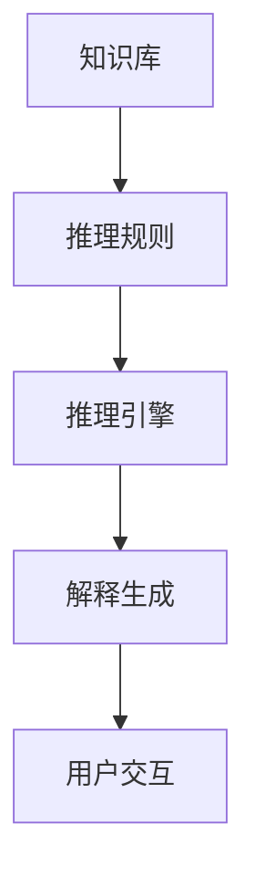
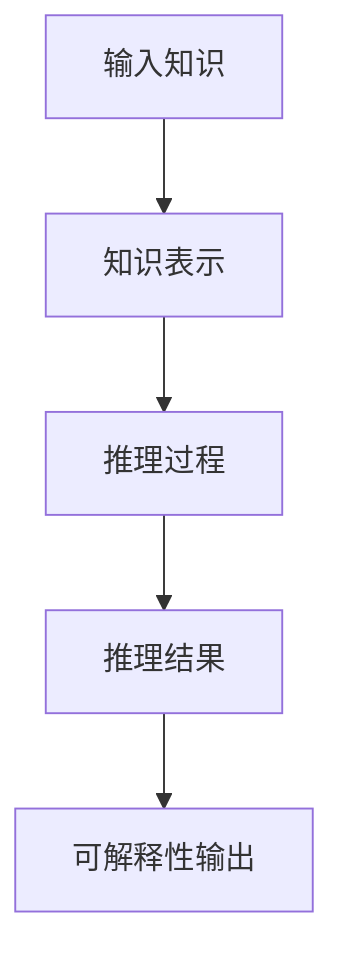
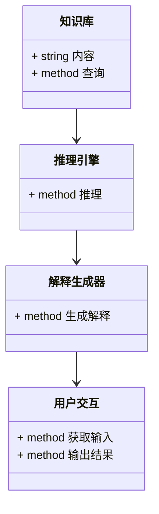
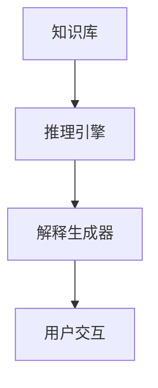
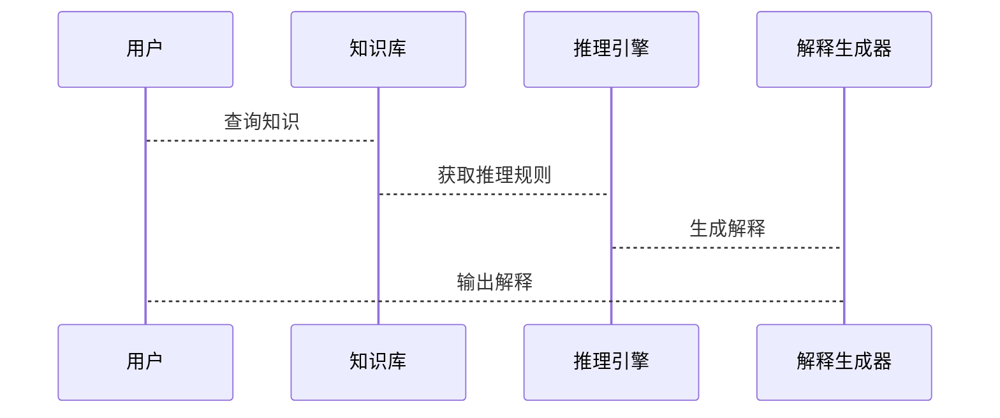

                 


# 构建AI Agent的知识推理可解释性框架

## 关键词：AI Agent，知识推理，可解释性，知识图谱，逻辑推理，可解释性框架

## 摘要：  
构建AI Agent的知识推理可解释性框架是实现人工智能系统透明性和可信性的重要一步。本文从AI Agent的基本概念出发，详细探讨了知识推理与可解释性框架的核心原理、算法实现、系统设计及实际应用。通过分析知识表示、推理机制和可解释性生成的关键步骤，本文提出了一种基于知识图谱和逻辑推理的可解释性框架，并结合实际案例展示了其在AI Agent中的应用。文章还提供了详细的系统架构设计和项目实战指南，帮助读者理解如何将理论付诸实践。

---

# 第一部分: 知识推理与可解释性框架的背景与基础

## 第1章: AI Agent与知识推理概述

### 1.1 问题背景
#### 1.1.1 AI Agent的基本概念  
AI Agent（人工智能代理）是指能够感知环境、自主决策并执行任务的智能实体。AI Agent的核心能力包括感知、推理、规划和执行。  

#### 1.1.2 知识推理在AI Agent中的作用  
知识推理是AI Agent实现智能决策的核心能力。通过知识推理，AI Agent能够根据已有的知识库和输入的信息，推导出新的结论或行动方案。  

#### 1.1.3 可解释性的重要性  
可解释性是指AI Agent的决策过程和结果能够被人类理解和验证。可解释性是AI Agent在实际应用中的关键需求，尤其是在医疗、法律和金融等高风险领域。  

### 1.2 问题描述
#### 1.2.1 知识推理的核心问题  
知识推理的核心问题是如何从知识库中提取有效的信息，并结合上下文进行逻辑推理。  

#### 1.2.2 可解释性框架的目标  
可解释性框架的目标是将AI Agent的推理过程和结果转化为人类可理解的形式，确保决策的透明性和可信性。  

#### 1.2.3 当前存在的主要挑战  
当前知识推理与可解释性框架的主要挑战包括：知识表示的复杂性、推理算法的效率、可解释性输出的直观性等。  

### 1.3 问题解决
#### 1.3.1 知识推理的基本方法  
知识推理的基本方法包括基于规则的推理、基于逻辑的推理和基于概率的推理。  

#### 1.3.2 可解释性框架的设计原则  
可解释性框架的设计原则包括：简洁性、直观性、可定制性和可验证性。  

#### 1.3.3 解决方案的实现路径  
解决方案的实现路径包括：知识表示、推理算法设计、可解释性生成和结果验证。  

### 1.4 边界与外延
#### 1.4.1 知识推理的边界  
知识推理的边界包括：知识库的范围、推理的深度和广度、推理结果的准确性。  

#### 1.4.2 可解释性框架的适用范围  
可解释性框架的适用范围包括：需要透明决策的领域、高风险领域和用户信任度要求高的领域。  

#### 1.4.3 相关领域的关联性  
相关领域的关联性包括：知识图谱、逻辑推理、自然语言处理和机器学习。  

### 1.5 概念结构与核心要素
#### 1.5.1 知识推理的核心要素  
知识推理的核心要素包括：知识库、推理规则、推理引擎和推理结果。  

#### 1.5.2 可解释性框架的组成  
可解释性框架的组成包括：知识表示层、推理层、解释生成层和用户交互层。  

#### 1.5.3 核心概念之间的关系  
知识推理与可解释性框架的关系可以通过以下表格展示：

| 核心概念 | 描述 | 关系 |
|----------|------|------|
| 知识库   | 数据存储 | 推理的基础 |
| 推理规则 | 推理依据 | 知识库的补充 |
| 推理引擎 | 推理过程 | 知识库和推理规则的结合体 |
| 解释生成 | 输出结果 | 推理结果的可视化 |

---

## 第2章: 知识推理与可解释性框架的核心概念

### 2.1 核心概念原理
#### 2.1.1 知识表示的基本原理  
知识表示是将知识以计算机可理解的形式存储的过程。常见的知识表示方法包括：概念图、逻辑符号和知识图谱。  

#### 2.1.2 推理机制的核心原理  
推理机制是根据已有知识和新的信息，推导出新的结论的过程。推理机制的核心原理包括：逻辑推理、概率推理和启发式推理。  

#### 2.1.3 可解释性框架的实现原理  
可解释性框架的实现原理包括：将推理过程分解为可解释的步骤、提供可视化工具和生成自然语言解释。  

### 2.2 概念属性特征对比
知识推理与可解释性框架的概念属性特征可以通过以下表格对比：

| 概念       | 属性       | 特征描述                          |
|------------|------------|-----------------------------------|
| 知识表示    | 表达方式    | 符号化、语义化                   |
| 推理机制    | 方法类型    | 逻辑推理、概率推理、启发式推理 |
| 可解释性    | 解释形式    | 可视化、自然语言、规则描述       |

### 2.3 ER实体关系图架构
以下是知识推理与可解释性框架的ER实体关系图：



---

# 第二部分: 知识推理与可解释性框架的算法原理

## 第3章: 知识推理算法原理

### 3.1 算法原理讲解
#### 3.1.1 知识表示的算法  
知识表示的算法包括：概念图构建、逻辑符号化和知识图谱构建。  

#### 3.1.2 推理机制的算法  
推理机制的算法包括：基于规则的推理、基于逻辑的推理和基于概率的推理。  

#### 3.1.3 可解释性生成的算法  
可解释性生成的算法包括：基于规则的解释生成、基于逻辑的解释生成和基于概率的解释生成。  

### 3.2 算法流程图
以下是知识推理与可解释性框架的算法流程图：



### 3.3 算法数学模型
#### 3.3.1 知识表示的数学模型
$$ \text{知识表示} = \{ (s, r, o) \} $$
其中，\(s\) 表示主体，\(r\) 表示关系，\(o\) 表示客体。  

#### 3.3.2 推理机制的数学模型
$$ \text{推理结果} = \sum_{i=1}^{n} w_i \cdot x_i $$
其中，\(w_i\) 表示权重，\(x_i\) 表示输入特征。  

#### 3.3.3 可解释性生成的数学模型
$$ \text{解释度} = \frac{\text{可解释性得分}}{\text{推理复杂度}} $$

---

## 第4章: 可解释性框架的系统分析与架构设计

### 4.1 问题场景介绍
#### 4.1.1 系统功能需求  
系统功能需求包括：知识表示、推理过程、解释生成和用户交互。  

#### 4.1.2 系统性能需求  
系统性能需求包括：推理效率、解释生成速度和系统稳定性。  

### 4.2 项目介绍
#### 4.2.1 项目背景  
本项目旨在构建一个支持知识推理的AI Agent，并提供可解释性框架。  

#### 4.2.2 项目目标  
项目的总体目标是实现一个高效、可解释的AI Agent知识推理框架。  

### 4.3 系统功能设计
#### 4.3.1 领域模型设计  
以下是领域模型设计的类图：



#### 4.3.2 系统架构设计  
以下是系统架构设计的架构图：



#### 4.3.3 系统接口设计  
系统接口设计包括：知识库接口、推理引擎接口、解释生成器接口和用户交互接口。  

#### 4.3.4 系统交互设计  
以下是系统交互设计的序列图：



---

## 第5章: 项目实战

### 5.1 环境安装
#### 5.1.1 系统环境  
建议使用Python 3.8及以上版本。  

#### 5.1.2 安装依赖  
安装以下依赖：
```
pip install numpy
pip install networkx
pip install matplotlib
```

### 5.2 系统核心实现源代码
以下是系统核心实现的源代码：

```python
# 知识库类
class KnowledgeBase:
    def __init__(self):
        self.knowledge = {}

    def add_fact(self, s, r, o):
        key = (s, r)
        if key not in self.knowledge:
            self.knowledge[key] = []
        self.knowledge[key].append(o)

    def get_facts(self, s, r):
        return self.knowledge.get((s, r), [])

# 推理引擎类
class ReasoningEngine:
    def __init__(self, knowledge_base):
        self.knowledge_base = knowledge_base

    def infer(self, s, r, o):
        facts = self.knowledge_base.get_facts(s, r)
        # 假设推理规则是简单的逻辑推理
        return any(f == o for f in facts)

# 解释生成器类
class ExplanationGenerator:
    def __init__(self):
        pass

    def generate_explanation(self, s, r, o, result):
        if result:
            return f"根据{s}与{o}的关系{r}，推理结果为True。"
        else:
            return f"根据{s}与{o}的关系{r}，推理结果为False。"
```

### 5.3 代码应用解读与分析
#### 5.3.1 知识库类  
知识库类用于存储和管理知识，支持添加事实和查询事实。  

#### 5.3.2 推理引擎类  
推理引擎类根据知识库中的事实进行推理，返回推理结果。  

#### 5.3.3 解释生成器类  
解释生成器类根据推理结果生成自然语言解释。  

### 5.4 实际案例分析和详细讲解剖析
#### 5.4.1 实际案例分析  
假设知识库中存储以下事实：
```
知识库.add_fact("人", "是", "生物")
知识库.add_fact("生物", "能", "呼吸")
```

推理问题：人能呼吸吗？  
推理过程：推理引擎会检查“人”与“呼吸”的关系，并返回True。  
解释生成：解释生成器会生成“根据人与呼吸的关系是，推理结果为True。”  

#### 5.4.2 详细讲解剖析  
通过上述案例，我们可以看到知识推理与可解释性框架的核心流程：知识表示、推理过程、解释生成和用户交互。  

### 5.5 项目小结
本项目实现了基于知识图谱和逻辑推理的可解释性框架，能够支持AI Agent的智能决策和透明解释。

---

## 第6章: 最佳实践 tips、小结、注意事项、拓展阅读

### 6.1 小结
本文详细探讨了构建AI Agent的知识推理可解释性框架的核心原理、算法实现和系统设计。通过实际案例分析，展示了如何将理论付诸实践。

### 6.2 注意事项
- 知识表示需要简洁明了，避免复杂性。
- 推理算法需要高效可靠，确保推理速度。
- 可解释性输出需要直观易懂，确保用户理解。

### 6.3 拓展阅读
- 《知识图谱：从概念到应用》
- 《逻辑推理与机器学习》
- 《可解释人工智能：理论与实践》

---

## 作者：AI天才研究院/AI Genius Institute & 禅与计算机程序设计艺术 /Zen And The Art of Computer Programming

