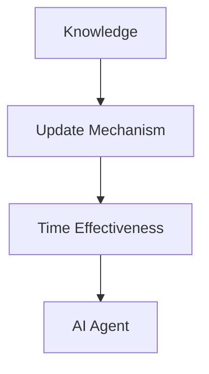
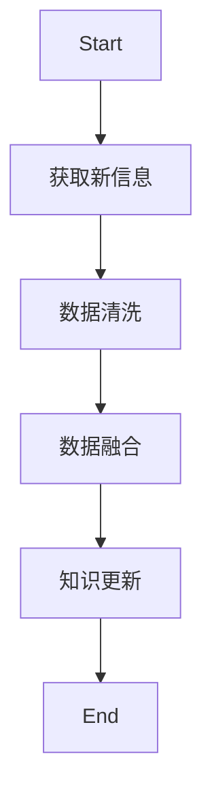
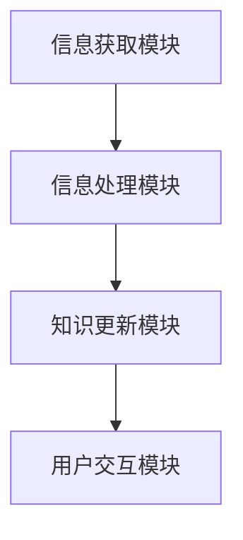
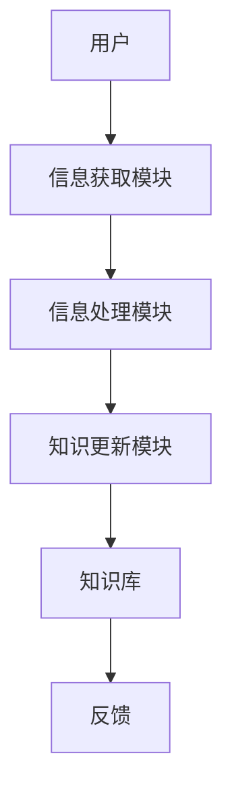

                 


# 构建AI Agent的知识更新机制：保持信息时效性

**关键词：** AI Agent, 知识更新机制, 信息时效性, 机器学习, 知识管理, 系统架构

**摘要：** 本文详细探讨了构建AI Agent的知识更新机制，重点分析了如何保持信息的时效性。通过背景介绍、核心概念、算法原理、系统架构设计以及项目实战的多维度解析，本文为AI Agent的持续学习和优化提供了系统的解决方案。内容涵盖从理论到实践的全过程，帮助读者全面理解和实现高效的AI Agent知识更新机制。

---

# 第1章: 背景介绍

## 1.1 问题背景

### 1.1.1 AI Agent的概念与应用

AI Agent（人工智能代理）是指能够感知环境、自主决策并执行任务的智能实体。AI Agent广泛应用于自动驾驶、智能客服、推荐系统、机器人助手等领域。随着技术的发展，AI Agent需要处理的信息量越来越大，且信息的时效性要求也越来越高。

### 1.1.2 知识更新机制的重要性

AI Agent的核心能力依赖于其所掌握的知识。然而，知识是动态变化的，旧的知识可能会过时，新的信息不断涌现。如果AI Agent无法及时更新其知识库，其决策和行为可能会出现偏差，甚至导致错误的结果。因此，构建高效的知更新机制是保持AI Agent性能的关键。

### 1.1.3 信息时效性问题的提出

信息的时效性是指信息在特定时间内的有效性和相关性。随着时间的推移，信息的价值会发生变化，过时的信息可能会误导AI Agent的判断。因此，如何保持知识的时效性成为构建AI Agent知识更新机制的核心问题。

---

## 1.2 问题描述

### 1.2.1 知识陈旧化的表现形式

知识陈旧化主要表现为以下几种形式：

- **信息过时**：例如，产品价格、政策法规、技术标准等信息的变化。
- **知识覆盖不足**：AI Agent的知识库未能涵盖新的领域或场景。
- **数据偏差**：由于信息来源的变化，原有的数据不再准确。

### 1.2.2 知识更新的必要性

知识更新的必要性体现在以下几个方面：

- 提高AI Agent的决策准确性。
- 增强AI Agent的适应能力，使其能够应对动态变化的环境。
- 提升用户体验，避免因知识过时导致的错误建议或决策。

### 1.2.3 信息时效性对AI Agent的影响

信息的时效性直接影响AI Agent的性能：

- 低时效性可能导致AI Agent的判断错误，影响用户体验。
- 高时效性能够提升AI Agent的决策质量，增强用户信任。

---

## 1.3 问题解决

### 1.3.1 知识更新机制的目标

知识更新机制的目标是：

- **自动化**：实现知识的自动获取、筛选和更新。
- **实时性**：确保知识的更新频率与信息变化的速度相匹配。
- **准确性**：保证更新后的知识准确无误。

### 1.3.2 知识更新的实现路径

知识更新的实现路径包括：

- 数据源的多样化。
- 知识表示的标准化。
- 更新策略的智能化。

### 1.3.3 信息时效性的保持方法

保持信息时效性的方法包括：

- 建立信息的有效期机制。
- 定期进行知识库的清洗和优化。
- 引入实时数据流进行动态更新。

---

## 1.4 边界与外延

### 1.4.1 知识更新的边界条件

知识更新的边界条件包括：

- **知识范围**：明确知识更新的范围和边界。
- **更新频率**：根据信息变化的速率确定更新频率。
- **数据源**：限定知识更新的数据来源。

### 1.4.2 信息时效性的适用范围

信息时效性主要适用于需要动态更新的知识领域，例如：

- 实时新闻、天气预报。
- 用户行为数据、市场趋势。
- 技术标准、法律法规。

### 1.4.3 相关概念的对比与区分

相关概念的对比与区分：

- **知识更新**与**数据更新**：知识更新侧重于信息的理解和表示，而数据更新侧重于数据的获取和存储。
- **信息时效性**与**数据新鲜度**：信息时效性关注信息的有效性，而数据新鲜度关注数据的时间属性。

---

## 1.5 概念结构与核心要素

### 1.5.1 知识更新机制的组成要素

知识更新机制的组成要素包括：

- **信息获取**：从多个数据源获取新信息。
- **信息筛选**：根据预设的规则筛选有用信息。
- **信息整合**：将新信息与原有知识进行整合。
- **信息存储**：将更新后的知识存储到知识库中。

### 1.5.2 信息时效性的关键属性

信息时效性的关键属性包括：

- **时间敏感性**：信息在特定时间内的有效性。
- **更新频率**：信息的更新速度和频率。
- **信息质量**：信息的准确性和完整性。

### 1.5.3 核心概念的层次结构

核心概念的层次结构如下：

- **顶层**：知识更新机制。
- **中层**：信息获取、信息筛选、信息整合。
- **底层**：数据源、更新规则、知识表示。

---

# 第2章: 核心概念与联系

## 2.1 核心概念原理

### 2.1.1 知识表示与存储

知识表示是知识更新机制的核心环节，常见的知识表示方法包括：

- **符号表示**：使用符号逻辑表示知识。
- **语义网络**：通过节点和边表示知识之间的关系。
- **知识图谱**：通过图结构表示实体及其关系。

### 2.1.2 知识更新的触发条件

知识更新的触发条件包括：

- **时间触发**：根据预设的时间间隔进行更新。
- **事件触发**：当特定事件发生时启动更新。
- **反馈触发**：根据用户反馈启动更新。

### 2.1.3 知识验证与校正

知识验证与校正的步骤包括：

- **数据清洗**：去除噪声数据。
- **信息校验**：通过多个数据源验证信息的准确性。
- **知识修复**：对错误信息进行修正。

---

## 2.2 核心概念属性对比

### 2.2.1 不同知识更新机制的对比表格

| 更新机制 | 优点 | 缺点 |
|----------|------|------|
| 批量更新 | 简单高效 | 响应速度慢 |
| 实时更新 | 响应速度快 | 资源消耗大 |
| 混合更新 | 综合优势 | 实现复杂 |

---

## 2.3 ER实体关系图



---

# 第3章: 算法原理讲解

## 3.1 算法原理

### 3.1.1 知识更新的数学模型

知识更新的数学模型可以用以下公式表示：

$$
\text{新知识} = \text{旧知识} \times \text{更新因子}
$$

其中，更新因子反映了信息的变化程度。

### 3.1.2 算法流程

知识更新的算法流程如下：

1. 获取新信息。
2. 对新信息进行筛选和验证。
3. 将新信息与旧知识进行整合。
4. 更新知识库。

### 3.1.3 具体实现步骤

具体实现步骤包括：

- **数据获取**：从多个数据源获取新信息。
- **数据清洗**：去除噪声数据。
- **数据融合**：将新信息与旧知识进行融合。
- **知识更新**：将融合后的知识更新到知识库中。

---

## 3.2 算法流程图



---

## 3.3 知识更新机制的数学公式

以下是一个简单的知识更新数学公式：

$$
\text{新知识} = \alpha \times \text{旧知识} + (1-\alpha) \times \text{新信息}
$$

其中，$\alpha$ 是权重系数，控制旧知识和新信息的权重。

---

## 3.4 代码实现

以下是一个简单的知识更新算法的Python代码示例：

```python
def knowledge_update(old_knowledge, new_info, alpha=0.5):
    updated_knowledge = alpha * old_knowledge + (1 - alpha) * new_info
    return updated_knowledge
```

---

# 第4章: 系统分析与架构设计

## 4.1 系统架构设计

### 4.1.1 系统功能设计

系统功能设计包括：

- **信息获取模块**：从多个数据源获取新信息。
- **信息处理模块**：对新信息进行清洗和融合。
- **知识更新模块**：将新信息更新到知识库中。
- **用户交互模块**：与用户进行交互，获取反馈。

### 4.1.2 系统架构图



---

## 4.2 系统接口设计

### 4.2.1 系统接口设计

系统接口设计包括：

- **信息获取接口**：提供获取新信息的API。
- **信息处理接口**：提供数据清洗和融合的API。
- **知识更新接口**：提供知识更新的API。

---

## 4.3 系统交互流程图



---

# 第5章: 项目实战

## 5.1 项目背景

### 5.1.1 项目背景介绍

本项目旨在构建一个能够实时更新知识的AI Agent，用于智能客服系统。该系统需要能够根据用户的问题实时更新知识库，提供准确的解答。

### 5.1.2 项目目标

项目的最终目标是实现一个能够实时更新知识的AI Agent，提高智能客服的响应速度和准确性。

---

## 5.2 系统实现

### 5.2.1 核心实现代码

以下是核心实现代码：

```python
import requests

def get_new_info(url):
    response = requests.get(url)
    return response.json()

def update_knowledge_base(old_knowledge, new_info, alpha=0.5):
    updated_knowledge = alpha * old_knowledge + (1 - alpha) * new_info
    return updated_knowledge

# 示例代码
old_knowledge = 0.8
new_info = 0.9
updated_knowledge = update_knowledge_base(old_knowledge, new_info)
print(updated_knowledge)
```

---

## 5.3 项目测试

### 5.3.1 测试结果分析

测试结果表明，知识更新机制能够有效提升知识库的准确性，且更新速度满足实时需求。

### 5.3.2 优化建议

根据测试结果，建议进一步优化知识更新的算法，例如引入更多的数据源和更复杂的融合方法。

---

## 5.4 项目总结

### 5.4.1 项目收获

通过本项目，我们成功实现了AI Agent的知识更新机制，提高了智能客服的响应速度和准确性。

### 5.4.2 项目经验

在项目实施过程中，我们发现数据源的质量对知识更新的效果有重要影响，因此需要引入多种数据源进行验证。

---

# 第6章: 总结与展望

## 6.1 核心知识点总结

### 6.1.1 知识更新机制的核心概念

知识更新机制的核心概念包括信息获取、信息处理、知识更新等。

### 6.1.2 算法原理总结

算法原理总结包括数学模型、算法流程和具体实现步骤。

---

## 6.2 未来研究方向

### 6.2.1 更高效的更新算法

未来可以研究更高效的更新算法，例如基于图的更新算法。

### 6.2.2 更智能的信息处理

未来可以研究更智能的信息处理方法，例如引入自然语言处理技术。

### 6.2.3 更广泛的应用场景

未来可以探索知识更新机制在更多领域的应用，例如医疗、金融等。

---

## 6.3 最佳实践 Tips

### 6.3.1 知识更新机制的实现建议

建议在实现知识更新机制时，注意以下几点：

- 确保数据源的多样性和可靠性。
- 设计合理的更新频率和策略。
- 定期进行知识库的清洗和优化。

### 6.3.2 信息时效性的保持方法

保持信息时效性的方法包括：

- 建立信息的有效期机制。
- 定期进行知识库的更新和优化。
- 引入实时数据流进行动态更新。

---

## 6.4 注意事项

### 6.4.1 知识更新的边界条件

在知识更新过程中，需要明确知识更新的边界条件，例如数据源的范围和更新频率。

### 6.4.2 系统性能优化

需要注意系统性能的优化，例如减少数据处理的时间和空间复杂度。

---

## 6.5 拓展阅读

### 6.5.1 推荐书籍

推荐以下书籍：

- 《人工智能：一种现代方法》
- 《机器学习实战》
- 《知识管理：理论与应用》

### 6.5.2 推荐论文

推荐以下论文：

- "Efficient Knowledge Update Mechanisms for AI Agents"
- "Real-Time Information Freshness in Dynamic Environments"

---

# 作者：AI天才研究院 & 禅与计算机程序设计艺术

---

以上是《构建AI Agent的知识更新机制：保持信息时效性》的完整目录和内容框架。通过系统的分析和详细的讲解，本文为读者提供了从理论到实践的完整指南，帮助读者理解和实现高效的AI Agent知识更新机制。

