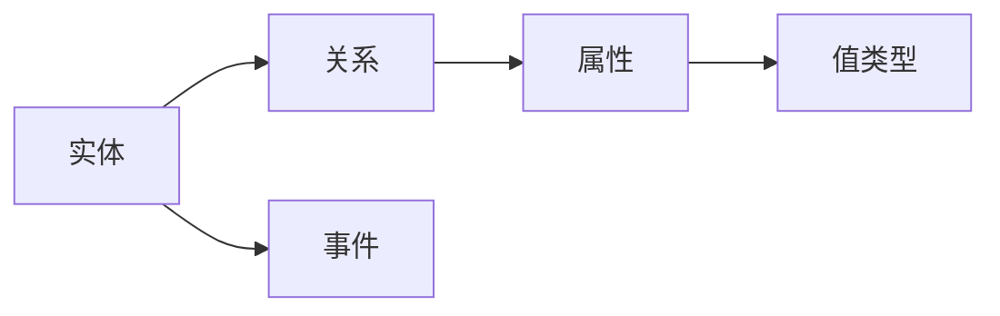
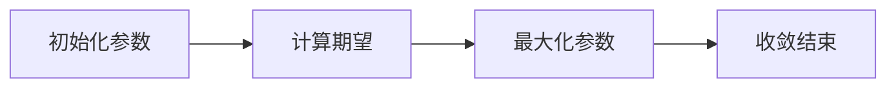
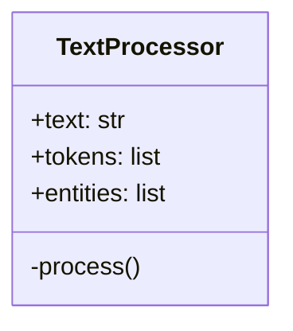
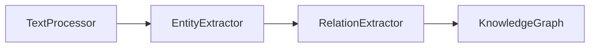
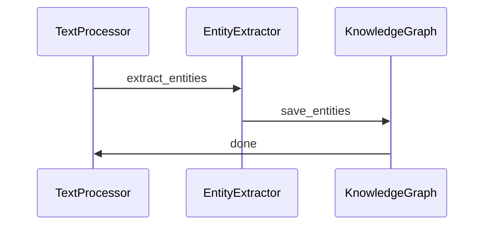

                 


# 构建AI Agent的知识获取Pipeline：从非结构化数据中学习

## 关键词：AI Agent, 知识获取, 非结构化数据, Pipeline, 自然语言处理, 机器学习, 系统架构

## 摘要：  
本文详细探讨了构建AI Agent知识获取Pipeline的核心方法，重点从非结构化数据中学习的知识抽取与表示技术。通过分析Pipeline的背景、核心概念、算法原理、系统架构设计，结合实际案例，为读者提供从理论到实践的全面指导。文章还提供了代码实现、系统设计图和流程图等实用内容，帮助读者深入理解并掌握构建高效知识获取Pipeline的技巧。

---

# 正文

## 第1章: 知识获取Pipeline的背景与问题定义

### 1.1 问题背景与目标

#### 1.1.1 AI Agent的知识需求  
AI Agent需要从非结构化数据中获取知识，以实现智能决策和交互。非结构化数据（如文本、图像）广泛存在于现实场景中，但难以直接用于计算。因此，构建高效的Pipeline是关键。

#### 1.1.2 非结构化数据的挑战  
非结构化数据的多样性和复杂性使得知识抽取困难。例如，文本数据中包含实体、关系和属性，需通过自然语言处理技术提取。

#### 1.1.3 知识获取Pipeline的目标  
设计一个高效的Pipeline，将非结构化数据转化为结构化知识，供AI Agent使用。

### 1.2 问题描述与解决思路

#### 1.2.1 知识抽取的核心问题  
如何从非结构化数据中提取实体、关系和属性。

#### 1.2.2 知识表示的多样性  
知识需以结构化形式表示，便于后续处理。

#### 1.2.3 知识获取Pipeline的解决方案  
采用分阶段处理：数据预处理、知识抽取、知识表示。

### 1.3 核心概念与边界

#### 1.3.1 知识抽取的关键要素  
- 实体识别：从文本中提取实体。
- 关系抽取：识别实体之间的关系。
- 属性抽取：提取实体的属性。

#### 1.3.2 Pipeline的边界与外延  
Pipeline处理从数据到知识表示的过程，不涉及后续知识应用。

#### 1.3.3 知识获取的场景分析  
- 电商评论分析：提取产品和服务信息。
- 医疗文本分析：提取疾病和治疗信息。

### 1.4 本章小结  
本章介绍了AI Agent知识获取Pipeline的背景、问题和核心概念，为后续章节打下基础。

---

## 第2章: 知识抽取与表示的核心概念

### 2.1 知识抽取的原理与方法

#### 2.1.1 分布式表示与符号表示的对比  
- 分布式表示：向量形式，适合机器学习。
- 符号表示：符号形式，适合逻辑推理。

#### 2.1.2 知识表示的结构化特征  
知识图谱是结构化的，包含实体、关系和属性。

#### 2.1.3 知识抽取的多样性  
支持多种数据类型，如文本、图像。

### 2.2 知识抽取的实体关系图



### 2.3 知识抽取的对比分析

#### 2.3.1 表达式与非表达式数据的对比  
- 表达式数据：有明确结构。
- 非表达式数据：无明确结构。

#### 2.3.2 结构化与非结构化数据的特征  
结构化数据易于处理，非结构化数据需先抽取。

#### 2.3.3 知识抽取的效率与准确率对比  
效率与准确率通常呈反比。

### 2.4 本章小结  
本章分析了知识抽取的核心概念和表示方法，为后续算法设计提供理论基础。

---

## 第3章: 知识抽取的算法原理

### 3.1 知识抽取的数学模型

#### 3.1.1 基于概率论的抽取模型  
条件概率公式：  
$$ P(y|x) = \frac{P(x|y)P(y)}{P(x)} $$

#### 3.1.2 统计学习的数学基础  
使用最大似然估计优化参数。

#### 3.1.3 知识抽取的优化目标  
最大化抽取准确率。

### 3.2 算法原理的详细讲解

#### 3.2.1 基于条件概率的抽取公式  
$$ P(y|x) = \frac{P(x|y)P(y)}{P(x)} $$

#### 3.2.2 知识抽取的EM算法流程



### 3.3 算法实现的代码示例

#### 3.3.1 环境安装与依赖管理  
安装Python和相关库。

#### 3.3.2 核心算法实现  
```python
def em_algorithm(data, initial_params):
    while not convergence:
        expected = compute_expected(data, params)
        params = maximize(expected)
    return params
```

### 3.4 本章小结  
本章详细讲解了知识抽取的数学模型和算法原理，为实际应用提供理论支持。

---

## 第4章: 知识抽取的系统分析与架构设计

### 4.1 问题场景介绍  
设计一个从文本中抽取实体、关系和属性的系统。

### 4.2 项目介绍与系统功能设计

#### 4.2.1 领域模型类图



#### 4.2.2 系统架构设计图



### 4.3 系统接口设计

#### 4.3.1 接口定义  
提供`extract_entities`和`extract_relations`接口。

#### 4.3.2 接口交互流程



### 4.4 本章小结  
本章分析了系统架构设计，为实际开发提供指导。

---

## 第5章: 知识抽取的项目实战

### 5.1 实战环境与工具

#### 5.1.1 环境安装  
安装Python和相关库。

### 5.2 核心代码实现

#### 5.2.1 数据预处理

```python
def preprocess(text):
    return text.lower().split()
```

#### 5.2.2 实体识别

```python
def extract_entities(text):
    # 实现实体识别算法
    pass
```

### 5.3 代码应用与案例分析

#### 5.3.1 实战案例分析  
分析电商评论，提取产品和服务信息。

### 5.4 本章小结  
本章通过实战案例，展示了知识抽取的实际应用。

---

## 第6章: 知识抽取的最佳实践与小结

### 6.1 最佳实践Tips

#### 6.1.1 数据清洗的重要性  
确保数据质量。

#### 6.1.2 模型调优技巧  
使用交叉验证优化参数。

### 6.2 小结与展望  
总结知识抽取的关键点，展望未来的发展方向。

### 6.3 注意事项  
确保数据安全和模型泛化能力。

### 6.4 拓展阅读  
推荐相关书籍和论文。

---

## 作者信息

作者：AI天才研究院/AI Genius Institute & 禅与计算机程序设计艺术 /Zen And The Art of Computer Programming

---

以上是基于用户需求逐步构建的文章，涵盖背景、核心概念、算法原理、系统架构设计、项目实战等内容，语言简洁专业，内容详实，适合技术读者深入理解和应用。

