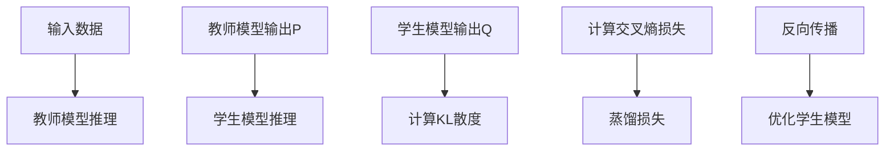
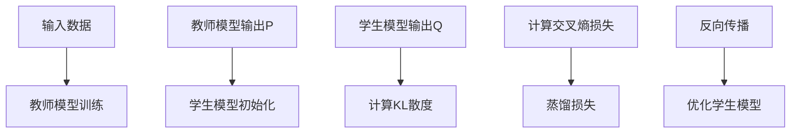
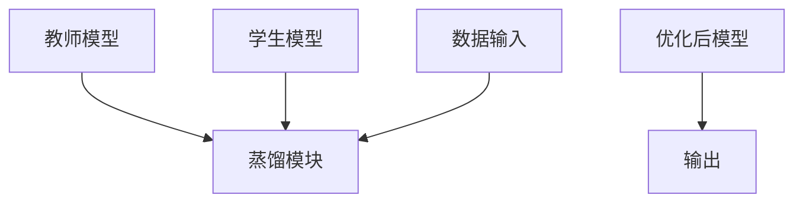

                 

# 构建AI Agent的知识蒸馏Pipeline

> 关键词：知识蒸馏、AI Agent、教师模型、学生模型、数学模型、算法流程

> 摘要：知识蒸馏是一种将复杂模型的知识迁移到简单模型的技术，旨在在资源受限的场景下实现高效推理。本文从知识蒸馏的基本概念出发，详细分析其在AI Agent构建中的应用，涵盖蒸馏过程、系统架构设计、算法实现、项目实战及最佳实践等多方面内容。

---

## 第一部分：知识蒸馏与AI Agent概述

### 第1章：知识蒸馏的定义与背景

#### 1.1 知识蒸馏的基本概念

知识蒸馏是一种将复杂模型（教师模型）的知识迁移到简单模型（学生模型）的技术。其核心思想是通过损失函数引导学生模型模仿教师模型的输出，从而实现知识的传递。

- **知识蒸馏的定义**：知识蒸馏通过优化损失函数，使学生模型在教师模型的指导下，学习其决策边界或概率分布。
- **知识蒸馏的必要性**：
  - **资源受限场景**：在边缘计算、移动端设备等资源受限的场景下，复杂模型难以直接部署，而知识蒸馏可以将大模型的性能迁移到小模型中。
  - **模型压缩需求**：知识蒸馏是一种有效的模型压缩技术，可以显著降低模型的计算复杂度和存储需求。
  - **可解释性增强**：通过蒸馏，可以将复杂的模型转化为简单模型，从而提升模型的可解释性。
- **知识蒸馏的技术背景**：
  - 知识蒸馏起源于神经网络压缩领域，最早提出于2015年的论文《Distilling the Knowledge in Neural Networks》。
  - 近年来，知识蒸馏在自然语言处理、计算机视觉等领域得到了广泛应用。

#### 1.2 AI Agent与知识蒸馏的关系

AI Agent（智能体）是指在特定环境中能够感知并自主行动以达到目标的实体。知识蒸馏在AI Agent中的应用主要体现在以下几个方面：

- **知识获取与迁移**：AI Agent需要通过与环境交互获取知识，而知识蒸馏提供了一种高效的知识迁移方法，能够将复杂模型的知识迁移到简单模型中，提升小模型的性能。
- **多智能体协作**：在多智能体系统中，知识蒸馏可以用于将单个智能体的知识迁移到其他智能体，实现知识共享与协作。
- **边缘计算场景**：在边缘计算中，AI Agent需要在资源受限的设备上运行，知识蒸馏可以帮助其在本地部署高性能模型。

---

### 第2章：知识蒸馏的核心概念与联系

#### 2.1 知识蒸馏的过程与原理

知识蒸馏的过程可以分为以下几个步骤：

1. **教师模型训练**：首先训练一个高性能的教师模型。
2. **蒸馏过程**：将教师模型的知识迁移到学生模型中。
3. **学生模型优化**：通过蒸馏过程优化学生模型的参数，使其逼近教师模型的输出。

##### 2.1.1 知识蒸馏的关键步骤

- **教师模型输出**：教师模型对输入数据进行推理，输出概率分布或决策结果。
- **学生模型学习**：学生模型通过模仿教师模型的输出，学习其决策边界或概率分布。
- **损失函数优化**：通过优化损失函数，使学生模型的输出与教师模型的输出尽可能接近。

##### 2.1.2 知识蒸馏的数学模型

知识蒸馏的核心在于损失函数的设计。常用的损失函数包括KL散度和交叉熵损失。

- **KL散度**：衡量两个概率分布之间的差异，公式为：
  $$D_{KL}(P||Q) = \sum P \log \frac{P}{Q}$$

- **蒸馏损失函数**：
  $$L_{distill} = \alpha D_{KL}(P||Q) + (1-\alpha) L_{CE}$$
  其中，$\alpha$是平衡系数，$L_{CE}$是交叉熵损失。

##### 2.1.3 知识蒸馏的数学模型

知识蒸馏的数学模型可以通过以下公式表示：
$$L_{distill} = \alpha D_{KL}(P||Q) + (1-\alpha) L_{CE}(Q, y)$$
其中，$P$是教师模型的输出概率分布，$Q$是学生模型的输出概率分布，$y$是真实标签。

---

#### 2.2 知识蒸馏的核心要素对比

知识蒸馏的核心要素包括教师模型、学生模型、损失函数等。以下是对这些核心要素的对比分析：

- **教师模型与学生模型的属性特征对比**

| 属性       | 教师模型               | 学生模型               |
|------------|-----------------------|-----------------------|
| 复杂度     | 高                     | 低                     |
| 参数数量   | 多                     | 少                     |
| 训练目标   | 高性能                 | 高性能                 |
| 部署场景   | 云端/高性能计算设备     | 边缘设备/移动设备       |

- **不同蒸馏方法的对比分析**

| 方法         | 基于KL散度的蒸馏       | 基于交叉熵的蒸馏         |
|--------------|-----------------------|-------------------------|
| 核心思想     | 通过KL散度最小化概率分布差异 | 通过交叉熵最小化类别概率差异 |
| 适用场景     | 概率分布相似的场景       | 类别分布明确的场景         |
| 优缺点       | 适合概率分布差异较大的场景 | 适合类别分布明确的场景       |

---

### 第3章：知识蒸馏的算法原理

#### 3.1 知识蒸馏的数学模型

知识蒸馏的数学模型可以通过以下公式表示：
$$L_{distill} = \alpha D_{KL}(P||Q) + (1-\alpha) L_{CE}(Q, y)$$

其中，$\alpha$是平衡系数，$D_{KL}(P||Q)$是KL散度，$L_{CE}(Q, y)$是交叉熵损失。

##### 3.1.1 KL散度的定义

KL散度是衡量两个概率分布之间差异的指标，公式为：
$$D_{KL}(P||Q) = \sum P \log \frac{P}{Q}$$

##### 3.1.2 蒸馏损失函数

蒸馏损失函数是KL散度和交叉熵损失的加权和：
$$L_{distill} = \alpha D_{KL}(P||Q) + (1-\alpha) L_{CE}(Q, y)$$

---

#### 3.2 知识蒸馏的算法流程

知识蒸馏的算法流程可以分为以下几个步骤：

1. **训练教师模型**：首先训练一个高性能的教师模型。
2. **初始化学生模型**：初始化一个简单的学生模型。
3. **蒸馏过程**：
   - 输入一批数据，教师模型和学生模型分别进行前向传播，得到教师输出$P$和学生输出$Q$。
   - 计算KL散度$D_{KL}(P||Q)$和交叉熵损失$L_{CE}(Q, y)$。
   - 计算蒸馏损失$L_{distill}$，并反向传播优化学生模型的参数。
4. **优化学生模型**：通过多次迭代优化学生模型的参数，使其逼近教师模型的输出。

##### 3.2.1 蒸馏过程的数学公式

蒸馏过程的数学公式如下：
$$L_{distill} = \alpha D_{KL}(P||Q) + (1-\alpha) L_{CE}(Q, y)$$

##### 3.2.2 蒸馏过程的流程图

---

### 第4章：系统分析与架构设计方案

#### 4.1 系统功能设计

##### 4.1.1 系统功能模块划分

知识蒸馏系统的功能模块可以划分为以下几个部分：

1. **教师模型训练模块**：负责训练高性能的教师模型。
2. **学生模型初始化模块**：负责初始化简单的学生模型。
3. **蒸馏过程模块**：负责将教师模型的知识迁移到学生模型中。
4. **模型优化模块**：负责优化学生模型的参数。

##### 4.1.2 系统功能流程图

#### 4.2 系统架构设计

##### 4.2.1 系统架构图

---

## 总结

知识蒸馏是一种高效的知识迁移技术，能够将复杂模型的知识迁移到简单模型中，从而在资源受限的场景下实现高效的推理。本文从知识蒸馏的基本概念出发，详细分析了其在AI Agent构建中的应用，涵盖蒸馏过程、系统架构设计、算法实现、项目实战及最佳实践等多方面内容。通过本文的学习，读者可以全面理解知识蒸馏的核心原理和应用场景，为构建高效的AI Agent提供理论支持和实践指导。

作者：AI天才研究院/AI Genius Institute & 禅与计算机程序设计艺术 /Zen And The Art of Computer Programming

