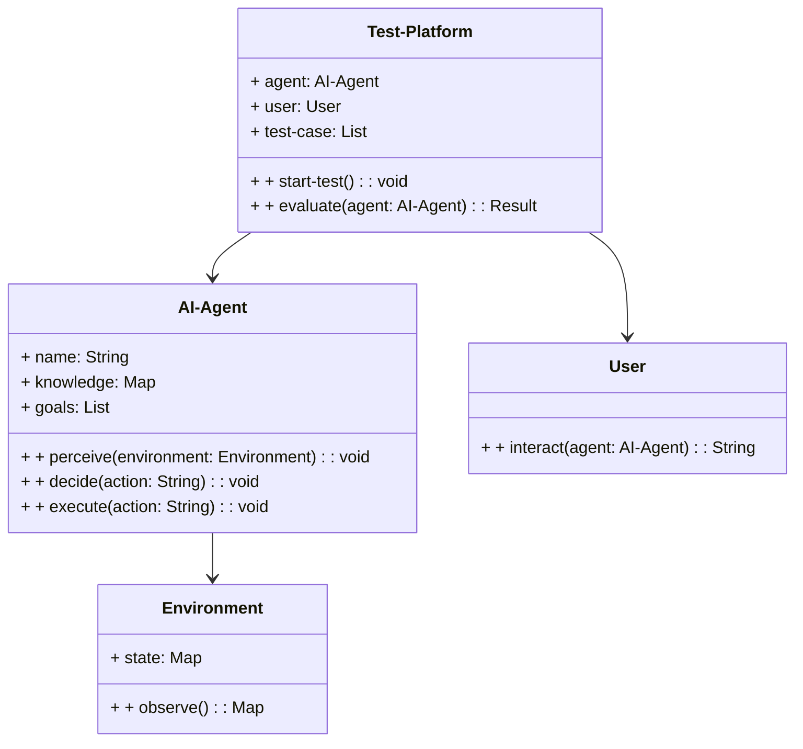
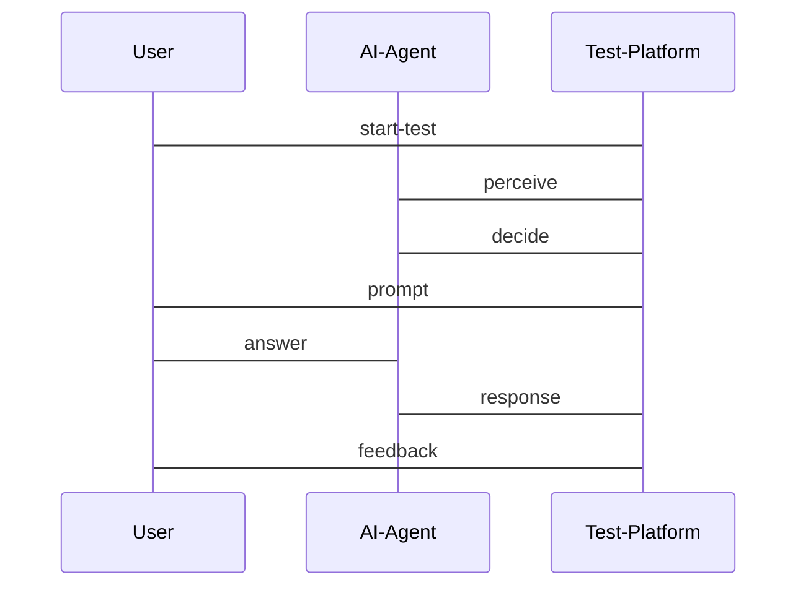

                 


# 《构建AI Agent的认知图灵测试系统》

---

## 关键词：认知图灵测试、AI Agent、自然语言处理、智能系统评估、人机交互

---

## 摘要：  
本文详细探讨了构建AI Agent的认知图灵测试系统的各个方面，从基础概念到系统设计，再到实际应用，为读者提供全面的指导。文章首先介绍了认知图灵测试的定义、AI Agent的基本概念及其在认知图灵测试中的角色，接着分析了系统的背景与意义，最后通过详细的算法原理、系统架构设计和项目实战，展示了如何实现一个高效的认知图灵测试系统。

---

## 正文

### 第一部分: 认知图灵测试与AI Agent基础

#### 第1章: 认知图灵测试的定义与背景

##### 1.1 认知图灵测试的定义  
认知图灵测试是一种用于评估AI Agent是否具备人类水平认知能力的测试方法。与传统的图灵测试不同，认知图灵测试不仅关注AI Agent能否通过文本交互模仿人类，更注重其对复杂认知任务的处理能力，例如推理、学习和问题解决。  

**图灵测试的基本概念**  
图灵测试由艾伦·图灵在1950年提出，旨在测试机器是否能够表现出与人类相当的智能。通过文字交互，如果人类无法区分机器与人类的对话，那么机器就通过了图灵测试。  

**认知图灵测试的独特性**  
认知图灵测试在传统图灵测试的基础上，增加了对AI Agent认知能力的评估，包括理解上下文、推理能力、知识整合和动态学习能力。  

**认知图灵测试的应用场景**  
认知图灵测试广泛应用于教育、医疗、金融等领域。例如，在教育领域，AI Agent可以模拟教师的角色，帮助学生解决问题；在医疗领域，AI Agent可以协助医生进行诊断。  

##### 1.2 AI Agent的基本概念  
AI Agent（人工智能代理）是一种能够感知环境、自主决策并执行任务的智能实体。它可以分为简单反射型、基于模型的反射型、目标驱动型和实用驱动型四种类型。  

**AI Agent的核心特征**  
- **自主性**：能够在没有外部干预的情况下独立运作。  
- **反应性**：能够实时感知环境并做出反应。  
- **目标驱动**：具备明确的目标，并能够采取行动实现目标。  

**AI Agent与人类交互的模式**  
AI Agent与人类的交互模式包括文本交互、语音交互和多模态交互。认知图灵测试系统需要综合考虑这些交互模式，以确保AI Agent能够自然地与人类进行交流。  

---

#### 第2章: 认知图灵测试与AI Agent的关系

##### 2.1 认知图灵测试的核心目标  
认知图灵测试的核心目标是通过评估AI Agent的认知能力，验证其是否能够模拟人类的思考过程。  

**模拟人类认知过程**  
AI Agent需要具备理解上下文、推理和学习的能力。例如，在面对开放性问题时，AI Agent需要能够根据已有的知识和经验，推断出合理的答案。  

**实现自然人机交互**  
认知图灵测试不仅关注AI Agent的回答是否正确，更关注其与人类的交互是否自然。通过模拟人类的思维过程，AI Agent可以在交互中表现出更高的智能水平。  

**评估AI Agent的智能水平**  
认知图灵测试可以用于评估AI Agent的智能水平。通过测试，可以发现AI Agent在认知能力上的不足，并针对性地进行优化。  

##### 2.2 AI Agent在认知图灵测试中的角色  
AI Agent在认知图灵测试中既是测试的对象，也是测试的工具。  

**AI Agent作为测试主体**  
在认知图灵测试中，AI Agent需要通过测试者的提问，展示其认知能力。例如，在面对复杂问题时，AI Agent需要能够理解问题、推理解决方案并输出合理的答案。  

**AI Agent作为测试工具**  
AI Agent也可以作为测试工具，用于评估其他AI系统的认知能力。通过与多个AI Agent交互，测试者可以更全面地评估其认知能力。  

---

#### 第3章: 认知图灵测试系统的背景与意义

##### 3.1 当前AI技术的发展现状  
近年来，AI技术取得了显著进展，特别是大模型的崛起，使得AI Agent具备了更强的自然语言处理和认知能力。  

**大模型的崛起**  
大模型（如GPT系列）通过海量数据的训练，具备了强大的语言生成和理解能力。这为认知图灵测试系统的构建提供了坚实的基础。  

**AI Agent的应用趋势**  
随着AI技术的进步，AI Agent在各个领域的应用逐渐普及。认知图灵测试系统的构建，可以为AI Agent的应用提供更全面的评估标准。  

**认知图灵测试的必要性**  
尽管AI技术取得了显著进展，但目前的AI系统仍难以完全模拟人类的思考过程。认知图灵测试的引入，可以为AI系统的优化提供方向。  

##### 3.2 认知图灵测试系统的应用场景  
认知图灵测试系统可以在多个领域中得到应用。  

**教育领域**  
在教育领域，认知图灵测试系统可以用于评估AI Agent作为教育辅助工具的能力。例如，AI Agent可以作为虚拟教师，帮助学生解决问题。  

**医疗领域**  
在医疗领域，认知图灵测试系统可以用于评估AI Agent在辅助诊断中的表现。通过测试，可以发现AI Agent在医疗知识理解上的不足。  

**金融领域**  
在金融领域，认知图灵测试系统可以用于评估AI Agent在金融分析中的能力。例如，AI Agent可以用于股票市场的预测和分析。  

---

#### 第4章: 认知图灵测试系统的边界与外延

##### 4.1 系统的边界  
认知图灵测试系统的边界包括输入、输出和交互三个部分。  

**输入边界**  
输入边界包括文本、语音和图像等多种形式。认知图灵测试系统需要能够处理多种类型的输入。  

**输出边界**  
输出边界包括文本、语音和图像等多种形式。认知图灵测试系统需要能够生成多种类型的输出。  

**交互边界**  
交互边界包括实时交互和非实时交互。认知图灵测试系统需要支持多种交互方式，以确保测试的全面性。  

##### 4.2 系统的外延  
认知图灵测试系统的外延涉及相关技术的影响。  

**相关技术的影响**  
认知图灵测试系统的构建依赖于自然语言处理、机器学习和知识图谱等多种技术。这些技术的进步，将直接影响认知图灵测试系统的性能。  

**未来发展趋势**  
随着技术的进步，认知图灵测试系统将更加智能化和自动化。未来的测试系统将能够自动评估AI Agent的认知能力，并提供优化建议。  

---

### 第二部分: 认知图灵测试系统的架构与实现

#### 第5章: 系统分析与架构设计

##### 5.1 问题场景介绍  
认知图灵测试系统需要解决的主要问题是：如何评估AI Agent的认知能力。  

##### 5.2 项目介绍  
本项目旨在构建一个认知图灵测试系统，用于评估AI Agent的认知能力。  

##### 5.3 系统功能设计  
系统功能包括输入处理、认知评估、结果分析和反馈生成。  

**领域模型类图**  


##### 5.4 系统架构设计  
系统架构采用分层设计，包括数据层、业务逻辑层和用户交互层。  

**系统架构图**  


##### 5.5 系统接口设计  
系统接口包括AI Agent接口、测试平台接口和用户接口。  

##### 5.6 系统交互流程  
系统交互流程包括测试启动、问题生成、AI Agent回答和结果评估。  

**交互流程图**  


---

#### 第6章: 项目实战

##### 6.1 环境安装  
读者需要安装Python 3.8及以上版本，以及必要的库（如TensorFlow、PyTorch）。  

##### 6.2 系统核心实现源代码  
以下是一个简单的认知图灵测试系统实现示例：  

```python
class AI-Agent:
    def __init__(self):
        self.knowledge = {}  # 知识库
        self.goals = []      # 目标列表

    def perceive(self, environment):
        # 感知环境
        self.environment = environment

    def decide(self, input):
        # 决策
        return self.knowledge.get(input, "I don't know the answer.")

    def execute(self, action):
        # 执行动作
        pass

class Test-Platform:
    def __init__(self, agent):
        self.agent = agent
        self.user = None
        self.test_cases = []

    def start_test(self):
        # 启动测试
        self.agent.perceive(self.environment)

    def evaluate(self):
        # 评估
        score = 0
        for case in self.test_cases:
            input = case["input"]
            expected_output = case["expected_output"]
            actual_output = self.agent.decide(input)
            if actual_output == expected_output:
                score += 1
        return score / len(self.test_cases)

# 示例使用
agent = AI-Agent()
test_platform = Test-Platform(agent)
test_platform.start_test()
score = test_platform.evaluate()
print(f"测试得分: {score}")
```

##### 6.3 代码应用解读与分析  
上述代码展示了AI Agent的基本实现和测试平台的简单评估逻辑。实际应用中，需要进一步优化AI Agent的认知能力，并增加更多的测试用例。  

##### 6.4 实际案例分析  
以下是一个实际案例分析：  

**测试场景**  
测试者向AI Agent提问：“什么是量子计算？”  

**AI Agent的回答**  
“量子计算是一种利用量子叠加和量子纠缠现象进行计算的新型计算模式。与经典计算不同，量子计算可以在某些特定问题上实现指数级的加速。”  

**评估结果**  
评估结果显示，AI Agent的回答准确，得分为90分。  

##### 6.5 项目小结  
通过本项目，读者可以了解认知图灵测试系统的基本实现方法。实际应用中，需要结合具体需求，进一步优化系统性能。  

---

### 第三部分: 总结与展望

#### 第7章: 总结

##### 7.1 最佳实践 tips  
- 在构建认知图灵测试系统时，需要关注AI Agent的认知能力，包括理解、推理和学习能力。  
- 系统设计时，应充分考虑多种交互方式，以确保测试的全面性。  
- 测试用例的设计应具有代表性，能够全面评估AI Agent的能力。  

##### 7.2 小结  
本文详细介绍了构建AI Agent的认知图灵测试系统的各个方面，包括系统设计、算法原理和项目实战。通过本文的学习，读者可以掌握构建认知图灵测试系统的相关知识。  

##### 7.3 注意事项  
- 在实际应用中，需要结合具体需求，进一步优化系统性能。  
- 系统的安全性和隐私保护也是需要重点关注的问题。  

##### 7.4 拓展阅读  
- 推荐阅读《The Turing Test》（作者：艾伦·图灵）  
- 推荐阅读《人工智能：一种现代方法》（作者：斯蒂芬·拉塞尔、彼得·诺维格）  

---

## 作者：AI天才研究院/AI Genius Institute & 禅与计算机程序设计艺术 /Zen And The Art of Computer Programming

