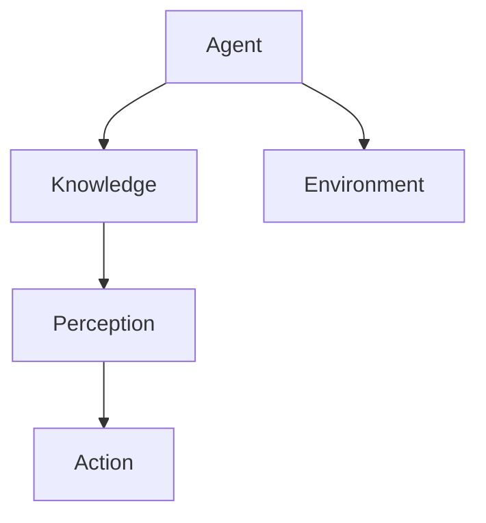
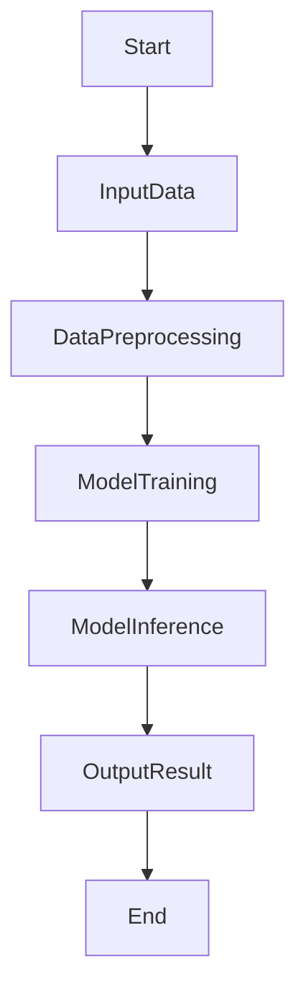
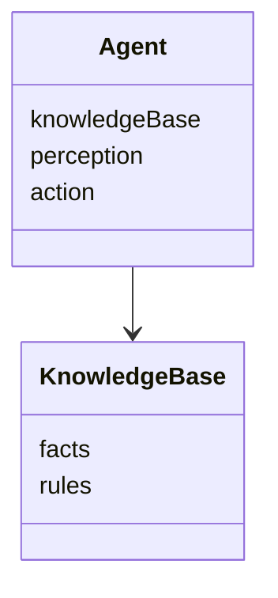
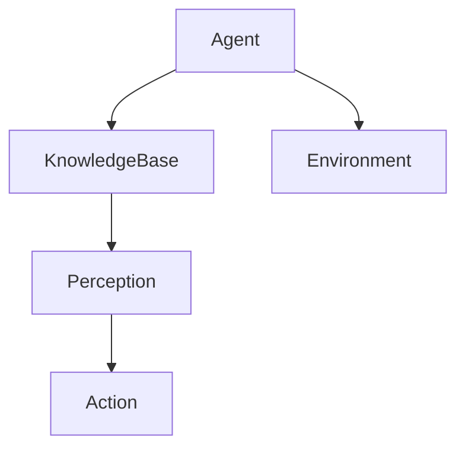

                 


# 构建AI Agent的认知架构设计

> 关键词：AI Agent, 认知架构, 知识表示, 认知推理, 行为决策, 系统架构设计

> 摘要：本文详细探讨了构建AI Agent的认知架构设计，从问题背景到系统实现，结合理论与实践，分析了认知架构的核心概念、算法原理、系统架构及项目实战。通过具体案例分析，本文为读者提供了一套完整的认知架构设计方案。

---

# 第一部分: 构建AI Agent的认知架构设计背景

## 第1章: AI Agent与认知架构概述

### 1.1 问题背景与目标
#### 1.1.1 AI Agent的基本概念
AI Agent（智能体）是能够感知环境、做出决策并执行行动的智能系统。它广泛应用于自动驾驶、智能助手、机器人等领域。认知架构是AI Agent的核心，负责处理信息、推理和决策。

#### 1.1.2 认知架构的核心目标
认知架构的目标是实现智能体的自主性、反应性和主动性。它需要处理复杂环境中的不确定性，实现高效的知识表示和推理。

#### 1.1.3 当前AI Agent的应用现状
当前，AI Agent在多个领域取得了显著进展，但仍然面临知识表示不足、推理复杂性和决策不确定性等问题。

### 1.2 问题描述与解决思路
#### 1.2.1 AI Agent面临的挑战
AI Agent需要在动态环境中实时处理信息，解决知识表示和推理的复杂性，同时应对不确定性。

#### 1.2.2 认知架构设计的关键问题
认知架构设计需要解决知识表示、推理机制、行为决策等问题。

#### 1.2.3 解决方案的初步思路
通过优化知识表示方法、改进推理算法和增强行为决策机制，提升AI Agent的认知能力。

### 1.3 问题解决与边界定义
#### 1.3.1 认知架构的边界与范围
认知架构关注信息处理、推理和决策，不涉及底层传感器和执行器。

#### 1.3.2 相关概念的对比分析
对比知识表示、推理和决策的概念，明确认知架构的核心要素。

#### 1.3.3 概念结构与核心要素
认知架构的核心要素包括知识库、推理引擎和决策模块。

---

# 第二部分: 认知架构的核心概念与联系

## 第2章: 认知架构的核心原理

### 2.1 核心概念原理
#### 2.1.1 知识表示的核心方法
知识表示方法包括语义网络、逻辑推理和概率模型。语义网络适合表示关系，逻辑推理适合处理规则，概率模型适合处理不确定性。

#### 2.1.2 认知推理的基本机制
认知推理通过逻辑推理和概率推理实现，逻辑推理基于规则，概率推理基于统计模型。

#### 2.1.3 行为决策的逻辑框架
行为决策基于推理结果，结合环境信息，选择最优行动方案。

### 2.2 概念属性特征对比
通过对比知识表示、推理和决策的概念属性，明确认知架构的设计方向。

### 2.3 ER实体关系图架构


---

# 第三部分: 算法原理与数学模型

## 第3章: 算法原理与流程

### 3.1 算法原理概述
#### 3.1.1 算法的基本流程
AI Agent的认知过程包括感知、推理、决策和执行。

#### 3.1.2 核心算法的实现步骤
包括知识表示、推理算法和决策算法的实现。

#### 3.1.3 算法的优化策略
通过优化知识表示和推理算法，提升计算效率。

### 3.2 算法流程图


### 3.3 数学模型与公式
#### 3.3.1 概率计算公式
$$
P(A|B) = \frac{P(B|A)P(A)}{P(B)}
$$

---

# 第四部分: 系统分析与架构设计方案

## 第4章: 系统架构设计

### 4.1 问题场景介绍
设计一个AI Agent，用于智能助手，处理用户的自然语言查询。

### 4.2 项目介绍
项目名称：智能助手AI Agent。

### 4.3 系统功能设计
#### 4.3.1 领域模型


#### 4.3.2 系统架构设计


---

## 第五章: 项目实战

### 5.1 环境安装
安装Python和必要的库。

### 5.2 系统核心实现源代码
```python
class Agent:
    def __init__(self):
        self.knowledge = KnowledgeBase()
        
    def perceive(self, input):
        # 处理输入
        pass
        
    def decide(self, input):
        # 决策逻辑
        pass
```

### 5.3 代码应用解读与分析
解读代码结构，分析实现细节。

### 5.4 案例分析与详细讲解
通过具体案例，详细分析认知架构的设计与实现。

---

## 第六章: 总结与附录

### 6.1 本章总结
总结认知架构设计的关键点。

### 6.2 最佳实践 tips
提供设计和实现的实用建议。

### 6.3 注意事项
提示开发中的常见问题和解决方案。

### 6.4 拓展阅读
推荐相关书籍和资源。

---

作者：AI天才研究院/AI Genius Institute & 禅与计算机程序设计艺术 /Zen And The Art of Computer Programming

