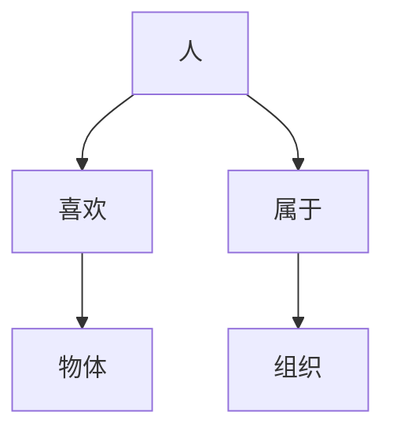
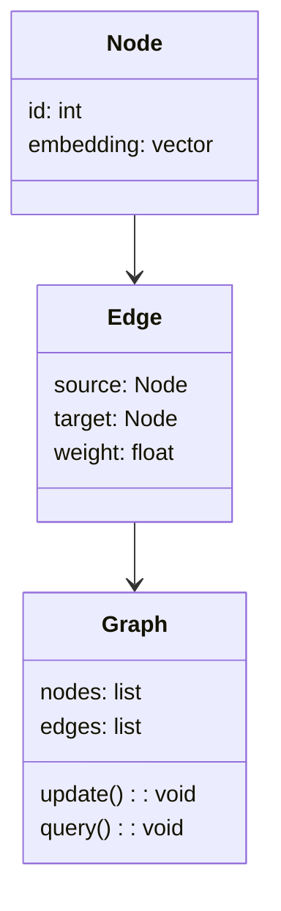
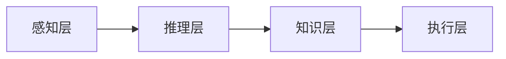
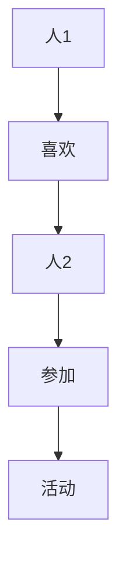

                 


# 构建AI Agent的认知计算图模型

> 关键词：认知计算图模型、AI Agent、图计算、算法原理、系统架构、项目实战

> 摘要：认知计算图模型是一种基于图计算的AI Agent构建方法，通过构建节点表示、边权重计算和图结构优化算法，结合系统架构设计与项目实战，实现高效的知识表示与推理能力。本文从背景、核心概念、算法原理、系统架构、项目实战和总结六个方面展开，详细讲解认知计算图模型的构建过程。

---

## 第一部分：认知计算图模型的背景与概念

### 第1章：认知计算图模型的背景与概念

#### 1.1 问题背景与问题描述
AI Agent（人工智能代理）旨在模拟人类的思维方式，通过感知环境、推理、决策和行动来完成特定任务。然而，传统的AI模型在处理复杂关系和动态信息时存在局限性，难以应对实时推理和多维度关联问题。认知计算图模型作为一种基于图计算的AI代理构建方法，能够有效解决这些问题。

#### 1.2 认知计算图模型的定义与特点
认知计算图模型是一种基于图结构的知识表示方法，通过节点表示和边权重计算，构建一个动态的知识网络。其特点包括：
- **动态性**：能够实时更新节点和边的权重，适应环境变化。
- **关联性**：通过图结构表示多维度关系，提升推理能力。
- **可解释性**：节点和边的权重具有明确的语义，便于理解和解释。

#### 1.3 认知计算图模型的边界与外延
认知计算图模型主要用于AI Agent的知识表示与推理，其边界包括：
- **输入边界**：感知环境输入的数据。
- **输出边界**：生成推理结果或决策。
- **外部依赖**：依赖于外部知识库或传感器数据。

#### 1.4 认知计算图模型的概念结构与核心要素
认知计算图模型的核心要素包括：
- **节点**：表示实体或概念。
- **边**：表示节点之间的关系或权重。
- **图结构**：整体表示知识网络。

---

## 第二部分：认知计算图模型的核心概念与联系

### 第2章：认知计算图模型的核心概念与联系

#### 2.1 核心概念原理
- **节点表示**：通过向量或嵌入表示节点的语义。
- **边权重**：表示节点之间的关系强度或概率。
- **图结构**：整体表示知识网络的拓扑结构。

#### 2.2 概念属性特征对比表格
以下是节点、边和图的属性对比：

| 属性 | 节点 | 边 | 图 |
|------|------|------|------|
| 类型 | 实体或概念 | 关系或权重 | 拓扑结构 |
| 示例 | "人"、"物体" | "喜欢"、"属于" | 无向图、有向图 |

#### 2.3 ER实体关系图架构
以下是实体关系图的Mermaid图示：



---

## 第三部分：认知计算图模型的算法原理

### 第3章：认知计算图模型的算法原理

#### 3.1 节点表示算法
节点表示是认知计算图模型的核心，常用Word2Vec或GraphSAGE算法。

##### Word2Vec公式：
$$
\text{score} = \sum_{i=1}^{n} w_i \cdot v_{i}
$$

##### GraphSAGE公式：
$$
h_i = \text{Aggregator}(\{h_j | j \in \text{neighbors}(i)\})
$$

#### 3.2 边权重计算算法
边权重计算用于表示节点之间的关系强度，常用余弦相似度或注意力机制。

##### 余弦相似度公式：
$$
\text{similarity}(u, v) = \frac{u \cdot v}{\|u\| \|v\|}
$$

##### 注意力机制公式：
$$
\alpha_i = \frac{\exp(s_i)}{\sum_{j} \exp(s_j)}
$$

#### 3.3 图结构优化算法
图结构优化用于提升模型的推理能力，常用Laplacian正则化或DropEdge方法。

##### Laplacian正则化公式：
$$
\mathcal{L} = \text{tr}(X^T L X)
$$

---

## 第四部分：系统分析与架构设计

### 第4章：系统分析与架构设计

#### 4.1 问题场景介绍
AI Agent需要在动态环境中实时推理和决策，认知计算图模型能够高效处理多维度关系。

#### 4.2 系统功能设计
以下是领域模型的Mermaid类图：



#### 4.3 系统架构设计
以下是系统架构的Mermaid图示：



---

## 第五部分：项目实战

### 第5章：认知计算图模型的项目实战

#### 5.1 环境安装
需要安装以下依赖：
```bash
pip install numpy networkx matplotlib
```

#### 5.2 核心实现
以下是节点表示和边权重计算的Python代码：

```python
import numpy as np
from networkx import Graph

def node_embedding(node_features):
    return np.random.rand(32)  # 32维嵌入

def edge_weight(node1, node2):
    return np.dot(node1.embedding, node2.embedding) / (np.linalg.norm(node1.embedding) * np.linalg.norm(node2.embedding))
```

#### 5.3 案例分析
通过一个简单的社交网络案例，展示认知计算图模型的应用：



---

## 第六部分：总结与扩展

### 第6章：认知计算图模型的总结与扩展

#### 6.1 最佳实践
- 数据预处理：确保数据质量和多样性。
- 参数调优：通过实验选择最优参数。
- 模型评估：使用准确率、召回率等指标评估性能。

#### 6.2 小结
认知计算图模型通过图结构的动态表示和推理，为AI Agent提供了强大的知识处理能力。

#### 6.3 注意事项
- 数据稀疏性：需要处理数据不足的问题。
- 计算复杂度：优化算法以降低计算成本。

#### 6.4 拓展阅读
推荐阅读《图神经网络》和《深度学习中的注意力机制》。

---

作者：AI天才研究院 & 禅与计算机程序设计艺术

