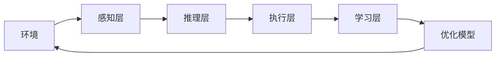
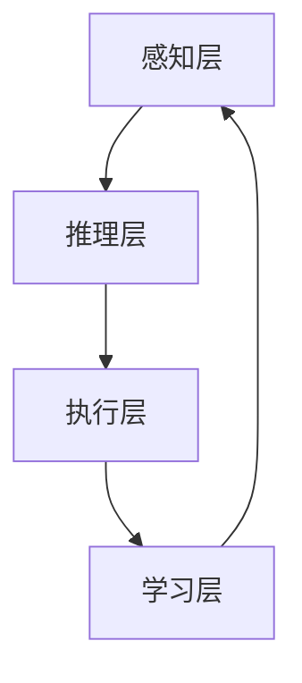
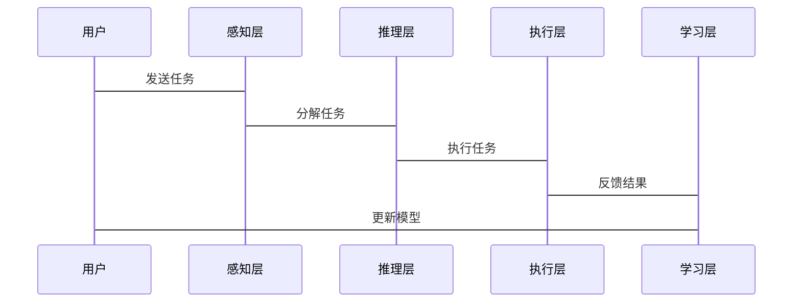

                 


# 构建AI Agent的认知计算模型

> 关键词：AI Agent, 认知计算模型, 知识表示, 推理机制, 深度学习, 系统架构

> 摘要：本文详细探讨了构建AI Agent的认知计算模型，从基本概念到算法原理，再到系统架构和项目实战，全面解析认知计算模型的核心概念和应用场景。文章结合理论与实践，提供丰富的代码示例和系统设计，帮助读者深入理解并掌握AI Agent的认知计算模型的构建方法。

---

## 第1章: AI Agent的基本概念与认知计算模型的背景

### 1.1 AI Agent的基本概念

AI Agent（人工智能代理）是指能够感知环境、自主决策并执行任务的智能体。AI Agent的核心目标是通过与环境交互，实现特定目标或解决问题。根据功能和智能水平的不同，AI Agent可以分为简单反射型、基于模型的反射型、目标驱动型和效用驱动型。AI Agent的特点包括自主性、反应性、目标导向性和社交能力。

### 1.2 认知计算模型的背景与意义

认知计算模型是一种模拟人类认知过程的计算模型，旨在通过感知、推理、学习和决策等过程，帮助AI Agent更好地理解和处理复杂问题。认知计算模型的意义在于它能够处理非结构化数据，解决传统算法难以应对的复杂任务。

### 1.3 认知计算模型的结构与组成

认知计算模型的结构通常包括以下四个层次：
- **感知层**：负责接收和解析外部环境的数据。
- **推理层**：通过逻辑推理或机器学习算法对数据进行分析和理解。
- **执行层**：根据推理结果执行具体的操作或任务。
- **学习层**：通过反馈机制不断优化模型和策略。

---

## 第2章: 认知计算模型的核心概念与联系

### 2.1 认知计算模型的核心概念

认知计算模型的核心概念包括知识表示、推理机制和学习机制。

- **知识表示**：知识表示是将现实世界中的信息以计算机可理解的形式表示的过程。常用的表示方法包括符号逻辑、概率分布和深度学习模型。
- **推理机制**：推理机制是根据已有知识推导新结论的过程。常见的推理方法包括符号逻辑推理、概率推理和基于规则的推理。
- **学习机制**：学习机制是模型通过数据和反馈不断优化自身性能的过程。包括监督学习、无监督学习和强化学习。

### 2.2 核心概念的属性特征对比

表2-1：认知计算模型核心概念的属性对比

| 概念       | 输入形式 | 输出形式 | 核心目标               |
|------------|----------|----------|-----------------------|
| 知识表示   | 结构化数据 | 符号化知识 | 描述问题领域知识       |
| 推理机制   | 符号化知识 | 新结论   | 根据知识推导新结论     |
| 学习机制   | 样本数据 | 模型优化 | 优化模型性能           |

### 2.3 实体关系图

图2-1：认知计算模型的实体关系



---

## 第3章: 认知计算模型的算法原理

### 3.1 符号逻辑推理的算法原理

符号逻辑推理是一种基于逻辑规则的推理方法，其核心是通过符号表示和逻辑规则进行推理。例如，命题逻辑中的蕴含关系可以通过真值表进行判断。

- **命题逻辑公式**：$$ p \rightarrow q $$
- **蕴含关系**：如果p为真，q必须为真。

### 3.2 概率推理的算法原理

概率推理是基于概率论的推理方法，用于处理不确定性问题。例如，贝叶斯网络可以通过概率分布来表示变量之间的关系。

- **贝叶斯网络公式**：$$ P(A|B) = \frac{P(B|A)P(A)}{P(B)} $$

### 3.3 深度学习模型的算法原理

深度学习模型（如神经网络）通过多层非线性变换学习数据的特征表示。例如，卷积神经网络（CNN）常用于图像识别任务。

- **卷积层公式**：$$ f(x) = \max(0, x) $$

---

## 第4章: 系统架构设计

### 4.1 问题场景介绍

以一个简单的任务管理AI Agent为例，系统需要完成任务接收、任务分解、任务执行和任务反馈四个步骤。

### 4.2 系统功能设计

- **领域模型**：类图展示系统各模块的交互关系。
- **系统架构**：分层架构，包括感知层、推理层、执行层和学习层。

### 4.3 系统架构图



### 4.4 接口设计

系统接口包括任务接收接口、任务分解接口和任务反馈接口。

### 4.5 交互序列图



---

## 第5章: 项目实战

### 5.1 项目介绍

构建一个简单的任务管理AI Agent，实现任务接收、分解、执行和反馈功能。

### 5.2 核心代码实现

```python
# 知识表示
knowledge_base = {
    "任务1": {"优先级": "高", "截止时间": "2023-12-31"},
    "任务2": {"优先级": "中", "截止时间": "2023-11-30"}
}

# 推理逻辑
def get_priority_task(knowledge_base):
    return max(knowledge_base.items(), key=lambda x: x[1]["优先级"])
```

### 5.3 代码解读与分析

上述代码通过知识表示存储任务信息，并通过推理逻辑选择优先级最高的任务进行执行。代码简单明了，展示了认知计算模型的基本实现。

---

## 第6章: 优化与扩展

### 6.1 性能优化

- **算法优化**：使用更高效的推理算法，如优化的符号逻辑推理。
- **模型优化**：通过增加数据量和调整模型结构提高学习效果。

### 6.2 功能扩展

- **多任务处理**：支持同时处理多个任务。
- **自适应学习**：模型能够根据环境变化自动调整策略。

### 6.3 集成与应用

- **与其他系统的集成**：如与企业管理系统（ERP）集成。
- **实际应用案例**：如智能助手、自动驾驶等。

---

## 第7章: 总结与展望

### 7.1 全文总结

本文从AI Agent的基本概念出发，详细探讨了认知计算模型的核心概念、算法原理和系统架构设计，最后通过项目实战和优化建议，为读者提供了全面的构建方法。

### 7.2 未来展望

随着人工智能技术的不断发展，认知计算模型将更加智能化和复杂化。未来的挑战在于如何更好地处理不确定性问题，以及如何实现更高效的模型优化和自适应学习。

---

作者：AI天才研究院

