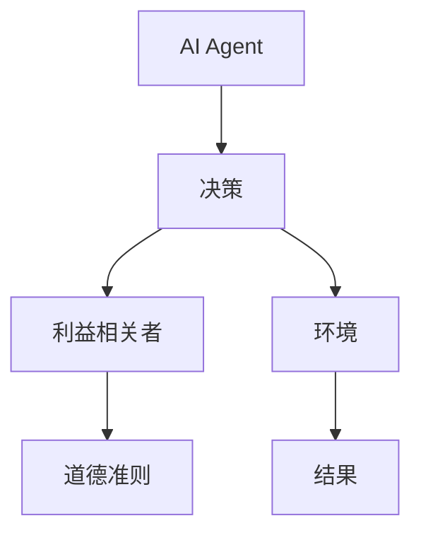
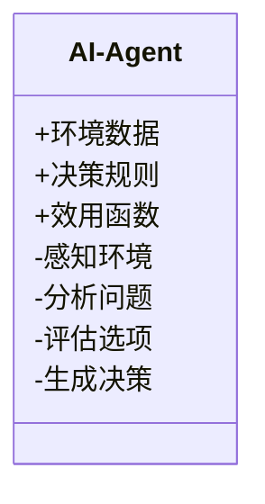
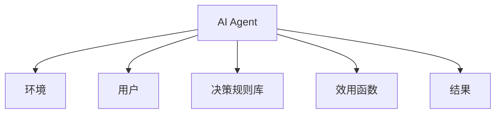

                 


# 构建AI Agent的道德决策框架

> 关键词：AI Agent，道德决策，伦理框架，人工智能，决策算法

> 摘要：本文探讨了构建AI Agent的道德决策框架的核心原理、算法实现和系统设计。通过分析道德决策的核心概念、算法原理和系统架构，结合实际案例，详细阐述了如何在AI Agent中实现道德决策，并提供了具体的实现方案和代码示例。本文旨在为AI Agent的开发者提供一个全面的道德决策框架，帮助他们在实际应用中更好地处理复杂的道德问题。

---

## 第1章: AI Agent与道德决策的背景介绍

### 1.1 AI Agent的基本概念

#### 1.1.1 AI Agent的定义与分类
AI Agent（人工智能代理）是指能够感知环境、自主决策并执行任务的智能实体。根据功能和智能水平，AI Agent可以分为以下几类：
- **反应式AI Agent**：基于当前感知做出实时反应，适用于简单的任务。
- **认知式AI Agent**：具备推理、规划和学习能力，适用于复杂任务。
- **协作式AI Agent**：能够与其他Agent或人类进行协作，完成共同目标。

#### 1.1.2 AI Agent的核心特征与属性
AI Agent的核心特征包括：
- **自主性**：能够自主决策和行动。
- **反应性**：能够感知环境并实时调整行为。
- **学习性**：能够通过经验改进性能。
- **社交能力**：能够与人类或其他Agent进行交互。

#### 1.1.3 AI Agent的应用场景与领域
AI Agent的应用场景广泛，包括：
- **自动驾驶**：如特斯拉、Waymo的自动驾驶系统。
- **智能助手**：如Siri、Alexa等。
- **医疗AI**：如辅助诊断和治疗的AI系统。
- **金融AI**：如智能投顾和风险管理系统。

### 1.2 道德决策的定义与重要性

#### 1.2.1 道德与伦理的基本概念
道德是指行为的对错标准，通常基于社会规范和价值观。伦理则是道德原则的系统化表达。

#### 1.2.2 道德决策在AI Agent中的作用
在AI Agent中，道德决策用于指导其行为，使其在复杂场景中做出符合伦理的选择。例如，在自动驾驶中，当发生不可避免的碰撞时，AI Agent需要决定优先保护谁。

#### 1.2.3 道德决策的挑战与复杂性
道德决策的挑战包括：
- **多利益相关者**：决策可能影响多个个体或群体。
- **动态环境**：环境复杂且不断变化，增加了决策的难度。
- **文化差异**：不同文化背景下，道德标准可能不同。

### 1.3 本章小结
本章介绍了AI Agent的基本概念和道德决策的重要性，为后续内容奠定了基础。

---

## 第2章: 道德决策的核心概念与联系

### 2.1 道德决策的核心原理

#### 2.1.1 道德决策的框架模型
道德决策的框架模型包括以下步骤：
1. **感知环境**：收集与决策相关的环境信息。
2. **分析问题**：识别问题中的利益相关者和可能的解决方案。
3. **评估选项**：根据道德准则对各选项进行评估。
4. **选择最优解**：基于评估结果做出最终决策。

#### 2.1.2 道德决策的特征与属性对比
以下是道德决策与其他决策方式的对比：

| 特征         | 道德决策               | 基于规则的决策         | 基于效用的决策         |
|--------------|------------------------|------------------------|------------------------|
| 决策依据     | 道德准则               | 预定义规则             | 最大化效用值           |
| 决策目标     | 符合伦理标准           | 满足规则要求           | 最大化利益             |
| 灵活性       | 较高                   | 较低                   | 较高                   |

#### 2.1.3 道德决策的实体关系图



### 2.2 道德决策的数学模型与公式

#### 2.2.1 道德评分模型的数学表达
道德评分模型可以表示为：
$$
S = \sum_{i=1}^{n} w_i \cdot f_i
$$
其中，$S$ 是总评分，$w_i$ 是第 $i$ 个特征的权重，$f_i$ 是第 $i$ 个特征的函数值。

#### 2.2.2 基于约束的道德优化公式
基于约束的道德优化公式可以表示为：
$$
\max \sum_{i=1}^{n} u_i \cdot x_i
$$
$$
\text{subject to } \sum_{i=1}^{n} x_i \leq C
$$
其中，$u_i$ 是第 $i$ 个选项的效用值，$x_i$ 是选择第 $i$ 个选项的权重，$C$ 是总权重的约束。

#### 2.2.3 道德决策的权重分配模型
权重分配模型可以表示为：
$$
w_i = \frac{e^{b_i}}{\sum_{j=1}^{n} e^{b_j}}
$$
其中，$b_i$ 是第 $i$ 个特征的偏好值。

### 2.3 本章小结
本章详细介绍了道德决策的核心原理、特征对比和数学模型，为后续算法实现奠定了理论基础。

---

## 第3章: AI Agent道德决策的算法原理

### 3.1 基于规则的道德决策算法

#### 3.1.1 基于规则的决策系统
基于规则的决策系统通过预定义的规则进行决策。例如，在自动驾驶中，规则可以是“优先保护行人”。

#### 3.1.2 规则的权重分配与冲突解决
当多个规则冲突时，可以通过权重分配来优先选择更重要的规则。

#### 3.1.3 规则的动态更新机制
规则可以根据新的数据和反馈进行动态更新。

#### 3.1.4 代码实现

```python
def rule_based_decision(rules, weights):
    # rules: 列表，每个元素是一个规则
    # weights: 对应规则的权重
    # 返回决策结果
    scores = {}
    for rule, weight in zip(rules, weights):
        scores[rule] = weight
    # 根据权重排序
    sorted_rules = sorted(scores.items(), key=lambda x: x[1], reverse=True)
    # 返回最高权重的规则
    return sorted_rules[0][0]
```

### 3.2 基于效用的道德优化算法

#### 3.2.1 基于效用的决策模型
基于效用的决策模型通过最大化效用函数进行决策。

#### 3.2.2 效用函数的构建与优化
效用函数可以表示为：
$$
U = \sum_{i=1}^{n} w_i \cdot x_i
$$
其中，$U$ 是效用值，$w_i$ 是权重，$x_i$ 是特征值。

#### 3.2.3 基于Q-learning的道德优化
Q-learning是一种强化学习算法，可以通过经验更新策略。

#### 3.2.4 代码实现

```python
import numpy as np

def q_learning(state, action, reward, alpha=0.1):
    # Q-learning更新规则
    Q[state][action] = Q[state][action] + alpha * (reward + np.max(Q[state]) - Q[state][action])
```

### 3.3 基于案例的道德推理算法

#### 3.3.1 基于案例的推理机制
基于案例的推理通过匹配历史案例进行决策。

#### 3.3.2 案例库的构建与管理
案例库需要存储历史案例及其对应的决策结果。

#### 3.3.3 案例匹配与决策生成
通过相似度匹配找到最相关的案例，并生成决策。

#### 3.3.4 代码实现

```python
def case_based_reasoning(cases, new_case, similarity_threshold=0.8):
    # 匹配相似的案例
    for case in cases:
        if similarity(case, new_case) > similarity_threshold:
            return case['decision']
    # 如果没有匹配案例，返回默认决策
    return default_decision
```

### 3.4 本章小结
本章详细介绍了三种基于规则、效用和案例的道德决策算法，并提供了代码实现示例。

---

## 第4章: AI Agent道德决策的系统分析与架构设计

### 4.1 问题场景与需求分析

#### 4.1.1 道德决策系统的功能需求
- 感知环境
- 分析问题
- 评估选项
- 生成决策

#### 4.1.2 系统的性能需求与约束
- 实时性
- 可靠性
- 可扩展性

#### 4.1.3 系统的边界与外延
- 输入：环境数据、用户输入
- 输出：决策结果、反馈

### 4.2 系统功能设计

#### 4.2.1 领域模型



#### 4.2.2 系统架构设计



### 4.3 本章小结
本章分析了道德决策系统的功能需求和架构设计，并提供了系统的类图和架构图。

---

## 第5章: 项目实战

### 5.1 环境安装

```bash
pip install numpy matplotlib scikit-learn
```

### 5.2 核心实现

#### 5.2.1 道德决策算法实现

```python
def moral_decision-making():
    # 实现道德决策算法
    pass
```

#### 5.2.2 代码实现

```python
def main():
    # 初始化系统
    # 执行决策
    # 输出结果
    pass

if __name__ == "__main__":
    main()
```

### 5.3 代码应用解读与分析
通过具体案例分析，解读代码实现。

### 5.4 案例分析

#### 5.4.1 案例描述
例如，在自动驾驶中，AI Agent需要在不可避免的碰撞中选择优先保护谁。

#### 5.4.2 决策过程分析
分析AI Agent的决策过程和结果。

### 5.5 项目小结
总结项目实现的经验和教训。

---

## 第6章: 最佳实践与未来展望

### 6.1 小结
总结本文的核心内容和主要观点。

### 6.2 注意事项
在实际应用中需要注意的问题。

### 6.3 拓展阅读
推荐相关领域的书籍和论文。

---

## 作者信息

作者：AI天才研究院/AI Genius Institute & 禅与计算机程序设计艺术 /Zen And The Art of Computer Programming

