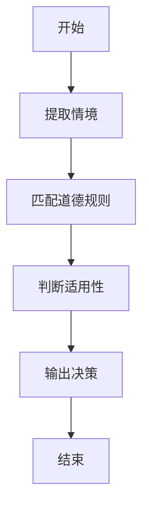
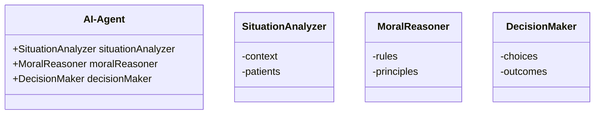

                 


# 《构建AI Agent的道德推理框架》

---

## 关键词

- AI Agent
- 道德推理
- 伦理框架
- 人工智能
- 系统架构

---

## 摘要

在人工智能快速发展的背景下，AI Agent（智能体）在各个领域的应用日益广泛。然而，AI Agent的决策过程必须考虑道德和伦理因素，以确保其行为符合社会规范和人类价值观。本文旨在构建一个AI Agent的道德推理框架，探讨其核心概念、算法实现、数学模型及系统架构，并通过实际案例展示其应用。文章从基础概念出发，逐步深入，结合理论与实践，为AI Agent的道德推理提供全面指导。

---

# 第1章：AI Agent与道德推理的背景

## 1.1 AI Agent的基本概念

### 1.1.1 AI Agent的定义与分类

AI Agent是指能够感知环境、自主决策并采取行动以实现目标的智能实体。根据智能水平，AI Agent可分为简单反射型、基于模型的反应型、目标驱动型和推理驱动型。

### 1.1.2 AI Agent的核心特征

- **自主性**：能够在无外部干预下执行任务。
- **反应性**：能实时感知环境并调整行为。
- **目标导向性**：所有行为均以实现特定目标为导向。

### 1.1.3 AI Agent的发展历程

从早期的专家系统到现代的深度学习模型，AI Agent经历了从简单到复杂、从静态到动态的演变过程。

## 1.2 道德推理的基本概念

### 1.2.1 道德推理的定义与类型

道德推理是通过伦理原则和价值观来判断行为对错的过程。其类型包括义务论、功利主义和美德伦理等。

### 1.2.2 道德推理在AI中的重要性

AI Agent的决策可能对人类产生重大影响，因此必须具备道德推理能力，以避免负面后果。

### 1.2.3 道德推理的挑战与现状

当前AI Agent的道德推理主要面临伦理原则的模糊性、多利益相关者的冲突以及动态环境的适应性等挑战。

## 1.3 AI Agent与道德推理的结合

### 1.3.1 AI Agent中道德推理的应用场景

- 医疗诊断中的伦理决策。
- 自动驾驶中的紧急情况处理。

### 1.3.2 道德推理对AI Agent决策的影响

道德推理框架能够为AI Agent提供伦理指导，确保其决策符合社会接受的道德标准。

### 1.3.3 当前研究中的问题与挑战

现有研究主要集中在如何将道德原则编码化，但动态环境下的灵活应用仍是一个难题。

---

# 第2章：道德推理框架的核心概念与联系

## 2.1 道德推理框架的核心概念

### 2.1.1 伦理原则

伦理原则是道德推理的基础，包括诚实、公正、尊重等。

### 2.1.2 道德规则

道德规则是对伦理原则的具体化，用于指导特定情境下的行为。

### 2.1.3 情境分析

情境分析是理解当前环境和相关利益者需求的关键步骤。

## 2.2 道德推理框架的属性特征对比

| 特性      | 基于规则的框架 | 神经符号系统 |
|-----------|----------------|--------------|
| 处理方式   | 基于预定义规则 | 结合神经网络 |
| 适应性     | 较低           | 较高          |
| 复杂性     | 较低           | 较高          |

## 2.3 AI Agent与道德推理的实体关系

```mermaid
erDiagram
    actor EthicalPrinciples
    actor SituationAnalysis
    actor MoralRules
    EthicalPrinciples --> MoralRules : 基于
    MoralRules --> SituationAnalysis : 适用于
    SituationAnalysis --> AI-Agent : 影响
```

---

# 第3章：道德推理算法的原理与实现

## 3.1 基于规则的道德推理算法

### 3.1.1 算法流程



### 3.1.2 优缺点分析

- **优点**：实现简单，易于解释。
- **缺点**：难以处理复杂和动态的道德困境。

## 3.2 神经符号系统

### 3.2.1 系统结构

神经符号系统结合了神经网络的感知能力和符号逻辑的推理能力。

### 3.2.2 与基于规则系统的对比

神经符号系统在处理复杂情境时更具灵活性，但实现复杂度较高。

---

## 3.3 算法实现

### 3.3.1 基于规则的算法实现

```python
def moral_reasoning(rules, situation):
    applicable_rules = [rule for rule in rules if rule.applies_to(situation)]
    if not applicable_rules:
        return None
    # 选择最合适的规则
    selected_rule = max(applicable_rules, key=lambda r: r.priority)
    return selected_rule.apply(situation)
```

### 3.3.2 神经符号系统的实现

```python
class NeuralSymbolicSystem:
    def __init__(self, network, rules):
        self.network = network
        self.rules = rules

    def infer(self, situation):
        # 使用神经网络进行情境分析
        features = extract_features(situation)
        outputs = self.network.predict(features)
        # 基于符号规则进行推理
        selected_rule = self.rules[outputs.index(max(outputs))]
        return selected_rule.apply(situation)
```

---

# 第4章：数学模型与公式

## 4.1 逻辑推理模型

$$ P(e) = \text{概率}(e) $$

其中，$e$代表情境，$P(e)$表示情境$e$发生的概率。

## 4.2 概率论模型

贝叶斯网络用于道德推理中的概率计算：

$$ P(A|B) = \frac{P(B|A)P(A)}{P(B)} $$

其中，$A$代表决策，$B$代表情境。

---

# 第5章：系统架构设计

## 5.1 项目介绍

构建一个AI Agent的道德推理框架，用于辅助医疗诊断中的伦理决策。

## 5.2 系统功能设计



---

# 第6章：项目实战

## 6.1 环境安装

安装必要的库，如TensorFlow、Keras等。

## 6.2 核心代码实现

```python
# 道德规则库
rules = [
    Rule("不伤害患者", priority=3),
    Rule("最大利益", priority=2),
    Rule("尊重患者意愿", priority=1)
]

# 情境分析
situation = {
    "患者病情": "严重",
    "患者意愿": "拒绝治疗",
    "医疗团队建议": "手术"
}

# 调用道德推理函数
decision = moral_reasoning(rules, situation)
print(decision)
```

## 6.3 实际案例分析

在医疗诊断中，当患者拒绝治疗但医疗团队建议手术时，AI Agent会基于规则库选择最合适的决策。

---

# 第7章：总结与展望

## 7.1 小结

本文系统地探讨了构建AI Agent道德推理框架的各个方面，从理论到实践，为AI Agent的伦理决策提供了指导。

## 7.2 注意事项

在实际应用中，需确保道德规则的透明性和可解释性，同时关注动态情境下的适应性。

## 7.3 拓展阅读

建议深入研究神经符号系统的优化和动态道德推理框架的设计。

---

# 作者

作者：AI天才研究院/AI Genius Institute & 禅与计算机程序设计艺术 /Zen And The Art of Computer Programming

