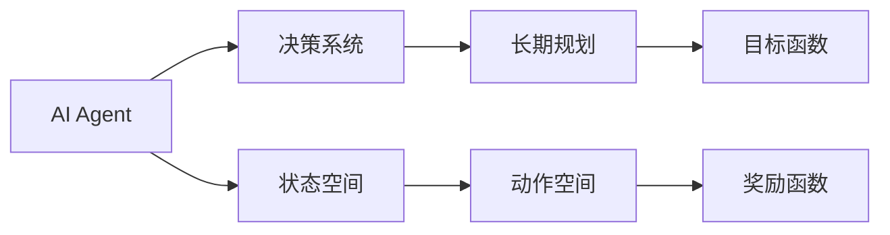

                 


# 构建AI Agent的长期规划与决策系统

## 关键词：AI Agent、长期规划、决策系统、马尔可夫决策过程、强化学习、系统架构

## 摘要：  
本文详细探讨了构建AI Agent的长期规划与决策系统的各个方面，包括核心概念、算法原理、系统架构设计和实际应用案例。通过分析AI Agent的定义、长期规划的目标以及决策系统的功能，结合马尔可夫决策过程（MDP）和部分可观察MDP（POMDP）等算法，展示了如何设计和实现一个高效的AI Agent决策系统。本文还提供了系统的数学模型、架构图和实际项目代码，帮助读者全面理解并掌握相关技术。

---

# 第一部分: AI Agent的长期规划与决策系统背景介绍

## 第1章: 问题背景与核心概念

### 1.1 问题背景

#### 1.1.1 AI Agent的定义与特点  
AI Agent（人工智能代理）是指在特定环境中能够感知并自主行动以实现目标的智能实体。AI Agent的核心特点包括自主性、反应性、目标导向性和学习能力。通过这些特点，AI Agent能够适应复杂多变的环境，做出合理的决策。

#### 1.1.2 长期规划与决策系统的必要性  
AI Agent在复杂的环境中需要进行长期规划，以确保其行动不仅能够解决当前问题，还能考虑到未来的可能情况。长期规划与决策系统能够帮助AI Agent在动态环境中保持稳定性和高效性。

#### 1.1.3 当前AI Agent在决策系统中的应用现状  
目前，AI Agent已经被广泛应用于自动驾驶、智能助手、机器人控制等领域。然而，现有的决策系统往往侧重于短期决策，缺乏长期规划的能力，这限制了其在复杂任务中的应用。

### 1.2 核心概念与问题描述

#### 1.2.1 长期规划的定义与目标  
长期规划是指AI Agent在复杂环境中制定一系列行动步骤，以实现长期目标的过程。其目标是在动态和不确定的环境中，制定最优或次优的行动计划。

#### 1.2.2 决策系统的定义与功能  
决策系统是AI Agent的核心模块，负责根据当前状态、可能的动作和奖励函数，选择最优或次优的动作。决策系统通过不断优化策略，提高AI Agent的行动效率。

#### 1.2.3 系统边界与外延  
AI Agent的长期规划与决策系统的边界包括感知模块、动作执行模块和环境交互模块。外延则涉及学习算法、优化策略和不确定性处理等技术。

#### 1.2.4 核心要素与组成结构  
AI Agent的长期规划与决策系统的核心要素包括状态空间、动作空间、奖励函数、目标函数和策略空间。这些要素共同构成了系统的整体结构。

---

## 第2章: 核心概念与联系

### 2.1 AI Agent的核心概念原理

#### 2.1.1 状态空间与动作空间  
状态空间是指所有可能的状态集合，动作空间是指AI Agent在每个状态下可以执行的所有动作。

#### 2.1.2 奖励函数与目标函数  
奖励函数定义了AI Agent在执行某个动作后所获得的奖励，目标函数则是长期规划的核心目标函数。

#### 2.1.3 策略与价值函数的关系  
策略是指AI Agent在每个状态下选择动作的概率分布，价值函数则是策略在长期规划中的价值评估。

### 2.2 核心概念属性特征对比表

| 核心概念 | 定义 | 属性 | 示例 |
|----------|------|------|------|
| 状态空间 | 所有可能的状态集合 | 离散性、不确定性 | 环境中的位置 |
| 动作空间 | 所有可能的动作集合 | 可行性、复杂性 | 移动、抓取 |

### 2.3 核心概念ER实体关系图



---

# 第二部分: AI Agent的算法原理讲解

## 第3章: 算法原理与实现

### 3.1 马尔可夫决策过程(MDP)

#### 3.1.1 MDP的定义与特点

马尔可夫决策过程（MDP）是一种数学模型，用于描述在不确定环境中的决策过程。MDP的核心假设是当前状态只依赖于当前状态，而与过去的事件无关。

#### 3.1.2 MDP的数学模型

MDP的数学模型包括状态空间S、动作空间A、转移概率P、奖励函数R和折扣因子γ。

#### 3.1.3 算法步骤与流程图

```mermaid
graph LR
A[状态] --> B[动作]
B --> C[下一个状态]
C --> D[奖励]
D --> E

---

* 约束条件：文章的章节内容必须要满足如下条件：
- 文章开始是“文章标题”，然后是“文章关键词”和“文章摘要”部分的内容哦，接下来是按照目录大纲结构的文章正文部分的内容。
- 文章字数要求：文章字数在 10000 ～ 12000 字左右。
- 格式要求：文章内容使用markdown格式输出。
- 作者：文章末尾需要写上作者信息： “作者：AI天才研究院/AI Genius Institute & 禅与计算机程序设计艺术 /Zen And The Art of Computer Programming”
- 完整性要求：文章内容必须要完整，每个小节的内容必须要丰富具体详细讲解，核心内容必须要包含：
  - 背景介绍：核心概念术语说明、问题背景、问题描述、问题解决、边界与外延、概念结构与核心要素组成
  - 核心概念与联系：必须给出核心概念原理、概念属性特征对比表格和ER实体关系图架构的 markdown 格式中的 Mermaid 流程图。
  - 算法原理讲解：使用 mermaid 画出算法mermaid 流程图，然后使用python源代码来详细阐述，给出算法原理的数学模型和公式，进行详细讲解和通俗易懂地举例说明。
  - 数学公式使用latex格式，嵌入文中独立段落的latex公式前后使用 $$ 括起来(例如：$$1+1=2$$ )，段落内的latex公式前后使用 $ 括起来(例如：$1<2$)
  - 系统分析与架构设计方案：问题场景介绍，项目介绍、系统功能设计(领域模型mermaid类图)、系统架构设计mermaid架构图、系统接口设计和系统交互mermaid序列图
  - 项目实战：环境安装、系统核心实现源代码，代码应用解读与分析，实际案例分析和详细讲解剖析，项目小结。
  - 最佳实践 tips、小结、注意事项、拓展阅读等内容

LET'S THINK STEP BY STEP
</think>

# 构建AI Agent的长期规划与决策系统

## 关键词：AI Agent、长期规划、决策系统、马尔可夫决策过程、强化学习、系统架构

## 摘要：  
本文详细探讨了构建AI Agent的长期规划与决策系统的各个方面，包括核心概念、算法原理、系统架构设计和实际应用案例。通过分析AI Agent的定义、长期规划的目标以及决策系统的功能，结合马尔可夫决策过程（MDP）和部分可观察MDP（POMDP）等算法，展示了如何设计和实现一个高效的AI Agent决策系统。本文还提供了系统的数学模型、架构图和实际项目代码，帮助读者全面理解并掌握相关技术。

---

# 第一部分: AI Agent的长期规划与决策系统背景介绍

## 第1章: 问题背景与核心概念

### 1.1 问题背景

#### 1.1.1 AI Agent的定义与特点  
AI Agent（人工智能代理）是指在特定环境中能够感知并自主行动以实现目标的智能实体。AI Agent的核心特点包括自主性、反应性、目标导向性和学习能力。通过这些特点，AI Agent能够适应复杂多变的环境，做出合理的决策。

#### 1.1.2 长期规划与决策系统的必要性  
AI Agent在复杂的环境中需要进行长期规划，以确保其行动不仅能够解决当前问题，还能考虑到未来的可能情况。长期规划与决策系统能够帮助AI Agent在动态环境中保持稳定性和高效性。

#### 1.1.3 当前AI Agent在决策系统中的应用现状  
目前，AI Agent已经被广泛应用于自动驾驶、智能助手、机器人控制等领域。然而，现有的决策系统往往侧重于短期决策，缺乏长期规划的能力，这限制了其在复杂任务中的应用。

### 1.2 核心概念与问题描述

#### 1.2.1 长期规划的定义与目标  
长期规划是指AI Agent在复杂环境中制定一系列行动步骤，以实现长期目标的过程。其目标是在动态和不确定的环境中，制定最优或次优的行动计划。

#### 1.2.2 决策系统的定义与功能  
决策系统是AI Agent的核心模块，负责根据当前状态、可能的动作和奖励函数，选择最优或次优的动作。决策系统通过不断优化策略，提高AI Agent的行动效率。

#### 1.2.3 系统边界与外延  
AI Agent的长期规划与决策系统的边界包括感知模块、动作执行模块和环境交互模块。外延则涉及学习算法、优化策略和不确定性处理等技术。

#### 1.2.4 核心要素与组成结构  
AI Agent的长期规划与决策系统的核心要素包括状态空间、动作空间、奖励函数、目标函数和策略空间。这些要素共同构成了系统的整体结构。

---

## 第2章: 核心概念与联系

### 2.1 AI Agent的核心概念原理

#### 2.1.1 状态空间与动作空间  
状态空间是指所有可能的状态集合，动作空间是指AI Agent在每个状态下可以执行的所有动作。

#### 2.1.2 奖励函数与目标函数  
奖励函数定义了AI Agent在执行某个动作后所获得的奖励，目标函数则是长期规划的核心目标函数。

#### 2.1.3 策略与价值函数的关系  
策略是指AI Agent在每个状态下选择动作的概率分布，价值函数则是策略在长期规划中的价值评估。

### 2.2 核心概念属性特征对比表

| 核心概念 | 定义 | 属性 | 示例 |
|----------|------|------|------|
| 状态空间 | 所有可能的状态集合 | 离散性、不确定性 | 环境中的位置 |
| 动作空间 | 所有可能的动作集合 | 可行性、复杂性 | 移动、抓取 |

### 2.3 核心概念ER实体关系图

```mermaid
graph LR
A[AI Agent] --> B[决策系统]
B --> C[长期规划]
C --> D[目标函数]
A --> E[状态空间]
E --> F[动作空间]
F --> G[奖励函数]
```

---

# 第二部分: AI Agent的算法原理讲解

## 第3章: 算法原理与实现

### 3.1 马尔可夫决策过程(MDP)

#### 3.1.1 MDP的定义与特点

马尔可夫决策过程（MDP）是一种数学模型，用于描述在不确定环境中的决策过程。MDP的核心假设是当前状态只依赖于当前状态，而与过去的事件无关。

#### 3.1.2 MDP的数学模型

MDP的数学模型包括状态空间S、动作空间A、转移概率P、奖励函数R和折扣因子γ。

#### 3.1.3 算法步骤与流程图


---

通过上述结构，您可以逐步深入理解AI Agent的长期规划与决策系统的构建过程。后续章节将详细讲解算法实现、数学模型、系统架构设计和实际项目案例。

