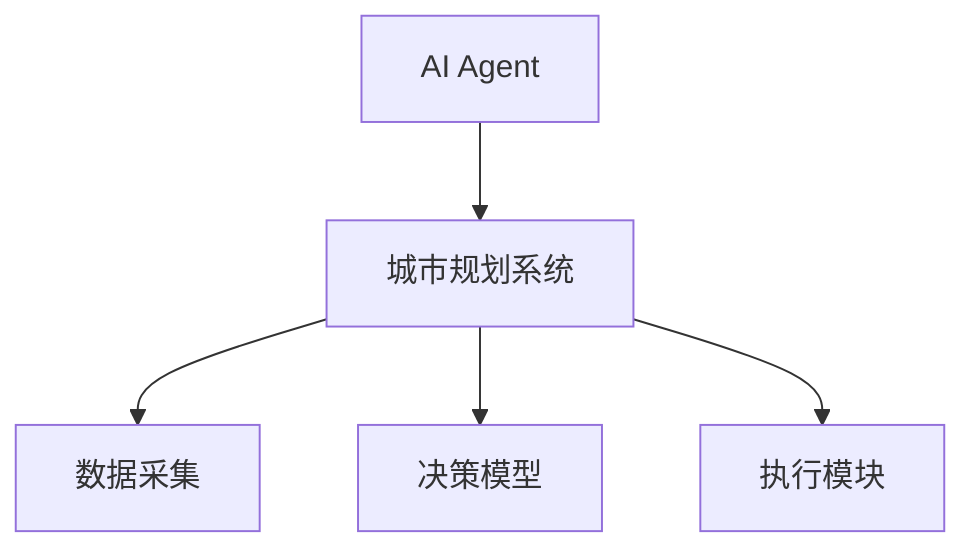
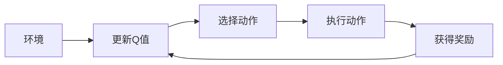
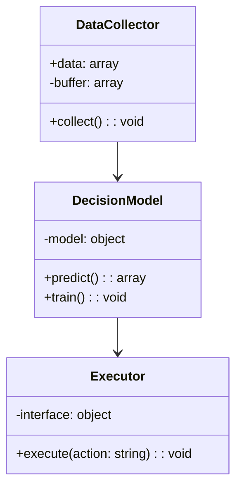

                 


# 《构建AI Agent驱动的智能城市规划系统》

> 关键词：AI Agent，智能城市规划，多智能体系统，强化学习，城市交通优化

> 摘要：本文探讨了利用AI Agent技术构建智能城市规划系统的背景、核心概念、算法原理、系统架构设计以及项目实战。通过分析传统城市规划的挑战，提出了一种基于AI Agent的新范式，结合强化学习算法和系统架构设计，展示了如何实现智能化的城市规划与管理。

---

## 第一部分: AI Agent驱动智能城市规划的背景与概念

### 第1章: 问题背景与描述

#### 1.1 问题背景
##### 1.1.1 当前城市规划面临的挑战
随着城市化进程的加快，城市规模不断扩大，传统城市规划方法逐渐暴露出诸多问题。例如，交通拥堵、资源分配不均、环境污染加剧等，这些问题的复杂性使得传统方法难以有效解决。

##### 1.1.2 传统城市规划的局限性
传统城市规划主要依赖人工经验，缺乏数据驱动的决策支持。这种模式难以应对城市化进程中的动态变化，导致规划结果与实际需求存在较大偏差。

##### 1.1.3 AI技术在城市规划中的潜力
AI技术，特别是AI Agent（智能体）的应用，为城市规划带来了新的可能性。通过实时数据处理、多目标优化和自适应调整，AI Agent能够显著提高城市规划的效率和准确性。

#### 1.2 问题描述
##### 1.2.1 智慧城市建设的需求
智慧城市建设要求城市具备智能化的管理能力，能够实时感知、预测和优化城市运行状态。AI Agent技术正是满足这一需求的关键技术之一。

##### 1.2.2 城市规划中的数据与决策复杂性
现代城市规划需要处理海量数据，包括交通流量、人口分布、环境监测等。这些数据的复杂性要求规划系统具备强大的数据处理和决策能力。

##### 1.2.3 AI Agent在城市规划中的应用场景
AI Agent可以应用于城市交通优化、资源分配、环境监测等多个领域。通过实时数据处理和智能决策，AI Agent能够显著提高城市规划的科学性和实用性。

### 第2章: 问题解决与边界定义

#### 2.1 问题解决方法
##### 2.1.1 AI Agent驱动城市规划的核心思路
AI Agent通过实时数据处理和多目标优化，为城市规划提供动态调整和智能决策支持。

##### 2.1.2 数据驱动的城市规划新范式
基于数据驱动的方法，AI Agent能够实时分析城市运行状态，动态调整规划方案，提高规划的适应性和灵活性。

##### 2.1.3 AI Agent与城市规划的结合方式
AI Agent作为城市规划的核心驱动力，能够实现城市各系统的协同优化，例如交通、能源和环境。

#### 2.2 系统边界与外延
##### 2.2.1 系统的功能边界
AI Agent驱动的城市规划系统主要负责数据采集、分析、决策和执行。系统边界包括数据源、决策模型和执行模块。

##### 2.2.2 系统的适用范围与限制
系统适用于城市交通优化、资源分配等领域，但在复杂性极高的情况下可能需要结合其他技术进行优化。

##### 2.2.3 系统与外部环境的交互
系统通过传感器、数据库等接口与外部环境交互，获取实时数据并输出决策结果。

---

## 第二部分: 核心概念与联系

### 第3章: 核心概念解析

#### 3.1 AI Agent的定义与特征
AI Agent是一种能够感知环境、自主决策并采取行动的智能体。其核心特征包括自主性、反应性、目标导向性和学习能力。

#### 3.2 智能城市规划系统的构成要素
智能城市规划系统由数据采集模块、决策模型、执行模块和反馈机制组成。

#### 3.3 AI Agent与城市规划的结合方式
AI Agent通过实时数据处理和智能决策，为城市规划提供动态优化支持。

### 第4章: 概念结构与核心要素

#### 4.1 概念结构图


#### 4.2 核心要素对比表格
| 要素 | 特性 |
|------|------|
| 数据源 | 实时性、多样性 |
| 决策模型 | 多目标优化、强化学习 |
| 执行模块 | 自动化、实时响应 |

---

## 第三部分: 算法原理讲解

### 第5章: 强化学习算法

#### 5.1 强化学习的原理
强化学习是一种通过试错机制优化决策的算法。AI Agent通过与环境交互，学习最优策略。

#### 5.2 Q-learning算法
Q-learning是一种经典的强化学习算法，通过更新Q值函数来优化决策。

#### 5.3 算法流程图


#### 5.4 Python代码实现
```python
import numpy as np

class QAgent:
    def __init__(self, state_size, action_size):
        self.state_size = state_size
        self.action_size = action_size
        self.Q = np.zeros((state_size, action_size))

    def choose_action(self, state, epsilon=0.1):
        if np.random.random() < epsilon:
            return np.random.randint(self.action_size)
        return np.argmax(self.Q[state, :])

    def update_Q(self, state, action, reward, gamma=0.99):
        self.Q[state, action] = reward + gamma * np.max(self.Q[state, :])
```

#### 5.5 数学模型与公式
Q-learning的更新公式为：
$$ Q(s, a) = r + \gamma \cdot \max_{a'} Q(s', a') $$

---

## 第四部分: 系统架构设计

### 第6章: 系统架构设计

#### 6.1 问题场景介绍
城市交通优化是AI Agent驱动城市规划的一个典型应用场景。

#### 6.2 系统功能设计
系统功能模块包括数据采集、决策模型、执行模块和反馈机制。

#### 6.3 领域模型类图


#### 6.4 系统架构图


---

## 第五部分: 项目实战

### 第7章: 项目实战

#### 7.1 环境安装与配置
安装Python和相关库，例如numpy、pandas、scikit-learn。

#### 7.2 核心代码实现
实现AI Agent的交通优化算法，例如基于强化学习的交通信号灯控制。

#### 7.3 案例分析与解读
分析实际案例，展示AI Agent在城市交通优化中的应用效果。

---

## 第六部分: 总结与展望

### 第8章: 总结与展望

#### 8.1 总结
AI Agent驱动的城市规划系统通过实时数据处理和智能决策，显著提高了城市规划的效率和准确性。

#### 8.2 未来展望
随着AI技术的不断发展，AI Agent在城市规划中的应用将更加广泛，例如城市能源管理和环境监测。

---

## 最佳实践 Tips

1. 在项目实战中，建议先从简单的场景入手，逐步复杂化。
2. 数据的实时性和准确性对系统性能至关重要。
3. 系统的可扩展性和可维护性需要在设计阶段充分考虑。

---

## 小结

本文系统地介绍了AI Agent驱动智能城市规划系统的背景、核心概念、算法原理、系统架构设计和项目实战。通过理论与实践的结合，展示了如何利用AI技术提升城市规划的智能化水平。

---

## 注意事项

1. 本文内容基于当前技术发展水平，未来可能会有新的技术突破。
2. 在实际应用中，需要根据具体需求进行系统优化和调整。

---

## 拓展阅读

1. 《强化学习：算法与应用》
2. 《多智能体系统：原理与实践》
3. 《智能城市：AI技术的应用与发展》

---

作者：AI天才研究院/AI Genius Institute & 禅与计算机程序设计艺术 /Zen And The Art of Computer Programming

