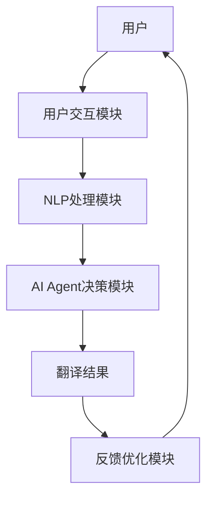

                 


# 构建AI Agent驱动的智能翻译系统

> 关键词：AI Agent, 智能翻译, 自然语言处理, 机器翻译, 大语言模型

> 摘要：本文将详细介绍如何构建一个基于AI Agent的智能翻译系统。从AI Agent的基本概念到智能翻译的核心技术，从算法原理到系统架构设计，从项目实战到优化与扩展，我们将全面解析如何利用AI Agent技术打造一个高效、智能、个性化的翻译系统。通过本文，读者将能够理解AI Agent在翻译中的作用，掌握智能翻译系统的实现原理，并能够基于开源工具快速构建一个属于自己的AI Agent驱动的智能翻译系统。

---

# 第1章 AI Agent与智能翻译概述

## 1.1 AI Agent的基本概念

### 1.1.1 AI Agent的定义与特点

AI Agent（人工智能代理）是指在计算机系统中，能够感知环境、自主决策并执行任务的智能实体。AI Agent的核心特点包括：

- **自主性**：能够自主决策，无需人工干预。
- **反应性**：能够实时感知环境并做出反应。
- **目标导向性**：具有明确的目标，并为实现目标而行动。
- **学习能力**：能够通过数据和经验不断优化自身性能。

AI Agent可以是软件程序，也可以是硬件设备，其目标是通过智能算法实现特定任务。

### 1.1.2 AI Agent的技术背景

AI Agent的发展离不开以下几个关键领域的技术进步：

- **自然语言处理（NLP）**：使AI Agent能够理解和生成人类语言。
- **机器学习**：通过数据训练AI Agent的决策能力。
- **知识图谱**：为AI Agent提供丰富的背景知识。
- **推理与规划**：使AI Agent能够进行逻辑推理和任务规划。

### 1.1.3 智能翻译的现状与挑战

智能翻译系统的核心任务是将一种语言的文本准确地翻译成另一种语言。然而，智能翻译仍然面临以下挑战：

- **语言的多义性**：同一个词或短语在不同上下文中含义不同。
- **文化差异**：不同语言背后的文化背景可能影响翻译结果。
- **实时性要求**：在线翻译需要快速响应。
- **个性化需求**：用户可能需要根据自身需求定制翻译结果。

---

## 1.2 AI Agent驱动智能翻译的意义

### 1.2.1 提高翻译效率

AI Agent可以通过自动化处理和并行计算，显著提高翻译效率。例如，AI Agent可以同时调用多个NLP模型进行翻译，并根据结果进行优化。

### 1.2.2 实现个性化翻译

AI Agent可以根据用户的偏好、上下文和使用场景，提供个性化的翻译结果。例如，AI Agent可以为金融领域的翻译用户提供专门的金融术语库。

### 1.2.3 提升翻译质量

通过结合多种NLP技术和知识图谱，AI Agent可以实现更准确的翻译。例如，AI Agent可以利用上下文信息和领域知识，减少翻译错误。

---

## 1.3 本章小结

本章主要介绍了AI Agent的基本概念及其在智能翻译中的作用，分析了智能翻译面临的挑战，并探讨了AI Agent驱动智能翻译的意义。通过本章，读者可以理解AI Agent如何帮助实现更高效、更准确的翻译。

---

# 第2章 AI Agent与智能翻译的核心技术基础

## 2.1 自然语言处理（NLP）基础

### 2.1.1 NLP的基本概念

NLP是研究计算机如何理解和生成人类语言的学科。NLP的核心任务包括：

- **文本分割**：将连续的文本分割成词、短语或句子。
- **词性标注**：给每个词标注其词性（名词、动词、形容词等）。
- **句法分析**：分析句子的语法结构。
- **语义分析**：理解文本的语义含义。

### 2.1.2 NLP在翻译中的应用

翻译本质上是将一种语言的语义信息转换为另一种语言的语义信息。NLP技术在翻译中的应用包括：

- **分词与句法分析**：将源语言文本分割成基本单位，并分析其语法结构。
- **语义理解**：理解源语言文本的深层含义。
- **目标语言生成**：根据源语言的语义信息生成目标语言文本。

### 2.1.3 翻译的挑战与NLP技术的解决方案

翻译的难点在于如何准确地理解源语言并生成符合目标语言语法和表达习惯的文本。NLP技术可以通过以下方式解决这些问题：

- **上下文理解**：利用上下文信息减少歧义。
- **领域知识**：引入领域知识库，提高翻译准确性。
- **多模态输入**：结合图像、语音等多种输入方式，提高翻译质量。

---

## 2.2 大语言模型（LLM）在翻译中的作用

### 2.2.1 大语言模型的定义

大语言模型是指经过海量数据训练的大型神经网络模型，例如GPT、BERT等。这些模型具有强大的语言理解和生成能力。

### 2.2.2 LLM在翻译中的优势

与传统的统计机器翻译（SMT）相比，LLM在翻译中的优势包括：

- **上下文感知**：能够理解上下文关系，生成更连贯的翻译。
- **多语言支持**：可以同时处理多种语言。
- **动态调整**：可以根据用户反馈动态调整翻译策略。

### 2.2.3 LLM的训练与优化

大语言模型的训练通常需要大量多语言数据，并通过自监督学习进行优化。训练目标是使模型在给定输入下生成正确的输出。

---

## 2.3 AI Agent与NLP的结合

### 2.3.1 AI Agent如何调用NLP模型

AI Agent可以通过调用NLP API或集成NLP模型来实现翻译功能。例如，AI Agent可以调用Google的Translation API进行翻译。

### 2.3.2 NLP模型如何支持AI Agent的决策

NLP模型为AI Agent提供语义理解能力，帮助其做出翻译决策。例如，AI Agent可以根据NLP模型的输出选择最佳的翻译结果。

### 2.3.3 NLP与AI Agent的协同工作流程

1. AI Agent接收用户的翻译请求。
2. AI Agent调用NLP模型进行源语言理解和目标语言生成。
3. NLP模型返回翻译结果。
4. AI Agent根据反馈优化翻译质量。

---

## 2.4 本章小结

本章主要介绍了NLP技术在翻译中的应用，探讨了大语言模型在翻译中的优势，并分析了AI Agent与NLP的结合方式。通过本章，读者可以理解NLP技术如何支持AI Agent实现智能翻译。

---

# 第3章 AI Agent驱动的智能翻译系统实现

## 3.1 系统架构设计

### 3.1.1 系统组成模块

AI Agent驱动的智能翻译系统通常包括以下几个模块：

- **用户交互模块**：接收用户的翻译请求。
- **NLP处理模块**：对源语言文本进行语义理解和生成目标语言文本。
- **AI Agent决策模块**：根据NLP处理结果做出翻译决策。
- **反馈优化模块**：根据用户反馈优化翻译质量。

### 3.1.2 系统架构设计图



---

## 3.2 翻译算法实现

### 3.2.1 神经机器翻译模型

神经机器翻译（NMT）是目前最先进的翻译技术之一。其核心模型是编码器-解码器结构。

### 3.2.2 编码器-解码器模型

编码器将源语言文本映射到一个向量空间，解码器将编码器输出的向量生成目标语言文本。

```latex
$$
\text{编码器}: x \rightarrow z
$$
$$
\text{解码器}: z \rightarrow y
$$
```

### 3.2.3 注意力机制

注意力机制帮助模型关注源语言文本中的重要部分。

$$
\text{注意力权重}: a_{ij} = \frac{\exp(e_{ij})}{\sum_{k} \exp(e_{ik})}
$$

---

## 3.3 项目实战

### 3.3.1 环境安装

安装必要的Python库：

```bash
pip install transformers
pip install torch
pip install requests
```

### 3.3.2 核心代码实现

```python
from transformers import AutoTokenizer, AutoModelForSeq2Seq
import requests

class AI_Translator:
    def __init__(self, model_name):
        self.tokenizer = AutoTokenizer.from_pretrained(model_name)
        self.model = AutoModelForSeq2Seq.from_pretrained(model_name)

    def translate(self, source_text, target_lang):
        inputs = self.tokenizer(source_text, return_tensors="pt")
        outputs = self.model.generate(**inputs, max_length=100)
        return self.tokenizer.decode(outputs[0], skip_special_tokens=True)

# 使用示例
translator = AI_Translator("facebook/m2m100")
result = translator.translate("Hello world", "zh")
print(result)
```

### 3.3.3 系统优化

- **模型选择**：选择适合目标语言的模型。
- **批量处理**：优化批量翻译性能。
- **错误处理**：增加错误捕捉和重试机制。

---

## 3.4 本章小结

本章详细介绍了AI Agent驱动的智能翻译系统的实现过程，包括系统架构设计、翻译算法实现和项目实战。通过本章，读者可以掌握如何基于开源工具快速构建一个智能翻译系统。

---

# 第4章 系统优化与扩展

## 4.1 系统优化策略

### 4.1.1 模型优化

- **模型蒸馏**：通过知识蒸馏技术减少模型大小。
- **模型并行**：利用分布式训练提高计算效率。

### 4.1.2 性能优化

- **缓存机制**：减少重复计算。
- **异步处理**：提高系统响应速度。

### 4.1.3 可扩展性优化

- **模块化设计**：方便功能扩展。
- **接口标准化**：便于与其他系统集成。

---

## 4.2 系统扩展

### 4.2.1 多语言支持

通过引入多语言模型，系统可以支持更多语言的翻译。

### 4.2.2 个性化定制

根据用户需求，提供个性化翻译服务。

### 4.2.3 实时更新

通过实时更新模型参数，保持翻译质量。

---

## 4.3 本章小结

本章探讨了系统优化策略和扩展方向，帮助读者进一步提升智能翻译系统的性能和功能。

---

# 第5章 总结与展望

## 5.1 本文总结

本文详细介绍了AI Agent驱动的智能翻译系统的构建过程，包括系统设计、算法实现和优化策略。通过本文，读者可以掌握如何利用AI Agent技术打造智能翻译系统。

## 5.2 未来展望

随着AI技术的不断进步，智能翻译系统将更加智能化和个性化。未来的研究方向包括：

- **多模态翻译**：结合图像、语音等多种输入方式。
- **实时翻译**：实现超低延迟的实时翻译。
- **自适应翻译**：根据用户反馈动态调整翻译策略。

---

# 作者

作者：AI天才研究院/AI Genius Institute & 禅与计算机程序设计艺术 /Zen And The Art of Computer Programming

---

通过本文，我们全面解析了AI Agent驱动的智能翻译系统的构建过程，从理论到实践，为读者提供了详细的指导。希望本文能够帮助读者理解AI Agent在翻译中的作用，并能够基于开源工具快速构建一个属于自己的智能翻译系统。

