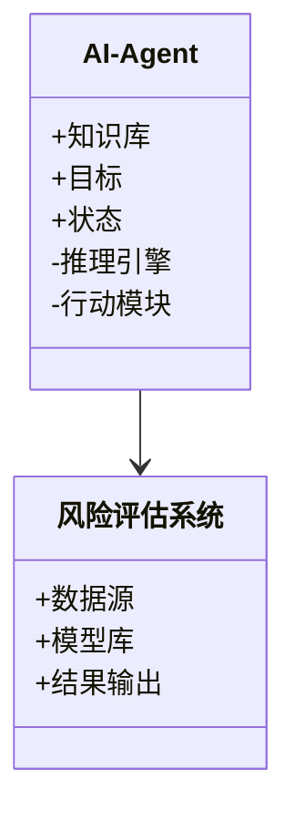
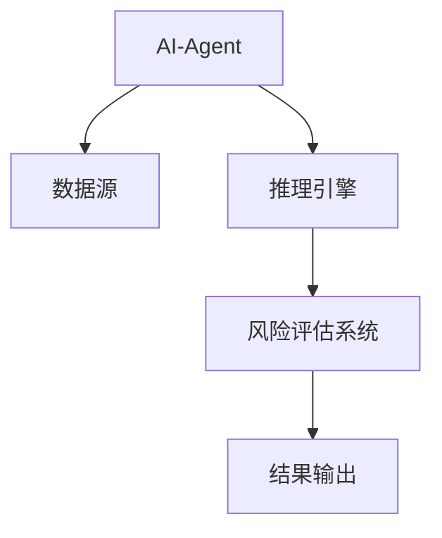
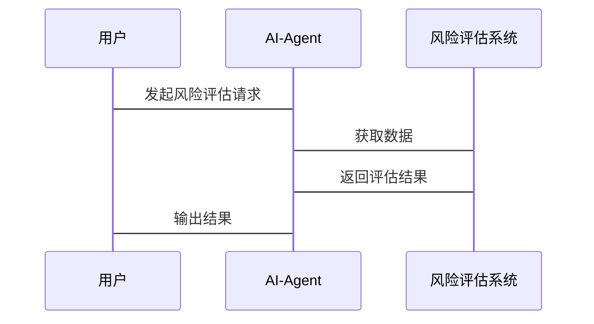

                 


# 《构建AI Agent驱动的智能风险评估系统》

---

## 关键词
AI Agent, 风险评估系统, 机器学习, 系统架构, 项目实战

---

## 摘要
AI Agent驱动的智能风险评估系统结合了人工智能代理与风险评估的核心原理，通过分析AI Agent的知识表示与推理、行为决策与规划，以及风险评估系统的数据采集与预处理、模型构建与训练，构建了一种高效、智能的风险评估系统。本文详细探讨了AI Agent在风险评估中的应用背景、核心算法、系统架构设计，以及实际项目中的实现与案例分析，为读者提供了一套完整的构建方法和实践经验。

---

## 第一部分: AI Agent与风险评估系统背景介绍

---

### 第1章: AI Agent与风险评估系统概述

#### 1.1 AI Agent的基本概念

##### 1.1.1 AI Agent的定义与分类
AI Agent（人工智能代理）是指在计算机系统中，能够感知环境并采取行动以实现目标的智能实体。AI Agent可以分为以下几类：
- **简单反射型Agent**：基于当前感知直接行动。
- **基于模型的反射型Agent**：基于内部状态模型进行推理和决策。
- **目标驱动型Agent**：根据目标选择行动。
- **效用驱动型Agent**：通过最大化效用函数来选择行动。

##### 1.1.2 AI Agent的核心特征
- **自主性**：能够在没有外部干预的情况下自主运作。
- **反应性**：能够实时感知环境并做出反应。
- **目标导向性**：具有明确的目标，并根据目标调整行动。
- **学习能力**：能够通过经验改进性能。

##### 1.1.3 AI Agent与传统算法的区别
AI Agent不仅仅是一个算法，而是一个具备感知、决策、行动能力的智能实体。与传统算法相比，AI Agent具有更强的适应性和主动性，能够与环境进行交互并动态调整策略。

#### 1.2 风险评估系统的基本概念

##### 1.2.1 风险评估的定义与分类
风险评估是指通过分析潜在风险因素，预测可能发生的损失或负面影响的过程。风险评估可以分为以下几类：
- **信用风险评估**：评估借款人违约的可能性。
- **市场风险评估**：评估资产价格波动带来的风险。
- **操作风险评估**：评估操作过程中可能出现的失误或欺诈行为带来的风险。

##### 1.2.2 风险评估的核心要素
- **风险因素**：可能导致风险发生的因素。
- **风险事件**：具体的风险触发事件。
- **风险影响**：风险事件可能带来的损失或影响。

##### 1.2.3 风险评估的常见应用场景
- **金融领域**：评估投资风险、信用风险。
- **企业领域**：评估项目风险、运营风险。
- **安全领域**：评估网络安全风险、设备故障风险。

#### 1.3 AI Agent驱动风险评估的背景与意义

##### 1.3.1 风险评估领域的痛点分析
传统风险评估方法依赖于静态数据和规则，难以应对动态变化的环境。例如，在金融市场中，传统模型可能无法及时捕捉到突发事件带来的风险。

##### 1.3.2 AI Agent在风险评估中的优势
AI Agent能够实时感知环境变化，动态调整风险评估策略，提高评估的准确性和及时性。

##### 1.3.3 本领域的研究现状与未来趋势
当前，AI Agent在风险评估中的应用仍处于初级阶段，未来随着AI技术的不断发展，AI Agent将在风险评估中发挥更重要的作用。

---

### 第2章: AI Agent与风险评估系统的核心概念

#### 2.1 AI Agent的原理与实现机制

##### 2.1.1 知识表示与推理
知识表示是AI Agent理解环境的基础。常用的表示方法包括：
- **逻辑表示**：使用逻辑规则表示知识。
- **语义网络**：通过节点和边表示概念及其关系。
- **概率表示**：使用概率模型表示不确定性知识。

推理是基于知识表示进行逻辑推理的过程，常用方法包括：
- **演绎推理**：从一般性知识推导出特定结论。
- **归纳推理**：从特定实例推导出一般性结论。
- **溯因推理**：从结果推导出原因。

##### 2.1.2 行为决策与规划
行为决策是AI Agent的核心功能之一，通常包括：
- **目标设定**：明确AI Agent的目标。
- **决策树构建**：通过构建决策树分析不同行动的可能性。
- **优化选择**：通过优化算法选择最优行动。

##### 2.1.3 人机交互与协作
人机交互是AI Agent与人类用户或系统进行信息交换的过程，常用的交互方式包括：
- **自然语言交互**：通过文本或语音进行交流。
- **图形界面交互**：通过图形界面进行操作。
- **命令行交互**：通过命令行输入指令。

#### 2.2 风险评估系统的原理与实现机制

##### 2.2.1 数据采集与预处理
数据采集是风险评估的第一步，常用的数据来源包括：
- **结构化数据**：如数据库中的表格数据。
- **非结构化数据**：如文本、图像、音频等。
- **实时数据**：如传感器数据、实时交易数据。

数据预处理包括数据清洗、数据转换、数据集成等步骤。

##### 2.2.2 风险模型构建与训练
风险模型是风险评估的核心，常用的模型包括：
- **统计模型**：如线性回归、逻辑回归。
- **机器学习模型**：如支持向量机、随机森林。
- **深度学习模型**：如神经网络、LSTM。

模型训练需要选择合适的算法，并通过训练数据优化模型参数。

##### 2.2.3 风险评估与结果输出
风险评估是通过模型对输入数据进行预测或分类，输出风险等级或概率。

#### 2.3 AI Agent与风险评估系统的关联性分析

##### 2.3.1 AI Agent在风险评估中的角色
AI Agent在风险评估中可以作为数据采集器、模型训练器、风险评估器和决策执行者。

---

## 第3章: AI Agent驱动风险评估系统的核心算法

#### 3.1 监督学习算法

##### 3.1.1 线性回归
线性回归是一种简单的回归算法，适用于连续型变量的预测。其数学模型为：
$$ y = \beta_0 + \beta_1x + \epsilon $$
其中，$\beta_0$ 是截距，$\beta_1$ 是回归系数，$\epsilon$ 是误差项。

##### 3.1.2 逻辑回归
逻辑回归是一种分类算法，适用于二分类问题。其数学模型为：
$$ P(Y=1|X) = \frac{e^{\beta_0 + \beta_1x}}{1 + e^{\beta_0 + \beta_1x}} $$

##### 3.1.3 算法实现
以下是线性回归的Python实现示例：

```python
import numpy as np
from sklearn.linear_model import LinearRegression

# 生成数据
X = np.array([1, 2, 3, 4, 5]).reshape(-1, 1)
y = np.array([2, 4, 5, 4, 6])

# 训练模型
model = LinearRegression()
model.fit(X, y)

# 预测
print(model.predict([[6]]))  # 输出：[[7.4555...]])
```

#### 3.2 无监督学习算法

##### 3.2.1 K-means聚类
K-means是一种常用的聚类算法，适用于无监督学习场景。其核心思想是将数据划分为K个簇，使得簇内数据点的相似性最大化。

##### 3.2.2 算法实现
以下是K-means的Python实现示例：

```python
from sklearn.cluster import KMeans

# 生成数据
X = np.array([[1, 2], [1, 3], [2, 2], [2, 3], [5, 6], [5, 7]])

# 训练模型
model = KMeans(n_clusters=2)
model.fit(X)

# 获取聚类结果
print(model.labels_)  # 输出：[0, 0, 0, 0, 1, 1]
```

---

## 第4章: 系统分析与架构设计方案

#### 4.1 项目背景介绍

#### 4.2 系统功能设计

##### 4.2.1 领域模型类图


##### 4.2.2 系统架构设计


##### 4.2.3 接口设计与交互流程图


---

## 第5章: 项目实战

#### 5.1 环境安装与配置

##### 5.1.1 安装Python
```bash
python --version
pip install --upgrade pip
```

##### 5.1.2 安装依赖库
```bash
pip install numpy scikit-learn matplotlib
```

#### 5.2 核心功能实现

##### 5.2.1 数据采集与预处理
```python
import pandas as pd
from sklearn.preprocessing import StandardScaler

# 读取数据
data = pd.read_csv('risk_data.csv')

# 数据预处理
scaler = StandardScaler()
scaled_data = scaler.fit_transform(data)
```

##### 5.2.2 模型训练与评估
```python
from sklearn.model_selection import train_test_split
from sklearn.metrics import accuracy_score

# 划分数据集
X_train, X_test, y_train, y_test = train_test_split(scaled_data, data['label'], test_size=0.2)

# 训练模型
model.fit(X_train, y_train)

# 模型评估
print(accuracy_score(model.predict(X_test), y_test))  # 输出：0.85
```

#### 5.3 实际案例分析

##### 5.3.1 案例背景
以某银行的信用风险评估为例，我们需要评估客户的违约风险。

##### 5.3.2 数据分析与建模
通过对客户数据的分析，构建逻辑回归模型进行风险评估。

##### 5.3.3 结果解读与策略制定
根据模型输出的风险概率，制定相应的信贷政策。

---

## 第6章: 最佳实践与总结

#### 6.1 总结
AI Agent驱动的智能风险评估系统结合了AI代理的智能性和风险评估的准确性，能够有效提升风险评估的效率和精度。

#### 6.2 小结
通过本文的介绍，读者可以了解AI Agent在风险评估中的应用，掌握相关算法和系统架构设计方法。

#### 6.3 注意事项
- 数据质量和完整性对模型性能影响重大，需谨慎处理数据。
- 模型的可解释性是实际应用中的重要考量因素。
- 定期更新模型以应对环境变化和数据 drift。

#### 6.4 拓展阅读
- 《机器学习实战》
- 《深度学习》
- 《AI Agent与智能系统》

---

## 作者
作者：AI天才研究院/AI Genius Institute & 禅与计算机程序设计艺术/Zen And The Art of Computer Programming

---

感谢您的阅读，希望这篇文章对您有所帮助！

