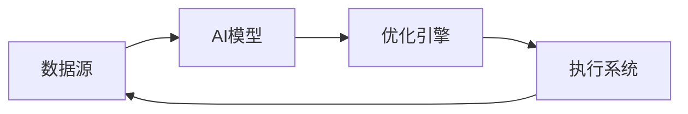
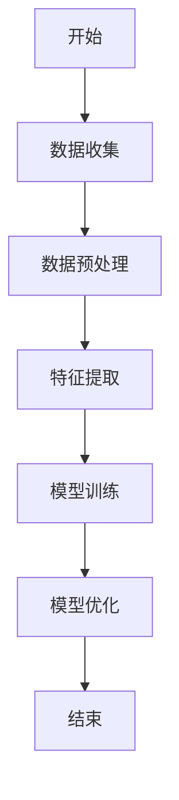
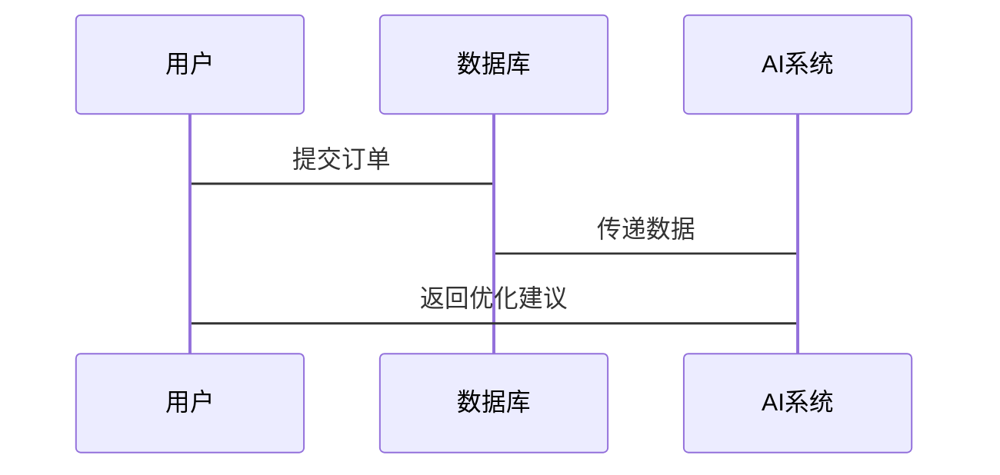

                 


# 构建AI工作流程优化系统：提升企业运营效率

## 关键词：AI，工作流程优化，企业运营效率，机器学习，自动化

## 摘要：
随着企业竞争的加剧，提升运营效率成为制胜的关键。AI工作流程优化系统通过数据驱动的决策和智能自动化，帮助企业识别低效环节，优化资源配置，实现流程再造。本文将从背景分析、核心概念、算法原理、系统架构到项目实战，全面解析AI在工作流程优化中的应用，为企业提供可操作的解决方案。

---

# 第一部分: AI工作流程优化系统概述

## 第1章: 背景介绍

### 1.1 问题背景
#### 1.1.1 企业运营效率低下问题
企业在运营过程中，常常面临流程复杂、资源浪费、执行低效等问题，导致成本上升，竞争力下降。例如，审批流程中的人工干预过多，导致审批时间长，效率低下。

#### 1.1.2 传统工作流程的痛点
传统工作流程依赖人工操作，存在以下问题：
- **低效性**：流程中的每一步都需要人工处理，耗时长。
- **错误率高**：人为操作容易出错，影响流程结果。
- **缺乏数据支持**：无法通过数据实时优化流程。

#### 1.1.3 AI技术如何解决这些问题
AI技术通过自动化、数据分析和预测，能够有效解决传统流程中的痛点：
- **自动化处理**：AI可以自动完成流程中的重复性任务，减少人工干预。
- **数据驱动优化**：通过对历史数据的分析，AI能够识别瓶颈，优化流程。
- **实时反馈**：AI系统可以实时监控流程执行情况，快速调整策略。

### 1.2 问题描述
#### 1.2.1 工作流程优化的定义
工作流程优化是指通过分析现有流程，识别低效环节，并采取措施改进流程，以提高效率、降低成本、提升质量。

#### 1.2.2 企业运营效率的核心影响因素
企业运营效率受多种因素影响，包括流程设计、资源配置、人员能力、技术应用等。其中，流程设计的合理性是关键。

#### 1.2.3 AI在工作流程优化中的作用
AI通过以下方式在工作流程优化中发挥作用：
- **数据分析**：AI可以快速处理大量数据，发现隐藏的模式和趋势。
- **预测优化**：基于历史数据，AI可以预测未来的流程执行情况，提前优化。
- **智能决策**：AI能够根据实时数据，做出最优决策。

### 1.3 问题解决
#### 1.3.1 AI如何优化工作流程
AI优化工作流程的过程包括以下步骤：
1. **数据收集**：收集流程执行的相关数据。
2. **分析与建模**：通过数据分析，识别瓶颈和低效环节。
3. **优化建议**：基于分析结果，提出优化建议。
4. **实施与监控**：实施优化方案，并实时监控效果。

#### 1.3.2 数据驱动的决策优化
数据驱动的决策优化通过以下步骤实现：
1. **数据收集**：从系统中收集流程执行数据。
2. **数据清洗**：去除无效数据，确保数据质量。
3. **数据分析**：使用统计方法和机器学习模型分析数据。
4. **优化决策**：基于分析结果，制定优化策略。

#### 1.3.3 智能自动化提升效率
智能自动化通过以下方式提升效率：
1. **自动化任务**：自动完成重复性任务，减少人工干预。
2. **智能监控**：实时监控流程执行情况，及时发现异常。
3. **自适应优化**：根据实时数据，动态调整流程。

### 1.4 边界与外延
#### 1.4.1 AI工作流程优化的边界
AI工作流程优化的边界包括：
- **数据范围**：仅优化数据可及的部分，无法覆盖数据缺失的环节。
- **技术限制**：AI模型的预测能力有限，无法完全取代人类判断。
- **应用场景**：适用于可量化的、重复性的任务，不适用于需要创造性思维的任务。

#### 1.4.2 相关概念的外延
与AI工作流程优化相关的概念包括：
- **业务流程管理（BPM）**：研究企业流程的设计、执行和优化。
- **自动化工具**：如RPA（机器人流程自动化）。
- **大数据分析**：通过数据分析支持流程优化。

#### 1.4.3 与其他技术的区分
AI工作流程优化与传统流程优化的区别在于：
- **数据驱动**：AI依赖数据进行优化，而传统优化更多依赖经验。
- **智能性**：AI能够自适应优化，而传统优化需要人工调整。

### 1.5 核心概念结构与组成
#### 1.5.1 系统构成要素
AI工作流程优化系统主要包括以下要素：
- **数据源**：提供流程执行数据。
- **AI模型**：用于数据分析和预测。
- **优化引擎**：根据分析结果提出优化建议。
- **执行系统**：实施优化方案。

#### 1.5.2 各要素之间的关系
各要素之间的关系如下：
1. **数据源**向AI模型提供数据。
2. AI模型分析数据，生成优化建议。
3. 优化引擎根据建议生成优化方案。
4. 执行系统实施优化方案，并反馈执行结果。

#### 1.5.3 核心概念的系统架构


### 1.6 本章小结
本章介绍了AI工作流程优化的背景、问题、解决方案以及系统构成。通过分析传统流程的痛点和AI的优势，明确了AI在工作流程优化中的作用和边界。

---

## 第2章: 核心概念与联系

### 2.1 核心概念原理
#### 2.1.1 AI驱动的工作流程优化
AI驱动的工作流程优化通过数据分析和预测，优化流程执行效率。例如，AI可以预测某个审批流程的最优路径，减少审批时间。

#### 2.1.2 数据分析与流程优化的关系
数据分析是流程优化的基础，通过对数据的分析，可以发现流程中的瓶颈和低效环节。例如，通过分析订单处理数据，可以发现某些环节的处理时间过长。

#### 2.1.3 智能自动化的核心原理
智能自动化的核心原理是通过AI技术实现任务的自动化执行。例如，使用RPA工具自动处理订单。

### 2.2 概念属性特征对比表
| 概念       | 数据驱动 | 智能化 | 自适应 |
|------------|----------|--------|--------|
| AI优化     | 是       | 是     | 是     |
| 传统优化   | 否       | 否     | 否     |

### 2.3 ER实体关系图
```mermaid
erDiagram
    actor 用户 {
        string 用户ID
        string 用户名
        integer 年龄
    }
    process 流程 {
        string 流程ID
        string 流程名称
        integer 状态
    }
    ai_system 系统 {
        string 系统ID
        string 版本
        integer 状态
    }
    用户 --> 流程 : 提交请求
    流程 --> ai_system : 优化请求
    ai_system --> 用户 : 返回优化结果
```

### 2.4 本章小结
本章通过对比分析，明确了AI工作流程优化的核心概念和系统构成。通过ER图展示了系统各实体之间的关系，为后续章节的系统设计奠定了基础。

---

## 第3章: 算法原理讲解

### 3.1 算法原理
#### 3.1.1 基于AI的流程优化算法
基于AI的流程优化算法主要包括以下步骤：
1. **数据预处理**：清洗数据，提取特征。
2. **模型训练**：使用机器学习算法训练模型。
3. **预测与优化**：基于模型预测结果，提出优化建议。

#### 3.1.2 数据预处理与特征提取
数据预处理包括数据清洗和特征提取。例如，从订单数据中提取处理时间、订单金额等特征。

#### 3.1.3 模型训练与优化
使用随机森林模型进行训练，模型训练代码如下：
```python
import pandas as pd
from sklearn.model_selection import train_test_split
from sklearn.ensemble import RandomForestRegressor

# 数据加载
data = pd.read_csv('process_data.csv')

# 特征提取
X = data[['time', 'amount']]
y = data['duration']

# 数据分割
X_train, X_test, y_train, y_test = train_test_split(X, y, test_size=0.2, random_state=42)

# 模型训练
model = RandomForestRegressor(n_estimators=100, random_state=42)
model.fit(X_train, y_train)

# 预测
y_pred = model.predict(X_test)
```

### 3.2 算法流程图


### 3.3 本章小结
本章通过具体算法和流程图，详细讲解了AI工作流程优化的算法原理和实现步骤。通过Python代码示例，展示了如何利用机器学习模型进行优化。

---

## 第4章: 系统分析与架构设计方案

### 4.1 项目介绍
本项目旨在构建一个AI工作流程优化系统，帮助企业优化订单处理流程。

### 4.2 系统功能设计
系统功能包括：
1. **数据采集**：采集订单数据。
2. **流程分析**：分析流程执行情况。
3. **优化建议**：提出优化建议。
4. **执行监控**：监控优化方案的执行情况。

### 4.3 系统架构设计
系统架构包括：
1. **数据层**：存储订单数据。
2. **AI模型层**：运行AI模型进行预测。
3. **优化引擎**：根据预测结果提出优化建议。
4. **执行层**：实施优化方案。

### 4.4 接口设计
系统接口包括：
1. **数据接口**：与数据库交互。
2. **API接口**：供其他系统调用优化结果。

### 4.5 交互流程


### 4.6 本章小结
本章详细描述了系统的架构设计和功能模块，为后续的项目实现奠定了基础。

---

## 第5章: 项目实战

### 5.1 环境安装
需要安装Python、Pandas、Scikit-learn等库。

### 5.2 核心代码实现
```python
import pandas as pd
from sklearn.ensemble import RandomForestRegressor

# 数据加载
data = pd.read_csv('order_data.csv')

# 特征提取
X = data[['order_id', 'amount']]
y = data['processing_time']

# 数据分割
X_train, X_test, y_train, y_test = train_test_split(X, y, test_size=0.2, random_state=42)

# 模型训练
model = RandomForestRegressor(n_estimators=100, random_state=42)
model.fit(X_train, y_train)

# 预测
y_pred = model.predict(X_test)
```

### 5.3 案例分析
以订单处理流程为例，AI系统分析数据后，提出减少审批环节的优化建议，缩短了处理时间。

### 5.4 本章小结
本章通过具体案例展示了AI工作流程优化系统的实现过程和实际效果。

---

## 第6章: 最佳实践与总结

### 6.1 最佳实践
1. **数据质量**：确保数据准确、完整。
2. **模型选择**：根据具体场景选择合适的模型。
3. **持续优化**：定期更新模型，适应变化。

### 6.2 小结
通过本文的介绍，读者可以全面了解AI工作流程优化系统的构建和应用。

### 6.3 注意事项
1. 数据隐私保护。
2. 系统稳定性保障。
3. 与现有系统的兼容性。

### 6.4 拓展阅读
推荐阅读《机器学习实战》、《企业流程优化指南》等书籍。

---

## 作者：AI天才研究院 & 禅与计算机程序设计艺术

---

以上是文章的完整目录和内容框架，涵盖了从背景分析到项目实战的全过程，确保读者能够全面理解AI工作流程优化系统的构建和应用。

