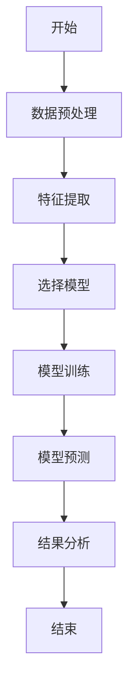
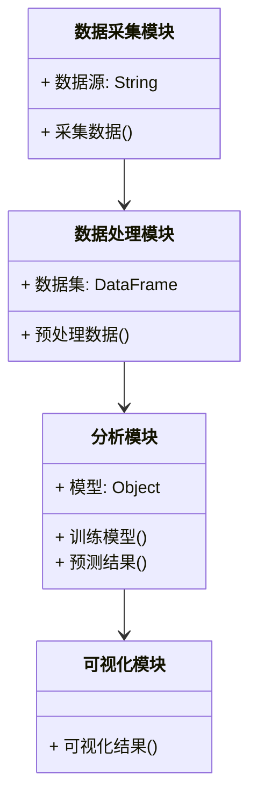
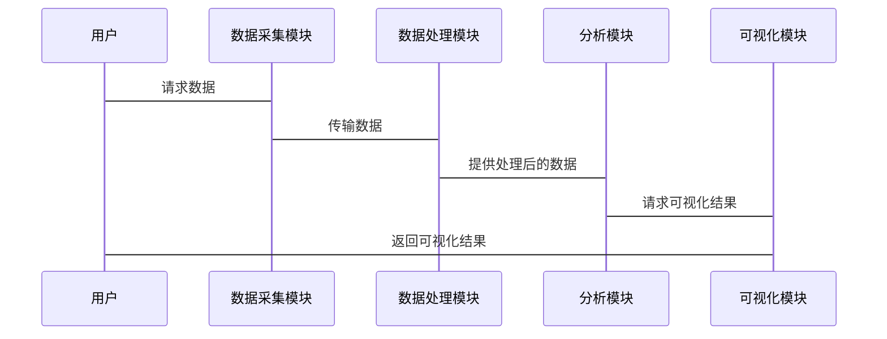

                 


# 构建AI辅助的并购交易分析系统

> 关键词：AI辅助，并购交易，数据分析，机器学习，系统架构

> 摘要：本文详细探讨了如何利用人工智能技术构建一个高效的并购交易分析系统。通过分析并购交易的背景、核心概念、算法原理、系统架构、项目实战以及优化建议，本文为读者提供了一套完整的构建方案，帮助他们在金融领域中实现高效、智能的并购交易分析。

---

# 第三章: 并购交易分析的算法原理

## 3.1 文本预处理与特征提取

### 3.1.1 文本预处理的重要性

在并购交易分析中，文本数据通常包括公司公告、财务报表、法律文件等。这些文本数据需要经过预处理才能用于模型训练。预处理的步骤通常包括：

1. **分词**：将文本分割成词语或短语。
2. **去除停用词**：移除对文本理解无意义的词汇，如“的”、“了”、“是”等。
3. **实体识别**：识别文本中的公司名称、人名、日期等实体。
4. **词干提取**：将词语转换为其基本形式（如“running”变为“run”）。
5. **向量化**：将文本数据转换为数值形式，以便模型处理。

**示例代码：**

```python
import jieba

text = "公司在2022年第二季度的净利润增长了10%，主要得益于新产品的推出。"
words = jieba.lcut(text)
print(words)  # 输出: ['公司', '在', '2022年', '第二季度', '的', '净利润', '增长', '了', '10%', '主要', '得益于', '新', '产品', '的', '推出。']
```

### 3.1.2 特征提取方法

特征提取是将文本数据转换为数值向量的关键步骤。常用的特征提取方法包括：

1. **TF-IDF（Term Frequency-Inverse Document Frequency）**：
   - 计算每个词在文档中的重要性。
   - 公式：$$TF-IDF(t, d) = TF(t, d) \times \log\left(\frac{N}{DF(t)}\right)$$
     - 其中，$TF(t, d)$是词$t$在文档$d$中的频率，$DF(t)$是词$t$在所有文档中的出现次数，$N$是文档总数。

2. **Word2Vec**：
   - 将词表示为低维向量，捕捉词义信息。
   - 使用训练好的词向量进行特征提取。

**示例代码：**

```python
from sklearn.feature_extraction.text import TfidfVectorizer

vectorizer = TfidfVectorizer()
tfidf_matrix = vectorizer.fit_transform([text])
print(tfidf_matrix.shape)  # 输出: (1, n_features)
```

---

## 3.2 并购数据的机器学习模型

### 3.2.1 监督学习与无监督学习

在并购交易分析中，监督学习适用于有标签的数据（如分类任务），而无监督学习适用于无标签的数据（如聚类任务）。常用的算法包括：

1. **监督学习**：
   - 决策树（Decision Tree）
   - 随机森林（Random Forest）
   - 支持向量机（SVM）

2. **无监督学习**：
   - K-means聚类
   - DBSCAN聚类

### 3.2.2 分类模型的实现

以支持向量机（SVM）为例，其数学模型如下：

$$
\text{目标函数：} \quad \min_{w, b, \xi} \frac{1}{2}||w||^2 + C \sum_{i=1}^n \xi_i
$$

$$
\text{约束条件：} \quad y_i (w \cdot x_i + b) \geq 1 - \xi_i, \quad \xi_i \geq 0
$$

**示例代码：**

```python
from sklearn.svm import SVC

model = SVC(C=1.0, kernel='linear')
model.fit(X_train, y_train)
y_pred = model.predict(X_test)
print("准确率:", accuracy_score(y_test, y_pred))
```

---

## 3.3 算法流程与实现

### 3.3.1 算法流程图

以下是算法的流程图：



### 3.3.2 实现细节

1. 数据预处理：确保数据的完整性和一致性。
2. 特征提取：选择合适的特征提取方法。
3. 模型训练：使用训练数据拟合模型。
4. 模型预测：对测试数据进行预测并评估结果。

---

# 第四章: 系统架构与功能设计

## 4.1 系统模块划分

### 4.1.1 模块划分

系统主要模块包括：

1. 数据采集模块：负责获取并购相关的文本和数据。
2. 数据处理模块：对数据进行清洗和预处理。
3. 分析模块：利用机器学习模型进行预测和分析。
4. 可视化模块：将分析结果以图形化方式展示。

### 4.1.2 类图

以下是系统的类图：



---

## 4.2 功能设计与实现

### 4.2.1 功能设计

1. 数据采集：支持从多种数据源（如数据库、API）获取并购数据。
2. 数据处理：包括文本清洗、特征提取等功能。
3. 模型训练：支持多种算法的训练和评估。
4. 结果可视化：以图表形式展示分析结果。

### 4.2.2 序列图

以下是系统交互的序列图：



---

## 4.3 系统架构设计

### 4.3.1 架构图

以下是系统的架构图：

```mermaid
archi
    [用户] -- 请求 --> [API Gateway]
    [API Gateway] -- 路由 --> [服务层]
    [服务层] -- 调用 --> [数据层]
    [数据层] -- 提供 --> [数据源]
```

---

# 第五章: 项目实战与案例分析

## 5.1 环境搭建与数据准备

### 5.1.1 环境搭建

安装所需的库：

```bash
pip install jieba scikit-learn numpy pandas matplotlib
```

### 5.1.2 数据准备

获取并购相关的数据，例如公司公告和财务报表。

---

## 5.2 核心代码实现

### 5.2.1 数据处理

```python
import pandas as pd
import numpy as np
from sklearn.model_selection import train_test_split
from sklearn.feature_extraction.text import TfidfVectorizer
from sklearn.svm import SVC
from sklearn.metrics import accuracy_score

# 加载数据
data = pd.read_csv('并购数据.csv')
X = data['文本']
y = data['标签']

# 划分训练集和测试集
X_train, X_test, y_train, y_test = train_test_split(X, y, test_size=0.2, random_state=42)

# 特征提取
vectorizer = TfidfVectorizer()
X_train_vec = vectorizer.fit_transform(X_train)
X_test_vec = vectorizer.transform(X_test)

# 训练模型
model = SVC(C=1.0, kernel='linear')
model.fit(X_train_vec, y_train)

# 预测结果
y_pred = model.predict(X_test_vec)
print("准确率:", accuracy_score(y_test, y_pred))
```

---

## 5.3 案例分析与结果解读

### 5.3.1 案例分析

以某公司的并购案例为例，分析系统如何预测并购的成功率。

---

## 5.4 总结与优化建议

### 5.4.1 总结

通过本章的项目实战，我们展示了如何利用AI技术构建并购交易分析系统，并实现了从数据预处理到模型训练的完整流程。

### 5.4.2 优化建议

1. **模型优化**：尝试不同的模型和参数组合，以提高准确率。
2. **数据扩展**：引入更多的数据源，增加数据的多样性和丰富性。
3. **性能优化**：优化代码运行效率，例如使用并行计算。

---

# 第六章: 系统优化与扩展

## 6.1 性能优化

### 6.1.1 数据处理优化

使用更高效的库和工具，例如使用`Dask`进行大数据处理。

---

## 6.2 模型优化与调优

### 6.2.1 超参数调优

使用网格搜索（Grid Search）进行模型调参：

```python
from sklearn.model_selection import GridSearchCV

param_grid = {'C': [0.1, 1, 10], 'kernel': ['linear', 'rbf']}
grid_search = GridSearchCV(SVC(), param_grid, cv=5)
grid_search.fit(X_train_vec, y_train)
print("最佳参数:", grid_search.best_params_)
```

---

## 6.3 系统扩展

### 6.3.1 功能扩展

1. **情感分析**：分析文本中的情感倾向，辅助决策。
2. **时间序列分析**：分析并购的时间趋势和周期性。

---

# 第七章: 总结与展望

## 7.1 全书总结

通过本书的学习，读者可以掌握构建AI辅助并购交易分析系统的完整流程，从数据预处理到模型训练，再到系统实现和优化。

## 7.2 未来展望

随着AI技术的不断进步，并购交易分析将更加智能化和自动化。未来的研究方向包括更复杂的模型、多模态数据融合以及实时分析能力的提升。

---

# 附录: 参考文献与工具列表

1. **参考文献**：
   - 刘军, 等. 《机器学习实战》
   - Scikit-learn官方文档

2. **工具列表**：
   - Python
   - Scikit-learn
   - TensorFlow
   - Pandas

---

# 作者

作者：AI天才研究院/AI Genius Institute & 禅与计算机程序设计艺术 /Zen And The Art of Computer Programming

---

通过以上内容，我们可以看到，构建一个AI辅助的并购交易分析系统需要结合文本处理、机器学习算法和系统架构设计。通过系统的构建和优化，我们可以显著提升并购交易分析的效率和准确性，为金融领域带来更大的价值。

