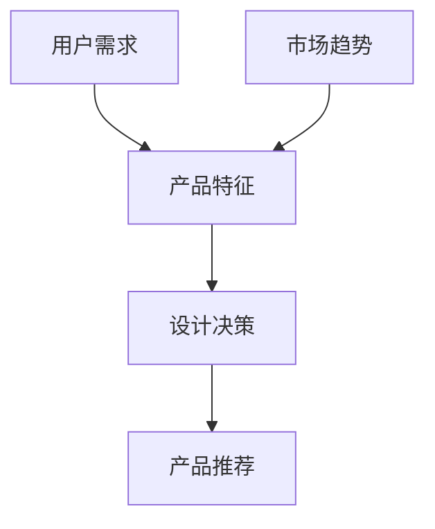
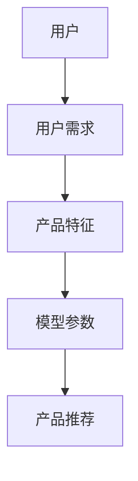
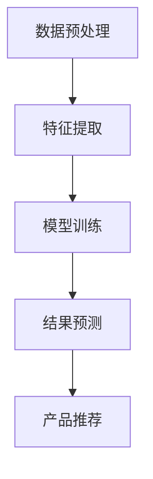

                 


# 《构建AI辅助的金融产品设计系统》

---

## 关键词：
AI、金融产品设计、机器学习、深度学习、系统架构、数据驱动

---

## 摘要：
本文深入探讨了如何利用人工智能技术构建一个高效的金融产品设计系统。通过分析金融产品设计的痛点与挑战，结合AI的核心原理，提出了基于数据驱动的设计理念，详细阐述了AI辅助设计的算法原理、系统架构、功能模块及实现案例。本文内容涵盖从理论到实践的全过程，旨在为金融行业的技术实践者提供一套系统化的解决方案，帮助他们高效地设计和优化金融产品。

---

# 第1章：AI辅助金融产品设计的背景与问题背景

## 1.1 问题背景

### 1.1.1 传统金融产品设计的局限性
传统金融产品设计依赖于人工经验与规则，存在以下问题：
- **效率低下**：设计过程耗时长，依赖人工经验，难以快速响应市场需求。
- **主观性较强**：依赖设计师的个人经验，难以实现客观化、量化的设计决策。
- **数据利用不足**：传统设计方法难以充分利用海量数据，难以挖掘潜在的用户需求与市场趋势。

### 1.1.2 AI技术在金融领域的应用现状
AI技术在金融领域的应用已经逐渐成熟，主要集中在以下方面：
- **风险控制**：利用机器学习模型进行信用评估、欺诈检测。
- **投资决策**：通过量化分析和预测模型辅助投资决策。
- **客户画像**：基于大数据分析构建用户画像，精准营销。

然而，AI在金融产品设计领域的应用仍处于探索阶段，尚未形成系统化的解决方案。

### 1.1.3 金融产品设计中的痛点与挑战
- **复杂性**：金融产品涉及多种变量，如市场波动、用户需求、政策变化等，设计过程复杂。
- **数据多样性**：需要整合多源异构数据，包括用户行为数据、市场数据、政策数据等。
- **模型可解释性**：AI模型的黑箱特性使得设计决策难以解释，影响实际应用。

---

## 1.2 问题描述

### 1.2.1 金融产品设计的复杂性
金融产品的设计需要考虑以下几个方面：
- **用户需求**：不同用户群体的需求差异性大。
- **市场环境**：宏观经济环境、政策变化对产品设计的影响。
- **产品特性**：产品的风险、收益、流动性等关键指标需要平衡。

### 1.2.2 数据驱动的必要性
AI技术的核心是数据驱动，金融产品设计需要依赖于以下数据：
- **用户行为数据**：用户的交易记录、投资偏好等。
- **市场数据**：市场波动、行业趋势等。
- **政策数据**：监管政策的变化对产品设计的影响。

### 1.2.3 AI辅助设计的可行性与优势
AI技术在金融产品设计中的优势：
- **数据处理能力**：能够快速处理海量数据，提取有用信息。
- **自动化设计能力**：通过模型预测和优化，辅助设计决策。
- **实时反馈能力**：能够根据市场变化实时调整设计策略。

---

## 1.3 问题解决

### 1.3.1 AI辅助设计的核心思路
AI辅助金融产品设计的核心思路是：
- **数据驱动**：利用AI技术对数据进行深度挖掘，提取用户需求和市场趋势。
- **模型优化**：通过机器学习模型对产品设计进行预测和优化。
- **人机协作**：结合人类设计师的经验和AI模型的预测能力，实现人机协作设计。

### 1.3.2 数据、模型与场景的结合
- **数据**：包括用户行为数据、市场数据、政策数据等。
- **模型**：包括推荐算法、生成模型、优化模型等。
- **场景**：结合具体的金融场景，如投资、借贷、保险等。

### 1.3.3 系统化解决方案的构建
构建一个AI辅助的金融产品设计系统，需要整合以下要素：
- **数据采集模块**：采集用户行为数据、市场数据等。
- **模型训练模块**：训练机器学习模型，提取数据特征。
- **产品推荐模块**：基于模型预测结果推荐产品设计方案。
- **反馈优化模块**：根据实际效果优化模型和设计方案。

---

## 1.4 系统边界与外延

### 1.4.1 系统边界定义
AI辅助的金融产品设计系统的核心功能包括：
- **数据采集**：收集用户行为数据、市场数据等。
- **模型训练**：训练机器学习模型，提取数据特征。
- **产品推荐**：根据模型预测结果推荐产品设计方案。
- **反馈优化**：根据实际效果优化模型和设计方案。

### 1.4.2 系统功能的外延
- **用户界面**：提供友好的用户界面，方便用户操作。
- **数据可视化**：将数据和模型结果可视化，便于理解。
- **系统监控**：实时监控系统运行状态，确保系统稳定。

### 1.4.3 与其他金融系统的接口关系
- **与投资决策系统的接口**：共享市场数据和用户画像。
- **与风险控制系统接口**：共享用户信用评分和风险评估结果。
- **与客户关系管理系统接口**：共享用户行为数据和客户画像。

---

## 1.5 核心概念结构与组成

### 1.5.1 核心概念框架
AI辅助的金融产品设计系统的核心概念框架包括：
- **用户需求**：用户的投资偏好、风险承受能力等。
- **市场趋势**：宏观经济指标、行业趋势等。
- **产品特征**：产品的风险、收益、流动性等。

### 1.5.2 关键要素与关系
- **用户需求与产品特征**：用户需求驱动产品特征的设计。
- **市场趋势与产品特征**：市场趋势影响产品特征的优化。
- **数据与模型**：数据驱动模型训练，模型指导产品设计。

### 1.5.3 概念结构图


---

# 第2章：AI辅助设计的核心概念与联系

## 2.1 核心概念原理

### 2.1.1 数据驱动的设计理念
数据驱动的设计理念强调通过数据的分析和挖掘，提取有用的信息，指导设计决策。在金融产品设计中，数据驱动的具体体现包括：
- **用户画像**：通过分析用户行为数据，构建用户画像，了解用户的投资偏好和风险承受能力。
- **市场趋势**：通过分析市场数据，预测市场的未来走势，为产品设计提供依据。

### 2.1.2 AI模型的特征提取与预测能力
AI模型在金融产品设计中的应用主要体现在特征提取和预测两个方面：
- **特征提取**：通过机器学习模型提取用户行为数据和市场数据中的特征，例如用户的交易频率、市场波动率等。
- **预测能力**：利用模型预测用户对不同产品设计方案的偏好，以及市场的未来走势。

### 2.1.3 人机协作的设计模式
人机协作的设计模式结合了人类设计师的经验和AI模型的预测能力，通过以下方式实现：
- **输入阶段**：人类设计师根据市场趋势和用户需求，提供初步的设计方案。
- **优化阶段**：AI模型对设计方案进行优化，提出改进建议。
- **输出阶段**：最终的设计方案由人类设计师确认，并输出给相关部门。

---

## 2.2 核心概念属性对比

### 2.2.1 数据特征与模型特征对比
- **数据特征**：来源于用户行为数据和市场数据，例如用户的交易频率、市场的波动率等。
- **模型特征**：通过机器学习模型提取的特征，例如用户的信用评分、市场的风险指数等。

### 2.2.2 传统设计与AI辅助设计的对比
| 对比维度 | 传统设计 | AI辅助设计 |
|----------|----------|------------|
| **效率** | 低       | 高         |
| **准确性** | 主观性较强 | 客观性较强 |
| **灵活性** | 较低     | 较高       |

### 2.2.3 不同AI模型的性能对比
| 模型类型 | 优点 | 缺点 |
|----------|------|------|
| 线性回归 | 简单、易于解释 | 无法处理非线性关系 |
| 支持向量机 | 适合高维数据 | 参数敏感性高 |
| 神经网络 | 能处理复杂模式 | 黑箱问题，可解释性差 |

---

## 2.3 ER实体关系图



---

# 第3章：AI辅助设计的核心算法

## 3.1 算法原理

### 3.1.1 基于机器学习的推荐算法
推荐算法是AI辅助设计的核心算法之一，常用的推荐算法包括：
- **协同过滤**：基于用户相似性或物品相似性进行推荐。
- **基于内容的推荐**：基于产品的特征进行推荐。
- **混合推荐**：结合协同过滤和基于内容的推荐方法。

### 3.1.2 基于深度学习的生成模型
生成模型在金融产品设计中的应用主要体现在生成新的产品设计方案。常用的生成模型包括：
- **循环神经网络（RNN）**：用于生成序列数据。
- **变分自编码器（VAE）**：用于生成高维数据。
- **生成对抗网络（GAN）**：通过对抗训练生成高质量数据。

### 3.1.3 多目标优化的数学模型
多目标优化模型在金融产品设计中的应用主要体现在如何在多个目标之间找到平衡点，例如在风险和收益之间找到最优解。

---

## 3.2 算法流程图



---

## 3.3 算法实现代码

### 3.3.1 线性回归模型实现
```python
import numpy as np
from sklearn.linear_model import LinearRegression

# 示例数据
X = np.array([[1], [2], [3], [4]])
y = np.array([2, 4, 6, 8])

# 模型训练
model = LinearRegression()
model.fit(X, y)

# 预测
print(model.predict([[5]]))  # 输出：[[10]]
```

### 3.3.2 支持向量机模型实现
```python
from sklearn.svm import SVC
from sklearn.datasets import make_classification
from sklearn.model_selection import train_test_split

# 示例数据
X, y = make_classification(n_samples=100, n_features=2, n_classes=2, random_state=42)

# 数据划分
X_train, X_test, y_train, y_test = train_test_split(X, y, test_size=0.2, random_state=42)

# 模型训练
model = SVC()
model.fit(X_train, y_train)

# 预测
print(model.score(X_test, y_test))  # 输出：模型准确率
```

---

## 3.4 算法的数学模型与公式

### 3.4.1 线性回归模型
线性回归的数学模型可以表示为：
$$ y = \beta_0 + \beta_1 x + \epsilon $$

其中，$\beta_0$ 是截距，$\beta_1$ 是回归系数，$\epsilon$ 是误差项。

### 3.4.2 支持向量机模型
支持向量机的数学模型可以表示为：
$$ y = \text{sign}(\sum_{i=1}^n \alpha_i y_i x_i \cdot x + b) $$

其中，$\alpha_i$ 是拉格朗日乘子，$y_i$ 是样本标签，$x_i$ 是支持向量，$b$ 是偏置项。

### 3.4.3 神经网络模型
神经网络的数学模型可以表示为：
$$ y = f(Wx + b) $$

其中，$W$ 是权重矩阵，$x$ 是输入向量，$b$ 是偏置向量，$f$ 是激活函数。

---

# 作者：AI天才研究院/AI Genius Institute & 禅与计算机程序设计艺术 /Zen And The Art of Computer Programming

