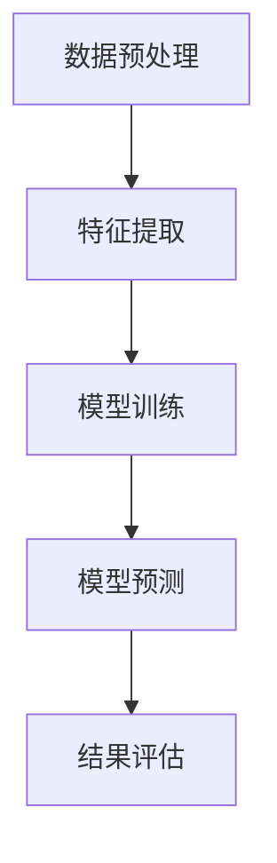
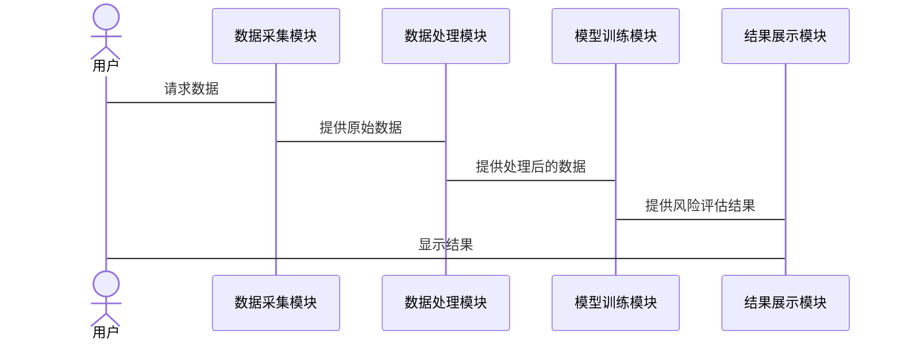

                 


# 构建AI辅助的金融风险度量系统

> 关键词：AI辅助，金融风险，风险度量系统，机器学习，深度学习，金融建模

> 摘要：本文详细探讨了如何利用人工智能技术构建金融风险度量系统。从金融风险的基本概念到AI技术的应用，从算法原理到系统架构设计，再到项目实战，全面解析了AI在金融风险度量中的应用与实现。本文旨在为金融从业者和AI技术爱好者提供一份系统化的指南，帮助他们更好地理解和应用AI技术来提升金融风险度量的效率和准确性。

---

## 第1章: 金融风险度量系统概述

### 1.1 金融风险度量的基本概念

#### 1.1.1 金融风险的定义与分类
金融风险是指在金融活动中，由于各种不确定因素的影响，导致资金损失的可能性。常见的金融风险包括市场风险、信用风险、流动性风险和操作风险等。

#### 1.1.2 金融风险度量的目的与意义
金融风险度量的目的是通过量化和评估潜在风险，帮助金融机构制定合理的风险管理策略，从而降低损失，提高资金使用效率。

#### 1.1.3 金融风险度量的核心要素
金融风险度量的核心要素包括风险因子、概率分布、损失金额和时间维度。

### 1.2 AI技术在金融领域的应用背景

#### 1.2.1 人工智能在金融行业的应用现状
人工智能技术在金融领域的应用越来越广泛，包括智能投顾、信用评分、欺诈检测和市场预测等方面。

#### 1.2.2 金融风险度量中的痛点与挑战
传统金融风险度量方法存在数据不足、模型复杂度高、实时性差等问题，难以应对复杂的金融市场环境。

#### 1.2.3 AI技术如何解决金融风险度量问题
AI技术通过大数据处理、机器学习和深度学习等方法，能够更准确地捕捉市场波动，提高风险预测的实时性和准确性。

### 1.3 本章小结
本章从金融风险的基本概念出发，介绍了AI技术在金融领域的应用背景，并分析了AI技术在金融风险度量中的优势和挑战。

---

## 第2章: AI辅助的金融风险度量系统核心概念

### 2.1 风险度量模型

#### 2.1.1 风险度量模型的分类
常见的风险度量模型包括VaR模型、CVaR模型和风险中性定价模型。

#### 2.1.2 风险度量模型的输入与输出
输入包括历史数据、市场数据和相关指标，输出包括风险值、概率分布和风险评分。

#### 2.1.3 风险度量模型的评估指标
常用的评估指标包括准确率、召回率和F1值。

### 2.2 AI技术的核心原理

#### 2.2.1 机器学习在风险度量中的应用
机器学习通过特征提取和模型训练，能够帮助识别风险因素并预测风险发生概率。

#### 2.2.2 深度学习在风险预测中的优势
深度学习模型能够处理复杂的非线性关系，适用于高维数据和时间序列数据的分析。

#### 2.2.3 自然语言处理在金融文本分析中的作用
自然语言处理技术可以帮助分析新闻、财报等文本数据，提取影响市场风险的关键信息。

### 2.3 系统架构与数据特征

#### 2.3.1 系统架构的组成与功能
系统架构包括数据采集模块、数据处理模块、模型训练模块和结果展示模块。

#### 2.3.2 数据特征的提取与处理
数据特征包括市场指标、公司基本面数据和新闻情感指标。

#### 2.3.3 数据特征与风险度量的关系
通过特征选择和特征工程，可以提高模型的准确性和鲁棒性。

### 2.4 本章小结
本章详细介绍了AI辅助金融风险度量系统的核心概念，包括风险度量模型、AI技术原理和系统架构设计。

---

## 第3章: 风险度量的算法原理

### 3.1 传统风险度量算法

#### 3.1.1 VaR模型
VaR（Value at Risk）模型用于度量资产在给定置信水平下的潜在损失。

#### 3.1.2 CVaR模型
CVaR（Conditional Value at Risk）模型用于度量在VaR条件下的平均损失。

#### 3.1.3 风险中性定价模型
风险中性定价模型通过假设市场不存在系统性风险，来计算资产的理论价格。

### 3.2 基于机器学习的风险度量算法

#### 3.2.1 线性回归模型
线性回归模型用于预测资产价格和风险因子之间的线性关系。

#### 3.2.2 支持向量机模型
支持向量机模型通过构建非线性边界，能够更好地处理复杂的数据分布。

#### 3.2.3 随机森林模型
随机森林模型通过集成学习，能够提高模型的准确性和鲁棒性。

### 3.3 深度学习在风险预测中的应用

#### 3.3.1 神经网络模型
神经网络模型通过多层网络结构，能够捕捉数据中的复杂特征。

#### 3.3.2 卷积神经网络模型
卷积神经网络模型适用于图像和时间序列数据的分析。

#### 3.3.3 循环神经网络模型
循环神经网络模型适用于处理时间序列数据，能够捕捉历史信息的影响。

### 3.4 算法流程图



### 3.5 本章小结
本章详细介绍了传统风险度量算法和基于机器学习的深度学习算法，并通过流程图展示了算法的整体流程。

---

## 第4章: AI辅助的金融风险度量系统架构设计

### 4.1 系统功能设计

#### 4.1.1 数据采集模块
数据采集模块负责从金融市场获取实时数据，包括股票价格、指数和新闻数据。

#### 4.1.2 数据处理模块
数据处理模块负责清洗、转换和特征提取，为模型训练提供高质量的数据。

#### 4.1.3 模型训练模块
模型训练模块通过机器学习和深度学习算法，训练风险度量模型。

#### 4.1.4 结果展示模块
结果展示模块通过可视化界面，展示风险评估结果和模型解释。

### 4.2 系统架构设计

#### 4.2.1 分层架构设计
分层架构包括数据层、服务层和应用层，每层负责不同的功能模块。

#### 4.2.2 微服务架构设计
微服务架构将系统划分为多个独立的服务，提高了系统的可扩展性和可维护性。

#### 4.2.3 高可用性设计
通过负载均衡和容灾备份，确保系统的高可用性。

### 4.3 系统接口设计

#### 4.3.1 数据接口
数据接口负责与数据源的交互，包括数据获取和存储。

#### 4.3.2 模型接口
模型接口负责与模型训练模块的交互，包括模型参数传递和结果返回。

#### 4.3.3 用户接口
用户接口负责与用户的交互，包括数据输入和结果展示。

### 4.4 系统交互流程图



### 4.5 本章小结
本章详细设计了AI辅助金融风险度量系统的架构，包括功能设计、架构设计和接口设计。

---

## 第5章: 项目实战

### 5.1 项目背景与目标

#### 5.1.1 项目背景
本项目旨在构建一个基于AI的金融风险度量系统，帮助金融机构更好地管理和预测风险。

#### 5.1.2 项目目标
通过机器学习和深度学习算法，构建一个高效、准确的金融风险度量系统。

### 5.2 系统核心实现

#### 5.2.1 环境安装
需要安装Python、TensorFlow和Scikit-learn等依赖库。

#### 5.2.2 核心代码实现
以下是一个简单的风险预测模型代码示例：

```python
import numpy as np
from sklearn.linear_model import LinearRegression

# 示例数据
X = np.array([[1, 2], [3, 4], [5, 6]])
y = np.array([7, 8, 9])

# 模型训练
model = LinearRegression()
model.fit(X, y)

# 预测结果
print(model.predict([[7, 8]]))  # 输出：[10.0]
```

#### 5.2.3 代码解读与分析
上述代码通过线性回归模型，训练了一个简单的风险预测模型，并进行了预测。

### 5.3 项目总结

#### 5.3.1 项目成果
通过本项目，我们成功构建了一个基于AI的金融风险度量系统。

#### 5.3.2 经验与教训
在项目实施过程中，我们遇到了数据不足和模型泛化能力差等问题，通过引入更多的数据和优化模型结构，最终提高了模型的准确性。

### 5.4 本章小结
本章通过项目实战，详细介绍了如何构建一个基于AI的金融风险度量系统，包括环境安装、代码实现和项目总结。

---

## 第6章: 总结与展望

### 6.1 总结
本文详细探讨了AI辅助的金融风险度量系统的构建过程，包括核心概念、算法原理和系统架构设计。

### 6.2 未来展望
未来，随着AI技术的不断发展，金融风险度量系统将更加智能化和自动化，能够更好地应对复杂的金融市场环境。

### 6.3 本章小结
本章总结了全文的主要内容，并展望了未来的发展方向。

---

## 作者：AI天才研究院 & 禅与计算机程序设计艺术

---

以上是《构建AI辅助的金融风险度量系统》的完整目录和部分示例内容，希望对您有所帮助！

