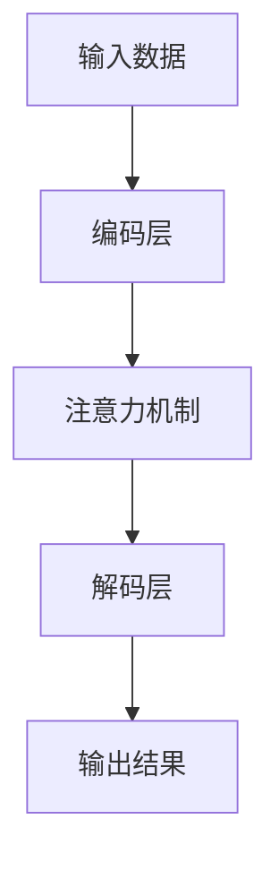
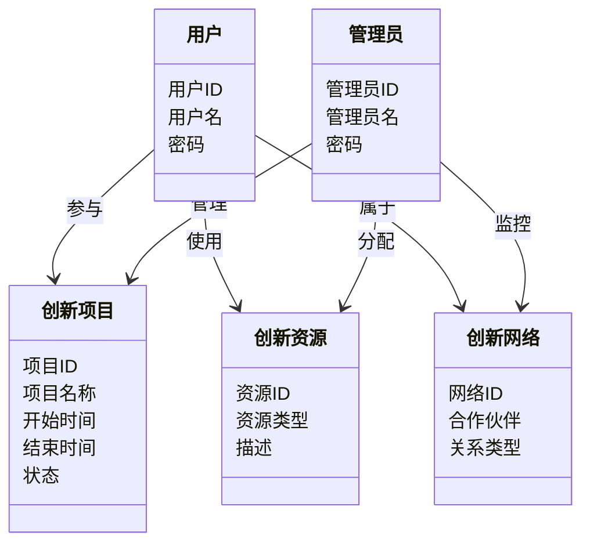
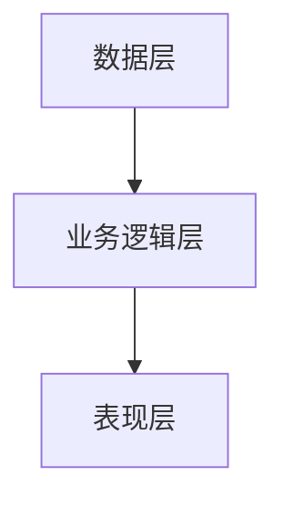
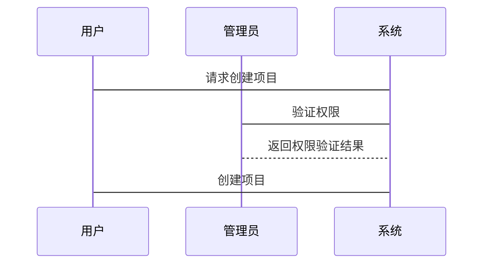

                 


# 构建AI驱动的企业创新生态系统分析平台

**关键词**：AI、企业创新、生态系统、数据分析、算法、系统架构

**摘要**：随着人工智能技术的快速发展，企业创新生态系统分析平台的构建已成为企业数字化转型的重要方向。本文系统地分析了AI在企业创新生态系统中的作用，详细阐述了构建分析平台的核心算法、系统架构设计及项目实战，为企业的创新管理提供了理论支持和实践指导。

---

## 第1章：AI驱动的企业创新生态系统概述

### 1.1 企业创新生态系统的基本概念

#### 1.1.1 企业创新生态系统的定义
企业创新生态系统是指由企业内部员工、外部合作伙伴、客户、供应商以及技术创新资源等多方主体共同参与，通过协作与竞争形成的动态平衡系统。它以知识共享、资源整合和价值共创为核心，推动企业的持续创新。

#### 1.1.2 创新生态系统的核心要素
创新生态系统的核心要素包括：
- **企业主体**：企业内部的研发团队、管理部门等。
- **创新资源**：技术、数据、资金等。
- **创新网络**：企业与外部合作伙伴（如高校、科研机构、供应商）形成的协作网络。

#### 1.1.3 AI在企业创新生态系统中的作用
人工智能技术通过数据分析、模式识别和智能决策支持，帮助企业发现潜在的创新机会，优化资源配置，提升创新效率。

### 1.2 企业创新生态系统分析平台的背景

#### 1.2.1 传统企业创新面临的挑战
- **资源分散**：企业内部资源分散，难以形成有效的协同创新。
- **信息孤岛**：各部门间信息不通，创新机会难以被识别。
- **创新效率低**：缺乏系统化的创新管理方法。

#### 1.2.2 AI技术对企业创新的支持
- **数据驱动决策**：通过AI分析海量数据，识别潜在的创新方向。
- **智能匹配资源**：利用AI算法优化资源配置，提升创新效率。
- **实时反馈与优化**：通过动态数据分析，实时调整创新策略。

#### 1.2.3 创新生态系统分析平台的必要性
平台能够整合企业内外部资源，通过AI技术实现创新过程的智能化管理，帮助企业构建高效、协同的创新生态系统。

### 1.3 本章小结
本章介绍了企业创新生态系统的基本概念和核心要素，并分析了AI在其中的作用，强调了构建分析平台的必要性。

---

## 第2章：企业创新生态系统的核心概念与联系

### 2.1 企业创新生态系统的核心要素

#### 2.1.1 企业主体
- **员工**：员工是创新的核心驱动力，他们的知识、经验和创造力直接决定创新的潜力。
- **管理层**：通过制定战略和政策引导创新方向。

#### 2.1.2 创新资源
- **技术资源**：包括专利、技术标准等。
- **数据资源**：企业运营过程中产生的数据，是创新的重要依据。
- **资金资源**：支持创新项目实施的资金。

#### 2.1.3 创新网络
- **合作伙伴**：高校、科研机构、供应商等外部合作伙伴为企业提供技术支持和创新灵感。
- **客户**：客户需求是推动企业创新的重要动力。

### 2.2 核心要素的特征对比

#### 2.2.1 表格对比核心要素的特征
| 核心要素 | 特征 |
|----------|------|
| 企业主体 | 内部员工与管理层 |
| 创新资源 | 技术、数据、资金 |
| 创新网络 | 外部合作伙伴与客户 |

#### 2.2.2 核心要素之间的关系
企业主体是创新的主体，创新资源是创新的物质基础，创新网络是创新的支持环境。三者相互作用，共同推动企业的持续创新。

### 2.3 企业创新生态系统的ER实体关系图

#### 2.3.1 实体关系图的构建
通过ER图可以清晰展示企业创新生态系统中各实体之间的关系。

```mermaid
erDiagram
    actor 用户 {
        string 用户名
        string 密码
        string 邮箱
    }
    actor 管理员 {
        string 管理员ID
        string 密码
        string 邮箱
    }
    entity 创新项目 {
        string 项目ID
        string 项目名称
        date 开始时间
        date 结束时间
        boolean 状态
    }
    entity 创新资源 {
        string 资源ID
        string 资源类型
        string 描述
    }
    entity 创新网络 {
        string 网络ID
        string 合作伙伴
        string 关系类型
    }
    用户 --> 创新项目 : 参与
    用户 --> 创新资源 : 使用
    用户 --> 创新网络 : 属于
    管理员 --> 创新项目 : 管理
    管理员 --> 创新资源 : 分配
    管理员 --> 创新网络 : 监控
```

### 2.4 本章小结
本章通过对比和ER图的方式，详细分析了企业创新生态系统的核心要素及其关系，为后续的平台设计奠定了基础。

---

## 第3章：AI驱动的企业创新生态系统分析平台的核心算法

### 3.1 算法原理概述

#### 3.1.1 基于Transformer的模型
Transformer模型通过自注意力机制（Self-attention）捕获文本中的长距离依赖关系，适用于处理序列数据。

#### 3.1.2 注意力机制的实现
注意力机制通过计算输入序列中每个位置的权重，确定其对当前输出的重要程度。

### 3.2 算法流程图



### 3.3 算法实现

#### 3.3.1 Python源代码实现
```python
import torch
import torch.nn as nn

class Attention(nn.Module):
    def __init__(self, embed_dim):
        super(Attention, self).__init__()
        self.embed_dim = embed_dim
        self.key = nn.Linear(embed_dim, embed_dim)
        self.query = nn.Linear(embed_dim, embed_dim)
        self.value = nn.Linear(embed_dim, embed_dim)
    
    def forward(self, x):
        # x: (batch_size, seq_len, embed_dim)
        key = self.key(x)
        query = self.query(x)
        value = self.value(x)
        
        # 计算注意力权重
        attention_weights = nn.Softmax(dim=-1)(torch.bmm(query, key.transpose(-1, -2)))
        # 计算加权值
        output = torch.bmm(attention_weights, value)
        return output
```

#### 3.4 数学模型与公式

##### 注意力机制的数学公式
$$\text{Attention}(Q, K, V) = \text{softmax}\left(\frac{QK^T}{\sqrt{d_k}}\right)V$$

##### 解码层的计算流程
$$\text{Output} = \text{Decoder}(z)$$

---

## 第4章：系统架构设计与实现

### 4.1 系统功能设计

#### 4.1.1 领域模型
通过领域模型（Domain Model）明确系统的功能模块及其交互关系。



### 4.2 系统架构设计

#### 4.2.1 架构图
系统架构采用分层设计，包括数据层、业务逻辑层和表现层。



#### 4.2.2 接口设计
系统提供RESTful API接口，支持以下操作：
- POST /api/users: 创建用户
- GET /api/projects: 获取所有项目
- PUT /api/resources: 更新资源

#### 4.2.3 交互流程
系统交互流程如下：



---

## 第5章：项目实战与案例分析

### 5.1 环境搭建

#### 5.1.1 技术选型
- 开发语言：Python
- 框架：Django或Flask
- 数据库：MySQL
- 机器学习库：TensorFlow或PyTorch

#### 5.1.2 安装依赖
```bash
pip install django flask numpy pandas scikit-learn
```

### 5.2 核心实现

#### 5.2.1 数据处理
```python
import pandas as pd

# 读取数据
data = pd.read_csv('data.csv')
# 数据清洗
data.dropna(inplace=True)
# 数据转换
data['label'] = data['label'].map({'yes': 1, 'no': 0})
```

#### 5.2.2 模型训练
```python
from sklearn.model import SVC

model = SVC()
model.fit(X_train, y_train)
```

#### 5.2.3 模型评估
```python
from sklearn.metrics import accuracy_score

y_pred = model.predict(X_test)
print('Accuracy:', accuracy_score(y_test, y_pred))
```

### 5.3 案例分析

#### 5.3.1 数据来源
假设我们有一个包含企业创新项目数据的CSV文件，其中包含项目名称、开始时间、结束时间、是否成功等字段。

#### 5.3.2 案例分析步骤
1. 数据清洗与预处理。
2. 模型训练与优化。
3. 模型评估与部署。

### 5.4 本章小结
通过实际案例分析，详细展示了如何利用AI技术构建企业创新生态系统分析平台。

---

## 第6章：最佳实践与总结

### 6.1 最佳实践

#### 6.1.1 技术选型
- 数据量大的场景推荐使用分布式架构。
- 对实时性要求高的场景推荐使用流处理框架（如Flink）。

#### 6.1.2 数据处理
- 数据清洗是关键，确保数据质量。
- 数据存储采用分布式存储（如Hadoop）以提高效率。

#### 6.1.3 系统优化
- 系统架构设计要注重扩展性和可维护性。
- 使用容器化技术（如Docker）进行部署和管理。

### 6.2 总结与展望

#### 6.2.1 总结
本文系统地分析了AI驱动的企业创新生态系统分析平台的构建过程，详细阐述了核心算法、系统架构设计和项目实战。

#### 6.2.2 展望
未来，随着AI技术的不断发展，企业创新生态系统分析平台将更加智能化和个性化，为企业创造更大的价值。

### 6.3 注意事项
- 数据隐私和安全问题需要高度重视。
- 系统设计时要考虑可扩展性和可维护性。

### 6.4 拓展阅读
推荐阅读《AI系统设计》和《企业创新管理》等相关书籍，以深入了解AI在企业创新中的应用。

---

## 作者信息

**作者**：AI天才研究院/AI Genius Institute & 禅与计算机程序设计艺术/Zen And The Art of Computer Programming

---

以上是《构建AI驱动的企业创新生态系统分析平台》的技术博客文章的完整大纲和内容，涵盖了从背景介绍、核心概念、算法原理、系统设计到项目实战的全过程。希望这篇文章能为您提供有价值的参考和启发！

