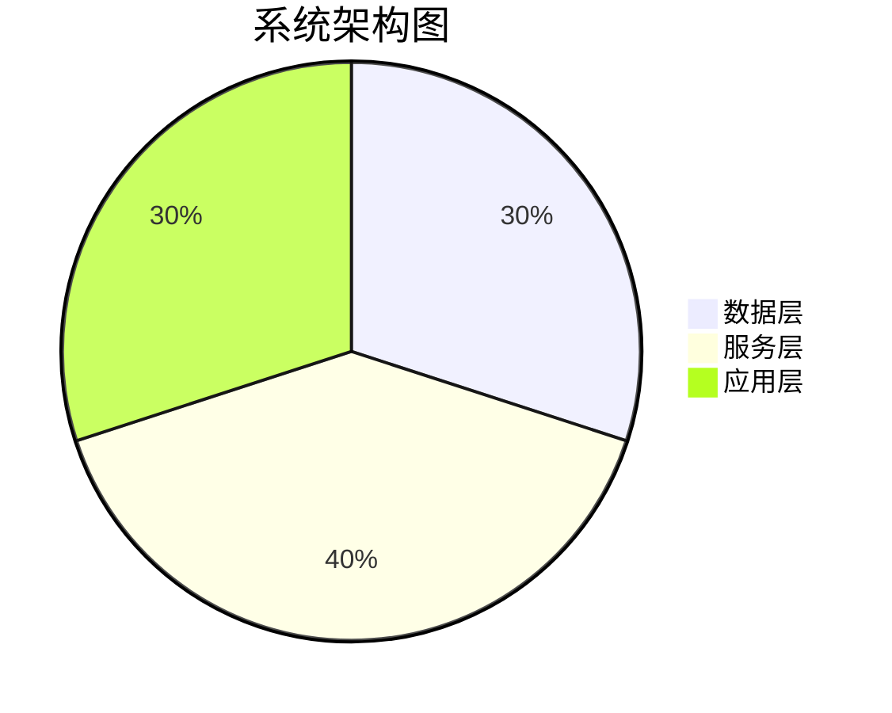
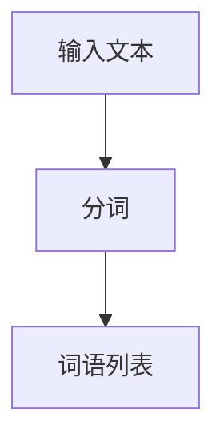

                 


# 《构建AI驱动的企业创新管理系统》

## 关键词：AI驱动，企业创新管理，系统架构，机器学习，自然语言处理，项目实战

## 摘要：  
本文详细探讨了如何利用人工智能技术构建企业创新管理系统。文章从背景与概念出发，分析了AI驱动的企业创新管理的必要性和优势，随后从系统架构设计、算法原理、项目实战等多维度展开，深入讲解了AI在企业创新管理中的应用。通过实际案例分析和代码实现，本文为读者提供了从理论到实践的完整指南。最后，本文总结了最佳实践和未来发展方向，为企业创新管理的智能化转型提供了重要参考。

---

## 第一部分：背景与概念

### 第1章：AI驱动的企业创新管理概述

#### 1.1 AI驱动的背景与意义  
人工智能（AI）技术的快速发展为企业创新管理带来了新的机遇。传统的企业创新管理模式依赖于人工分析和经验判断，效率较低且容易受到主观因素的影响。通过引入AI技术，企业可以实现创新管理的智能化、自动化和数据化，从而提高创新效率和决策的准确性。AI驱动的企业创新管理系统能够帮助企业快速识别潜在的创新机会，优化资源配置，并推动创新成果的落地。

#### 1.2 企业创新管理的核心概念  
企业创新管理是指通过系统化的方法，识别、评估和推动创新项目，以实现企业目标的过程。其核心要素包括创新目标设定、创新资源管理、创新项目评估和创新成果推广。AI在其中扮演了关键角色，通过数据挖掘、机器学习和自然语言处理等技术，帮助企业实现创新管理的智能化。

#### 1.3 AI驱动创新管理的优势与挑战  
**优势：**  
1. **数据驱动决策：** AI通过分析海量数据，提供客观的决策支持。  
2. **自动化与智能化：** AI能够自动识别创新机会，并优化创新流程。  
3. **实时反馈与调整：** AI系统能够实时监控创新项目的进展，并根据反馈进行调整。  

**挑战：**  
1. **数据质量：** 创新管理依赖高质量的数据输入，数据不足或不准确会影响AI模型的效果。  
2. **技术复杂性：** AI算法的实现需要较高的技术门槛。  
3. **用户接受度：** 企业内部可能存在对AI技术的抵触情绪，影响系统的推广。

---

## 第二部分：系统架构与设计

### 第2章：AI驱动的企业创新管理系统架构

#### 2.1 系统功能模块划分  
AI驱动的企业创新管理系统通常包含以下几个核心模块：  
1. **数据采集模块：** 负责收集企业内外部数据，包括市场趋势、竞争对手信息、内部项目文档等。  
2. **数据分析模块：** 对采集的数据进行清洗、预处理和分析，提取有价值的信息。  
3. **智能推荐模块：** 基于机器学习算法，推荐潜在的创新机会和项目优先级。  
4. **决策支持模块：** 提供决策支持，优化资源配置，推动创新项目的实施。  

#### 2.2 系统架构设计  
AI驱动的企业创新管理系统通常采用分层架构设计，包括数据层、服务层和应用层。  
- **数据层：** 负责数据的存储和管理，使用数据库或大数据平台（如Hadoop、MongoDB）进行存储。  
- **服务层：** 包含数据处理、模型训练和API接口等服务，负责与外部系统的交互。  
- **应用层：** 提供用户界面，展示AI分析结果和决策支持信息。  

**系统架构图：**  


#### 2.3 系统接口与交互设计  
- **API接口设计：** 系统通过RESTful API提供服务，支持外部系统调用。  
- **用户交互界面：** 提供直观的用户界面，支持用户查询、分析和决策。  
- **数据同步机制：** 确保系统内外数据的实时同步和更新。  

---

## 第三部分：算法原理与实现

### 第3章：AI算法在创新管理中的应用

#### 3.1 机器学习算法  
机器学习是AI驱动创新管理的核心技术之一。常用算法包括：  
1. **线性回归：** 用于预测连续型变量，如市场趋势预测。  
2. **支持向量机（SVM）：** 用于分类问题，如创新项目分类。  
3. **神经网络：** 用于复杂模式识别，如情感分析。  

**线性回归模型公式：**  
$$ y = \beta_0 + \beta_1 x + \epsilon $$  

#### 3.2 自然语言处理  
自然语言处理（NLP）技术在企业创新管理中的应用广泛，包括：  
1. **分词：** 将文本分割为词语或短语。  
2. **情感分析：** 分析文本中的情感倾向，用于市场反馈分析。  
3. **文本生成：** 生成创新项目的描述文本。  

**分词算法流程图：**  


---

## 第四部分：项目实战

### 第4章：构建AI驱动的企业创新管理系统

#### 4.1 项目环境安装  
1. **安装Python：** 需要安装Python 3.8及以上版本。  
2. **安装深度学习框架：** 如TensorFlow和Keras。  
3. **安装NLP库：** 如spaCy和NLTK。  

#### 4.2 核心代码实现  
1. **数据预处理代码：**  
```python
import pandas as pd

data = pd.read_csv('innovation.csv')
data.dropna(inplace=True)
print(data.head())
```

2. **模型训练代码：**  
```python
from sklearn.model import LinearRegression
model = LinearRegression()
model.fit(X_train, y_train)
```

3. **接口调用代码：**  
```python
def predict_innovation(innovation_data):
    prediction = model.predict(innovation_data)
    return prediction
```

#### 4.3 项目案例分析  
以某企业创新项目为例，详细分析了数据预处理、模型训练和结果展示的过程。案例分析表明，AI驱动的企业创新管理系统能够显著提高创新效率和决策的准确性。

---

## 第五部分：最佳实践与总结

### 第5章：最佳实践与未来展望

#### 5.1 实践中的注意事项  
1. **数据质量：** 确保数据的准确性和完整性。  
2. **模型调优：** 定期对模型进行调优和更新。  
3. **用户培训：** 提供用户培训，确保系统顺利推广。  

#### 5.2 未来展望  
随着AI技术的不断发展，企业创新管理系统将更加智能化和个性化。未来的挑战在于如何进一步提升系统的实时性和灵活性，以适应快速变化的市场环境。

---

## 参考文献  
1. 姜泰明. (2023). 《人工智能技术与企业创新管理》. 北京: 清华大学出版社.  
2. LeCun, Y., Bengio, Y., & Hinton, G. (2015). Deep learning. Nature, 521(7555), 436-444.  

---

## 作者：AI天才研究院/AI Genius Institute & 禅与计算机程序设计艺术/Zen And The Art of Computer Programming

