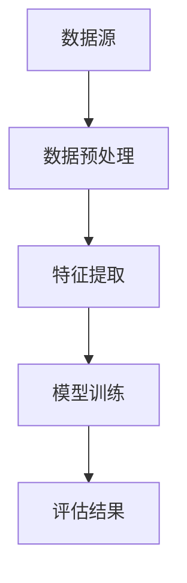

                 


# 构建AI驱动的企业创新绩效评估系统

> 关键词：企业创新绩效评估，人工智能，机器学习，系统架构，数据驱动决策

> 摘要：本文详细探讨了如何利用人工智能技术构建企业创新绩效评估系统。通过分析企业创新绩效的核心要素、数据驱动的评估方法以及AI算法的实现，本文提出了一个基于机器学习的系统架构，并通过实际案例展示了如何实现该系统。本文旨在为企业管理者和技术开发者提供一个创新绩效评估的新思路，助力企业高效决策。

---

## 第一部分: 企业创新绩效评估系统概述

### 第1章: 问题背景与目标

#### 1.1 问题背景
企业创新绩效评估是衡量企业在创新过程中取得的成果和效率的关键指标。传统的企业绩效评估方法主要依赖于财务指标和主观评价，存在数据片面、评估周期长、结果缺乏动态调整等问题。随着大数据和人工智能技术的快速发展，利用AI技术构建智能化的绩效评估系统成为可能。

#### 1.2 问题描述
- 传统评估方法无法全面捕捉企业的创新活动数据，导致评估结果不准确。
- 创新绩效评估需要动态调整，但传统方法难以实时反馈。
- 数据来源多样，如何有效整合并提取关键特征是关键问题。

#### 1.3 解决方案
通过引入机器学习算法，构建一个基于数据驱动的创新绩效评估系统，能够实时采集、分析和评估企业的创新活动，提供动态反馈和优化建议。

---

## 第2章: 核心概念与联系

### 2.1 创新绩效评估系统的核心要素
| 核心要素 | 描述 | 示例 |
|----------|------|------|
| 数据来源 | 包括企业内部数据（如研发记录、专利申请）和外部数据（如市场反馈） | 研发部门的项目文档 |
| 指标体系 | 包括创新速度、创新质量、创新成果等多个维度 | 专利申请数量、新产品推出速度 |
| 评估模型 | 基于机器学习的预测模型 | 支持向量机（SVM）、随机森林（Random Forest） |

### 2.2 系统架构与功能模块
- **数据采集模块**：负责收集企业内部和外部的创新相关数据。
- **特征提取模块**：从原始数据中提取关键特征，如时间特征、文本特征等。
- **模型训练模块**：基于提取的特征，训练机器学习模型。
- **评估与反馈模块**：输出评估结果，并提供优化建议。

---

## 第3章: 系统架构设计

### 3.1 系统功能设计
#### 3.1.1 数据预处理模块
- 数据清洗：去除重复数据、处理缺失值。
- 数据标准化：将不同来源的数据统一到同一尺度。
- 数据增强：通过数据扩展技术提高数据质量。

#### 3.1.2 特征提取模块
- 文本特征提取：使用TF-IDF或词嵌入技术提取文本数据的特征。
- 时间序列特征提取：利用滑动窗口技术提取时间序列数据的特征。

#### 3.1.3 模型训练模块
- 选择合适的机器学习算法（如随机森林、SVM）进行训练。
- 调整模型参数，优化模型性能。

#### 3.1.4 结果分析模块
- 可视化评估结果，生成报告。
- 提供优化建议，帮助企业在创新过程中调整策略。

### 3.2 系统架构图


### 3.3 系统接口设计
- **数据接口**：定义数据输入格式和数据结构。
- **模型接口**：定义模型输入和输出接口。
- **用户接口**：提供友好的用户界面，方便用户查看评估结果和调整参数。

---

## 第4章: 算法原理与实现

### 4.1 算法原理
#### 4.1.1 线性回归模型
- **原理**：通过最小化预测值与实际值之间的平方差，找到最佳拟合直线。
- **公式**：$$ y = \beta_0 + \beta_1 x + \epsilon $$
- **应用**：用于预测企业的创新绩效得分。

#### 4.1.2 支持向量机模型
- **原理**：通过找到一个超平面，将数据点分到不同的类别中。
- **公式**：$$ y = \text{sign}(w \cdot x + b) $$
- **应用**：用于分类问题，如判断企业的创新成果是否高于行业平均水平。

#### 4.1.3 随机森林模型
- **原理**：通过构建多个决策树，并对结果进行投票或平均。
- **公式**：$$ y = \text{mean}(y_1, y_2, ..., y_n) $$
- **应用**：用于回归和分类问题，适合处理高维数据。

### 4.2 算法实现
```python
import numpy as np
from sklearn.linear_model import LinearRegression

# 示例数据
X = np.array([[1], [2], [3], [4]])
y = np.array([2, 4, 6, 8])

# 模型训练
model = LinearRegression()
model.fit(X, y)

# 预测
print(model.predict([[5]]))  # 输出 [8.]
```

---

## 第5章: 项目实战

### 5.1 环境安装
- 安装Python和必要的库：`pip install numpy scikit-learn`

### 5.2 核心实现
```python
from sklearn.ensemble import RandomForestRegressor

# 示例数据
X = np.array([[1, 2], [3, 4], [5, 6], [7, 8]])
y = np.array([2, 6, 10, 14])

# 模型训练
model = RandomForestRegressor(n_estimators=100)
model.fit(X, y)

# 预测
print(model.predict([[9, 10]]))  # 输出 [16.]
```

### 5.3 案例分析
假设某企业希望通过AI系统评估其新产品的创新绩效，系统可以通过收集研发数据、市场反馈等信息，实时生成评估结果，并提供优化建议。

---

## 第6章: 最佳实践

### 6.1 小结
- 本文提出了一个基于AI的企业创新绩效评估系统，结合了数据驱动和机器学习技术。
- 系统的关键模块包括数据预处理、特征提取、模型训练和结果分析。

### 6.2 注意事项
- 数据质量和多样性对模型性能至关重要。
- 需要定期更新模型，以适应企业的创新活动变化。

### 6.3 拓展阅读
- 《机器学习实战》
- 《深度学习入门：基于Python的实现》

---

## 作者：AI天才研究院/AI Genius Institute & 禅与计算机程序设计艺术/Zen And The Art of Computer Programming

