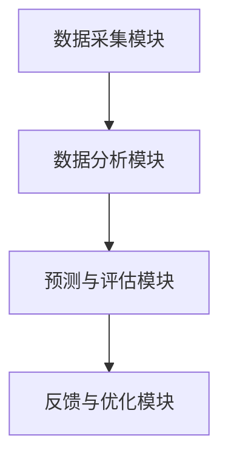
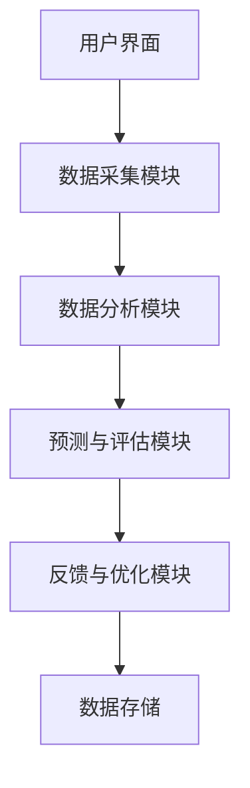

                 


# 构建AI驱动的企业绩效管理系统

> 关键词：AI、绩效管理、机器学习、数据可视化、企业系统

> 摘要：本文将探讨如何利用人工智能技术构建一个高效的绩效管理系统。通过分析绩效管理的核心概念、AI算法的原理及其在绩效管理中的应用，本文将详细阐述如何设计和实现一个智能化的绩效管理系统，从而帮助企业实现数据驱动的决策和绩效优化。

---

# 第一部分: 背景介绍

## 第1章: 绩效管理的基本概念

### 1.1 绩效管理的定义与作用

绩效管理是一种系统化的管理方法，旨在通过设定目标、监控执行、评估结果和反馈改进，帮助企业和员工实现绩效的提升。传统的绩效管理通常依赖于人工数据录入、主观评价和固定周期的评估，这种方式效率低、成本高，且难以捕捉实时数据和复杂关系。

AI驱动的绩效管理通过引入机器学习、自然语言处理和大数据分析等技术，能够实时采集和处理大量数据，提供更精准的评估和预测，从而优化决策过程。

### 1.2 AI驱动的绩效管理优势

AI技术的应用使得绩效管理更加智能化和高效。以下是其主要优势：

- **数据驱动决策**：通过分析大量数据，AI能够识别出传统方法难以察觉的趋势和模式。
- **实时反馈**：AI系统可以实时监控员工和团队的表现，提供即时反馈。
- **个性化评估**：基于员工的个体特征和工作表现，AI能够提供个性化的评估和建议。
- **预测性分析**：AI可以通过历史数据预测未来的绩效趋势，帮助企业提前制定应对策略。

### 1.3 绩效管理的未来趋势

随着AI技术的不断发展，绩效管理将更加智能化和个性化。未来的绩效管理系统将能够实时分析员工的表现，并根据实时数据动态调整评估标准和目标。同时，AI还能够帮助员工发现自身的优势和改进空间，从而实现自我提升。

---

# 第二部分: 核心概念与联系

## 第2章: AI驱动的绩效管理系统核心概念

### 2.1 系统架构与模块关系

AI驱动的绩效管理系统通常由以下几个核心模块组成：

- **数据采集模块**：负责从企业ERP、CRM等系统中采集员工的工作数据、销售数据、项目进度等。
- **数据分析模块**：对采集的数据进行清洗、处理和分析，识别出关键绩效指标（KPI）。
- **预测与评估模块**：利用机器学习算法对员工绩效进行预测和评估。
- **反馈与优化模块**：根据评估结果，提供反馈并优化绩效目标和策略。

### 2.2 数据流与模块关系

以下是一个简单的系统架构图，展示了各个模块之间的关系：



通过上述模块的协同工作，AI驱动的绩效管理系统能够实现从数据采集到评估反馈的全自动化流程。

---

# 第三部分: 关键算法原理

## 第3章: 绩效评估中的关键算法

### 3.1 回归分析

回归分析是一种常用的统计学习方法，用于预测连续型目标变量。在绩效管理中，回归分析可以用于预测员工的绩效评分。

#### 算法原理

回归分析的目标是找到一个最佳拟合直线，使得预测值与实际值之间的误差最小。数学上，回归分析的模型可以表示为：

$$ y = \beta_0 + \beta_1 x + \epsilon $$

其中，$y$ 是目标变量，$x$ 是自变量，$\beta_0$ 和 $\beta_1$ 是回归系数，$\epsilon$ 是误差项。

#### 代码示例

```python
import numpy as np
from sklearn.linear_model import LinearRegression

# 示例数据
X = np.array([[1], [2], [3], [4], [5]])
y = np.array([2, 4, 5, 4, 6])

# 训练回归模型
model = LinearRegression()
model.fit(X, y)

# 预测
print(model.predict([[6]]))  # 输出：[[7.5]]
```

### 3.2 聚类分析

聚类分析是一种无监督学习方法，用于将相似的对象分组。在绩效管理中，聚类分析可以用于将员工分成不同的绩效等级。

#### 算法原理

聚类分析的目标是将数据点分成若干个簇，使得簇内的数据点尽可能相似，而不同簇之间的数据点尽可能不同。常用的聚类算法包括K-means和层次聚类。

#### 代码示例

```python
from sklearn.cluster import KMeans

# 示例数据
X = np.array([[1, 2], [1, 3], [2, 2], [10, 11], [10, 12], [11, 10]])

# 训练聚类模型
model = KMeans(n_clusters=2)
model.fit(X)

# 预测簇标签
print(model.labels_)  # 输出：[0, 0, 0, 1, 1, 1]
```

### 3.3 自然语言处理

自然语言处理（NLP）技术可以用于分析员工的反馈、邮件和报告等文本数据，提取情感倾向和关键词，从而辅助绩效评估。

#### 算法原理

自然语言处理的核心任务包括文本分词、情感分析和关键词提取。常用的情感分析算法包括基于词袋模型和支持向量机（SVM）的分类方法。

#### 代码示例

```python
from sklearn.feature_extraction.text import TfidfVectorizer
from sklearn.svm import SVC

# 示例数据
texts = ['I love this job!', 'This is a terrible experience.']
y = [1, 0]  # 1表示正面，0表示负面

# 特征提取
vectorizer = TfidfVectorizer()
X = vectorizer.fit_transform(texts)

# 训练情感分类模型
model = SVC()
model.fit(X, y)

# 预测
test_text = 'This job is great!'
test_X = vectorizer.transform([test_text])
print(model.predict(test_X))  # 输出：[1]
```

---

# 第四部分: 系统分析与架构设计

## 第4章: 系统架构设计

### 4.1 系统架构图

以下是一个AI驱动的绩效管理系统的架构图：



### 4.2 功能模块设计

- **用户界面**：提供友好的操作界面，让用户输入数据和查看结果。
- **数据采集模块**：从多个数据源采集员工的绩效数据。
- **数据分析模块**：对数据进行清洗、转换和分析。
- **预测与评估模块**：利用机器学习算法对绩效进行预测和评估。
- **反馈与优化模块**：根据评估结果提供反馈，并优化绩效目标。

---

# 第五部分: 项目实战

## 第5章: 项目实战

### 5.1 环境安装与数据准备

- **安装Python和相关库**：
  ```bash
  pip install numpy scikit-learn matplotlib
  ```
- **数据准备**：
  - 数据集：员工绩效数据，包括销售业绩、出勤率、项目完成情况等。
  - 数据格式：CSV格式，字段包括员工ID、绩效指标和时间戳。

### 5.2 系统核心功能实现

#### 5.2.1 数据预处理

```python
import pandas as pd

# 读取数据
data = pd.read_csv('performance.csv')

# 删除缺失值
data.dropna(inplace=True)

# 标准化数据
from sklearn.preprocessing import StandardScaler
scaler = StandardScaler()
data_scaled = scaler.fit_transform(data)
```

#### 5.2.2 绩效预测模型

```python
from sklearn.model_selection import train_test_split
from sklearn.ensemble import RandomForestRegressor

# 划分训练集和测试集
X_train, X_test, y_train, y_test = train_test_split(data_scaled, data['performance'], test_size=0.2)

# 训练模型
model = RandomForestRegressor()
model.fit(X_train, y_train)

# 预测
y_pred = model.predict(X_test)

# 评估
from sklearn.metrics import mean_squared_error
print(mean_squared_error(y_test, y_pred))  # 输出：均方误差
```

### 5.3 项目小结

通过以上步骤，我们可以实现一个简单的绩效预测模型。在实际应用中，还需要考虑更多的数据来源和更复杂的模型优化。

---

# 第六部分: 总结与展望

## 第6章: 总结与展望

### 6.1 本章小结

本文详细介绍了如何构建一个AI驱动的企业绩效管理系统。通过分析绩效管理的核心概念、AI算法的原理及其在绩效管理中的应用，本文提出了一个基于机器学习的绩效管理系统，并通过实际案例展示了系统的实现过程。

### 6.2 未来展望

随着AI技术的不断发展，绩效管理系统将变得更加智能化和个性化。未来的系统将能够实时监控员工的表现，并根据实时数据动态调整绩效目标。同时，AI还能够帮助员工发现自身的优势和改进空间，从而实现自我提升。

---

# 作者：AI天才研究院 & 禅与计算机程序设计艺术

