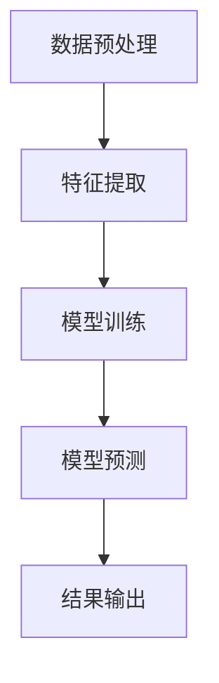
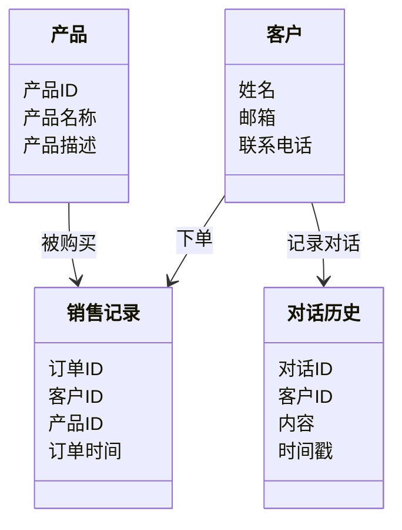
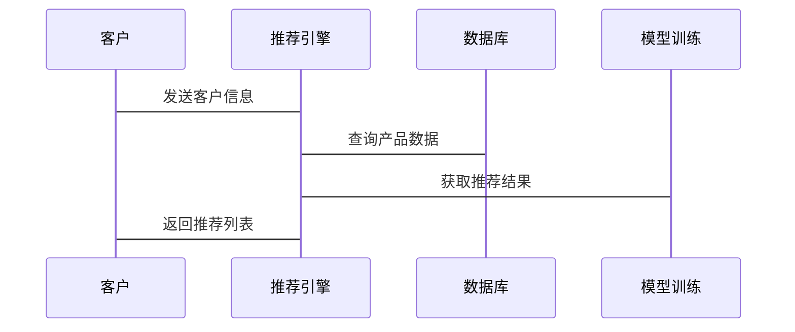

                 


# 构建AI驱动的销售助手：提升转化率与客户满意度

## 关键词：AI驱动销售助手、客户满意度、转化率、自然语言处理、机器学习

## 摘要：本文详细探讨了如何利用AI技术构建高效的销售助手，通过自然语言处理和机器学习算法提升销售转化率和客户满意度。文章从背景介绍、核心算法、系统架构到项目实战，全面分析了AI驱动销售助手的构建过程，并提供了实际案例和最佳实践。

---

# 第一部分: AI驱动的销售助手背景与核心概念

## 第1章: AI驱动的销售助手背景介绍

### 1.1 问题背景与描述

#### 1.1.1 传统销售中的痛点
在传统销售过程中，销售人员面临诸多挑战，包括：
- **信息过载**：销售人员需要处理大量的客户数据和历史记录，难以快速提取关键信息。
- **客户需求多样性**：每个客户的偏好和需求不同，难以实现个性化的销售策略。
- **决策滞后**：由于依赖人工分析，销售决策往往滞后，错失最佳销售机会。

#### 1.1.2 转化率与客户满意度的定义
- **转化率**：指潜在客户转化为实际购买客户的比例，是衡量销售效果的重要指标。
- **客户满意度**：客户对产品或服务的整体满意程度，直接影响客户忠诚度和口碑传播。

#### 1.1.3 AI如何解决销售问题
AI技术可以通过以下方式提升销售效率：
- **自动化数据分析**：利用机器学习算法快速分析客户数据，提取关键信息。
- **个性化推荐**：基于客户行为和偏好，提供个性化的产品推荐。
- **实时互动支持**：通过自然语言处理技术，实时辅助销售人员与客户沟通。

### 1.2 问题解决与边界

#### 1.2.1 AI驱动销售助手的目标
- 提高销售转化率。
- 提升客户满意度。
- 优化销售流程，降低销售成本。

#### 1.2.2 边界与外延
AI驱动的销售助手专注于销售环节，不涉及生产、物流等其他环节。其外延包括：
- 数据采集与处理。
- 模型训练与部署。
- 人机交互界面设计。

#### 1.2.3 核心要素与组成
- **客户数据**：包括客户的基本信息、购买记录、浏览行为等。
- **销售策略**：基于数据的个性化推荐策略。
- **交互方式**：包括文本、语音等多种形式的客户互动。

### 1.3 核心概念与联系

#### 1.3.1 核心概念原理
AI驱动的销售助手主要依赖以下技术：
- **自然语言处理（NLP）**：用于理解和生成自然语言文本。
- **机器学习（ML）**：用于训练模型，预测客户行为和偏好。

#### 1.3.2 概念属性特征对比表格
以下表格对比了AI驱动销售助手的核心概念及其属性特征：

| 概念       | 属性1     | 属性2     | 属性3     |
|------------|-----------|-----------|-----------|
| AI驱动     | 数据驱动   | 自动化处理 | 可扩展性   |
| 销售助手     | 个性化推荐 | 实时响应   | 智能分析   |

#### 1.3.3 ER实体关系图
以下ER图展示了AI驱动销售助手的核心实体及其关系：

```mermaid
er
  entity:客户
  entity:产品
  entity:销售记录
  entity:对话历史
  relation:客户-产品(购买)
  relation:客户-对话历史(关联)
  relation:产品-销售记录(销售)
```

---

## 第2章: AI驱动销售助手的核心算法与数学模型

### 2.1 算法原理讲解

#### 2.1.1 算法流程图
以下流程图展示了AI驱动销售助手的算法流程：



#### 2.1.2 算法实现代码
以下代码示例展示了AI驱动销售助手的核心算法实现：

```python
def preprocess(data):
    # 数据预处理代码
    return processed_data

def train_model(features, labels):
    # 模型训练代码
    return model

def predict(model, input_data):
    # 模型预测代码
    return prediction
```

### 2.2 数学模型与公式

#### 2.2.1 概率计算公式
$$ P(A|B) = \frac{P(B|A)P(A)}{P(B)} $$

#### 2.2.2 损失函数
$$ \text{损失} = -\sum_{i=1}^{n} [y_i \log p_i + (1 - y_i) \log (1 - p_i)] $$

### 2.3 举例说明

#### 2.3.1 个性化推荐示例
$$ \text{推荐概率} = \frac{\text{客户历史购买记录}}{\text{产品相似度}} $$

---

## 第3章: 系统分析与架构设计方案

### 3.1 问题场景介绍

#### 3.1.1 问题场景描述
AI驱动的销售助手需要处理以下场景：
- **客户咨询**：客户通过文本或语音方式咨询产品信息。
- **个性化推荐**：基于客户行为推荐相关产品。
- **销售跟踪**：实时跟踪销售进展，优化销售策略。

### 3.2 项目介绍

#### 3.2.1 领域模型mermaid类图
以下类图展示了AI驱动销售助手的领域模型：



#### 3.2.2 系统架构设计mermaid架构图
以下架构图展示了AI驱动销售助手的系统架构：


#### 3.2.3 系统接口设计
以下是系统接口设计的描述：
- **输入接口**：接收客户请求和数据输入。
- **输出接口**：返回推荐结果和销售建议。
- **数据库接口**：与客户数据库和产品数据库交互。

#### 3.2.4 系统交互mermaid序列图
以下序列图展示了系统交互过程：



---

## 第4章: 项目实战

### 4.1 环境安装

#### 4.1.1 安装Python和相关库
```bash
pip install numpy pandas scikit-learn transformers
```

### 4.2 系统核心实现源代码

#### 4.2.1 数据预处理代码
```python
import pandas as pd
from sklearn.model_selection import train_test_split
from sklearn.feature_extraction.text import TfidfVectorizer
from sklearn.naive_bayes import MultinomialNB

# 数据加载
data = pd.read_csv('sales_data.csv')

# 数据分割
X_train, X_test, y_train, y_test = train_test_split(data['description'], data['label'], test_size=0.2)

# 特征提取
vectorizer = TfidfVectorizer()
X_train_vec = vectorizer.fit_transform(X_train)
X_test_vec = vectorizer.transform(X_test)

# 模型训练
model = MultinomialNB()
model.fit(X_train_vec, y_train)

# 模型预测
y_pred = model.predict(X_test_vec)
```

#### 4.2.2 推荐引擎实现代码
```python
from transformers import pipeline

# 加载预训练模型
classifier = pipeline("text-classification", model="your_model")

# 推荐逻辑
def get_recommendation(product_description):
    prediction = classifier(product_description)
    return prediction['label']
```

### 4.3 代码应用解读与分析

#### 4.3.1 数据预处理
- 使用TF-IDF进行文本特征提取，将产品描述转换为向量表示。
- 划分训练集和测试集，进行模型训练和验证。

#### 4.3.2 推荐引擎
- 使用预训练的文本分类模型，根据产品描述生成推荐结果。
- 返回推荐的标签或类别，供销售人员参考。

### 4.4 实际案例分析

#### 4.4.1 案例背景
假设我们有一个电子产品销售平台，客户浏览了一款智能手表，系统需要推荐相关产品。

#### 4.4.2 数据分析
- 客户历史浏览记录：智能手表、运动手环。
- 产品数据库：智能手表、运动手环、蓝牙耳机、智能音箱。

#### 4.4.3 推荐结果
系统推荐智能手表和蓝牙耳机作为相关产品。

### 4.5 项目小结
- 通过AI驱动的销售助手，实现了个性化推荐和实时销售支持。
- 提高了销售转化率和客户满意度，优化了销售流程。

---

## 第5章: 最佳实践、小结与拓展

### 5.1 最佳实践 tips
- 数据质量是关键，确保数据的准确性和完整性。
- 持续优化模型，根据反馈调整推荐策略。
- 注重用户体验，提供流畅的交互界面。

### 5.2 小结
通过构建AI驱动的销售助手，企业可以显著提升销售效率和客户满意度。结合自然语言处理和机器学习技术，AI销售助手能够为销售人员提供实时支持，帮助他们做出更明智的销售决策。

### 5.3 注意事项
- 保护客户隐私，确保数据安全。
- 定期更新模型，适应市场变化。
- 提供多渠道支持，满足不同客户的需求。

### 5.4 拓展阅读
- 《自然语言处理实战》
- 《机器学习项目实战》
- 《AI在商业中的应用》

---

## 作者：AI天才研究院/AI Genius Institute & 禅与计算机程序设计艺术 /Zen And The Art of Computer Programming

---

通过本文的详细讲解，读者可以全面了解AI驱动的销售助手的构建过程，并能够实际操作相关技术。希望本文能够为销售人员和企业提供有价值的参考，帮助他们在竞争激烈的市场中脱颖而出。

